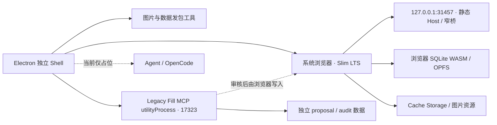
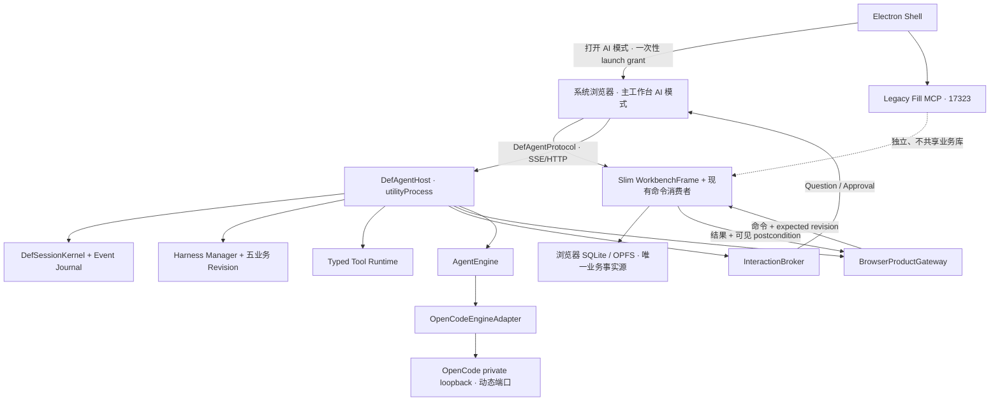
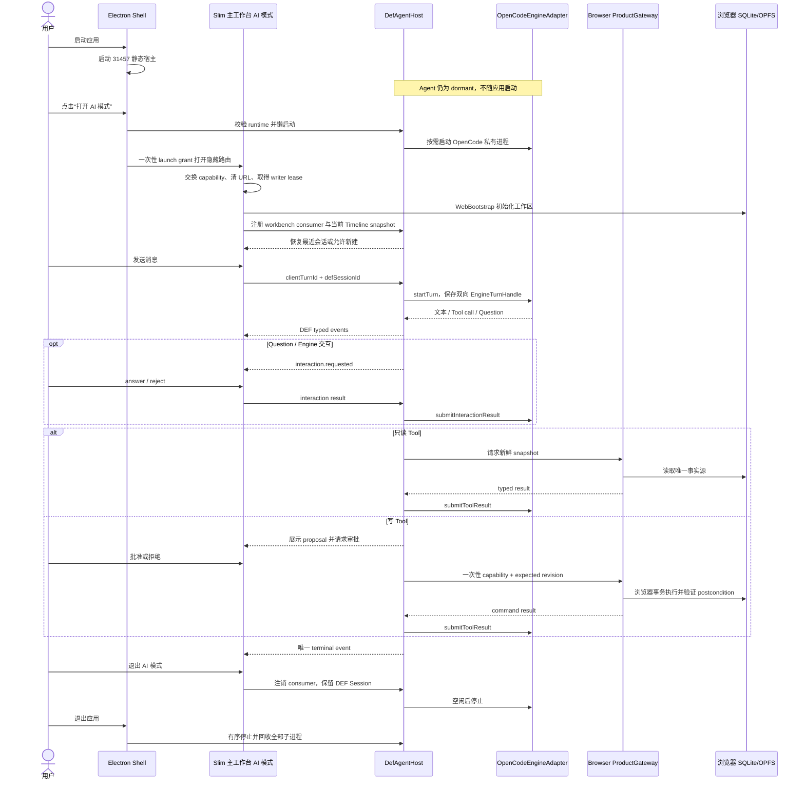

# OpenCode 引擎回迁与可替换 Agent 架构调研

> **归档于 2026-08-08。** 本文保存“先回迁 OpenCode、再通过引擎合同为 Pi 留接口”的历史决策背景，不再作为下一阶段的实施指南。DEF Host、Harness、ProductGateway、浏览器 SQLite 与安全边界仍是有效证据；OpenCode 长期引擎、完整原生 UI 网关及后续 Pi 接入路线由 [DEF 轻量 Agent Runtime 源码映射与移植方案](../audits/def-lightweight-agent-runtime-source-mapping-20260808.md) 重新评估。当前代码在新方案落地前仍受 [ADR-0008](../decisions/0008-native-opencode-ui.md) 约束。

> 2026-08-07 决策更新：本文关于“另建 Slim React Agent UI、原生 OpenCode UI 不进入产品”的结论已被 [ADR-0008](../decisions/0008-native-opencode-ui.md) 取代。Engine、Host、Harness 和 ProductGateway 的解耦边界继续有效；产品 AI 模式改为通过受控网关宿主同版本的原生 OpenCode UI。

日期：2026-08-06

性质：开工前调研，不是 Spec，不是 Tasks，也不代表已经开始迁移

目标分支：`codex/v1.8-lts-desktop-shell`，审计基线 `8bc9af76`

旧 AI 参考分支：`codex/def-opencode-spec9-2-implementation`，审计基线 `ea29a231`

共同基线：`de8f78bbca4ea39cb0cbad7da7ff50718ff07ea6`

## 0. 最终结论

这项工程可以开工，正确路线不是“把旧 OpenCode 分支合并回来”，也不是“先把 OpenCode 的 Session 从 Agent Loop 里硬拆掉”。正确路线是：

1. 永久保留 Slim LTS 的浏览器前端、浏览器 SQLite/OPFS 和独立 Electron Shell；
2. 把旧分支里真正属于 DEF 的 Harness、业务事务、Tool 合同迁回；
3. 新建 DEF 自己拥有的 Session、Turn、事件、审批和产品访问协议；
4. 让 OpenCode 作为第一套 `AgentEngine` 接入，允许它在适配器内部继续拥有自己的 Session、上下文压缩和模型循环；
5. 所有业务读写都经过浏览器侧 `ProductGateway`，绝不恢复旧 `17321` REST、旧 Node Timeline/Work Node SQLite 或旧数据服务；
6. 产品 UI 使用 Slim React 前端。OpenCode 原生 UI 只作为开发期行为参照和对跑工具，不作为长期产品协议；
7. 唯一用户入口是 Shell 唤起的主工作台 AI 模式；AI CLI 和所有 legacy chat 旁路永久退役；
8. Pi 暂时不实施，但从第一天用一套真实的引擎合同约束 OpenCode，等 OpenCode 迁移闭环后再做 Pi 适配。

一句话概括：

> 迁回的是 DEF 业务内核；OpenCode 只是被装进这个内核的第一台引擎。

这一方案同时满足四个目标：

- 保住 1.8 Slim 已经取得的前端、维护和响应优势；
- 尽快恢复成熟度最高的旧 AI 能力；
- 不恢复双数据库和三层旧 Sidecar；
- 后续替换 Pi 时，不需要再重写产品 Session、审批、Tool、Harness 和 UI。

## 1. 本报告回答的问题

本报告集中回答以下问题：

1. 当前 Slim 桌面分支是否已经具备接回 Agent 的基础；
2. 旧 AI 分支里哪些内容真的可复用，哪些只是 OpenCode 耦合；
3. OpenCode 是否应整套迁回、只迁 Agent Loop，还是做适配器；
4. OpenCode Session 与旧 DEF Session 强绑定时，怎样解耦才不会重写整个引擎；
5. 浏览器 SQLite 成为唯一业务事实源后，旧 Typed Tools 应怎样访问产品；
6. Shell 唤起主工作台 AI 模式时，如何与单标签写租约、当前 Workbench 和隐藏路由协作；
7. 原生 OpenCode UI、现有魔改 UI、Slim React UI 应分别扮演什么角色；
8. OpenCode 与 Pi 的真实能力怎样映射，接口会不会只是“为了未来而虚构”；
9. 应按什么顺序实施、测试、回滚和打包；
10. 哪些旧内容严禁迁回；
11. 从安装、首次打开、Session/Turn、审批写入、切换、刷新、崩溃、清理、更新、换引擎到卸载的完整生命周期怎样运行。

## 2. 结论成立的硬约束

以下约束来自当前产品事实和此前已确认的产品方向，后续实施不得擅自改变。

| 约束 | 必须保持的结果 |
| --- | --- |
| 前端基线 | Slim LTS React 前端是唯一产品前端基线 |
| 桌面形态 | Electron 只承载独立 Shell、进程生命周期和本地工具，不用 `BrowserWindow` 承载业务前端 |
| 业务数据 | 浏览器 SQLite WASM/OPFS 是唯一业务事实源 |
| 旧数据库 | 旧 Node SQLite、旧 Timeline Repository、旧 Work Node Store、旧数据服务全部保持退役 |
| 旧 REST | `17321` AI CLI REST 和 `17322` DEF Sidecar 不恢复 |
| MCP | Legacy Fill MCP 继续独立运行在 `17323`，与 Agent 进程、环境变量和数据隔离 |
| 生产 Origin | 生产浏览器工作区继续固定为 `http://127.0.0.1:31457`，不能因 Agent 改成随机 Origin |
| 开发 Origin | `npm run electron:dev` 继续使用 `3030` 的 Slim 页面和 `31457` 的本地 Host bridge |
| Web 版本 | 普通线上 Web LTS 不显示 Agent 入口，也不依赖 Electron/Agent 才能运行 |
| 唯一 AI 入口 | 产品只保留 Shell 唤起的主工作台“AI 模式”；隐藏路由只是实现细节，不构成第二套产品入口 |
| AI CLI 退役 | `/AI CLI`、`host="ai-cli"`、`/def-agent/chat*`、`/api/chat*`、缺失 Host 回退和 bare OpenCode UI 自动建会话永久保持禁用 |
| 离线范围 | 本地 Electron Host 的 Agent 不做 PWA 断网启动承诺；原有 Web LTS 离线保护测试保持原样，但不是本轮 Agent 验收重点 |
| 依赖边界 | 已退役的 `xlsx`、`exceljs` 不得被旧分支依赖链带回 |
| CI/CD | 本轮先完成架构和本地验收设计，不把 CI/CD 改造混入第一轮迁移 |
| 业务语义 | 迁移不借机改伤害公式、游戏数据或五业务规则；差异必须由测试和明确的新需求驱动 |

当前约束的直接证据见：

- [当前系统全景](../current-system.md)
- [Slim Electron Shell 迁移审计](../audits/v1.8-slim-electron-shell-migration-20260806.md)
- [桌面运行时边界检查](../../../scripts/check-desktop-runtime-boundaries.mjs)
- [Electron Shell 主进程](../../../electron/main.cjs)
- [当前 package 与打包清单](../../../package.json)

## 3. 调研方法与证据基线

### 3.1 本地代码审计

本轮同时审计了两条分支，而没有把当前工作区误认为全部事实：

| 对象 | 分支 / 提交 | 作用 |
| --- | --- | --- |
| 新产品基线 | `codex/v1.8-lts-desktop-shell@8bc9af76` | Slim 前端、独立 Shell、浏览器 SQLite、Legacy Fill MCP |
| 旧 AI 参考线 | `codex/def-opencode-spec9-2-implementation@ea29a231` | OpenCode、DEF Harness、Typed Tools、Interop、旧数据桥 |
| 历史共同点 | `de8f78bb...` | 判断两边独立演进范围 |

两个分支从共同基线后分别前进 37 和 249 个提交；直接比较有 6836 个文件变化、约 8.2 万行新增和 130 万行删除。这个差异量已经排除“整分支 merge 后修冲突”作为可靠方案。

可复核命令：

```bash
git rev-list --left-right --count \
  codex/def-opencode-spec9-2-implementation...codex/v1.8-lts-desktop-shell
git merge-base \
  codex/def-opencode-spec9-2-implementation \
  codex/v1.8-lts-desktop-shell
git diff --shortstat \
  codex/def-opencode-spec9-2-implementation..codex/v1.8-lts-desktop-shell
```

### 3.2 独立复核

除主审计外，本轮还做了一次独立只读复核。两次审计对以下结论一致：

- Harness Manager、五业务 Harness、事务和 Tool 合同是可迁移的 DEF 资产；
- Session、UI、审批交互、事件观察、Tool handler 和打包仍明显耦合 OpenCode；
- 旧 `def.js` 不能整体复制；
- 最大的新问题不是 OpenCode，而是旧 Tool 最终依赖已退役的 Node 业务数据服务。

### 3.3 上游资料

上游事实以 2026-08-06 读取的官方资料为准：

- [OpenCode v1.18.14 release](https://github.com/anomalyco/opencode/releases/tag/v1.18.14)
- [OpenCode Server](https://opencode.ai/docs/server/)
- [OpenCode SDK](https://opencode.ai/docs/sdk/)
- [OpenCode Plugins](https://opencode.ai/docs/plugins/)
- [Pi repository](https://github.com/earendil-works/pi)
- [Pi SDK](https://pi.dev/docs/latest/sdk)
- [Pi Extensions](https://pi.dev/docs/latest/extensions)
- [Pi RPC](https://pi.dev/docs/latest/rpc)
- [Pi Compaction](https://pi.dev/docs/latest/compaction)

### 3.4 产品入口的历史证据

旧参考分支不是一直同时保留两个入口。`codex/def-opencode-spec9-2-implementation` 上已经实施完成的 `docs/specs/def-opencode-host-retirement-spec9-1/spec.md` 明确规定：

- 独立 `/AI CLI` 与 `host="ai-cli"` 全线禁用；
- 主工作台排轴的 `host="workbench"` AI 模式保留；
- 缺失/未知 Host 不得回退到 `ai-cli`；
- 旧 `/def-agent/chat*`、`/api/chat*` 和 bare OpenCode UI 建会话旁路关闭；
- Shell 只保留主工作台 AI runtime 管理和“清除全部 AI 模式会话”。

同分支的 `MainWorkbenchAiPanel.tsx` 把当前 Timeline、选人、技能按钮和 checkout context 传给 `DefOpenCodeView`；`DefOpenCodeView.tsx` 只接受 `host="workbench"`，并拒绝临时或无 ID Timeline。第 27 节的完整生命周期以这条已经完成的产品收口为基线，不以更早的双入口历史为基线。

## 4. 术语与责任

为避免后续继续把“Agent、OpenCode、DEF、页面”混成一个东西，本报告使用以下定义。

| 名称 | 含义 | 谁拥有 |
| --- | --- | --- |
| Slim Workbench | 当前 React 业务前端及其计算、Timeline、配置和页面状态 | 产品 |
| Electron Shell | 独立小窗口、托盘、发包工具、本地进程和系统浏览器启动器 | 桌面层 |
| DefAgentHost | 新增的本地 Agent 总入口，管理 DEF Session、事件、Harness、Tool 和引擎 | DEF |
| AgentEngine | 只负责模型、Agent Loop、引擎内部对话、压缩、stream、abort 的可替换接口 | 适配层 |
| OpenCodeEngine | `AgentEngine` 的第一套实现 | OpenCode 适配器 |
| ProductGateway | Agent 访问当前浏览器业务事实和执行业务命令的唯一通道 | DEF 与浏览器边界 |
| BrowserWorkbenchExecutor | 在持有 Web Locks 写租约的 Slim 页面中执行现有 29 类命令 | 产品浏览器端 |
| InteractionBroker | Question、审批、一次性 capability、超时和审计的权威状态机 | DEF |
| DefAgentProtocol | UI、测试和自动化观察 Agent 的稳定协议 | DEF |
| Engine Session | OpenCode 或 Pi 私有的会话 ID 和上下文 | 引擎适配器 |
| DEF Session | 与 Timeline、Axis、Harness 事务绑定的稳定产品会话 | DEF |

## 5. 当前 Slim 桌面分支的真实状态

### 5.1 当前运行拓扑



当前 [Electron 主进程](../../../electron/main.cjs) 只有约 500 行，和旧分支约 6770 行的主进程已经不是同一种架构。它负责：

- 单实例、托盘、Shell 小窗口；
- 系统浏览器启动；
- 生产静态 Host；
- 图片与数据 Release builder；
- Legacy Fill MCP 生命周期和窄浏览器桥；
- Agent 能力占位。

它不负责：

- 业务页面渲染；
- Timeline、Work Node 或配置数据库；
- Node 侧业务 SQLite；
- OpenCode、DEF Sidecar 或 AI REST。

### 5.2 当前边界测试是正确资产，不是迁移障碍

[桌面运行时边界检查](../../../scripts/check-desktop-runtime-boundaries.mjs) 当前明确保证：

- 六个旧运行时文件不存在；
- 主进程、preload 和发包工具不引用 Node SQLite、旧 repository、`17321`、`17322`；
- 打包清单没有 `agent/**`、`src/**` 或整个 `node_modules/**`；
- Electron 只 `loadFile()` 独立 Shell，不 `loadURL()` 业务前端；
- Legacy Fill MCP 仅用独立 proposal/audit 数据库；
- MCP 运行时会清除 `DEF_*` 和 `OPENCODE_*` 环境变量。

恢复 Agent 时应修改这份测试的“Agent 必须不存在”部分，但必须继续保留其余禁令。正确的新断言应是：

```text
允许 dist/agent/** 和一份平台 OpenCode runtime
仍禁止旧 17321/17322、旧 Node 业务库、旧 REST、旧 Electron 数据服务
仍禁止 agent/vendor/**、src/**、完整 node_modules/** 进入发布包
```

### 5.3 当前浏览器已经保留了重要的 Agent 接缝

[mainWorkbenchControl.ts](../../../src/utils/mainWorkbenchControl.ts) 仍定义了 29 类产品命令，覆盖：

- 选人和页面导航；
- 技能按钮增删；
- BUFF 单体、批量增删；
- 目标抗性和伤害计算；
- Timeline 快照；
- AI Work Node 创建、patch、validate、diff、checkout、restore；
- 武器、装备、整套配置；
- 配装 preview、apply、finalize 和失败后的原子恢复；
- 快照刷新。

同一文件还定义了 `MainWorkbenchSnapshot`，包含：

- `timelineId` 与 `activeTimelineId`；
- 当前 checkout；
- 已选干员；
- 可信技能目录；
- 技能按钮与 BUFF；
- 伤害报告；
- 武器、装备、套装效果和技能等级；
- 最近命令结果。

当前远程接缝：

- `pullRemoteMainWorkbenchCommands()`；
- `pushMainWorkbenchCommandResult()`；
- `pushMainWorkbenchSnapshot()`；

在瘦身时被有意识地保留为 no-op。这是恢复 Browser ProductGateway 的最佳落点，不需要重新发明一套业务命令。

### 5.4 接缝还不能直接视为完成的 ProductGateway

当前命令实际由两个 UI 所有者执行：

- [AppContext.tsx](../../../src/context/AppContext.tsx) 处理选人、视图、清空和页面打开；
- [CanvasBoard/index.tsx](../../../src/components/CanvasBoard/index.tsx) 处理其余复杂 Timeline、BUFF、配置和计算命令。

Canvas 执行器还明确要求 `document.visibilityState === 'visible'`，避免后台旧标签页推进 checkout。因此，如果 Shell 只打开一个纯聊天页面，而当前 Workbench 在另一个后台标签页：

- Agent 可以正常聊天；
- Host 可以正常排队命令；
- 但后台 Canvas 会拒绝执行；
- 用户会看到 Tool 超时，或更危险的“状态未知”。

这个问题不能靠延长超时解决。

### 5.5 首版最安全的主工作台 AI 模式方案

第一版不应先搬动 29 类复杂 handler。那会把引擎迁移、业务重构和 UI 重构绑成一次高风险改造。

建议新增一个只由 Shell 唤起的隐藏 AI 模式路由，形式上是 Slim Workbench 的 overlay。它是旧“主工作台 AI 模式”在新 Slim 前端里的复现，不是复活独立 AI CLI，也不是增加第二个通用聊天页：

```text
AI 模式隐藏路由
├── 仍挂载 WorkbenchFrame / AppProvider / CanvasBoard
├── 当前标签持有浏览器 SQLite 写租约
├── 现有命令处理器保持原样
└── 上层显示 DEF Agent React UI
```

这样：

- 页面仍是 Slim 前端；
- 当前标签可见，现有 Canvas 安全检查成立；
- 业务逻辑不需要在接 OpenCode前先大规模搬家；
- AI 模式 UI 可折叠或关闭，用户能立即查看变更后的 Workbench；
- 路由不出现在普通 Web 导航，只能凭 Shell 的一次性 launch grant 打开。

这里的用户可见名称始终是“AI 模式”。`AgentRoute`、`Agent overlay` 只允许作为代码层标识；开发命令、黑盒协议和诊断页也不能借机变成 AI CLI 产品入口。

在 OpenCode 对跑通过后，再把 handler 逐步抽成真正的 `BrowserWorkbenchExecutor` 服务。那是后续维护优化，不是第一阶段阻断项。

这里的“handler 保持原位”只指不先搬 React/Canvas 代码位置，不代表现有写 handler 自动满足 Agent mutation 合同。只读命令可以直接复用；写命令必须先证明其业务 mutation、revision、approval nonce 和 command receipt 能在同一浏览器 SQLite 事务提交，否则首版只能展示提案、由用户手动操作，不能作为 Agent 可执行 Tool。

## 6. 旧 AI 分支的真实架构

### 6.1 调用链

```text
旧 Workbench
  → MainWorkbenchAiPanel
  → DefOpenCodeView
  → Electron 31457 /open-def-agent
  → DEF Agent Sidecar :17322
  → def-opencode-adapter
  → OpenCode binary :17445+
  → OpenCode Session / Message / Event / Permission / Question
  → DEF OpenCode Plugin
  → Harness Manager + Typed Tool wrapper
  → DEF REST :17321
  → 旧 Node Timeline / Work Node / 数据服务 / 浏览器投影
```

旧系统至少包含：

- Electron 主进程；
- AI CLI REST；
- DEF Agent Sidecar；
- OpenCode 私有 server；
- OpenCode SolidJS UI；
- React iframe 宿主；
- Node 业务数据层；
- 浏览器投影层。

所以“把 OpenCode 装回来”不能等同于恢复这条完整链路。

### 6.2 旧资产规模

| 范围 | 文件数 / 大小或行数 | 判断 |
| --- | ---: | --- |
| `agent/vendor/opencode` | 6010 文件，约 95.5 MB 源码 | 不能整体迁入 |
| `def-opencode-adapter/index.cjs` | 2386 行 | 多职责，必须拆 |
| `def-agent-server.cjs` | 1858 行 | UI 代理与 DEF 网关混合，必须拆 |
| `def-codex-interop.cjs` | 793 行 | 协议思想可留，实现需重写 |
| `def-tools/opencode/def.js` | 2591 行 | Schema、handler、REST、审批混合，必须拆 |
| `def-tools/opencode/plugin.js` | 104 行 | 适合作为 OpenCode 生命周期薄适配器参考 |
| `def-tools/registry.mjs` | 464 行 | 产品合同资产 |
| `def-harness-manager/runtime.cjs` | 1268 行 | 产品业务内核资产 |
| `def-harness-manager/**` | 22 文件，约 285 KB | 高复用价值 |
| `agent/harness/business/**` | 23 文件，约 271 KB | 高复用价值 |
| OpenCode UI build | 840 个 asset，约 27.47 MB | 不应作为最终 UI 必需项 |
| 旧 Mac OpenCode runtime | 1.17.11，99,556,450 bytes | 发布包主要增量之一 |

### 6.3 真正已经解耦的内容

| 资产 | 独立度 | 证据与结论 |
| --- | --- | --- |
| Harness Manager | 高 | 路由、Revision、阶段、Tool 投影、写域、事务、CAS、trace 基本不依赖 OpenCode SDK |
| 五业务 Harness | 高 | selection、loadout、timeline、buff、calculation 都有 definition、revision、phase、Tool 和终态 |
| 业务 Transaction | 高 | Session、Timeline、Axis、checkout、revision、proposal、capability、phase 都是机器状态 |
| Tool Registry | 中高 | canonical id、风险、host exposure、workspace scope、typed errors 已是产品合同 |
| Atomic team modules | 中高 | 配装候选、命令状态、rollback 逻辑可拆后复用 |
| Interop 外部能力 | 中 | start/continue/stop/transcript/events/questions 有价值，但内部仍轮询 OpenCode 消息 |
| Tool handler | 低到中 | 大量业务逻辑可复用，但被 OpenCode Schema、`context.ask` 和旧 REST 包住 |
| Session | 低 | DEF Session ID 实际等于 OpenCode Session ID |
| Approval / Question | 低 | DEF 记录与 OpenCode UI 状态混合 |
| UI | 低 | React 只挂 iframe，页面直接使用 OpenCode API |
| 生产打包 | 低到中 | binary 可构建，但完整 Agent + plugin + Tool 的 packaged 闭环未证明 |

准确判断不是“旧架构已经能随便换引擎”，而是：

> 业务控制内核大约已有三分之二的换引擎准备；完整产品链路还远未到直接替换的程度。

### 6.4 旧 Spec 9-2 的验收边界

旧 `verification.md` 明确写明：Task 1—14 完成，Task 15 仅部分完成。

已通过：

- Harness Manager 合同和 64 项聚合测试；
- 五业务只读黑盒；
- Selection 非空换人和反向恢复；
- 真实 iframe 可见性；
- 类型、构建、知识、仓库检查。

尚未完成：

- Selection 新增、删除、审批拒绝和完整下游失效；
- Loadout 预览、纠正、后续确认和 postcondition；
- Timeline 添加、移动、删除、审批和恢复；
- BUFF 单体、批量、写域隔离；
- Calculation 在上游 mutation 后重算；
- 换人 → 配装 → 计算的跨业务流程；
- Harness 热重载、撤销和并发候选；
- 完整 packaged Agent turn。

因此旧分支只能作为“已证明范围内的行为 Oracle”，不能被写成全部正确的黄金版本。

## 7. 最关键的迁移冲突：旧 Tool 后端已经失效

旧 `def.js` 的核心调用最终是：

```text
fetch(:17321/api/def-tools/call)
```

旧 `ai-cli-rest-server.mjs` 随后读取或修改：

- Node 侧 Timeline repository；
- Node 侧 AI Work Node store；
- Node 侧数据服务；
- Workbench snapshot mirror；
- 命令队列和结果。

Slim 迁移后，权威实现已经变成 [browserTimelineStore.ts](../../../src/platform/timeline/browserTimelineStore.ts) 与浏览器 SQLite。它已经提供：

- document、snapshot；
- Work Node、commit、audit；
- content revision CAS；
- checkout ref；
- diff、validate、rollback；
- 导入导出和存档转换。

因此：

| 做法 | 结果 |
| --- | --- |
| 把旧 `17321` 原样迁回 | 恢复双主库，直接否决 |
| 让 Node 直接打开 OPFS SQLite | 破坏浏览器安全、租约和数据所有权，否决 |
| 把业务数据持续镜像到 Agent DB | 产生陈旧副本和不确定写入，否决 |
| Agent 只读浏览器发布的快照，写入由浏览器执行并返回 postcondition | 正确方向 |

这也是整个新架构中优先级最高的边界。

## 8. OpenCode 与 Pi 的上游事实

### 8.1 OpenCode

旧 vendor 固定为 `1.17.11`；调研时官方最新稳定 release 是 `1.18.14`。

OpenCode 的优势：

- 完整 Session、message、stream、abort、summarize/compaction；
- provider 和 model 生态成熟；
- headless server、OpenAPI、SDK；
- plugin 生命周期和 Tool 执行；
- 已经有一套经过本项目大量魔改和实测的旧实现；
- 旧 DEF 黑盒、Session 恢复和 UI 行为都围绕它积累了证据。

OpenCode 的成本：

- 本质是 server-centric、多客户端平台，不只是一个小 Agent Loop；
- binary 体积明显；
- 原生 UI、Session、Permission、Question 和 API 很容易渗透到产品层；
- 本项目使用的阶段 Tool 投影并非 1.17.11 官方标准 hook，而是 vendor patch；
- 旧分支还修改了 17 个 OpenCode App UI 文件。

### 8.2 Pi

Pi 的优势：

- SDK 直接提供 `AgentSession`、事件、工具、abort、compaction 和 SessionManager；
- extension hook 可拦截 Tool、修改结果、调整 system；
- `setActiveTools` 天然适合 Harness 阶段 Tool 投影；
- RPC 模式适合无头进程和自定义 UI；
- 核心包比完整 OpenCode server/runtime 更轻；
- Electron 39.8.10 内置 Node 22.22.1，满足当前 Pi 包声明的 Node 22.19+ 运行要求。

Pi 的不足：

- 不自带本项目已经依赖的完整 OpenCode UI 和服务层；
- 没有可直接照搬的 DEF Session、审批、Harness 和产品桥；
- 旧分支没有 Pi 的真实业务验证证据；
- 现在先上 Pi 会同时承担“迁产品基线”和“换引擎”两种变量。

### 8.3 能力映射证明接口不是空想

| DEF 需要的能力 | OpenCode 实现 | Pi 实现 |
| --- | --- | --- |
| 创建/恢复引擎 Session | Server Session API | `AgentSession` + `SessionManager` |
| 运行一轮 | message / prompt API | `AgentSession.prompt()` |
| 流式事件 | SSE / message parts | AgentSession events |
| 中止 | `/session/:id/abort` | `abort()` |
| 压缩 | summarize/compaction | compaction API |
| 动态 Tool 集 | DEF vendor Tool transform patch | `setActiveTools` |
| Tool 前后拦截 | plugin before/after | `tool_call` / `tool_result` extension |
| system 注入 | plugin system transform | `before_agent_start` |
| 自定义 UI | Server/SDK | SDK 或 RPC |
| 产品审批 | 不应由 OpenCode 权威拥有 | 不应由 Pi 权威拥有 |

真正的共同边界是存在的，所以 `AgentEngine` 不是为了 Pi 而虚构的一层。

### 8.4 AI 是否必须依赖 Electron

AI 特性本身不必依赖 Electron。OpenCode、Pi 或其他 Agent 都可以运行在普通本地 daemon、CLI 或远程服务中。当前项目需要 Electron，是因为浏览器本身不能可靠地：

- 启停本地 Agent 进程；
- 保存不应暴露给网页的 provider 凭据；
- 管理平台 binary、日志、退出回收和签名产物；
- 为系统浏览器提供受控 loopback Host；
- 在不部署远程服务的情况下提供本地 AI。

因此当前最合理的关系是：

```text
Electron = 本地控制面 / 进程宿主
Slim 浏览器页面 = 产品 UI / 业务数据 owner
OpenCode 或 Pi = 可替换的 Agent 引擎
```

这不等于让 Electron 重新承载前端，也不意味着未来不能把 DefAgentHost 换成独立 daemon。只要 `DefAgentProtocol` 和 `ProductGateway` 不引用 Electron IPC，Electron 就只是当前最省事、最容易发包的宿主。

### 8.5 体量信息的正确读法

调研时 npm 元数据显示 Pi `0.84.0` 的三个相关包分别为：

| 包 | unpacked size | Node 要求 |
| --- | ---: | --- |
| `@earendil-works/pi-agent-core` | 1,845,487 bytes | `>=22.19.0` |
| `@earendil-works/pi-ai` | 3,856,890 bytes | `>=22.19.0` |
| `@earendil-works/pi-coding-agent` | 13,562,839 bytes | `>=22.19.0` |

OpenCode 和 Pi 均使用 MIT License。上述 npm 数字只说明 Pi 的代码分发形态更轻，不等于最终 Electron 安装包会按同样比例缩小；provider SDK、UI、资源和 bundle 策略仍会影响实际产物。

## 9. 方案比较

评分用于辅助决策，不是性能实测。满分 5；总分按数据安全 25%、维护性 20%、交付速度 15%、未来 Pi 15%、可测试性 15%、包体与运行成本 10% 加权。

| 方案 | 数据安全 | 维护性 | 速度 | Pi 准备 | 可测试 | 体积 | 加权结果 | 判断 |
| --- | ---: | ---: | ---: | ---: | ---: | ---: | ---: | --- |
| A. 整体合并旧 AI 分支 | 1 | 1 | 5 | 1 | 2 | 1 | 35/100 | 否决 |
| B. 恢复旧 Sidecar + 原生 UI，但加 ProductGateway | 4 | 3 | 4 | 3 | 4 | 2 | 69/100 | 只可作短期诊断 |
| C. DEF Host/Protocol/UI + OpenCode EngineAdapter | 5 | 5 | 3 | 5 | 5 | 4 | 92/100 | 推荐 |
| D. 直接 Pi-first | 5 | 4 | 1 | 5 | 3 | 5 | 78/100 | 顺序不合适 |
| E. 自己重写 Agent Loop | 5 | 2 | 1 | 5 | 2 | 5 | 67/100 | 无必要 |

### 9.1 为什么不整体合并

- 分支差异过大；
- 会把旧前端、旧 Electron、旧 REST、旧 Node SQLite 和已删除依赖一起带回；
- 很难判断冲突修复后究竟是旧行为、LTS 补丁还是新逻辑；
- 测试无法给这种大规模回退提供可信归因。

### 9.2 为什么不先重写 OpenCode Agent Loop

用户担心 OpenCode Loop 与 Session 强绑定，这个判断是对的；但解决方法不是切开 OpenCode 内部 Session。

`AgentEngine` 可以把 OpenCode 的 Session 当成私有实现：

```text
DEF Session（稳定产品身份）
  └── engineRef
      ├── kind = opencode
      ├── engineSessionId = ses_xxx
      └── runtimeVersion = 1.17.11-def.x
```

OpenCode 可以继续用自己的 Session 驱动 Loop、上下文和压缩。DEF 只是不再把这个 ID 当成产品 ID。这样既保留成熟实现，也让 Pi 可以拥有完全不同的 Session 结构。

### 9.3 为什么不直接 Pi-first

Pi 很适合目标形态，但现在直接换会失去旧分支最有价值的对照物。更可靠的顺序是：

1. 用 OpenCode 证明 DEF 引擎边界能承载现有功能；
2. 用旧 OpenCode 分支做已验证范围内的对跑；
3. 完成产品协议、Tool、审批和 UI 的独立；
4. 再用 Pi 实现同一套 conformance suite。

若 OpenCode 都无法在新接口下通过，说明接口有问题；若 OpenCode 通过而 Pi 不通过，问题才真正属于 Pi 适配。

## 10. 推荐目标架构



### 10.1 最终所有权

| 能力 | 最终 owner |
| --- | --- |
| 模型调用、provider stream | Engine |
| Engine 内部对话、压缩、重试 | Engine |
| 稳定产品 Session/Turn ID | DEF |
| Transcript 的产品投影 | DEF Event Journal |
| Harness 路由、版本、阶段 | DEF |
| Tool 名称、Schema、风险、写域 | DEF |
| 业务 Tool handler | DEF |
| 当前业务数据 | 浏览器产品 |
| 产品 mutation | 浏览器产品 |
| 审批、Question、一次性 capability | DEF InteractionBroker |
| Agent UI | Slim React |
| 进程、打包、Shell 状态 | Electron |
| OpenCode 私有端口/API | OpenCodeEngineAdapter，禁止向浏览器暴露 |

### 10.2 推荐源码边界

具体文件名可在正式 Spec 中收口，建议的依赖方向如下：

```text
agent/
├── core/
│   ├── contracts/          # Session、Turn、Event、Engine、Product、Interaction
│   ├── session/            # DEF Session 与 event journal
│   ├── harness/            # Manager 与五业务 Revision
│   ├── tools/              # Registry、handler、typed errors
│   ├── interaction/        # Question、Approval、capability
│   └── product/            # ProductGateway port，不含浏览器实现
├── engines/
│   └── opencode/           # 唯一允许 import OpenCode SDK/API 的位置
└── host/                   # DefAgentHost、协议路由、生命周期

src/
├── components/Agent/       # Slim React Agent UI
├── platform/runtime/       # desktop Agent browser bridge
└── utils/mainWorkbenchControl.ts

electron/
├── main.cjs                # 只做生命周期和 Shell IPC
└── agent-runtime.cjs       # utilityProcess 启停封装
```

强制依赖方向：

```text
UI → DefAgentProtocol
Host → core contracts
OpenCode adapter → core contracts
core tools → ProductGateway port
browser bridge → existing Workbench command consumers
```

禁止反向依赖：

- `agent/core/**` import OpenCode；
- `src/**` import OpenCode SDK；
- Tool handler import Electron；
- Electron main import 业务 Tool handler；
- OpenCode adapter import 浏览器 SQLite 实现。

## 11. 必须先定义的合同

### 11.1 `AgentEngine`

建议最小合同如下。名称可在 Spec 中微调，但责任不能改变。

```ts
interface EngineTurnHandle {
  readonly ref: EngineTurnRef;
  readonly events: AsyncIterable<EngineEvent>;
  submitToolResult(input: EngineToolResultInput): Promise<void>;
  submitInteractionResult(input: EngineInteractionResultInput): Promise<void>;
  updateToolProjection(input: EngineToolProjectionInput): Promise<void>;
  abort(reason: EngineAbortReason): Promise<AbortResult>;
}

interface AgentEngine {
  readonly kind: string;
  probe(): Promise<EngineHealth>;
  createSession(input: EngineSessionCreateInput): Promise<EngineSessionRef>;
  recoverSession(ref: EngineSessionRef): Promise<EngineRecoveryResult>;
  startTurn(input: EngineTurnInput): Promise<EngineTurnHandle>;
  compact?(ref: EngineSessionRef): Promise<CompactionResult>;
  disposeSession(ref: EngineSessionRef): Promise<void>;
  shutdown(): Promise<void>;
}
```

这必须是双向 Turn 合同，不能只是单向事件流：

- `startTurn` 返回的 handle 同时给出可追踪的 `EngineTurnRef` 和事件流；
- Engine 发出 `tool.requested` 后，Host 执行 DEF Tool，再用同一 `toolCallId` 调 `submitToolResult`；
- Question/Approval 由 InteractionBroker 收口后，通过 `submitInteractionResult` 恢复同一 Engine run；
- Harness phase 改变时，Host 用带 revision 的 `updateToolProjection` 更新当前允许 Tool；
- stop 直接调用该 handle 的 `abort`，不存在“需要 abort ref 却从未拿到 ref”的断层；
- handle 已 terminal 后拒绝任何迟到 Tool/Interaction 结果，重复提交按 correlation ID 幂等处理。

OpenCode adapter 可以把这些动作映射到它的 Session/Tool callback/permission API，Pi adapter 可以映射到自己的 loop callback；DEF UI 和 ProductGateway 不接触任何引擎私有 continuation token。

`EngineTurnInput` 可以包含：

- 本轮 system context；
- 当前 Harness 投影出的 Tool descriptors；
- 用户消息；
- `defSessionId`、`defTurnId` 的 opaque correlation metadata；
- abort signal；
- provider/model profile ref。

它不能包含：

- 浏览器 SQLite handle；
- Electron IPC 对象；
- React state；
- Work Node repository 实例；
- DEF approval 的最终授权权力。

### 11.2 `DefSessionV6`

旧 schema v5 把 `sessionID` 直接写成 OpenCode ID。目标至少应拆成：

```json
{
  "schemaVersion": 6,
  "eventSchemaVersion": 1,
  "defSessionId": "def-session-uuid",
  "host": "workbench",
  "workspaceId": "browser-workspace-uuid",
  "lastDatabaseGeneration": "browser-generation-uuid",
  "timelineId": "timeline-uuid",
  "axisBindingId": "axis-uuid",
  "boundNodeId": "work-node-or-null",
  "engine": {
    "kind": "opencode",
    "sessionId": "ses_xxx",
    "runtimeVersion": "1.17.11-def.x",
    "storeSchemaVersion": 1
  },
  "harness": {
    "stateVersion": 1,
    "transactionStore": ".def-harness-manager/transactions.json"
  },
  "createdAt": "ISO-8601",
  "updatedAt": "ISO-8601"
}
```

ID 必须分层：

| ID | 作用 |
| --- | --- |
| `defSessionId` | 产品会话稳定身份 |
| `clientTurnId` | 调用方幂等键 |
| `defTurnId` | DEF 内部一轮身份 |
| `engineMessageId` | OpenCode/Pi 私有消息映射 |
| `toolCallId` | 一次 Tool 调用 |
| `interactionId` | Question/Approval |
| `commandId` | ProductGateway 命令和浏览器结果对账 |

其中 `timelineId` 是 Session 的稳定产品绑定；`axisBindingId`、`boundNodeId` 是最近一次明确选择的工作上下文指针，不是允许跨 Timeline 静默改绑的身份。每个 Turn 还必须单独固定当时的 checkout、revision 和 snapshot digest，切换规则按第 27.8 节执行。

### 11.3 `DefAgentProtocol v2`

旧 `DefCodexInteropProtocol v1` 的外部能力值得保留，但实现要改成事件源，而不是轮询 OpenCode transcript。

最低能力：

- Session create/list/read/set-active/archive/delete，以及 Shell 的 workbench 全清维护动作；
- Turn start/stop；崩溃后的继续是带来源关联的新 Turn，不复用已经终止的调用栈；
- transcript read；
- event subscribe；
- interactions list/respond；
- current state；
- UI consumer register/close；
- `clientTurnId` 幂等。

建议事件集合：

```text
session.ready
session.recovered
session.archived
session.orphaned
turn.accepted
response.first-token
response.delta
tool.requested
tool.started
tool.result
tool.error
interaction.requested
interaction.resolved
command.queued
command.dispatched
command.claimed
command.committed
command.result
command.reconciled
command.orphaned
turn.completed
turn.stopped
turn.interrupted
turn.failed
```

每个事件必须有：

- `sequence`，Session 内单调递增；
- `occurredAt`；
- `defSessionId`；
- 可选 `defTurnId`、`toolCallId`、`interactionId`、`commandId`；
- Product command 事件还要记录 `workspaceId`、`databaseGeneration`、before/after revision 和 browser receipt digest；
- engine raw ID 只能放在诊断 metadata，不能成为前端主键。

Transcript 应由这份事件日志投影得到，UI、黑盒测试和审计读取同一来源，避免旧系统中“OpenCode UI 一套状态、Interop 再轮询出另一套状态”。

### 11.4 `InteractionBroker`

目标流程：

```text
Tool Handler
  → requestQuestion / requestApproval
  → InteractionBroker 持久化 pending
  → DefAgentProtocol 通知 React UI
  → 用户 answer / approve / reject
  → Broker 校验 session、turn、proposal hash、revision、expiry
  → DEF 生成一次性 capability
  → ProductGateway 执行
  → Broker 记录结果与审计
  → EngineTurnHandle 收到 typed Tool/Interaction 结果并继续
```

硬规则：

- OpenCode 原生 permission 的同意不能直接代表产品授权；
- approval 必须绑定 exact proposal、timeline、checkout、revision 和 hash；
- capability 一次性、短期、不可重放；
- capability 由 DefAgentHost 的进程级 Ed25519 私钥签名，包含 key epoch、Session/Turn/Tool/Interaction/command、proposal hash、workspace/timeline/checkout/revision、scope、nonce 和 expiry；
- Browser consumer 只通过已认证注册拿到当前 epoch 的公钥，在浏览器 SQLite command journal 的同一事务中消费 nonce；不能只相信 Host 内存里的“已用过”标记；
- Host 重启轮换 key epoch，所有尚未 claimed 的旧 capability 失效；已经 claimed/committed 的命令只走 command journal 对账；
- reject、timeout、UI 关闭、引擎重启全部 fail closed；
- 引擎重启后不自动恢复 pending approval；
- Question 与 Approval 使用同一交互状态机，但风险和结果合同不同。

### 11.5 `ProductGateway`

建议合同：

```ts
interface ProductGateway {
  getSnapshot(binding: ProductBinding): Promise<ProductSnapshotEnvelope>;
  dispatch(command: ProductCommandEnvelope): Promise<ProductCommandReceipt>;
  awaitResult(commandId: string, options?: WaitOptions): Promise<ProductCommandResult>;
  reconcile(commandId: string): Promise<ProductCommandResult | null>;
}
```

命令 envelope 至少包含：

```json
{
  "protocolVersion": 1,
  "commandId": "uuid",
  "defSessionId": "uuid",
  "defTurnId": "uuid",
  "toolCallId": "uuid",
  "expected": {
    "workspaceId": "uuid",
    "databaseGeneration": "uuid",
    "timelineId": "uuid",
    "checkoutTargetId": "uuid",
    "checkoutUpdatedAt": 0,
    "snapshotDigest": "sha256",
    "contentRevision": 0
  },
  "command": {
    "op": "existing MainWorkbenchCommand op"
  }
}
```

浏览器工作区必须有两个稳定字段：

- `workspaceId`：数据库谱系身份，首次建库生成并随正常备份保留；
- `databaseGeneration`：每次清库、整库导入/恢复或替换数据库后重新生成，旧 proposal/capability/command 不得跨 generation 使用。

同一 workspace 谱系内的 `timelineId` 必须是不可复用 UUID；删除后保留最小 tombstone，复制/导入遇到冲突必须重映射 ID。这样“删除后新建同 ID”不会让旧 DEF Session 错接到另一条 Timeline。

Session 稳定绑定 `workspaceId + timelineId`；每个 snapshot、Turn 和 Product command 再固定当时的 `databaseGeneration`。Timeline ID 单独相同不足以证明仍是同一个工作区。

结果至少包含：

- `succeeded | committed | not-executed | rejected | conflict | error | orphaned`；
- typed error code；
- before/after revision；
- browser result；
- 可见 postcondition；
- 执行者 lease ID；
- 完成时间。

#### Product command 的崩溃一致性

Host Event Journal 和浏览器 command journal 都记录 `commandId`，但业务写入是否发生只由浏览器事务证明：

```text
Host: command.queued → command.dispatched
Browser: 持久化 claimed intent
Browser SQLite 同一事务：
  业务 mutation
  + revision/digest 更新
  + approval nonce consumed
  + command committed receipt
事务提交
Browser: 重建/验证可见投影
Host: command.result / command.reconciled
```

由此可严格判定：

- 崩溃发生在事务提交前：SQLite 回滚，重启后没有 committed receipt，结果为 `not-executed`；
- 崩溃发生在事务提交后、HTTP 回复前：committed receipt 与业务变更同时存在，按原 `commandId` 返回已提交结果；
- 事务已提交但 React 可见投影尚未确认：结果保持 `committed`，页面从数据库重建后再验证为 `succeeded`；
- 工作区被清除/恢复导致旧 journal 不可证明：命令变为 `orphaned`，绝不发往新 generation。

“没有 committed receipt”只有在 claimed executor 已明确返回 rollback，或其 browser/lease epoch 已结束、SQLite 已完成崩溃恢复后，才能收敛为 `not-executed`；executor 仍有有效 heartbeat 或事务仍可能运行时只能保持 `reconciling`，不能过早重试。

任何不能把“业务 mutation + revision + approval nonce + committed receipt”放进同一个浏览器 SQLite 事务的旧 handler，都不能作为首版可写 Agent Tool 暴露；它只能先保留只读/提案能力，或先改造成上述事务入口。不能用延长 timeout、比较 React state 或模型复述代替原子提交证据。

### 11.6 Browser bridge 传输

建议复用当前 MCP 的能力模式，但不要复用 MCP 的业务 proposal 状态。

推荐传输：

- Agent UI event：SSE；
- Browser Workbench 收命令：带 cursor 的长轮询；
- Browser 发布 snapshot/result：HTTP POST；
- 不需要 WebSocket；
- 不新增浏览器可访问的固定 Agent 端口，统一经过 `31457/agent-host/**`；
- OpenCode 自己使用随机 loopback 端口和随机 server password，仅 DefAgentHost 知道。

建议路由草案：

```text
POST /agent-host/ui/session
GET  /agent-host/ui/events
GET  /agent-host/status
GET  /agent-host/sessions?timelineId=...
POST /agent-host/sessions
POST /agent-host/sessions/:id/activate
POST /agent-host/sessions/:id/archive
DELETE /agent-host/sessions/:id
POST /agent-host/sessions/:id/turns
POST /agent-host/turns/:id/stop
GET  /agent-host/interactions
POST /agent-host/interactions/:id/respond
POST /agent-host/maintenance/workbench-sessions/cleanup

POST /agent-host/workbench/register
POST /agent-host/workbench/heartbeat
POST /agent-host/workbench/snapshot
GET  /agent-host/workbench/commands/next
POST /agent-host/workbench/commands/:id/result
GET  /agent-host/workbench/commands/:id
```

具体路径可以在实现时调整；重要的是 UI 协议、产品命令协议和 OpenCode 私有 API 三者不能混为一套。

生产路由还必须统一执行以下约束：

- 除只返回版本/存活且不含任何 Session 信息的最小 health 外，所有 `/agent-host/**` 请求都要求 Shell grant 派生的 scoped capability；
- Session create 的 `host` 由服务端固定写成 `workbench`，客户端不能提交或覆盖；workspace/timeline 只能来自当前已认证 Browser consumer；
- UI capability 只能操作其绑定的 workspace、consumer 和 `workbench` Session，不能当通用 bearer token；
- dev/Interop capability 使用不同 audience/key，生产包不提供签发入口；即使开发模式签发，也只能绑定现有 `workbench` Session 和 Browser consumer，不能创建无 Timeline 通用聊天；
- OpenCode 私有 API、诊断 UI 和 adapter 端口不经过这些产品路由暴露。

## 12. 主工作台 AI 模式隐藏路由与工作区租约

### 12.1 启动流程

```text
用户点击 Shell 的“打开 AI 模式”
→ Electron 启动/探测 DefAgentHost
→ Electron 生成一次性 AgentLaunchGrant
→ 系统浏览器打开同源的主工作台 AI 模式路由
→ 页面从 fragment 读取 grant 并立即清除 URL
→ 页面换取 AgentUiCapability
→ WebBootstrap 请求工作区写租约
→ 若另一标签持有租约，沿现有 BroadcastChannel 流程请求释放
→ 当前 AI 模式标签初始化浏览器 SQLite
→ 挂载 WorkbenchFrame + AI 模式 overlay
→ 注册 BrowserWorkbench consumer
→ AI 模式状态变为 ready
```

### 12.2 无 grant 的行为

普通网站或用户手输隐藏路由时：

- 不自动启动 Agent；
- 不主动抢占工作区租约；
- 不显示 provider 或 Session 数据；
- 显示“请从桌面 Shell 打开 AI 模式”；
- 普通 AppShell 导航不出现入口。

### 12.3 多标签与后台页

- 只有持有 Web Locks writer 的页面能注册可写 consumer；
- consumer heartbeat 过期后 Host 立即停止发写命令；
- snapshot 中的 timeline/checkout/revision 与命令不一致时返回 conflict；
- 后台旧 tab 不能消费命令；
- AI 模式 tab 是当前可见 writer，所以现有 Canvas 约束继续成立；
- 以后抽离纯 BrowserWorkbenchExecutor 时，仍要保留 lease 与可见性/活动页约束，不能简单删除。

## 13. Tool 与 Harness 的迁移方式

### 13.1 四层拆分

旧 `opencode/def.js` 必须拆成四层：

```text
DEF Tool Contract
  → 名称、Schema、风险、scope、typed errors

DEF Tool Handler
  → 业务解析、Harness 规则、proposal、verification

DEF ProductGateway
  → 快照、命令、CAS、浏览器 postcondition

OpenCode Tool Wrapper
  → 把 OpenCode tool context 映射成 DEF ToolExecutionContext
```

通用 `ToolExecutionContext` 应只提供：

```text
defSessionId
defTurnId
toolCallId
timeline / checkout binding
interactionBroker
productGateway
trace
abortSignal
```

它不能提供 OpenCode 的 `context.ask`、原生 `messageID` 或 REST base URL。

### 13.2 Tool 分类后的去向

| Tool 类型 | 新实现位置 | 数据来源 |
| --- | --- | --- |
| Harness 内部 route | DefHarnessManager | DEF Session/Harness 状态 |
| 公开静态知识 | DEF Resource Provider 或浏览器资源 Gateway | 版本化资源包 |
| 当前 Workbench 只读 | ProductGateway | 当前浏览器 snapshot |
| Work Node 读写 | ProductGateway + 浏览器 store | 浏览器 SQLite |
| 当前 checkout mutation | proposal + approval + ProductGateway | 浏览器执行 |
| Session 私有 plan/artifact | DEF Session directory | Agent 元数据，不是业务主库 |
| approval/question | InteractionBroker | DEF 交互日志 |

### 13.3 五业务资产

优先迁入并保持语义：

- `agent/runtime/def-harness-manager/**`；
- `agent/harness/business/selection/**`；
- `agent/harness/business/loadout/**`；
- `agent/harness/business/timeline/**`；
- `agent/harness/business/buff/**`；
- `agent/harness/business/calculation/**`；
- `agent/runtime/def-tools/definitions.mjs`；
- `agent/runtime/def-tools/registry.mjs`；
- `agent/runtime/def-tools/atomic-team-*.mjs`；
- 对应合同测试和黑盒场景定义。

“迁入”不等于原文件逐字复制。所有 `sessionId`、文件路径和产品访问都要经过新合同。

## 14. UI 决策

### 14.1 不建议把原生 OpenCode UI 作为最终产品 UI

旧原生 UI 的实际成本不是一个 256 行 iframe：

- 1858 行 Sidecar 代理；
- 17 个被修改的 OpenCode App 文件；
- 27.47 MB UI build；
- Session、Permission、Question、event 和 provider API 直连；
- SolidJS 组件树，而当前 Slim 是 React 18。

保留它会把 OpenCode API 变成事实上的永久产品协议。

### 14.2 推荐做法

产品版从第一轮就建设最小 DEF React Agent UI：

- Session 列表/新建；
- 消息和 Markdown；
- Tool start/result/error 卡；
- Question；
- Approval 和精确 diff；
- 输入、发送、中止；
- readiness/provider error；
- 当前 Timeline/checkout 简要绑定；
- 收起 overlay 查看 Workbench。

OpenCode UI 的作用：

- 视觉和交互参考；
- 旧分支对跑时的人工 Oracle；
- 开发诊断页面，可由 feature flag 启用；
- 不进入正式用户协议和最终打包必需项。

这种选择比“先恢复原生 UI、以后再替换”多一些前端工作，却省掉长期维护整套 OpenCode Web API 兼容层，整体工作量更可控。

## 15. OpenCode 适配策略

### 15.1 第一轮固定 1.17.11，不同时升级

旧实现和所有历史证据都基于 1.17.11。虽然调研时最新稳定版是 1.18.14，第一轮迁移不应同时升级：

- vendor patch 需要逐项重放；
- 上游 Server/Plugin/UI 可能已经变化；
- 同时迁基线和升版本会破坏回归归因；
- 先达到旧行为等价，再单独升级更容易测试和回滚。

### 15.2 旧 vendor patch 的去留

旧分支相对 vendor 导入基线修改了 24 个 OpenCode 文件，约 `+649/-80`。

| Patch 类别 | 决策 |
| --- | --- |
| 阶段 Tool projection hook | 暂时保留为明确的 OpenCode adapter patch |
| `toolChoice=required` 与 singleton Tool | 保留并加 provider conformance test |
| DeepSeek required-tool thinking 兼容 | 保留为 adapter-specific 行为，必须有回归 |
| system transform 增加 directory | 仅在 Harness 绑定确实需要时保留 |
| stale Tool name 修复 | 保留在 OpenCode adapter，并用录制 provider case 验证 |
| Permission Action/Rule 修改 | 重新与 1.17.11 clean tag 比对，非必要不保留 |
| WebFetch 增加 POST/PUT/PATCH/DELETE | 删除；DEF 产品 Agent 不应靠通用 WebFetch 写业务服务 |
| 17 个 OpenCode UI 修改 | 不进入产品 runtime；只保留截图、行为和测试参考 |

### 15.3 Source 与产物管理

不建议重新提交 6010 个 vendor 文件。推荐：

```text
agent/vendor-lock/opencode.json
  上游仓库、tag、commit、archive SHA-256、license

patches/opencode/*.patch
  本项目最小 patch series

scripts/build-opencode-runtime.mjs
  拉取/校验源、应用 patch、按当前平台构建

dist/agent/opencode/**
  Host、plugin bundle、平台 binary、manifest、checksum、NOTICE
```

构建输入与发布产物分离：

- 开发/发布构建可以下载固定 source archive；
- source archive 和 models snapshot 都必须有 hash；
- 最终应用只含一份当前平台 binary；
- 不含完整 vendor、Vite、Bun、源码或整个 node_modules；
- plugin 和 Host 必须 bundle，不能在生产时 import vendor 源路径。

### 15.4 OpenCode 进程边界

- DefAgentHost 由 Electron `utilityProcess.fork` 懒启动；
- OpenCode binary 由 OpenCode adapter 启动；
- OpenCode 绑定 `127.0.0.1` 随机端口；
- 每次启动生成随机 server password；
- 浏览器永远不拿到 OpenCode URL/password；
- 只暴露 DEF 投影出的 Tool，默认禁用 shell、pty、file edit、share、VCS、任意 MCP 和通用写型 WebFetch；
- App 退出时先停止 turn，再停 OpenCode，再停 Host；
- 按第 27.13 节的两级空闲策略回收 Engine/Host；有活动 Turn、Interaction 或未决 Product command 时禁止回收。

### 15.5 后续升级策略

完成 1.17.11 parity 后，升级 OpenCode 必须是独立变更：

1. 更新 source lock，不同时改 DEF 业务；
2. 在干净上游上逐片重放 patch，记录“保留/上游已吸收/删除”；
3. 运行 engine conformance、五业务 deterministic dual-run 和真实 provider blackbox；
4. 重建 Mac/Windows runtime 与 checksum；
5. 运行 packaged Agent turn；
6. 单独记录包体、启动和 provider 行为变化。

任何 patch 无法解释来源或没有测试时，都不应为了“旧分支里有”而保留。

## 16. Provider 与设置

Provider 配置不能继续隐式依赖 OpenCode UI。

推荐分层：

| 内容 | owner |
| --- | --- |
| API key / OAuth token | Engine 专用 credential store，位于 Electron userData，不发送到浏览器 |
| 可选 provider/model 列表 | Engine adapter |
| 产品选择的 Agent profile | DEF Session/Settings |
| thinking effort | DEF profile 映射为 engine 参数 |
| 当前 readiness 与脱敏错误 | Shell + DefAgentProtocol |

第一轮可以读取既有 OpenCode 配置作为兼容输入，但 Shell 至少要显示：

- Agent runtime 是否已安装/就绪；
- provider 是否可用；
- 当前模型；
- 打开 AI 模式；
- 重启 Agent；
- 查看脱敏日志。

不建议第一轮把所有 Provider 管理 UI 一起重做。先固定一个已验证 profile，等核心闭环后再扩展。

## 17. Session、恢复和旧数据迁移

### 17.1 新会话

- 先创建 `defSessionId`；
- 再由当前 engine 创建 `engine.sessionId`；
- engine 创建失败不删除 DEF Session，而是记录 `engine-unavailable`；
- DEF Session 稳定绑定 Timeline，并记录最近 axis/checkout；每个 Turn 固定精确 revision/digest，engine 只得到必要上下文。

### 17.2 OpenCode Session 丢失

- DEF Session 保持存在；
- adapter 可以创建新的 OpenCode Session；
- 更新 `engineRef`，写入 `session.recovered`；
- 已完成 Harness trace 保留；
- 未完成 Tool/Approval 标记 stale，不自动重放 mutation。

### 17.3 schema v5 → v6

迁移建议只适用于 binding 合法且 `host="workbench"` 的旧目录：

- 为旧目录生成新的 `defSessionId`；
- 旧 `sessionID` 写入 `engine.kind=opencode` 的 `engine.sessionId`；
- 保留 timelineId、axisBindingId、boundNodeId、Harness 状态；
- v5 没有 `workspaceId` 时先迁成 `binding-pending`，只有当前 Browser consumer 明确证明并由用户确认 Timeline 后才写入 workspace binding；
- 清除/拒绝所有 pending approval、question 和不确定 mutation；
- 迁移前保存原文件备份；
- 迁移失败时旧目录只读，不破坏原数据。

`sessions/ai-cli`、缺失 Host、未知 Host 或 binding 不完整的目录不得自动迁移、恢复或继续，只能在独立维护工具中被精确识别为历史残留；“发现旧数据”不能成为 AI CLI 回归入口。

### 17.4 Agent 元数据与业务数据

Agent 可以持久化：

- DEF Session binding；
- event journal；
- Harness transaction/trace；
- interaction audit；
- engine reference；
- provider profile ref。

Agent 不得持久化为权威副本：

- Timeline payload；
- 当前选人/配装/BUFF；
- Work Node 主数据；
- damage report 主数据；
- 浏览器数据包和图片库。

快照只可作为带 digest、revision、TTL 的诊断/执行输入，不能作为恢复业务状态的来源。

## 18. 迁移白名单

### 18.1 可迁移并整理为 DEF 内核

| 旧范围 | 动作 |
| --- | --- |
| `agent/runtime/def-harness-manager/**` | 迁入，替换 ID 和 Host 输入边界 |
| `agent/harness/business/**` | 迁入，保留版本和 hash |
| `def-tools/registry.mjs`、`definitions.mjs` | 迁入合同，补 runtime schema |
| `atomic-team-*.mjs` | 迁入通用业务层，改用 ProductGateway |
| Harness 合同测试 | 迁入并在 Slim 分支运行 |
| Spec 9-2 已验证场景 | 迁成 parity fixtures |
| Interop v1 能力模型 | 升级为 DefAgentProtocol v2 |
| OpenCode runtime manifest/checksum 思路 | 保留，重做产物链 |

### 18.2 必须拆后迁移

| 旧文件 | 新归属 |
| --- | --- |
| `def-opencode-adapter/index.cjs` | `OpenCodeEngineAdapter` + process manager |
| `def-agent-server.cjs` | `DefAgentHost` + protocol + engine-private adapter |
| `opencode/def.js` | contracts + handlers + ProductGateway + wrapper |
| `opencode/plugin.js` | OpenCode lifecycle adapter |
| `harness-manager-bridge.mjs` | 通用 HarnessLifecyclePort + OpenCode mapping |
| `def-codex-interop.cjs` | 通用 protocol/event journal；删除 transcript 轮询 |
| `DefOpenCodeView.tsx` | 只保留行为参考；产品改用主工作台 AI 模式 React overlay |
| `build-opencode-runtime.mjs` | pinned archive + patch series + bundle + manifest |

### 18.3 明确禁止迁移

- 旧 `electron/main.cjs`；
- `electron/data-management-service.cjs`；
- `electron/timeline-repository.cjs`；
- `electron/ai-timeline-work-node-store.cjs`；
- `electron/sidecar-runtime.cjs`；
- `electron/workbench-renderer-transport.cjs`；
- `scripts/ai-cli-rest-server.mjs`；
- 旧 `17321`、`17322` 固定端口；
- 旧 Node 业务 SQLite；
- 旧 `src/**` 前端；
- 整个 `agent/vendor/opencode/**`；
- OpenCode UI 作为永久产品 API；
- schema v5 继续作为当前格式；
- `xlsx`、`exceljs` 和旧 Excel 依赖链；
- 生产运行时依赖 Vite/Bun/src 动态加载。

## 19. 推荐实施顺序与每段退出条件

这不是正式 Tasks；它是为了证明方案可以按可回滚的小步落地。

### 阶段 0：冻结基线与测试夹具

工作：

- 固定新旧分支 commit；
- 导出旧 Spec 9-2 已通过/未通过场景；
- 建立引擎无关的 Session、event、Tool、ProductGateway fixture；
- 记录当前 Shell 启动、内存、包体和现有测试基线。

退出条件：

- 旧分支不再被口头当成“全部通过”；
- 每个后续行为都知道对比什么。

### 阶段 1：DEF 合同与 Fake Engine

工作：

- 建 `DefSessionV6`、`DefAgentProtocol v2`、`AgentEngine`、`InteractionBroker` 合同；
- 建 deterministic Fake Engine；
- Host 可在没有 OpenCode 的情况下完成消息、Tool、Question、Approval、abort 事件闭环。

退出条件：

- UI/测试完全不认识 OpenCode 字段；
- Fake Engine conformance 全过。

### 阶段 2：Shell、隐藏路由与 Browser ProductGateway

工作：

- Shell 增加 Agent 状态和“打开 AI 模式”按钮；
- 增加一次性 launch grant；
- 增加主工作台 AI 模式隐藏 overlay；
- 恢复三个 remote no-op；
- 补 runtime command schema、lease、snapshot digest、result reconciliation；
- 用 Fake Engine 跑一个只读和一个满足 command receipt 同事务合同的写操作。

退出条件：

- AI 模式页面持有唯一 writer；
- 浏览器仍是唯一业务库；
- Host restart 后能根据 `commandId` 判断 committed/succeeded/not-executed/error/orphaned；
- 旧端口仍关闭。

### 阶段 3：迁 DEF Harness 与 Tool 内核

工作：

- 按白名单迁 Harness Manager 和五业务 Harness；
- 拆 Tool contract/handler；
- 把旧 REST 访问改成 ProductGateway；
- 先完成五业务只读。

退出条件：

- 通用目录零 OpenCode import；
- 五业务只读合同和 deterministic blackbox 通过；
- 当前 Slim 数值/存档回归不变。

### 阶段 4：OpenCodeEngineAdapter

工作：

- 固定 1.17.11；
- 建 source lock 和 patch series；
- bundle plugin/Host；
- 私有动态端口启动；
- 映射 Session、stream、Tool、abort、compaction；
- 只开放只读业务。

退出条件：

- OpenCode 和 Fake Engine 通过同一 conformance suite；
- 旧五业务只读行为在新前端可见；
- 浏览器没有 OpenCode URL/API；
- 普通 Slim 启动时不启动 OpenCode。

### 阶段 5：Question、Approval 与 mutation

工作：

- InteractionBroker 成为权威；
- 完成 proposal、一次性 capability、CAS、postcondition；
- 补齐旧 Spec 9-2 未完成的 mutation 矩阵。

退出条件：

- approve/reject/timeout/reload/replay/stale 全部有自动验证；
- 任意不确定状态不会声称“已成功”；
- 五业务写操作都在隔离 SQLite fixture 通过。

### 阶段 6：恢复、会话和跨业务

工作：

- engine restart、Host restart、browser reload；
- schema v5 迁移；
- cross-business plan；
- Harness hot reload/revoke；
- transcript/event 恢复。

退出条件：

- DEF Session 不因 OpenCode Session 丢失而失去解释能力；
- 一条用户消息只有一个 `defTurnId`；
- abort 后不出现 completed；
- transcript 无重复。

### 阶段 7：UI 收口

工作：

- 完成 Slim React Agent UI；
- 对照旧 OpenCode UI 校验消息、Tool、Question、Approval；
- native UI 退出正式打包和用户流程。

退出条件：

- 产品 UI 不读取任何 OpenCode 私有字段；
- 诊断 feature flag 关闭时不需要 OpenCode UI assets。

### 阶段 8：打包、生命周期和性能

工作：

- Mac/Windows 各自构建一份平台 runtime；
- nested binary 签名/校验；
- packaged Agent 真实 turn；
- MCP 并存；
- 进程退出、端口和日志；
- 记录包体、冷启动、首 token、idle/active memory。

退出条件：

- 打包 App 完成一轮 deterministic Tool turn；
- App 退出后无 Agent/OpenCode 残留；
- 无旧业务库、旧端口、vendor、src、Vite/Bun；
- 普通 Slim 启动指标不因未使用 Agent 明显回退。

### 阶段 9：Pi readiness review

只做：

- 用 Pi API 写最小 conformance spike；
- 验证 Session、event、active tools、Tool callback、abort、compaction；
- 不迁产品业务，不同时发布第二引擎。

若 conformance 成立，再单独立 Pi 实施规格。

## 20. 测试体系

### 20.1 为什么必须分两类对跑

真实 LLM 输出非确定，不能逐字对比。测试分为：

1. **确定性对跑**：同一 scripted provider、同一 fixture、同一 Tool 调用序列，精确比较协议和业务后置状态；
2. **真实模型黑盒**：比较是否走对 Harness、Tool、审批和 postcondition，不比较自然语言逐字内容。

### 20.2 新旧分支对跑规则

同一份测试定义运行在：

- 旧参考分支的 OpenCode 链路；
- 新 Slim 分支的 OpenCodeEngineAdapter 链路。

归一化后比较：

- Harness business/operation/phase；
- 投影 Tool 集；
- Tool 调用顺序和 typed input；
- typed result/error；
- Question/Approval 生命周期；
- 产品状态 digest；
- checkout、revision、Work Node 关系；
- visible postcondition；
- terminal state。

不比较：

- 随机 UUID；
- 时间戳；
- OpenCode 内部 message ID；
- UI DOM 细节；
- 真实模型回答原文。

旧分支尚未通过的场景不能被用作黄金答案。它们要依据产品合同和人工确认的正确行为建立新期望。

### 20.3 分层测试矩阵

| 层次 | 必测内容 |
| --- | --- |
| 静态边界 | 禁旧文件、禁旧端口、禁 Node 业务 SQLite、禁 vendor/src/node_modules、禁 xlsx/exceljs |
| Engine conformance | create/recover/start handle/stream/tool-result/interaction-result/tool projection/abort/compact/dispose/shutdown |
| Session | v6 创建恢复、v5 迁移、workspace binding、engine ref 轮换、归档/删除/orphaned、损坏文件 |
| Event | sequence、幂等、首 token、Tool 顺序、terminal 唯一、恢复无重复 |
| ProductGateway | grant、lease、workspace generation、snapshot digest、runtime schema、CAS、原子 command receipt、提交前/后 crash、超时、reconcile/orphaned |
| Interaction | answer、approve、reject、timeout、reload、签名/key epoch、nonce 同事务消费、replay、stale、engine restart |
| Harness | 五业务 route、phase、Tool 投影、revision pin、hot reload、revoke、并发候选 |
| Selection | 读、增、删、换、拒绝、下游失效、可见状态 |
| Loadout | guide、catalog、preview、纠正、确认、apply、rollback、postcondition |
| Timeline | 创建、patch、移动、删除、validate、diff、审批、checkout、restore |
| BUFF | resolve、单体、批量、重复、写域、Work Node、postcondition |
| Calculation | 只读、上游 mutation 后 recompute、公式版本、归因、报告 |
| 跨业务 | 换人 → 配装 → 排轴/BUFF → 计算，中途拒绝和恢复 |
| 浏览器生命周期 | AI 模式路由抢占租约、旧 tab 释放、刷新、关闭、secondary tab |
| 进程 | lazy start、重复打开、OpenCode crash、Host crash、App quit、端口冲突 |
| MCP 并存 | `17323` 正常、环境变量隔离、两个 runtime 互不停止/污染 |
| UI | Session、消息、Tool card、Question、Approval、abort、错误、收起查看 Workbench |
| 打包 | Mac/Windows runtime、checksum、签名、真实 packaged turn、退出清理 |
| 性能 | Shell idle、Agent cold ready、首 token、idle/active memory、包体 |

### 20.4 浏览器业务 fixture

Agent 测试不能直接使用用户正式存档。应建立独立可销毁 fixture，至少包含：

- 四人队伍和完整本地干员目录；
- 多技能、多按钮、多 Timeline 行；
- 单体与批量 BUFF；
- 武器、四件装备、3+1、套装效果；
- 抗性、减抗、无视抗性、碎甲、导电、燃烧、猛击；
- 原始记忆强度、敏捷、主能力、条件触发、叠层、默认触发、系数型 BUFF；
- 一个当前 checkout、一个分支 Work Node、一个 stale revision；
- 可预测的伤害结果与 digest。

这份 fixture 可以复用现有 Slim 数值矩阵的设计思想，但 Agent 验收关注的是“模型/Harness/Tool 是否正确驱动同一个计算内核”，不重新实现公式。

### 20.5 建议本地命令入口

正式 Spec 可落成类似命令：

```text
test:agent-contract
test:agent-engine:fake
test:agent-engine:opencode
test:agent-product-gateway
test:agent-harness
test:agent-dual
test:agent-blackbox
electron:smoke:agent
electron:smoke:packaged:agent
```

最终 `electron:check` 再聚合它们。CI/CD 暂缓不代表本地质量门可以省略。

开发命令还应保持清楚分工：

```text
npm run electron:dev          # 常用入口；Shell + Slim，Agent 点击后懒启动
npm run agent:runtime:prepare # 显式准备/校验固定 OpenCode runtime
npm run agent:host:dev        # 只调 DefAgentHost，不启动第二套业务前端
npm run agent:runtime:verify  # checksum、版本、plugin bundle 和最小 turn
```

不建议让每次 `npm run electron:dev` 都从 6010 个上游文件重新编译 OpenCode。开发入口应使用已校验的本地 runtime；只有 lock/patch 改变时才重建。

## 21. 打包与性能

### 21.1 已知体积事实

- 旧 vendor source：约 95.5 MB；
- 旧 OpenCode UI build：约 27.47 MB；
- 旧 Mac 1.17.11 binary：约 99.56 MB；
- 旧 Windows 清理后的 portable：105.71 MB；
- 旧 Windows unpacked：443.10 MB；
- 旧 packaged smoke 只证明 binary `--version`，没有证明完整 Agent Tool turn。

这些数字不能直接当作新包体承诺，但足以说明：

- OpenCode binary 是主要增量；
- 不打包 OpenCode UI、vendor 和完整 node_modules 很有价值；
- 下载包和解压体必须分别报告；
- Pi npm package 的 unpacked size 与 OpenCode 可执行文件不是同口径，不能用来直接宣传节省比例。

### 21.2 新发布包应包含

```text
dist/agent/host/**
dist/agent/contracts/**
dist/agent/harness/**
dist/agent/engine/opencode/plugin.bundle.*
dist/agent/engine/opencode/bin/<platform>/opencode-<version>
dist/agent/engine/opencode/manifest.json
dist/agent/engine/opencode/checksums.json
dist/agent/engine/opencode/LICENSE / NOTICE
```

不应包含：

```text
agent/vendor/**
agent 源码目录整体
src/**
Vite / Bun
完整 node_modules/**
OpenCode UI assets（正式产品不需要时）
其他平台 binary
```

### 21.3 性能策略

- 普通 Electron 启动不启动 DefAgentHost/OpenCode；
- 用户点击“打开 AI 模式”时懒启动；
- Shell 可先显示“正在启动引擎”，再打开或唤醒页面；
- 不恢复旧 `warmAiRuntimeAtStartup`；
- 首轮只记录基线，不虚构固定毫秒预算；
- 基线稳定后再设质量门。

至少记录：

- Shell ready 时间和 idle RSS；
- Agent 点击到 Host ready；
- Host ready 到 OpenCode health；
- 第一条消息到首 token；
- idle 与 active RSS；
- App 退出后残留进程；
- app.asar、unpacked runtime、DMG/portable 大小。

## 22. 安全边界

### 22.1 浏览器入口

- launch grant 一次性、短期、放 fragment，交换后从 URL 删除；
- UI capability 放 `sessionStorage`，不放 localStorage；
- 生产只接受固定 31457 origin；开发只放行明确 3030 origin；
- 不使用 `Access-Control-Allow-Origin: *`；
- 普通线上网站没有本地 Host 时保持原有 Slim 行为。

### 22.2 产品写入

- Tool 不能直接写业务库；
- ProductGateway 写命令必须带 exact expected state；
- Browser executor 再次验证当前 writer lease、timeline、checkout、revision；
- Approval capability 一次性并绑定 command/proposal hash；
- timeout 后必须 reconcile，不能盲目重试 mutation；
- postcondition 失败时返回 typed failure，不能让模型声称成功。

### 22.3 进程与环境

- MCP 与 Agent 分成两个 utilityProcess；
- MCP 继续清除 `DEF_*`/`OPENCODE_*`；
- Agent 只得到必要 provider/engine 环境；
- provider secret 不写日志、不发浏览器；
- OpenCode 私有 server 使用 loopback + 随机口令；
- 禁止任意项目目录、shell、VCS、pty 和通用写型网络 Tool；
- 所有子进程受 Electron 生命周期回收。

## 23. 失败模式与规定动作

| 场景 | 必须行为 |
| --- | --- |
| Agent route 没有 writer lease | 不注册可写 consumer，提示接管 |
| 当前 snapshot 过期 | read 返回 stale，write 拒绝 |
| 浏览器 consumer 消失 | 当前 Tool fail closed，pending command 保留待 reconcile |
| Host 在 write 后崩溃 | 用浏览器 result log + commandId 对账，不重复写 |
| OpenCode 崩溃 | 未发写命令时 Turn failed；已发写命令时 Turn interrupted 并独立对账，DEF Session 保留，pending approval 失效 |
| provider 断网 | 未发 Product command 时 Turn failed；已发 command 时 Turn interrupted 并先对账，已提交效果如实保留和显示 |
| 用户拒绝 | 写操作不发往浏览器，记录 rejected |
| 用户审批后 revision 改变 | capability 无效，返回 revision-conflict |
| App 退出 | stop turn → stop OpenCode → stop Host → stop MCP → close Host |
| 端口被占 | 31457 给出明确 Shell 错误；OpenCode 改用其他动态端口 |
| schema v5 损坏 | 旧目录只读并报告，不覆盖 |
| packaged plugin 缺失 | Agent unavailable，Slim Workbench 仍能使用 |

### 23.1 可观测性

Shell 状态至少应区分：

```text
disabled → dormant → starting → ready → busy
                           ↘ degraded / failed
```

日志应分层、轮转并脱敏：

| 日志 | 内容 | 禁止内容 |
| --- | --- | --- |
| Shell lifecycle | Host/OpenCode start、stop、exit、版本、端口占用 | provider secret |
| DefAgent event | Session/Turn/Tool/Interaction ID 与 typed state | 完整私密 prompt 默认不写 |
| Harness trace | business、phase、revision、Tool projection、verification | API key、原始 capability |
| Product command | commandId、op、expected/actual revision、结果 | 完整 SQLite payload |
| Engine diagnostic | provider code、OpenCode event mapping、abort/compaction | token、Authorization header |

Shell 可以提供“导出诊断包”，但导出前必须：

- 去除 secret、launch grant、session capability、approval capability；
- 默认不包含用户业务存档；
- 明确列出版本、manifest/checksum、进程退出码和最近 typed errors；
- 让报告能关联 `defSessionId → defTurnId → toolCallId → commandId`。

## 24. 风险排序

| 级别 | 风险 | 防线 |
| --- | --- | --- |
| P0 | 旧 Node 业务 SQLite/REST 被迁回 | 静态边界测试 + ProductGateway 唯一入口 |
| P0 | DEF Session 继续等于 OpenCode Session | schema v6 + 独立 ID |
| P0 | 旧 `def.js` 整体复制 | 四层拆分 + import boundary test |
| P0 | `context.ask` 继续作为最终授权 | InteractionBroker + 一次性 capability |
| P0 | 超时后重复 mutation | commandId + result reconciliation |
| P1 | Agent 独立 tab 不执行 Canvas 命令 | 首版 overlay 保持 Workbench 可见和挂载 |
| P1 | UI 继续直接理解 OpenCode | DefAgentProtocol + React UI |
| P1 | Tool projection patch 随升级失效 | 先固定 1.17.11 + adapter conformance |
| P1 | 旧未测 mutation 被误当回归 | 明确 Spec 9-2 剩余矩阵 |
| P1 | 开发可用、打包不可用 | packaged deterministic Tool turn |
| P1 | MCP/Agent 环境与退出互相污染 | 两个 utilityProcess + 生命周期测试 |
| P2 | 包体重新膨胀 | source lock + patch series + 单平台 binary |
| P2 | 首次点击启动慢 | lazy start 基线；必要时以后增加可选预热 |
| P2 | Provider 设置范围膨胀 | 第一轮固定已验证 profile |

## 25. 回滚策略

迁移必须始终保留以下 feature gates：

```text
agent.enabled
agent.engine = opencode
agent.mutations.enabled
agent.nativeUiDiagnostics.enabled
```

推荐回滚层次：

1. mutation gate 关闭：保留聊天与只读；
2. engine gate 关闭：Shell 恢复“Agent 暂不可用”，Slim/MCP 不受影响；
3. runtime rollback：换回上一份 manifest/checksum 的 OpenCode 产物；
4. 代码 rollback：由于业务数据从未迁到 Node，关闭 Agent 不需要转换用户 SQLite。

不能把“旧 17321/17322 再开起来”当作回滚方案。

## 26. 当前仍需在实施中实测的未知项

以下问题已有默认方向，但不能在调研报告里伪装成已验证事实：

| 未知项 | 默认决策 | 首次证明方式 |
| --- | --- | --- |
| 1.17.11 patch 在新 bundle 中是否完整可用 | 固定旧版本重放最小 patch | deterministic OpenCode conformance |
| 生产 Mac/Win nested binary 签名 | runtime 放 unpacked 受控目录 | 两平台 packaged smoke |
| Provider 凭据迁移 | 先兼容既有 OpenCode config | clean userData 启动 + 旧 userData 恢复 |
| v5 会话实际分布 | 只读发现，不自动全量导入 | migration dry-run report |
| 新 Agent UI 的最终视觉密度 | 参考旧 UI，使用 Slim 视觉系统 | 截图审查 + 手测 |
| 冷启动/内存/包体 | lazy start | 阶段 0 与阶段 8 实测 |
| 现有 mutation handler 的事务覆盖率 | 未证明同事务 receipt 的一律只读/提案 | 逐 command 注入 commit 前后 crash |
| 29 类 handler 何时脱离 UI | OpenCode 闭环后再抽 | ProductGateway parity 全过后单独重构 |
| Pi 的实际 provider/session 细节 | 不提前假设 | 阶段 9 conformance spike |

## 27. 完整产品生命周期与操作方式

前文已经分别说明了架构、Session、Tool、审批、恢复、打包和失败处理，但如果没有一条统一状态机，实施者仍可能在入口、退出、切换和异常恢复上各自作出不同解释。本节把这些分散结论收成一份可直接转写为 Spec、UI 状态和端到端测试的操作合同。

本节所说的“完整”是指：每个用户入口、正常操作、状态转换、持久化边界、失败结果、恢复动作和清理动作都有明确 owner。性能数字、上游 patch 可用性和平台签名仍要按第 26 节实测，不能用生命周期设计代替实验证据。

### 27.1 产品入口拓扑：只复现主工作台 AI 模式

旧 AI 分支已经正式退役独立 `/AI CLI`，保留的是主工作台排轴里的 `host="workbench"` AI 模式。新架构必须复现这个产品事实：

| 用户动作 | 是否是 AI 产品入口 | 行为 |
| --- | --- | --- |
| Shell“打开工作台” | 否 | 打开普通 Slim Workbench；不启动 DefAgentHost/OpenCode |
| Shell“打开 AI 模式” | **是，唯一入口** | 懒启动 Agent，打开同源隐藏路由，并进入主工作台 AI 模式 |
| Shell“清除全部 AI 模式会话” | 否，属于维护动作 | 按第 27.14 节清理 `workbench` 会话 |
| Shell“打开 MCP 填表” | 否 | 打开独立 Legacy Fill MCP 页面/流程 |
| 普通线上 Web LTS | 否 | 不显示入口，也不探测本地 Agent |
| `agent:host:dev`、Interop/黑盒协议 | 否 | 仅开发与自动测试，不得成为用户聊天入口 |

因此以下行为永久禁止：

- 恢复 `/ai-cli` 页面、按钮或导航；
- 创建、恢复或继续 `host="ai-cli"` Session；
- 恢复 `/def-agent/chat*`、`/api/chat*` 旧通用聊天入口；
- Host 缺失、未知或省略时回退到 `ai-cli`；
- bare OpenCode UI 自动创建任何产品 Session；
- 把隐藏路由、诊断页、测试协议包装成第二个 Agent 产品。

隐藏路由只是“从 Shell 安全唤起主工作台 AI 模式”的技术实现。用户始终看到 Slim 主工作台及其 AI 模式，而不是独立 AI CLI。

### 27.2 全局生命周期总览



整个链路只有两处能成为权威事实：

- DEF Event Journal 决定 Agent 会话、Turn、Tool 和 Interaction 发生过什么；
- 浏览器 SQLite/OPFS 决定产品数据现在是什么。

OpenCode Session、UI 内存、Electron renderer 状态和模型自然语言都不是业务事实源。

### 27.3 持久化对象与删除边界

| 对象 | owner / 存放位置 | 何时创建 | 正常退出后 | 何时删除 |
| --- | --- | --- | --- | --- |
| Timeline、checkout、Work Node、配装、BUFF、计算数据 | 浏览器 SQLite/OPFS | WebBootstrap/用户操作 | 永久保留 | 只能由现有产品明确删除/清库功能处理 |
| 图片和资料包 | 浏览器 Cache Storage/资源层 | 浏览器资源初始化 | 永久保留 | 只能由现有资源管理功能处理 |
| DEF Session v6 | DefAgentHost 的 Electron userData | 合法正式 Timeline 上首次新建 AI 会话 | 永久保留 | 删除单会话或“清除全部 AI 模式会话” |
| DEF Event Journal / Harness trace | DEF Session 目录 | Turn 开始前 | 永久保留并可审计 | 随对应 DEF Session 删除或按明确日志保留策略归档 |
| Engine Session | adapter 管理的 OpenCode/Pi 存储 | DEF Session 绑定引擎时 | 尽力恢复 | 精确删除对应 DEF Session 时由 adapter 删除 |
| Product command result journal | 浏览器业务库中的受限幂等日志 | 浏览器收到 command 时 | 保留到 Host 已确认且超过保留窗口 | 版本化清理；不得早于崩溃对账需要 |
| Question/Approval | InteractionBroker | Tool/Engine 请求时 | 只保留审计结果；pending 不跨不可恢复崩溃继续 | resolve、expire、cancel 或 Session 删除 |
| launch grant | Electron 内存 | 每次打开 AI 模式 | 交换一次即失效 | 交换、过期或 Shell 退出 |
| UI capability | 浏览器 `sessionStorage` + Host 内存 | grant 交换成功 | 同标签刷新可恢复 | 标签关闭、过期、Host 重启或注销 |
| approval capability | Host 签名 token + Interaction 审计 + 浏览器 nonce journal | 用户批准精确 proposal 时 | 一次消费后失效 | nonce 同业务事务消费；拒绝、revision/key epoch 变化或过期即失效 |
| Provider 凭据 | Electron userData 的引擎 credential store/系统安全存储 | 用户配置 | 保留 | 用户在 Shell 明确清除；不发送浏览器 |
| MCP proposal 数据 | Legacy Fill MCP 自己的存储 | MCP 流程 | 与 Agent 无关 | 由 MCP 自己清理 |
| 运行日志 | Electron userData 的分层轮转日志 | 运行时 | 有界保留、脱敏 | 轮转或用户明确清理日志 |

任何 Agent 会话操作都不得顺带清理浏览器业务库、图片、资料包或 MCP 数据。卸载应用也不能被实现成“自动删除浏览器 Origin 数据”。

### 27.4 Shell 与 Agent 进程状态机

Shell 对用户暴露一个聚合状态；内部仍分别管理 DefAgentHost 和 Engine：

```text
disabled
   └─功能启用且产物校验成功→ dormant
dormant
   ├─打开 AI 模式/发送首条消息→ starting
   └─会话全清/runtime 校验→ maintenance→dormant
starting
   ├─Host 与 Engine ready→ ready
   ├─需要用户补 provider/认证→ blocked
   └─失败→ failed
ready
   ├─Turn 开始且 Engine 已运行→ busy
   ├─Turn 开始且 Engine 已回收→ starting→busy
   ├─Engine 空闲回收→ ready（engine sleeping，下一轮再启动）
   ├─连接异常→ degraded
   ├─AI 页面正常退出/注销 consumer→ warm-no-consumer
   └─无 active Turn 时执行明确维护动作→ maintenance→ready
warm-no-consumer
   ├─重新打开 AI 模式→ starting（复用存活 Host，重新 grant/consumer）→ready
   ├─5 分钟无活动→ dormant
   └─维护动作→maintenance→warm-no-consumer
busy
   ├─Question/Approval→ waiting-interaction
   ├─Turn terminal→ ready
   ├─用户 stop→ stopping-turn→ ready
   ├─用户确认会话清理→ stopping-turn→maintenance
   └─崩溃→ degraded/failed
waiting-interaction
   ├─respond→ busy
   ├─reject/expire/cancel→ busy 或 ready
   ├─用户确认会话清理→ cancel→maintenance
   └─Host/Engine 崩溃→ degraded
blocked
   ├─配置/认证完成→ starting
   ├─needs-workbench-reconcile + 新 consumer→ maintenance（对账）→ready
   └─用户关闭 AI 模式→ dormant
degraded
   ├─重连和对账成功→ ready
   └─无法恢复→ failed
failed
   └─用户“重启 AI 服务”且探测通过→ starting
maintenance
   ├─成功→先前的 ready/warm-no-consumer/dormant
   └─失败→degraded/failed（返回逐项结果）
```

状态含义必须稳定：

| 状态 | 用户还能做什么 | 禁止行为 |
| --- | --- | --- |
| `disabled` | 使用普通 Slim/MCP | 不尝试启动或创建 Session |
| `dormant` | 点击 AI 模式；普通工作台完全可用 | 后台预热 OpenCode |
| `starting` | 查看明确进度、取消打开 | 发送消息或写产品 |
| `ready` | 新建/恢复会话、发送消息 | 无 |
| `warm-no-consumer` | 从 Shell 重新打开 AI 模式；Host 可仍存活 | 显示为 ready、创建 Turn、分发 Product command |
| `busy` | 查看流、停止 Turn、查看 Workbench | 同一 Session 再发送一轮或并行 mutation |
| `waiting-interaction` | 回答、批准、拒绝、停止 | 绕过 InteractionBroker 写入 |
| `blocked` | 配置 Provider/重新认证，或返回普通 Workbench | 创建 Turn、产品 mutation |
| `degraded` | 查看已持久化记录、重连/重启 | 新消息、新审批、新 mutation |
| `failed` | 查看脱敏错误、验证 runtime、重启 | 让 UI 假装在线 |
| `maintenance` | 查看清理/校验进度、取消尚未开始的操作 | 创建 Session/Turn、并发第二项维护 |

Shell 的“服务健康”不能只检查端口。`ready` 至少要求 Host protocol version、runtime manifest、ProductGateway consumer 和当前 capability 均可用；Engine 子状态可以是已探测健康或已验证后空闲休眠，发送下一轮前必须重新启动并通过 health，不能从 sleeping 直接假定可用。

AI 模式页面另有一条 UI 状态链，不能拿 Shell 的进程状态直接代替：

```text
unauthorized
  → exchanging-grant
  → acquiring-writer-lease
  → bootstrapping-workspace
  → connecting-agent
  → blocked-provider | blocked-context | ready
ready
  ↔ busy / waiting-interaction
  ↔ reconnecting
  → reconcile-blocked（等待 Shell 重新授权并对账）
  → secondary（失去 writer）
  → closed
任意非 closed 状态 → error（显示 typed recovery action）
```

- `unauthorized` 只能提示从 Shell 打开，不能读 Session；
- `blocked-provider` 和 `blocked-context` 仍允许查看普通 Workbench，但不允许发送；
- `reconnecting` 与 `secondary` 禁止新 mutation；
- `reconcile-blocked` 不能自行续发旧 capability，只能等待 Shell 新 grant 建立合法 consumer；
- `error` 必须给出“重试连接 / 从 Shell 重开 / 返回普通工作台”之一，不能只有空白页；
- 页面刷新按原 `event cursor` 重建投影，不能先显示 ready 再异步发现自己无 writer。

### 27.5 首次启动与缺少前提条件

首次使用按以下顺序判定，任何一步失败都不能创建半成品产品会话：

1. Electron 启动固定 `31457` 静态宿主，普通工作台先可用；
2. Shell 校验 Agent manifest/checksum，但不启动 OpenCode；
3. 用户点击“打开 AI 模式”后才启动 Host；
4. 若 runtime 缺失或损坏，Shell 显示“AI runtime 不可用”，普通 Workbench/MCP 不受影响；
5. 若 provider/profile 未配置，AI 模式可以显示只读状态说明，但不能创建 Engine Session 或接受 Turn；配置动作回到 Shell；
6. 若浏览器工作区尚未准备好，先走现有 WebBootstrap，Agent 不绕过门禁直接访问数据；
7. 若当前 Timeline 是临时、未命名、未持久化或不存在，AI 模式明确阻塞，并要求用户先创建/保存/选择正式 Timeline；
8. 只有 runtime、provider、writer lease、工作区和正式 Timeline 全部就绪后，才恢复或创建 `host="workbench"` DEF Session。

“没有正式 Timeline”时不能偷偷创建通用聊天 Session，这正是防止 AI CLI 旁路复活的关键验收点。

#### Provider/Profile 变更

- 凭据只在 Shell 配置、验证和删除；浏览器只得到 provider/model 名称、readiness 和脱敏错误；
- 新凭据必须先通过最小连接验证，再设为 active，失败时保留上一份可用配置；
- DEF Session 保存默认 `profileRef`，每个 Turn 在 `accepted` 时固定本轮 provider/model/thinking 参数并写入事件；
- 用户可以在两轮之间更改默认 profile，但运行中的 Turn 不热切模型；新设置从下一轮生效；
- 删除或吊销正在使用的凭据时，禁止新 Turn；当前 provider stream 可以明确失败，但已经发往浏览器的 Product command 仍必须独立对账；
- OAuth/token 过期显示 `provider-auth-required`，不得把认证页面或 secret 暴露给普通 Web；
- Provider 变化不新建或改绑 Timeline，也不把同一 DEF Session 变成另一个产品入口。

### 27.6 打开 AI 模式

一次正常打开必须完成以下原子化握手：

1. Shell 去重点击；同一次启动只允许一个 `starting` 操作；
2. 启动或探测 DefAgentHost；Host 再按需启动固定版本 Engine；
3. Shell 生成短时、一次性、绑定 origin 和用途的 `AgentLaunchGrant`；
4. 系统浏览器打开 `31457`（开发为 `3030`）的隐藏 AI 模式路由，grant 只放 fragment；
5. 页面交换 grant 后立即清除 fragment；
6. 页面获取仅存于该标签 `sessionStorage` 的 `AgentUiCapability`；
7. 页面通过现有 Web Locks/BroadcastChannel 取得唯一 writer lease；
8. 若旧 Workbench 标签占用，沿现有“请求释放/用户确认接管”流程处理，不能强偷锁；
9. WebBootstrap 完成后挂载完整 WorkbenchFrame/AppProvider/CanvasBoard，再挂载 AI overlay；
10. 当前页面注册唯一 `BrowserWorkbench` consumer，并发布 timeline/checkout/revision/digest；
11. Host 只从合法 `workbench` Session 中恢复当前 Timeline 的最近可用会话，否则提示“新建会话”；
12. UI 进入 `ready` 后才允许发送。

重复点击“打开 AI 模式”时：

- 已有授权且健康的 AI 模式标签：页面先通过 BroadcastChannel 尝试自聚焦；系统浏览器拒绝聚焦时允许打开一个受控接管页，但仍不创建第二个 consumer/Session，并提示用户关闭旧标签；
- 原标签失联但 lease 尚未超时：先显示接管状态，超时或明确释放后再注册；
- Host 正在启动：复用同一个启动 Promise；
- Host 已失败：显示同一个 typed error，不形成启动风暴。

用户手输隐藏 URL、新开复制标签或普通网站尝试访问时，因为没有一次性 grant，只显示“请从桌面 Shell 打开 AI 模式”，不得探测 Session、抢锁或启动 Engine。

### 27.7 DEF Session 生命周期

Session 状态建议固定为：

```text
creating → ready | engine-unavailable | create-failed
create-failed → creating（显式重试）
binding-pending → ready（用户确认现有 workspace/timeline）| orphaned
ready ↔ archived
ready ↔ engine-unavailable
ready/archived/engine-unavailable → binding-missing
binding-missing → ready（同 workspace 明确重绑）| orphaned
ready/archived/engine-unavailable/binding-pending/binding-missing/orphaned → deleting → deleted
deleting → delete-failed → deleting（显式重试）
```

合同规则：

- `defSessionId` 是稳定产品身份；`engine.sessionId` 只是可替换引用；
- compatibility host 固定为 `workbench`，不存在可选 `ai-cli`；
- 每个 DEF Session 永久绑定一个正式 `workspaceId + timelineId` 和一个 `engine.kind`，不得静默改绑；
- 同一 Timeline 可以有多个历史会话，但产品只记录一个 `activeSessionByTimeline`；
- 首版 UI 默认“继续最近会话”，并提供明确“新建会话”；不需要先做复杂会话管理器；
- 一个 Session 同时只允许一个 active Turn；忙碌时发送框禁用，不排队第二条用户消息；
- 首版整个 `workbench` Host 也只允许一个 active Turn；用户不能切到另一个 Session 在后台并跑第二轮，ProductGateway mutation 全局串行；
- Engine Session 丢失时保留 DEF Session 和历史事件，adapter 新建 engine ref 并记录恢复边界；
- Engine 不兼容时历史 DEF transcript 仍可读，但不能把旧 engine ID 冒充为新引擎 Session；
- 归档只使会话不再成为默认 active，不删除产品数据或 Engine 历史；
- 删除必须精确、可重试并最终收敛，见第 27.14 节。

`activeSessionByTimeline` 不是浏览器 localStorage 随手指针，而是 DefAgentHost 的 `SessionRegistry`，键为 `workspaceId + timelineId`；切换 active、Session 归档和 Session 元数据必须在同一 Host 持久化事务中更新。启动时发现指针指向缺失/错误 binding，要清除指针并返回 typed repair，不猜“最近目录”。

工作区身份变化时：

- Timeline 被删除：Session 进入 `binding-missing`，只能查看、导出、重绑原 Timeline 恢复结果或删除；
- 浏览器整库清除/导入/恢复：`databaseGeneration` 必须轮换，旧 pending proposal/capability 全部 stale；
- 同一 `workspaceId` 恢复备份后，用户可以在无未决命令时明确确认重绑新 generation；
- `workspaceId` 不同，或旧 command journal 已无法证明结果：Session/command 进入 `orphaned`，不得把旧 Session 附着到恰好同 ID 的新 Timeline；
- `binding-missing/orphaned` Session 不允许创建 Engine Turn，但历史 DEF transcript 仍可读。

### 27.8 Timeline、checkout 和工作区切换

AI 模式不是脱离 Workbench 的通用聊天，因此上下文切换必须有明确语义。

#### 切换 Timeline

| 当前状态 | 行为 |
| --- | --- |
| 无 active Turn/Interaction/command | 注销旧 consumer context，发布新 Timeline snapshot，恢复新 Timeline 的 active Session 或提示新建 |
| Turn 正在流式输出但尚未发产品命令 | 提示用户先停止或等待；首版不允许后台继续 |
| 有 pending Question/Approval | 切换前取消 interaction，并以 `workspace-changed` 结束该轮 |
| mutation command 已发出 | 先按 `commandId` 对账；结果未明前禁止切换和重发 |

旧 Session 始终保留在旧 Timeline 下。不得为了“保持聊天连续”把它静默改绑到新 Timeline。

#### 同一 Timeline 切换 checkout/Work Node

- 没有 active Turn 时：发布新 checkout、revision 和 digest；下轮直接使用新上下文；
- 有 pending proposal/approval 时：立即标记 stale，旧批准按钮失效；
- Turn 运行时用户手动修改相关业务域：revision 变化，下一次 Tool 返回 typed conflict；该轮不能沿用旧 proposal 写入；
- 已完成 transcript 不回写或伪造，只追加 `context.changed` 事件；
- 需要继续时由用户发起新 Turn，或由同一 Turn 在明确刷新 snapshot 后只做新的只读规划；mutation 必须重新提案和审批。

#### writer lease 被其他标签接管

- 当前 AI 页面立即降为 secondary，只读显示已有 transcript；
- Host 停止向它分发新产品命令；
- active read 可以失败为 `consumer-lost`；
- active mutation 进入 reconcile，绝不自动发送给新标签；
- 用户在新 writer 页面重新从 Shell 打开 AI 模式后，才建立新的合法 consumer。

### 27.9 一轮 Turn 的完整状态机

```text
accepted
  → routing
  → running
      ↔ waiting-question
      ↔ waiting-approval
      ↔ executing-tool
      ↔ reconciling-command
  → completed | failed | stopped | interrupted
```

每一步必须遵守：

1. UI 生成 `clientTurnId`；Host 用它做幂等，重复 POST 不能生成第二轮；
2. Host 先持久化 `turn.accepted`，再调用 Harness/Engine；
3. Harness 根据业务、operation、phase 和 revision 投影当前可见 Tool；
4. Engine 只收到该轮允许的上下文和 Tool，不拥有产品数据库；
5. 文本、reasoning 摘要、Tool、Question 和 Approval 都先转成 DEF event，再投影给 UI；
6. 一轮最多只有一个 terminal event；
7. `completed` 只表示 Engine/DEF 流程正常收束，产品 mutation 还必须各自有已验证 command result；
8. provider 文本不能作为“已保存/已应用”的证据；只有 ProductGateway postcondition 能证明业务写入；
9. Engine/Harness/Host crash 后不得凭最后一段自然语言猜测完成状态；
10. 新用户消息在 active Turn 时不入队，避免旧上下文和新 revision 交错。
11. Turn terminal 后仍允许追加独立的 `command.reconciled` 事件，但不允许修改 Turn 终态或再产生第二个 terminal；UI 把“本轮为何结束”和“产品命令最终发生了什么”分开显示。

#### Harness、Tool 与知识版本

- 每个 Turn 在 `accepted` 时固定 `harnessRevision`、Tool contract version 和知识包 revision；
- 一轮运行中不得热替换 Tool Schema、审批风险或 Harness phase 定义；
- promote/hot reload 只影响下一轮；已完成事件继续引用旧 revision，保证审计可解释；
- 被安全撤销的 Harness/Tool 立即禁止新调用；若当前轮尚未调用则以 `revision-revoked` 结束，已经发出的 Product command 仍先对账；
- ProductGateway 对受支持的旧 command schema 使用明确兼容窗口；窗口外返回 typed `schema-unsupported`，不能猜字段；
- Session 恢复后，新 Turn 使用最新兼容 revision，但不改写历史 transcript 或旧 Harness trace。

#### 上下文压缩与执行上限

- Engine 可以拥有自己的 context compaction，但只能通过 adapter 报告 `compaction.started/completed/failed`；
- DEF Event Journal 和用户可见 transcript 不因 Engine 压缩而删除或改写；压缩摘要只是 engine-private continuation state；
- 有 pending Question、Approval 或 `reconcile-required` Product command 时不得把它们折叠成“已经处理”；
- Engine Session 因上下文损坏无法继续时，原 Turn typed fail，DEF Session 保留；需要时创建新的 engine ref 并记录 continuation boundary；
- DefAgentHost 对每轮持有最大运行时间、Tool 调用次数和输出预算；具体数值在 Spec/profile 固定，达到上限返回 `turn-limit-reached`，不能无限循环；
- OpenCode 和 Pi 都必须通过同一组 compaction/limit conformance，不要求内部摘要格式相同。

终态含义：

| 终态 | 含义 |
| --- | --- |
| `completed` | Engine 正常结束；所有已发 mutation 都有确定结果 |
| `failed` | provider、Engine、Tool 或协议明确失败；错误 typed、可审计 |
| `stopped` | 用户主动停止；若已有已提交产品效果，UI 必须单独列出，不能声称回滚 |
| `interrupted` | Engine 调用栈因 Host/Engine/App 中断而不能继续；Product command 可以独立待对账，但本轮终态不再改变 |

### 27.10 Question、Approval 与 Product command 生命周期

#### Question

```text
pending → answered | rejected | expired | cancelled | stale
```

- Question 绑定 `defSessionId + defTurnId + interactionId`；
- 正常页面刷新后，只要 Host 与 Engine run 仍存活，可以在同一 Turn 回答；
- Host/Engine 不可恢复重启后，pending Question 变为 `stale`，原 Turn 结束；
- 用户仍想回答时，UI 以明确的“继续”操作创建新 `defTurnId`，并关联旧 interaction，而不是伪装恢复原调用栈；
- 首版默认 15 分钟过期；睡眠唤醒后按绝对时间重新判断。

#### Approval

```text
pending → approved | rejected | expired | cancelled | stale
approved → capability-issued → consumed | invalidated
```

第一版所有产品 mutation 都需要手动批准。批准对象必须是不可变 proposal，并绑定：

- Session、Turn、Tool call；
- proposal hash 与命令类型；
- timeline、checkout、revision、snapshot digest；
- 允许写入的业务域；
- 过期时间与一次性 nonce。

批准后只要任一绑定项变化，capability 立即失效。OpenCode/Pi 自己的通用 permission API 可以被 adapter 用来暂停 Engine，但最终授权 owner 只能是 DEF InteractionBroker。

#### Product command

```text
queued → dispatched → claimed
claimed → committed → succeeded
claimed → not-executed | rejected | conflict | error
disconnected/timeout → reconciling
reconciling → committed | succeeded | not-executed | rejected | conflict | error | orphaned
```

浏览器执行顺序固定为：

1. 校验 UI capability、当前 writer lease 和 consumer 身份；
2. 校验 runtime schema 与 command type；
3. 校验 timeline/checkout/revision/snapshot digest；
4. 对 mutation 校验一次性 approval capability；
5. 以 `commandId` 持久化/检查 claimed intent；已有 committed/terminal receipt 直接返回；
6. 在同一浏览器 SQLite 事务中执行 mutation、revision/digest、nonce 消费和 committed receipt；
7. 事务提交后从数据库重建并验证 visible postcondition；
8. 先更新 command journal，再回复 Host；
9. Host 把 typed result 写入 DEF Event Journal，并通过 `EngineTurnHandle.submitToolResult` 继续仍存活的 Engine；Engine 已中断时只记录最终 command 结果，不复活旧 Turn。

重试规则：

- 只读请求可以在刷新 snapshot 后自动重试；
- mutation 在 `timeout/disconnected/reconciling` 时绝不自动重发；
- 必须先用原 `commandId` 查询浏览器 result journal；
- 已成功则消费原结果，已失败则返回原错误；
- 只有得到同 generation 的 `not-executed` receipt 才能证明未执行；再次尝试仍必须生成新 proposal/approval/commandId，不能复用旧 capability；
- 暂无 Browser consumer 时持久化 `reconcile-required`，允许进程退出，但该 Session/工作区在对账前不能开始新 Turn；
- 工作区被清除/恢复、Timeline 被删除或 journal 永久不可得时，命令只能收敛为 `orphaned`；用户明确确认后可以归档/删除该 Session，但旧命令绝不应用到新工作区。

### 27.11 停止、退出、刷新和关闭标签

| 用户动作 | 规定行为 |
| --- | --- |
| 停止当前 Turn | abort Engine；取消未消费 interaction；已发 command 先对账；保留所有已发生事件和已确认产品效果 |
| 收起 AI 面板 | 只改变 UI 展示，不注销 consumer、不停止 Turn |
| 退出 AI 模式（空闲） | 注销 consumer、释放 writer lease、保留 Session；回到普通 Workbench 或关闭该专用标签 |
| 退出 AI 模式（Turn 活跃） | 明确确认“停止并退出”；首版不允许无提示后台继续 |
| 浏览器刷新 | 用 `sessionStorage` capability 重连；重新取得 lease、注册 consumer、恢复 Session/event cursor、对账 command |
| 强制刷新导致 capability 失效 | 页面保持普通 Workbench 可用，AI 模式显示“请从 Shell 重新打开”，不自动建新 Session |
| 关闭 AI 标签/浏览器崩溃 | heartbeat 过期后停止新命令；中止 active Turn；已发 mutation 进入 reconcile |
| 打开第二个 AI 标签 | 无 grant 则不可用；有新 grant 也必须经过 writer 接管，不能并行写 |
| 仅隐藏 Electron Shell 窗口 | 不等于退出应用；已打开的浏览器 AI 模式继续按正常状态运行 |
| 退出 Electron 应用 | 按第 27.13 节有序停止；浏览器页面随后显示本地主机断开 |

刷新恢复必须以 `defSessionId + event cursor + commandId` 为依据，不能以 UI DOM、最后一段文本或 OpenCode 页面 URL 为依据。

### 27.12 崩溃、断网和恢复

| 故障 | 立即行为 | 恢复方式 | 绝不允许 |
| --- | --- | --- | --- |
| Provider 网络失败 | 未发 command 时 Turn `failed(provider-error)`；已发 command 时先令 Turn `interrupted` 并对账 | command 收敛后在同一 Session 发新 Turn | 声称业务必然不变或自动重发 mutation |
| OpenCode crash | 未发 command 时 Turn failed；已发 command 时 Turn interrupted；pending interaction stale | 先对账，再由 adapter 重启/恢复或重建 engine ref | 删除 DEF Session 或忽略已提交效果 |
| DefAgentHost crash | UI 进入 degraded；停止新消息/审批/写入 | Shell 重启 Host；恢复 Event Journal；对账 command | 把旧 pending interaction 当可继续 |
| AI 浏览器标签 crash | consumer heartbeat 失效；停止发命令 | 从 Shell 重新打开并恢复 Session | 后台继续产品 mutation |
| 31457 静态 Host 中断 | 页面不可达；浏览器业务库仍在 Origin 下 | Shell 重启固定端口并重新加载 | 换随机端口创建空工作区 |
| writer lease 丢失 | 当前页面降为 secondary | 用户显式接管后重新注册 | 两标签同时消费写命令 |
| command 回复前断连 | command 进入 reconciling | 用同一 commandId 查 result journal | 因 HTTP timeout 再写一次 |
| App/OS 强杀 | 无法保证优雅 stop；持久状态保留 | 下次启动先运行恢复扫描和对账 | 默认上一轮成功 |
| OS 睡眠/唤醒 | 重新验证 capability、lease、interaction expiry 和 Engine health | 健康则继续，否则重连 | 用睡眠前 approval 写睡眠后 revision |
| MCP crash | 只影响 MCP | 独立重启 MCP | 停止或污染 Agent 进程 |

恢复扫描顺序固定为：

1. 校验 DEF Session/Event Journal 是否完整；
2. 找出没有 terminal 的 Turn；
3. 使不可恢复的 pending Question/Approval stale；
4. 找出所有已发但未确认的 Product command；
5. 若尚无合法 Browser consumer，进入 `needs-workbench-reconcile`，把命令持久化为 `reconcile-required` 并禁止相关 Session 新 Turn；AI 页面注册后再向浏览器 result journal 对账；
6. 记录 Turn 的 `interrupted` 终态，以及 command 的 committed/not-executed/error/orphaned 独立结果；
7. 最后才允许创建新 Turn。

Host 重启后的授权握手固定为：

1. 旧 AI 页面发现 Host epoch 变化，立即清除本地 UI capability，进入 `reconcile-blocked`；
2. Shell 显示 `needs-workbench-reconcile`，用户点击“重新打开 AI 模式”或“重启 AI 服务”；
3. Shell 生成新的单次 launch grant，并打开/接管 AI 模式页；旧页面不能给自己续签；
4. 新页面取得 writer lease 和新 UI capability，注册同一 `workspaceId + databaseGeneration` consumer；
5. Host 先恢复 event cursor、对账所有 `reconcile-required` command，再开放 Session/Turn；
6. 原标签保持 unauthorized/secondary，不能与新标签同时成为 consumer。

如果原 workspace/generation 已不存在，不得用新工作区替它对账；相关 Session/command 进入 `orphaned` 处理路径。

### 27.13 空闲回收与应用退出

Agent 必须懒启动，也必须能真正回收。第一版使用两级策略：

- **Engine 空闲回收**：连续 5 分钟没有 active Turn 或 pending Interaction，停止 OpenCode；`reconcile-required` command 不依赖 Engine，不能为了对账长期养着模型进程；
- **Host 空闲回收**：有 Browser consumer 时先持续对账；没有授权 consumer 时把未决命令持久化为 `reconcile-required`，连续 5 分钟无 active Turn/Interaction 后可停止 DefAgentHost；Shell 保持可再次唤起；
- pending Question/Approval 有 15 分钟绝对 TTL；过期后结束该交互，才进入空闲计时；
- 这些初始数值可在性能实测后作为配置调整。固定合同是“不能无限后台常驻”和“未决写入的持久对账状态不能被回收动作丢弃”；Host 可以在 `reconcile-required` 已安全落盘且没有 consumer 后停止，下一次授权页面打开时先对账再接收新 Turn。

正常退出 Electron 的顺序：

```text
Shell 拒绝新 AI/MCP 请求
→ 通知 AI UI 即将停止
→ stop active Turn
→ 取消/过期 pending Interaction
→ 对账已发 Product command（有界等待）
→ 当前 Turn 记为 interrupted，未决 command 记为 reconcile-required 并落盘
→ flush DEF Event Journal / Session metadata
→ stop OpenCode/Pi engine
→ stop DefAgentHost
→ stop Legacy Fill MCP
→ stop 31457 静态宿主
→ Electron 退出并确认无子进程残留
```

有界等待超时不能阻止用户永久退出，也不能把结果伪装成成功；Turn 保持唯一 `interrupted` 终态，command 在下次同 workspace/generation 打开后继续对账。

### 27.14 会话归档、单项删除与全部清理

#### 归档

- 只取消 `activeSessionByTimeline`；
- 保留 DEF transcript、Harness trace 和 engine ref；
- 不影响 Timeline、checkout、Work Node、SQLite 或图片；
- 归档会话默认只读，可明确恢复为 active。

#### 删除一个 Session

顺序必须幂等且可重试：

1. 阻止该 Session 创建新 Turn；
2. 若有 active Turn，明确 stop；
3. 取消 pending Question/Approval；
4. 对账已发 Product command；存在 `reconcile-required` 时保留最小恢复元数据，不提前删目录；若原工作区已永久消失，只能经用户确认将命令收敛为 `orphaned`；
5. 请求 adapter 删除精确 Engine Session；上游 404 视为可收敛；
6. 删除 Interaction/Harness 的精确 binding；
7. 删除 DEF Session 目录；
8. 清除该 Timeline 的 active pointer；
9. 返回逐步 typed result。

任一步失败都保留足够信息供重试，不能出现“OpenCode 已删、DEF 假装仍完整”或“DEF 目录先删、无法知道业务命令结果”。

#### Shell“清除全部 AI 模式会话”

这项旧产品维护能力应保留，但按新状态机加强：

- 用户必须确认，文案明确“删除全部 AI 模式会话，不删除 Timeline、Work Node、SQLite、图片或 MCP 数据”；
- 清理开始后暂时禁止创建新 Session/Turn；
- 全清请求只接受 Shell 内部 capability，不恢复旧无鉴权 Sidecar 管理端点；
- 只枚举合法 `host="workbench"` DEF Session；
- 不扫描、不恢复、不继续历史 `sessions/ai-cli`；
- 每个目标复用同一个精确删除流程；
- 单项失败不阻止其他项，但结果列出成功数和失败项；
- 再次执行能够幂等收敛；
- 清理结束后重新进入 AI 模式会创建新 Session。

这个按钮是会话维护入口，不是 AI CLI，也不是普通聊天入口。

### 27.15 Engine 安装、升级、回滚与切换 Pi

#### 首次集成 OpenCode

- 应用包固定 OpenCode `1.17.11-def.x`、source lock、patch series、manifest 和 checksum；
- Agent runtime 与对应 adapter/plugin 作为一个兼容单元发布；
- 启动时校验，不在用户机器上临时拉取未知最新版；
- runtime 损坏只让 AI 模式 unavailable，不能拖垮 Slim/MCP。

#### OpenCode 升级

1. 独立变更 source lock/patch/runtime，不混入 DEF 业务改动；
2. Engine conformance、双跑、真实 provider、Mac/Windows packaged turn 全过；
3. 没有 active Turn/Interaction/`reconcile-required` command 时才切换 runtime；
4. 新 runtime 先做私有 health/minimal turn，再成为默认；
5. 旧 runtime/package 保持可回滚；
6. 现有 DEF Session 继续存在，adapter 只在声明兼容时恢复旧 engine session；
7. 不兼容时创建新 engine ref，记录明确恢复边界，绝不篡改旧 transcript。

#### 持久化格式迁移与 A/B 回滚

所有持久化对象都必须显式版本化，不能只升级 binary：

| 存储 | 必须记录的版本 | 迁移方式 |
| --- | --- | --- |
| DEF Session registry/metadata | `sessionSchemaVersion` | copy-on-write 到临时目录，校验后原子切 active pointer |
| DEF Event Journal | `eventSchemaVersion` | 只追加或生成新 projection；原 journal 先只读备份 |
| Harness transaction/trace | `harnessStateVersion + revision` | 由对应 Harness migrator 转换并校验 hash |
| 浏览器 command journal | `commandJournalSchemaVersion` | 由 Slim 浏览器 SQLite schema migration 在同源事务中完成 |
| Engine store | `engine.kind + runtimeVersion + storeSchemaVersion` | adapter 私有 migrator；不得由 DEF 猜 OpenCode/Pi 文件结构 |

升级步骤固定为：

1. 进入 maintenance lock，停止新 Turn，收敛所有 `reconcile-required` command；
2. 生成 migration dry-run，列出将升级的 Session/store 和磁盘需求；
3. 备份 DEF registry、Event Journal、Harness state 和 adapter-managed Engine store；凭据不明文复制到报告；
4. 在临时目录/非 active runtime slot 执行迁移；
5. 运行 schema invariant、event replay、Harness hash、Engine probe 和最小只读 Turn；
6. 全部通过后原子切 active manifest/pointer；
7. 保留上一 runtime slot 与只读存储备份，直到新版本完成 packaged acceptance；
8. 任一步失败都回到旧 pointer，不能留下半迁 Session。

OpenCode runtime 使用 A/B 目录和独立 adapter-managed store namespace，例如 `runtime/opencode/slots/<releaseId>` 与 `engine-store/opencode/<storeSchemaVersion>`；adapter 通过受控环境变量指向 active namespace，不读写未知全局默认目录。所谓“可回滚”必须同时证明旧 binary 与旧存储快照匹配；不能让旧 runtime 直接打开已经不可逆升级的新 store。

浏览器业务库仍不复制进 Electron。若本次桌面更新包含 Slim schema migration，继续使用浏览器自己的备份/事务流程；Agent maintenance 只等待它成功并读取新 `databaseGeneration`，不创建第二份业务备份。

#### 将来切换 Pi

- `AgentEngine` 合同、DEF Session、Event、Harness、Tool、Interaction、ProductGateway 和 AI UI 全部保持不变；
- 新建的 DEF Session 可以默认绑定 `engine.kind="pi"`；
- 已有 OpenCode DEF Session 继续固定为 OpenCode，不能原地把 OpenCode session ID 改成 Pi；
- 若最终停止随包提供 OpenCode，旧会话仍可只读查看；需要继续时由用户明确“在 Pi 中继续”，创建新的 DEF Session，并以受审计摘要关联来源；
- 首版不提供随意切引擎的用户下拉框，避免同一会话中途换 Loop；
- 只有 Pi 通过同一 conformance、五业务矩阵和 packaged smoke 后，才能成为正式默认引擎。

“在 Pi 中继续”使用显式、不可变的 continuation link，而不是改 engine ref：

```json
{
  "sourceDefSessionId": "uuid",
  "sourceEngineKind": "opencode",
  "sourceTerminalEventSequence": 123,
  "sourceTranscriptDigest": "sha256",
  "contextArtifactId": "uuid",
  "contextArtifactHash": "sha256",
  "targetDefSessionId": "uuid",
  "createdAt": "ISO-8601"
}
```

DEF 从已持久化的用户可见 transcript、typed Tool 结果和一份新鲜只读 Product snapshot 生成 canonical context artifact；可选模型摘要只能是附加材料，不能替代原始 digest。pending Interaction、approval capability、`reconcile-required` command、provider secret 和 Engine 私有 ID 不进入 artifact。用户确认后才创建新的 Pi DEF Session；artifact/hash 或 Pi createSession 失败时不切 active pointer，原 OpenCode Session 完全不变。

这意味着“可替换引擎”是按新 Session 切换实现，不是把正在运行的一轮或既有 Engine Session 强行热迁移。

### 27.16 桌面版本更新、回退与卸载

桌面包里的 Slim dist、Shell、DefAgentHost、adapter/plugin 和 Engine manifest 是一套兼容发布单元：

- 本轮不做独立 Agent runtime 自动下载，也不让在线 Web 版本远程替换桌面静态页面；
- 桌面更新由用户明确安装/确认，启动后先校验整套 release manifest；
- 有 active Turn、pending Interaction 或 `reconcile-required` command 时不直接安装；先走第 27.13 节有序停止/对账，仍无法确认时取消本次更新，用户只能先恢复原工作区对账，或明确将永久缺失的命令收敛为 `orphaned` 后重试；
- `31457` 保持固定，因此浏览器 OPFS/SQLite/Cache Storage 保留；
- Electron host 与前端应交换 `desktopReleaseId`，若 Service Worker 仍给出旧壳，只清理不匹配的应用壳缓存并受控刷新，绝不清 OPFS、业务 SQLite、资料包或图片；
- `/agent-host/**`、launch/reconnect、SSE、interaction、command/result 路由必须从 Service Worker navigation fallback 和 runtime cache 中排除，并同时返回 `Cache-Control: no-store`；Agent 协议永远 network-only，不能离线回放；
- 前端 schema migration 必须沿用 Slim 自己的备份与版本规则，Agent 不另建业务迁移；
- 应用包回退不得恢复旧 Node SQLite/REST；如果浏览器 schema 已前向升级，必须先证明旧 Slim 能读，不能盲目降级；
- 删除应用二进制不等于清除浏览器 Origin 数据或 Electron userData；真正“清除全部数据”必须是独立、高风险、明确列出目标的用户操作。

### 27.17 用户实际会怎样操作

用户正常使用只需要理解下面八步：

1. 启动 Electron Shell；
2. 点“打开工作台”使用普通 Slim，或者点“打开 AI 模式”；
3. 浏览器打开 Slim 主工作台，并进入原本的 AI 模式；
4. 选择一个已经保存的 Timeline，继续最近 AI 会话或新建会话；
5. 提问；Agent 可以先读当前人选、配装、排轴、BUFF 和计算状态；
6. Agent 要改东西时，页面显示具体提案，用户手动批准或拒绝；
7. 批准后由当前浏览器工作台执行，页面直接显示实际变更和结果；
8. 退出 AI 模式后会话保留，普通 Slim 继续使用；下次从 Shell 打开即可续接。

用户不需要打开终端，不需要访问 OpenCode UI，不需要理解 OpenCode/Pi Session，也不存在 AI CLI。

Shell 需要提供的 Agent 管理操作到此为止：

| 操作 | 用途 |
| --- | --- |
| 打开 AI 模式 | 唯一正式入口 |
| 配置并验证 Provider 凭据 | 干净安装首次启用；secret 只进 Electron credential store |
| 选择默认 Provider/模型/profile | 决定下一轮使用的引擎参数，不热切当前 Turn |
| 重新认证或删除凭据 | 处理 token 过期/吊销；删除后阻止新 Turn |
| 查看 runtime/provider/当前引擎状态 | 判断为什么不可用 |
| 重启 AI 服务 | 从 degraded/failed 恢复 |
| 查看脱敏日志 | 排障 |
| 清除全部 AI 模式会话 | 明确维护动作 |

不在 Shell 再造聊天框、Session 内容页、Tool UI 或业务设置。

### 27.18 生命周期验收矩阵

正式 Spec/Tasks 必须把下表每一行变成自动合同测试或明确的 Mac/Windows 手测；没有覆盖的状态转换不算实现完成。

| 生命周期段 | 必测场景 | 通过标准 |
| --- | --- | --- |
| 唯一入口 | Shell AI 模式、直接 URL、普通 Web、旧 `/ai-cli`、旧 chat API | 只有 Shell AI 模式能创建 `workbench` Session；其他零副作用 |
| 冷启动 | Agent 从未启动 | 普通 Slim ready 不启动 Host/Engine；点击后一次启动成功 |
| 缺 runtime/provider | 缺文件、checksum 错、无凭据 | AI typed blocked；Slim/MCP 正常；零半成品 Session |
| Provider 生命周期 | 验证失败、两轮间换模型、运行中改配置、token 过期/删除 | 当前轮参数固定；下一轮生效；secret 不进浏览器/日志 |
| 工作区门禁 | DB 未就绪、临时 Timeline、无 Timeline | AI 不接受 Turn；按正确顺序提示用户 |
| grant/capability | 重放、过期、复制 URL、Host 重启 | 全部拒绝；不泄漏 Session/Provider |
| 协议入口 | 直接调用 Session/Turn API、伪造 Host、production Interop/dev capability | 服务端只创建绑定 consumer 的 `workbench` Session；无通用聊天旁路 |
| 多标签 | 旧 writer、接管、secondary、标签 crash | 始终只有一个可写 consumer |
| Session | 新建、恢复、多个历史、归档恢复、Engine Session 丢失、binding missing/orphaned | DEF 身份稳定；不静默改绑；active pointer 事务一致 |
| 工作区身份 | 清库、备份恢复、整库导入、Timeline 删除/ID 重现 | generation 轮换；旧 command 不跨工作区；Session fail closed |
| 并发约束 | 同 Session 重复发送、跨 Session 并跑、并发 mutation | 首版全局仅一轮；无后台 Turn；写命令串行 |
| Timeline 切换 | idle、busy、pending approval、command in-flight | idle 正常切；其余停止/取消/对账后再切 |
| checkout 漂移 | proposal 前后 revision 改变 | capability stale；零旧 revision 写入 |
| Turn | accepted、双向 handle、Tool/Interaction 回送、terminal、重复 clientTurnId、command 后中断 | 一轮一个 ID、一个 terminal；command 可独立对账；无重复 transcript |
| Harness/Tool 版本 | promote、hot reload、revoke、旧 schema | 一轮版本固定；历史可解释；撤销 fail closed |
| 压缩与上限 | context compaction、压缩失败、Tool/时长预算耗尽 | DEF transcript 不丢；未决交互不伪完成；typed terminal |
| Question | 回答、拒绝、刷新、过期、Host crash | 可恢复的继续同轮；不可恢复的 stale + linked new Turn |
| Approval | approve、reject、timeout、签名篡改、旧 key epoch、nonce 重放、上下文变化 | 浏览器可验证；nonce 与业务写同事务只消费一次 |
| 只读 Tool | 新鲜 snapshot、consumer 消失、自动重试 | 不写业务；typed result/error |
| 写 Tool | commit 前 crash、commit 后回包前 crash、投影前 crash、conflict、断连、重复 command | 业务写+revision+nonce+receipt 同事务；可判定 committed/not-executed；绝不重写 |
| Stop | 纯文本时、Tool 前、command 后 | Engine 停止；已确认效果保留并显示；无假回滚 |
| 刷新/关闭 | 普通刷新、强刷、正常退出、5 分钟内/后重开、标签关闭、浏览器 crash | ready→warm→dormant 唯一；Session 可恢复；无 grant 时要求从 Shell 重开 |
| 进程故障 | OpenCode crash、Host crash、端口冲突、OS 强杀、无 consumer/旧 capability 恢复 | Shell 重发新 grant；浏览器对账完成前禁止相关 Session 新 Turn |
| 空闲 | Engine 5 分钟、无 consumer Host 5 分钟、interaction TTL | 进程真实退出；下一次可懒启动恢复 |
| App 退出 | busy、waiting、command in-flight、MCP 并存 | 有序停止；无残留；不丢对账线索；MCP 隔离 |
| 会话清理 | 单删、全清、部分失败、二次清理、旧 ai-cli 目录 | 幂等收敛；只删 workbench Agent 元数据，不碰业务数据 |
| 引擎升级 | A/B runtime、各 store migration、失败回滚、旧 Session | pointer 原子切换；旧 runtime 只配旧 store；业务库不复制到 Node |
| Pi 切换 | 新 Pi Session、旧 OpenCode Session、continuation artifact 失败/篡改 | 产品合同/UI 相同；显式新 Session；不原地改 engine kind |
| 桌面更新 | 旧 SW 壳、Agent API cache、固定 31457、浏览器数据存在 | Agent network-only/no-store；新 release 一致加载；OPFS/SQLite/图片不丢 |
| 安全 | secret 日志、CORS、固定/随机端口、禁用通用 Tool | 浏览器拿不到 engine secret；无旧端口和越权 Tool |
| 打包 | Mac/Windows 首轮、升级后、回退后 | 完成真实 Tool turn；退出无残留；manifest/checksum 正确 |

### 27.19 生命周期完成定义

架构实施到以下条件同时成立，才可以说“整个操作方式已经理清并实现”：

- 任何用户动作都能映射到唯一入口和唯一状态转换；
- 任何状态都有明确 owner、持久化位置、用户反馈和退出动作；
- 任何业务 mutation 都能追溯 `defSessionId → defTurnId → toolCallId → interactionId → commandId → product revision`；
- 刷新、停止、切换、崩溃和退出都不会让系统猜测写入结果；
- AI CLI 与所有旁路持续不可达；
- 普通 Slim、MCP 和浏览器业务库在 Agent 不可用时仍独立正常；
- OpenCode 与未来 Pi 只替换 Engine 层，不改变用户入口和产品操作；
- 第 27.18 节全部有测试证据，第 26 节实测未知项都有真实记录。

到这个层级，报告已经覆盖产品从安装、首次启动、日常使用、异常恢复、维护、升级、换引擎到退出/卸载的全生命周期；后续 Spec 的职责是把这些既定合同拆成实现批次，而不是重新发明产品行为。

## 28. 开工判定

### 可以立即开始的内容

- 定义 `AgentEngine`、`DefSessionV6`、事件和 Interaction 合同；
- 建 Fake Engine；
- 建 Shell Agent capability 和隐藏 overlay 骨架；
- 建 Browser ProductGateway 合同与 runtime schema；
- 整理旧 Harness/Tool 的迁移白名单和 parity fixtures。

### 不能提前做的内容

- 整体 merge 旧 AI 分支；
- 恢复旧 REST/Node SQLite；
- 先升级 OpenCode；
- 先实现 Pi；
- 先搬动全部 Canvas 业务 handler；
- 先把原生 OpenCode UI 定成正式 UI；
- 在 packaged turn 未通过前发布给用户。

### 最终开工结论

方案已经足够明确，可以进入正式 Spec/Tasks 编写和第一段施工。推荐的第一段不是“装 OpenCode binary”，而是先做：

```text
DEF 合同 + Fake Engine
→ 主工作台 AI 模式隐藏 overlay
→ Browser ProductGateway
→ 证明浏览器唯一事实源
→ 再接 OpenCode
```

这样接 OpenCode时，引擎面对的是已经成立的产品边界；将来接 Pi 时，Pi 面对的是同一套边界。整个工程不会因为追求更轻的引擎，再重复一次前端、Session、审批、Tool 和数据层重构。
