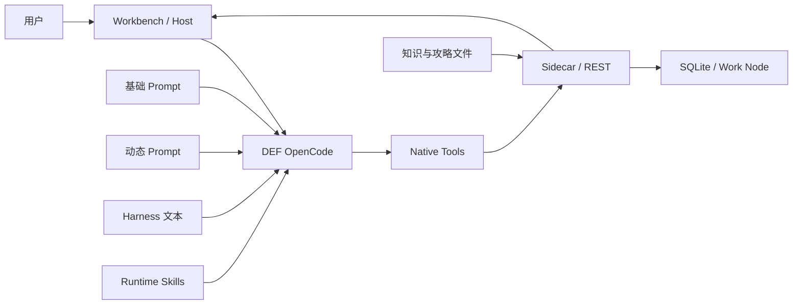

# DEF Agent 架构冲突总账与收口顺序

## 研究范围

本报告检查合并后的版本：

- `origin/main@de8f78b`
- `codex/code-bloat-audit-20260721@59083f7`
- 合并提交 `d262950`
- 共同基线 `e090404`

本轮只分析架构，不修改 Agent 行为。

## 收口进度（2026-07-22）

本报告之后已完成第一轮确定性收口：

| 原问题 | 当前状态 | 实现提交 |
| --- | --- | --- |
| 团队选择审批被通配放行 | 已补精确 `ask`，并扫描所有 native approval permission | `7c4195a` |
| Artifact 多文件产消相反 | consumer 支持 1–4 个文件并逐个校验 hash | `9dc45e4` |
| Prompt 引用幽灵 Tool | 已修正，并扫描全部模型可见指令 | `ac26fec` |
| 当前节点相反指令 | 已改为互斥分支和唯一权威 Tool | `9eefc6e` |
| session 按 turn 偷换 Harness | 已禁止；turn router 只保留任务分类 | `54840a8` |
| Harness `when` 静默失效 | V1 构建时明确拒绝 | `54840a8` |
| 完整 Agent 版本不可见 | 已增加 `AgentReleaseV1` 并接入 regression | `b2dda2d` |
| session 读取覆盖代码副本 | 已停止刷新；实际 process plugin 纳入 release 指纹 | `b2dda2d` |

另有一项事实修正：项目设置了 `OPENCODE_DISABLE_PROJECT_CONFIG=1`。session 的 `.opencode/tools/def.js` 副本并非当前 native Tool 的权威加载源；真正来源是进程级 plugin。副本覆盖仍是不合理写入，但完整运行时漂移的主要来源是进程 plugin、Skill、知识和 Host 没有整体 pin。

`AgentReleaseV1` 目前选择诚实记录，而不是虚假冻结：Harness 为 `immutable`，其他 Runtime 为 `observed-not-pinned`。

这里说的“训练”，不是训练模型权重。

它是 Codex 观察 DEF Agent 的失败，再修改仓库，让下一轮 Agent 表现更好。

更准确的名字是：

> **教师驱动的 Agent 运行时迭代。**

Codex 是教师。DEF OpenCode 是学生。真正的学生不是一份 Harness 文本，而是整个运行组合。

## 一、先说结论

这条路不是徒劳。

它已经证明了三件事：

1. 基础模型能够理解 DEF 任务；
2. typed tools 和领域知识确实能补足能力；
3. 审批、CAS、回读和 postcondition 能挡住不少错误。

所以“套壳训练”有效。

但当前训练单元错了。

一次失败通常会被同时修进：

- 基础 Prompt；
- 每轮动态 Prompt；
- Harness；
- Runtime Skill；
- Tool description；
- Tool schema 或实现；
- Sidecar 状态；
- Workbench 前端生命周期；
- Scenario 与合同测试。

下一次遇到问题，又继续向这些位置追加规则。

于是同一条经验有多个负责人。旧规则也很少退出。

最简单的根因是：

> **每次培训经验都直接写进生产系统，而且同一经验会写进好几个地方。**

现在最该做的不是继续训练新案例，也不是先建设完整 Eval 平台。

当前任务应当叫：

> **DEF Agent 架构收口。**

先解决确定性冲突，再确定一条经验到底归谁负责。

## 二、系统实际上由什么组成

文档常把 Harness 当作可训练的 Agent 版本。

实际运行不是这样。



一个真实的 Agent 版本至少包括：

```text
模型配置
+ OpenCode runtime
+ 基础 Prompt
+ 动态 Prompt
+ Harness
+ Runtime Skills
+ Tool 名称 / Schema / 权限 / 实现
+ 领域知识 revision
+ Sidecar 代码和状态合同
+ Workbench 命令与生命周期
```

当前 `DefHarnessSessionBindingV1` 只记录 Harness 包和八个 slot 的 hash。

因此它只能证明“用了哪份 Harness 文本”。

它不能证明“用了哪一版 Agent”。

这就是 stable、candidate 和 session pinning 后续失真的起点。

## 三、已经确认的硬冲突

下面不是风格问题，也不是架构偏好。

它们会直接造成错误、绕过或不可复现。

| 级别 | 冲突 | 实际后果 |
| --- | --- | --- |
| P0 | 团队选择审批被通配权限放行 | 高风险写入可能不出现用户审批 |
| P0 | Artifact 生产两个文件，消费者只收一个 | 合法的全量装备回退必然失败 |
| P1 | 主 Prompt 要求调用不存在的 Tool | Agent 会按系统指令调用幽灵工具 |
| P1 | 当前节点同时要求“先调 Tool”和“不要调 Tool” | 同一轮没有可满足的唯一行为 |
| P1 | session 声称固定 Harness，运行时却能按轮切 stable | 同一会话行为来源漂移 |
| P1 | Harness 保存 `when`，组合时完全忽略 | 所谓条件路由实际从不执行 |
| P1 | 旧 session 每次读取都会覆盖当前 Tool 代码 | 旧会话会执行新实现 |

### 3.1 团队选择的原生审批可能被自动跳过

工具目录把 `def.team.selection.apply` 标为：

```text
riskLevel = high
approval = user-confirm
```

位置：`agent/runtime/def-tools/definitions.mjs:29`。

工具实现也确实调用：

```text
permission = def_team_selection_apply
```

位置：`agent/runtime/def-tools/opencode/def.js:1589`。

但是外层权限表先配置了：

```text
def_* = allow
```

它只给少数写入工具补了精确的 `ask`。

其中没有 `def_team_selection_apply`。

位置：`agent/runtime/def-opencode-adapter/index.cjs:213-224`。

OpenCode 权限引擎使用最后一条匹配规则。

命中 `allow` 后，`context.ask()` 会直接返回。

位置：`agent/vendor/opencode/packages/opencode/src/permission/index.ts:28-36`、`55-76`。

所以这里出现了三份互相不一致的事实：

- Tool 元数据说要用户确认；
- Tool 实现说要请求确认；
- 真正生效的权限表却允许直接通过。

这是安全合同错误，不能靠 Prompt 修。

### 3.2 Artifact 的生产与消费合同相反

装备查询无匹配时，REST producer 会返回：

- `domain.full.jsonl`；
- `equipment-items.full.jsonl`。

位置：`scripts/ai-cli-rest-server.mjs:3890-3913`。

合同测试也明确断言第二个文件存在：

`scripts/def-native-catalog-bridge-contract-test.mjs:552-556`。

但 OpenCode 本地物化器要求：

```text
snapshot.files.length === 1
```

否则抛出 `exactly one catalog data file is required`。

位置：`agent/runtime/def-tools/opencode/def.js:721-724`。

所以合法 producer 输出会被合法 consumer 拒绝。

这类失败在 Agent 侧看起来像“工具调用失败”。

实际上是代码合同自相矛盾。

### 3.3 主 Prompt 仍在教授不存在的 Tool

模型真正可见的是：

```text
def_data_team_loadout_plan
```

位置：`agent/runtime/def-tools/registry.mjs:223`。

但基础 Workbench Prompt 仍要求：

```text
def_team_loadout_plan
```

位置：`agent/runtime/def-opencode-adapter/index.cjs:301`。

Candidate Harness 又专门告诉模型：

```text
Never call the nonexistent def_team_loadout_plan.
```

位置：

- `agent/harness/examples/candidate-v1/tool-guidance.md:17`
- `agent/harness/examples/candidate-v1/workflow.md:9`

也就是说，candidate 不是在增加新能力。

它在抵消基础 Prompt 的错误。

静态扫描 41 个真实模型可见 DEF Tool 后，唯一有意义的幽灵引用就是这个名称。

现有质量门没有拦住它。

### 3.4 当前节点规则在同一轮互相否定

Checkout 动态 Prompt 规定：

- 当前画布或当前节点问题先调用 `def_workbench_context`；
- 直接问当前节点时调用 `def_workbench_current_node`。

位置：`agent/server/def-agent-server.cjs:926-930`。

Live selection 动态 Prompt 又规定：

- 当前节点直接使用已注入字段回答；
- 不要为了重新发现它而调用 Tool。

位置：`agent/server/def-agent-server.cjs:952-965`。

这两段会被串到同一个 `system` 中。

位置：`agent/server/def-agent-server.cjs:538-548`、`716-725`。

模型无论调用还是不调用，都违反一条 system instruction。

### 3.5 session pinning 只固定了文本，还会被主动打破

ADR-0005 规定：

> session 创建后，后续 turn 只能使用同一 Harness binding。

实际 turn router 对特定 operator-config candidate 遇到排轴意图时，会切到 `stable`。

位置：`agent/runtime/def-opencode-adapter/harness-turn-router.cjs:33-47`。

Adapter 会为这一轮临时创建 stable binding。

原 session binding 仍然保留。

位置：`agent/runtime/def-opencode-adapter/index.cjs:794-822`。

所以同一个 session 同时存在：

- 记录中的 pinned binding；
- 本轮真正执行的 binding。

更进一步，读取旧 session 时会执行 `syncNativeSessionWorkspaceFiles()`。

它把当前仓库的 `def.js` 和 codec 覆盖到旧 workspace。

位置：`agent/runtime/def-opencode-adapter/index.cjs:973-980`、`1034-1044`。

Runtime Skill 也来自当前全局目录：

`agent/runtime/def-opencode-adapter/index.cjs:21`、`354-356`。

知识文件则由当前 Sidecar 实时读取：

`scripts/ai-cli-rest-server.mjs:112-115`、`4855-4865`、`4994-5009`。

因此旧 session 可以出现：

```text
旧 Harness 文本
+ 新 Tool 实现
+ 新 Skill
+ 新知识
+ 新动态 Prompt
```

这不是完整版本固定。

### 3.6 Harness 的条件路由只是一个没生效的字段

Harness parser 会保存 artifact 的 `when`：

`agent/harness/def-harness.cjs:78-86`。

但 `composeHarnessSystem()` 不读取 `when`。

它会把八个 slot 的全部文本拼入每一轮。

位置：`agent/harness/def-harness.cjs:317-325`。

所以目前这些名字容易误导：

- `routingPolicy` 不是路由器；
- `skills` 不是 Runtime Skill；
- `workflows` 不是可执行工作流；
- `when` 不是条件。

它们只是不同标题下的全局 Prompt 文本。

## 四、结构上不合理的地方

硬冲突修完，系统仍会继续膨胀。

原因在下面这些结构问题。

### 4.1 同一个行为有太多老师

Workbench Agent 会同时受到这些内容控制：

| 指令源 | 当前规模 | 作用 |
| --- | ---: | --- |
| 基础 Workbench Prompt | 20,263 字符 | 角色、路由、工具顺序、异常处理、回答约束 |
| `timeline-workbench` Runtime Skill | 16,192 字符 | 排轴、配置、读取、写入和审批流程 |
| stable Harness | 10,993 字符 | 再描述一次路由、Tool、流程和回答 |
| candidate Harness | 13,970 字符 | stable 内容加多个培训补丁 |
| 动态 Prompt | 每轮变化 | checkout、selection、特殊意图硬门 |
| Tool description | 随工具注入 | 继续说明先后顺序与禁止项 |

基础 Prompt 单独包含约 142 个英文命令词和 59 次 Tool 引用。

Runtime Skill 还有约 109 个命令词和 34 次 Tool 引用。

这些不是简单的背景信息。

它们都在争夺同一轮行为的控制权。

文本越多，不代表约束越强。

冲突出现后，模型只能临场猜优先级。

### 4.2 Harness slot 只有分类，没有责任隔离

八个 slot 看起来像八个组件。

运行时却一次性拼接全部文本。

因此：

- routing 可以写 workflow；
- workflow 可以写 Tool 名；
- tool-guidance 可以写回答风格；
- response-policy 可以写领域结论；
- skills 可以再次要求加载另一个 Skill。

slot 之间没有编译期边界，也没有冲突检测。

结果是“分了文件”，但没有真正分工。

### 4.3 一个 candidate 混了多堂课

`def-candidate@1.0.4` 同时包含：

- guide-first 装备推理；
- 战斗约定；
- named-guide 四人配装；
- 精确 Tool 名；
- timeline button schema；
- 大 JSON 分块编辑；
- candidate 身份测试字符串。

它相对 stable 修改了五个 slot：

- skills；
- routingPolicy；
- toolGuidance；
- responsePolicy；
- workflows。

因此 candidate 通过或失败时，很难判断是哪一堂课造成的。

这不是“版本内容太多”这么简单。

它破坏了训练归因。

### 4.4 stable 和 candidate 没有形成真实隔离

`origin/main` 从共同基线以来改了 60 个文件。

其中同时改了：

- stable Harness 6 个文件；
- candidate Harness 6 个文件；
- base Prompt；
- Runtime Skill；
- Native Tools；
- Sidecar；
- Workbench；
- Scenario。

另一条 code-bloat 分支改了 candidate、Skill、Tool、Sidecar 和 Workbench。

这说明两轮所谓“训练”都不是单纯的 Harness 对比。

尤其 main 直接同步修改 stable 与 candidate，相当于绕过 candidate → promotion。

产品默认又只使用 stable。

candidate 只能在开发 URL 里通过 `__defHarnessSelector` 选择。

位置：`src/components/def-opencode/DefOpenCodeView.tsx:52-54`、`83-92`。

当前 channel 更像开发调试开关，还不是完整训练发布通道。

### 4.5 stable 的版本号无法表达跨机器身份

stable manifest 一直是：

```text
def-stable@0.0.0
```

位置：`agent/harness/baseline/stable-v0/manifest.json`。

`ensureBaseline()` 的行为是：

- 本机已有 stable 时，继续使用旧包；
- 本机没有 stable 时，用当前仓库源码构建。

位置：`agent/harness/def-harness.cjs:252-266`。

所以两台机器可能都显示 `def-stable@0.0.0`，内容 hash 却不同。

hash 在单机内能区分，版本名却无法用于沟通和发布。

### 4.6 Tool 有多套事实源

当前 Tool 系统至少有四层定义：

1. `definitions.mjs`：75 个 legacy definition；
2. `registry.mjs`：47 个 native target 与迁移映射；
3. `opencode/def.js`：手写模型可见 schema、description 和 execute；
4. Adapter permission：另一份独立权限事实。

当前统计：

```text
legacy definitions       75
legacy model exposed     70
native targets           47
唯一模型可见 DEF 名称    41
canonical                11
alias                    49
absorbed                 15
```

其中 12 个 legacy 名称映射到通用 `def.node.crud.read`。

7 个映射到 `def.node.crud.update`。

5 个映射到 `def.node.code.apply_patch`。

这说明 `canonicalTarget` 主要是迁移标签。

它不是一份能够生成 Tool schema、实现和权限的真正目录。

幽灵 Tool 和审批绕过，正是多事实源漂移的结果。

### 4.7 确定性工作流仍交给模型拼装

当前很多任务要求模型严格完成：

```text
发现 guide
→ 读取精确 section
→ 保留 capability
→ 读取 catalog
→ 规划
→ 展示决策
→ 等用户确认
→ revise
→ prepare
→ 审批
→ apply
→ 回读验证
```

每一步都有 token、hash、revision、次数和禁止项。

这已经不是“让模型做判断”。

它是让模型充当低层工作流引擎。

模型当然可以偶尔完成。

但为了让它稳定完成，项目只能不断增加：

- exact tool sequence；
- “只能调用一次”；
- “不得回退”；
- “失败后立刻停止”；
- 关键词路由；
- 特例恢复规则。

这就是套壳成本快速上升的主要原因。

### 4.8 具体训练样本正在进入全局路由代码

`harness-turn-router.cjs` 中已经出现：

- 排轴中文关键词正则；
- 当前节点整句正则；
- `水龙卷`、`图腾`、`层` 等具体样本词。

位置：`agent/runtime/def-opencode-adapter/harness-turn-router.cjs:1-18`。

Tool 层也有中文确认意图正则。

这种硬门对安全场景有价值。

但具体技能名和训练句式不断进入全局路由，会产生两个问题：

1. 对已见案例越来越好；
2. 对未见表达越来越难解释。

安全、状态和 schema 应当硬编码。

普通语言理解不应逐例编译成正则。

### 4.9 状态没有一个明确的生命周期负责人

当前 Workbench 行为同时依赖：

- Timeline / Work Node SQLite；
- legacy Work Node mirror；
- Renderer React state；
- localStorage 恢复镜像；
- REST command queue；
- REST snapshot；
- `.def-session.json`；
- `.def-workbench-context.json`；
- Sidecar 内存 capability；
- guide source 持久化文件；
- OpenCode session；
- Harness registry。

`mainWorkbenchControl.ts` 明确写着：

```text
REST result push is best effort.
localStorage result log remains authoritative in the page.
```

位置：`src/utils/mainWorkbenchControl.ts:713-725`。

Canvas 还用多个布尔量和 ref 协调：

- `isTimelineSessionReady`；
- `isCheckoutBootstrapPendingRef`；
- `isProcessingWorkbenchCommandRef`；
- `isCheckoutMutationPendingRef`。

位置：`src/components/CanvasBoard/index.tsx:579-600`。

最近修复的这些问题：

- restart authority；
- checkout hydration；
- empty tracks；
- pending reconciliation；
- hydration 前延迟命令；
- 完整输入持久化；

本质上都在补同一个缺口：

> 谁负责判定 Workbench 已经可以接命令？

现在这个答案分散在前端、REST、Sidecar 和 Prompt 中。

### 4.10 超大文件正在承担过多领域

合并版本中的主要文件规模：

| 文件 | 行数 | 字节 |
| --- | ---: | ---: |
| `scripts/ai-cli-rest-server.mjs` | 11,374 | 551,540 |
| `electron/main.cjs` | 6,851 | 263,830 |
| `src/components/CanvasBoard/index.tsx` | 4,778 | 211,846 |
| `agent/runtime/def-opencode-adapter/index.cjs` | 2,407 | 110,649 |
| `agent/runtime/def-tools/opencode/def.js` | 2,316 | 126,658 |
| `agent/server/def-agent-server.cjs` | 1,680 | 76,869 |

问题不只是文件长。

这些文件同时拥有：

- 进程生命周期；
- 权限；
- Prompt；
- session；
- Tool 路由；
- domain planner；
- repository；
- command queue；
- UI hydration；
- recovery。

当责任没有拆开时，任何训练修复都容易跨层修改。

### 4.11 三代架构仍在同一个产品中运行

仓库里同时存在：

1. Browser / now-storage / legacy AI CLI Fill；
2. REST typed tools / Work Node；
3. Native OpenCode / Harness / Interop。

外部 MCP Fill 是当前独立能力，不应误删。

真正的问题是旧兼容路径仍和新路径一起常驻：

- `electron/main.cjs` 仍启动 `17321`、`17322`、`17323` 和 OpenCode；
- `scripts/ai-cli-rest-server.mjs` 仍镜像 legacy Work Node；
- 旧 `/ai-cli` proposal review 已不可达，兼容代码仍保留；
- 打包仍包含 legacy fill runtime 与 MCP stdio；
- Adapter 自己也写明 legacy REST tools 仍是迁移 fallback。

兼容层本身不是错误。

没有调用方清单、退出条件和删除日期，才会让它永久变成架构的一部分。

### 4.12 自动验证没有覆盖项目真正依赖的合同

`package.json` 中有 24 个 `test:def-*` 脚本。

`npm run check` 显式执行的只有：

- `test:def-operator-build-planning`；
- `harness:check` 内的 3 个脚本。

其余近期加入的 binding、approval、bootstrap、team rollback、reconciliation、projection bridge 等合同，没有进入合并门。

另一方面，Harness promotion regression 只固定运行三个 Scenario：

1. 问“当前使用的教学配置是什么”；
2. 说“你好”；
3. 做一次不应用的预览。

第一项甚至只检查 candidate 回答里包含 `candidate-v1`。

项目其实已经有 24 个领域 Scenario。

但 promotion 没有运行它们。

所以当前出现了两个相反的问题：

- 有价值的确定性合同没有进 CI；
- promotion gate 有形式，但业务证明力很弱。

这不要求先做完整 Eval 平台。

先把已有合同接到真正使用它们的门上即可。

## 五、为什么它看起来仍然有效

这些冲突不代表此前工作无效。

当前 Agent 进步主要来自四种真实力量。

### 5.1 模型本来就有通用能力

它会理解自然语言、读 Tool、处理失败并组织回答。

Harness 不是从零创造智能。

它主要在缩小搜索空间。

### 5.2 Tool 和知识补上了真实能力

目录读取、guide evidence、3+1 planner、weapon fit、Work Node 和 postcondition 都是可执行能力。

这些改动比重复教学文本更可靠。

### 5.3 重复规则提高了已知路径的命中率

同一规则出现在 Prompt、Skill 和 Harness 后，模型更可能照做。

所以短期测试会改善。

代价是冲突、token、维护和泛化越来越差。

### 5.4 运行时保护拦住了部分模型错误

CAS、capability、revision、审批和回读把许多软规则变成了硬边界。

这部分方向是对的，应该保留。

因此最准确的判断不是“有效”或“徒劳”二选一。

而是：

> **能力建设有效，训练组织方式正在失控。**

## 六、根因不是一个，而是五个

### 根因一：只会增加，不会替换

新规则写入后，旧 Prompt、旧 Skill、旧 Harness 和旧兼容路径通常还在。

系统没有“新 owner 上线后必须删掉哪些旧规则”的门。

### 根因二：一条经验没有唯一负责人

同一失败可能被判断为：

- 模型没理解；
- Prompt 不够强；
- Skill 不够完整；
- Tool 不够清楚；
- Runtime 没保护；
- UI 没准备好。

最后往往每一层都改一点。

### 根因三：控制面与执行面混在一起

训练控制面包括：

- Teacher；
- candidate；
- stable；
- promotion；
- replay。

产品执行面包括：

- OpenCode；
- Tool；
- Sidecar；
- SQLite；
- Workbench。

现在一次 candidate 训练会直接改整个执行面。

但 candidate 包只记录 Harness 文本。

所以训练记录和真实改动不是同一个对象。

### 根因四：把确定性流程留给模型协调

越依赖 exact sequence、一次性 token 和恢复状态，越应该由代码拥有流程。

目前模型承担了过多本可确定执行的编排。

### 根因五：迁移没有完成态

每一代架构都被下一代包住。

旧路径继续作为 fallback。

项目因此既要维护新设计，又要维持旧世界的所有假设。

## 七、每类问题到底应该归谁

以后遇到一个失败，先归类，再改代码。

一条经验只能有一个主负责人。

| 问题 | 主负责人 | 不该主要写在哪里 |
| --- | --- | --- |
| Tool 名、参数、返回结构 | 唯一 Tool catalog / schema | Prompt、Harness |
| 审批、安全、权限 | Runtime policy | Skill、回答要求 |
| revision、幂等、持久化 | Domain service / repository | Prompt |
| Workbench ready / applying / recovery | Workbench lifecycle | Agent 自己猜 |
| 多步确定性流程 | 复合 typed tool 或 domain service | exact tool sequence 文本 |
| 游戏事实与攻略内容 | versioned knowledge | Prompt、router 正则 |
| 任务识别与软性方法 | Runtime Skill | Tool implementation |
| 回答口吻与篇幅 | response policy | domain planner |
| candidate 教学差异 | 单一 Harness lesson | stable 同步副本 |
| 是否真的修好 | 合同 / Scenario / UI 事实 | 教学句子是否存在 |

判断规则可以很简单：

```text
能由代码确定的，不让模型记。
属于事实的，不写进流程。
属于安全的，不靠文字要求。
属于风格的，不污染领域合同。
```

## 八、哪些东西应该保留

收口不是推倒重来。

下面这些方向是正确的：

- Codex Teacher 与 DEF Worker 分离；
- typed tools；
- Work Node 隔离；
- revision / CAS；
- 原生审批；
- apply 后回读；
- 失败时 fail closed；
- knowledge allowlist 与 exact section read；
- Harness package 的内容 hash、registry 和 rollback 概念；
- 外部 MCP Fill 与 DEF session 的边界。

需要修的是它们之间的责任关系。

## 九、建议的收口顺序

### 第 0 步：暂停继续堆培训规则

在下面四个硬冲突修完前，不再往 Prompt、Skill 或 candidate 添加同类措辞：

1. 给 `def_team_selection_apply` 补精确 `ask`；
2. 统一 Artifact 多文件合同；
3. 删除基础 Prompt 的幽灵 Tool 名；
4. 合并当前节点的两套相反规则。

同时加三个很小的静态门：

- 所有 Prompt / Skill / Harness Tool 引用必须存在；
- 所有 `user-confirm` native Tool 必须有精确 `ask`；
- producer fixture 必须能被真实 consumer 接受。

### 第 1 步：诚实定义“Agent 版本”

不需要先造复杂 Registry。

先生成一份简单的只读 release manifest：

```text
AgentReleaseV1
  runtimeCommit
  modelId + thinking config
  basePromptHash
  dynamicPromptVersion
  harnessRef
  skillTreeHash
  toolCatalogHash
  toolImplementationHash
  knowledgeRevision
  stateSchemaVersion
```

session 要么固定这份组合，要么明确标记自己只固定 Harness。

不能继续把“固定了八份文本”描述成“固定了 Agent”。

### 第 2 步：让 Tool 只有一份可检查的目录

不必马上自动生成所有实现。

第一阶段只要求同一份 catalog 能检查：

- native Tool 名；
- schema identity；
- exposure；
- risk；
- approval；
- permission override；
- implementation binding。

Prompt、Skill 和 Harness 只能引用 catalog 中存在的名字。

legacy alias 继续保留，但必须单独标记调用方与退出条件。

### 第 3 步：一条 candidate 只上一堂课

把当前 `candidate-v1` 拆成独立假设，而不是更多 slot：

```text
候选 A：named-guide team plan
候选 B：timeline button schema
候选 C：large-file bounded edit
```

每个候选只回答一个问题：

> 这条修改是否改善了这一类失败？

训练 candidate 时不直接同步修改 stable。

Runtime bug 可以独立修，但必须标记为共同底座变化，不能算作 candidate 的效果。

### 第 4 步：把 Workbench 生命周期收进代码

由一个 owner 管理：

```text
BOOTSTRAPPING
→ READY
→ APPLYING
→ READY
```

异常进入：

```text
RECOVERING
或 FAILED
```

这个 owner 决定：

- 何时可领取命令；
- 命令由谁持有；
- 结果写到哪里；
- 重启后如何恢复；
- localStorage 是缓存还是事实源。

Agent 只看到 typed 状态，不再靠 Prompt 判断 hydration。

### 第 5 步：选择一个流程做“规则压缩”

不要一次重构所有 Agent 流程。

优先选择已经反复出问题的 named-guide team loadout，或装备 3+1。

目标不是新增框架。

目标是把下面的模型编排：

```text
多个 Tool
+ 多个 token
+ 多条顺序规则
+ 多条失败恢复规则
```

压成一个高层 typed 能力。

完成标准必须包含删除：

- 删除对应基础 Prompt 规则；
- 删除 Harness 重复顺序；
- 精简 Runtime Skill；
- 保留 Tool 合同和用户可见解释。

如果新能力上线后旧规则一条也删不掉，就不算收口。

### 第 6 步：清理旧架构，不动独立 MCP 能力

先列出每条兼容路径的真实调用方：

- 当前产品调用；
- 测试调用；
- 外部调用；
- 无调用。

优先删除：

- 已不可达的旧 `/ai-cli` review 代码；
- 零调用的 legacy adapter；
- 已由 SQLite repository 取代的重复 mirror。

保留独立 MCP Fill，但不要让它继续拖着无调用的 Browser/AI CLI 兼容层。

### 第 7 步：把已有验证接到正确的门

先做小事：

- 权限、binding、bootstrap、rollback、reconciliation 合同进入 `npm run check`；
- promotion 使用与候选主题对应的真实领域 Scenario；
- candidate 身份字符串只用于基础设施 smoke，不作为能力改善证据；
- 人工 UI 验收继续处理真正无法自动证明的可见结果。

这一步叫“把已有检查用起来”。

它不是建设一个新的 Eval 产品。

## 十、当前不该做什么

- 不继续扩大万能 Prompt；
- 不在 Prompt、Skill、Harness 三处同步写同一规则；
- 不再用具体技能名扩充全局 router；
- 不先引入 LangGraph 或新的通用 Agent framework；
- 不先做自动 self-improving；
- 不让同一个 DEF Agent 既当学生又当裁判；
- 不用更多文档掩盖 producer / consumer 合同错误；
- 不把所有失败都解释成模型能力不足；
- 不做一次性大重写；
- 不把独立 MCP Fill 和 DEF Agent 收口混成一个项目。

## 十一、完成架构收口的判断标准

满足下面这些事实，才算从“有效但混乱”进入“可持续训练”：

- 一条 Tool 名只在一个 catalog 中定义；
- `user-confirm` 不可能被通配 `allow` 绕过；
- producer 的合法输出一定能被 consumer 接受；
- 同一轮 system instruction 没有相反要求；
- session 能说明自己使用的完整运行组合；
- stable 与 candidate 不会在同一 session 静默混用；
- 一条 candidate 只有一个主要训练假设；
- Runtime bug 与 Harness lesson 分开归因；
- Workbench readiness 有一个代码 owner；
- localStorage、REST 与 SQLite 的权威关系明确；
- 新高层能力上线时能删除旧 Prompt / Skill / Harness 规则；
- 兼容层都有真实调用方或明确退出条件；
- 已有关键合同进入合并门；
- 训练成功由真实任务结果证明，而不是由教学句子存在证明。

## 十二、最后的判断

项目的方向是对的。

真正有价值的部分是：

```text
强基础模型
+ DEF 知识
+ typed tools
+ Workbench 真实环境
+ 审批与验证
+ Codex 教师返修
```

现在的问题不是“Agent 套壳没有用”。

问题是套壳已经同时承担：

- 教材；
- 路由器；
- 工作流；
- 安全规则；
- 状态恢复；
- 测试答案。

这些职责必须重新归位。

接下来最重要的一句话是：

> **先决定这个错误到底该改哪里；改对地方后，删掉其他地方的同类补丁。**

这就是当前项目最需要的一轮训练。
