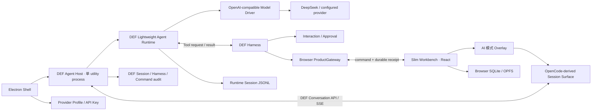

# DEF 轻量 Agent Runtime 源码映射与移植方案

日期：2026-08-08

性质：源码级架构分析与迁移设计，不是 Spec，不是 Tasks，也不表示代码已经开始迁移

当前分支：`codex/v1.8-lts-desktop-shell`

当前实现基线：`cab90253`

Pi 参考基线：`earendil-works/pi-mono@e47b8e37a6211ebd0b2942fa87059d64f81eec02`

Pi 发布包基线：`@earendil-works/pi-agent-core@0.84.1`、`@earendil-works/pi-ai@0.84.1`、`@earendil-works/pi-coding-agent@0.84.1`

OpenCode UI 参考基线：`anomalyco/opencode@67aec2212010d67775c35e696d8b8b54902eb338`，对应 `v1.17.11`

历史前置方案：[OpenCode 引擎回迁与可替换 Agent 架构调研（归档）](../archive/opencode-engine-reintegration-research-20260806.md)

当前有效 UI 决策：[ADR-0008：AI 模式复用原生 OpenCode UI](../decisions/0008-native-opencode-ui.md)。该 ADR 在新 Runtime 和新会话 UI 真正完成迁移前继续约束生产代码；本分析不能提前宣布它失效。

## 0. 最终结论

本项目不应把完整 Pi SDK 作为新的长期运行时依赖，也不应只拿 `pi-agent-core` 替换 OpenCode。正确方案是：

1. 把 Pi SDK 当作经过真实使用和大量测试验证的参考实现；
2. 源码级移植其中的消息模型、流式事件、Agent loop、Session、恢复、压缩和必要重试；
3. 按 DEF 的单一模型供应商、外置 Harness、浏览器业务数据库和独立 UI 边界重写外围；
4. 保留 OpenCode 会话 UI 的视觉结构、工具顺序和状态表达，不保留 OpenCode 服务端、Session API 和 99 MB 级 Runtime；
5. 保留现有 DEF Host、Harness、审批、ProductGateway、命令回执与浏览器 SQLite 边界；
6. 让最终代码成为 DEF 自己拥有、可以独立维护和测试的轻量 Agent Runtime。

一句话概括：

> 以 Pi SDK 为 Agent 行为参考，以 OpenCode 为会话 UI 参考，以现有 DEF 为业务与安全外壳，派生一套不依赖两者运行时的 DEF 自有实现。

这条路线成立并不依赖当前已经存在 `AgentEngine` 接口。现有接口只会降低集成成本；目标 Runtime 的内部设计必须首先忠于正确的 Agent、Session 和上下文生命周期，不能被当前接口过早限制。

## 1. “对着源码抄”的工程定义

这里的“抄”不是复制整个目录，也不是看到类名后自行想象一套相似实现。它包含四层要求。

| 层次 | 做法 | 验收证据 |
| --- | --- | --- |
| 行为 | 先写清消息、事件、Tool、Session、压缩和恢复的不变量 | 行为合同与状态机表 |
| 源码 | 对照固定提交中的具体文件和函数移植 | 来源台账、提交号与文件路径 |
| 裁剪 | 每删一个 Pi/OpenCode 能力，都记录为什么 DEF 不需要 | 保留/改写/舍弃矩阵 |
| 验证 | 同一组确定性输入同时跑参考实现与 DEF 实现 | 规范化 trace、Session 和上下文对比 |

采用以下三种移植等级：

| 等级 | 含义 | 使用场景 |
| --- | --- | --- |
| A：源码移植 | 保留上游核心控制流，只改类型、命名和依赖 | Agent loop、流事件组装、部分 Session/compaction 算法 |
| B：行为复刻 | 保留可观察行为，按 DEF 边界重新实现 | Provider、Tool bridge、Host adapter、会话存储目录 |
| C：设计借鉴 | 只保留数据模型或视觉语法 | OpenCode Message/Part、ToolState、会话 UI |

禁止以下做法：

- 直接复制 `pi-coding-agent` 全包后逐渐删除到“能编译”；
- 把 Pi SDK 加入生产依赖，再在外面包一层 DEF adapter；
- 把 OpenCode HTTP/SSE API 原样模拟成新的永久协议；
- 同时让 Pi/DEF/OpenCode 三份 Session 都成为上下文事实源；
- 为了追求少量代码而省略异常中断、Tool 配对、压缩边界和恢复测试；
- 把 Pi 尚未实现完成的 Durable `AgentHarness v2` 当成成熟底座。

## 2. 源码审计事实

### 2.1 Pi SDK 确实包含 Core，但完整 SDK 的重量主要在外围

依赖关系为：

```text
@earendil-works/pi-coding-agent
├── @earendil-works/pi-agent-core
│   └── @earendil-works/pi-ai
├── @earendil-works/pi-ai
├── pi-client / pi-protocol / pi-tui
├── 内置 read/bash/edit/write/grep/find/ls 工具
├── Extension / Skill / Prompt / Theme / Package Manager
└── Model/Auth/Export/Interactive 等外围能力
```

固定基线的源码量级：

| 范围 | TypeScript 行数 | 对本项目的判断 |
| --- | ---: | --- |
| `packages/ai/src` | 约 22,412 | 多供应商兼容层很重，只取统一消息协议和 OpenAI-compatible 路径 |
| `packages/agent/src` | 约 12,416 | 包含新的 Harness；成熟 `Agent + loop + types` 只有约 2,000 行 |
| `packages/coding-agent/src/core` | 约 28,653 | Session 能力成熟，但混入大量 CLI/TUI/插件/工具外围 |
| `AgentSession` | 3,342 | 不能整体复制，需拆出会话、压缩、重试和队列最小集 |
| `SessionManager` | 1,714 | 可作为 append-only JSONL、树与恢复的主要参考 |
| `compaction.ts` | 969 | 可作为压缩边界和摘要算法的主要参考 |

### 2.2 Pi 中真正可用的会话层

可用主线是：

- `packages/agent/src/agent.ts`
- `packages/agent/src/agent-loop.ts`
- `packages/agent/src/types.ts`
- `packages/coding-agent/src/core/sdk.ts`
- `packages/coding-agent/src/core/agent-session.ts`
- `packages/coding-agent/src/core/session-manager.ts`
- `packages/coding-agent/src/core/compaction/compaction.ts`
- `packages/coding-agent/src/core/agent-session-runtime.ts`

这些代码已经提供：

- user / assistant / toolResult 消息；
- text / thinking / toolCall 流式增量；
- Agent、Turn、Message、Tool 生命周期事件；
- Tool 串行或并行执行；
- steering / follow-up 队列；
- abort 和 idle settlement；
- append-only JSONL Session；
- Session 恢复、树导航和 fork；
- 手动、阈值和 overflow compaction；
- transient retry；
- 动态 Tool 和 Extension hook。

### 2.3 Pi 新 Durable Harness 不能采用

`packages/agent/src/harness/agent-harness.ts` 的接口设计很完整，但当前提交仍在多处抛出 `HarnessNotImplemented`。它可以作为未来观察对象，不能进入本轮实现基线。

DEF 已经拥有更贴合产品的 Harness、审批、事务、ProductBinding 和浏览器命令回执。迁移 Pi Harness 既没有必要，也会制造第二套业务状态机。

### 2.4 OpenCode UI 的真正价值

OpenCode UI 的好用并不来自 OpenCode 服务端本身，而来自以下稳定组合：

- `Message`：user / assistant；
- `Part`：text / reasoning / tool / file / compaction 等；
- `ToolState`：pending / running / completed / error；
- `message.updated`、`message.part.updated`、`message.part.delta` 等增量事件；
- `SessionTurn` 对一轮 user + assistant + tool 的组合显示；
- `ToolRegistry` 对不同工具卡片的可替换渲染；
- 严格保持实际 Tool 调用顺序。

主要源码：

- `packages/schema/src/session-v1.ts`
- `packages/app/src/context/server-session.ts`
- `packages/session-ui/src/components/session-turn.tsx`
- `packages/session-ui/src/components/message-part.tsx`
- `packages/session-ui/src/styles/`

这些源码证明 UI 与 OpenCode 上下文并非不可分离；真正的耦合点是消息数据结构和事件协议。只要 DEF Runtime 投影出等价的会话视图，UI 就不需要知道模型上下文由谁持有。

## 3. 必须保留的产品约束

| 约束 | 新架构中的结果 |
| --- | --- |
| 前端基线 | Slim LTS React 工作台继续是唯一业务页面 |
| AI 入口 | 主界面 SVG 的 AI 模式仍是唯一产品入口；AI CLI 不恢复 |
| Electron | 继续只做 Shell、进程、密钥、发包与浏览器唤起，不承载业务数据库 |
| 业务数据 | 浏览器 SQLite WASM/OPFS 继续是唯一业务事实源 |
| Agent 数据 | 本地 Runtime 只保存对话、模型上下文和 Agent 自身元数据 |
| 业务写入 | 必须经过 DEF Harness、审批、ProductGateway 和浏览器命令回执 |
| MCP | Legacy Fill MCP 继续独立；不作为 Agent Runtime 的内置插件系统 |
| 模型 | 首版只实现当前产品需要的 OpenAI-compatible/DeepSeek 路径 |
| Web LTS | 普通线上 Web 不依赖 Agent Runtime 才能工作 |
| 离线 | 本地 Agent 不承诺断网推理；Web LTS 现有离线保护不被本轮修改 |
| CI/CD | 第一轮只做本地合同、对跑和桌面验收，不把 CI/CD 改造混入迁移 |
| 业务语义 | 不借 Agent 重构修改伤害公式、数据或 Harness 业务含义 |

## 4. 目标架构



核心变化：

- 不再启动 OpenCode binary；
- 不再让 OpenCode Session 保存模型上下文；
- 不再代理 OpenCode 全套私有 API；
- Agent loop、Provider 和会话恢复在同一个 DEF Agent Host utility process 内运行；
- UI 继续保持 OpenCode 的视觉和工具顺序，但只消费 DEF 自有会话协议；
- 业务工具仍由 DEF Host/Harness 控制，不直接交给模型运行时写产品数据。

## 5. 事实源与所有权

| 数据 | 唯一权威 | 其他层可以保存什么 |
| --- | --- | --- |
| 对话消息、Tool call/result、compaction | DEF Runtime Session Log | UI 缓存和 Host 审计投影，不得反向重建模型上下文 |
| 当前模型上下文 | DEF Runtime `ContextBuilder` | UI 只看到可展示消息，不拥有裁剪规则 |
| Timeline、Buff、配置、伤害结果 | 浏览器 SQLite/OPFS | Agent 只能通过 snapshot 和 command receipt 观察 |
| ProductBinding | DEF Session | Runtime 只接收每轮最新的只读上下文 |
| Harness phase/transaction | DEF Harness Store | Runtime 只看到当前 Tool projection |
| Approval/Question | DEF InteractionBroker | UI 只投影待处理项和用户决议 |
| 产品命令执行结果 | Product Command Store + 浏览器 receipt | Runtime 只接收规范化 Tool result |
| Provider 密钥 | Electron Shell 的 0600 profile | Runtime 按 profile ref 读取；浏览器永远拿不到密钥 |
| UI 展开、滚动、折叠状态 | 浏览器 UI | 不进入模型上下文 |

最重要的去重原则：

> DEF Runtime Session Log 是唯一对话事实源；DEF Host Event Journal 是业务审计，不是第二份模型历史。

## 6. 模块总映射

| 能力 | Pi / OpenCode 参考源码 | 当前 DEF 接缝 | 目标模块 | 移植等级 |
| --- | --- | --- | --- | --- |
| 统一消息类型 | `pi-ai/src/types.ts` | `engine.ts`、`json.ts` | `agent/runtime/kernel/messages.ts` | A/B |
| 流事件协议 | `pi-ai/src/types.ts`、`event-stream.ts` | `EngineEvent` | `agent/runtime/kernel/stream-events.ts` | A |
| Provider 接口 | `pi-ai` 的 `StreamFunction` | OpenCode runtime/profile | `agent/runtime/kernel/provider/model-driver.ts` | B |
| DeepSeek 流式实现 | `openai-completions.ts` | `OpenCodeProviderProfile` | `provider/openai-compatible-driver.ts` | B |
| Agent 状态 | `agent.ts` | `AgentEngine` session/turn | `runtime-session.ts` | A/B |
| Agent loop | `agent-loop.ts` | OpenCode adapter | `agent-loop.ts` | A |
| Tool 类型 | `agent/src/types.ts` | `EngineToolDescriptor` | `tool.ts` | B |
| Tool 执行桥 | Pi `AgentTool.execute()` | `submitToolResult*()` | `host-tool-bridge.ts` | B |
| 动态 Tool | Pi `agent.state.tools` | Harness projection revision | `tool-projection.ts` | B |
| Session JSONL | `session-manager.ts` | DEF Session Store | `session/session-log.ts` | A/B |
| 上下文重建 | `buildSessionContext()` | `systemContext` | `session/context-builder.ts` | A/B |
| Compaction | `compaction.ts` | `AgentEngine.compact?` | `session/compaction.ts` | A/B |
| Overflow 恢复 | `AgentSession._checkCompaction()` | OpenCode provider errors | `session/context-recovery.ts` | B |
| Retry | Pi retry helpers | OpenCode error projection | `provider/retry-policy.ts` | B |
| Abort/Idle | `Agent.abort()`、`waitForIdle()` | `EngineTurnHandle.abort()` | `run-controller.ts` | A/B |
| Session create/recover | `sdk.ts`、`AgentSessionRuntime` | `AgentEngine` | `def-runtime-adapter.ts` | B |
| DEF Session/Binding | 不采用 Pi 实现 | `session.ts`、`session-store.ts` | 保留现有 | 保留 |
| Harness/审批 | 不采用 Pi Harness | `manager.ts`、InteractionBroker | 保留现有 | 保留 |
| ProductGateway | 无对应 Pi 模块 | `remote-browser-product-gateway.ts` | 保留现有 | 保留 |
| UI Message/Part | OpenCode `session-v1.ts` | Native UI gateway | `agent/ui/protocol.ts` | C/B |
| UI reducer | OpenCode `server-session.ts` | OpenCode SSE proxy | `agent/ui/conversation-store.ts` | C/B |
| Turn/Tool 视图 | OpenCode `session-turn.tsx`、`message-part.tsx` | iframe | `agent/ui/session-surface/` | A/C |
| UI Gateway | 不保留 OpenCode API | `opencode-native-ui-gateway.ts` | `agent-ui-gateway.ts` | B |
| Shell 生命周期 | 无须抄 Pi | Electron Agent supervisor | 保留并换启动目标 | 保留/改写 |

## 7. 建议的目标目录

```text
agent/
├── core/                         # 现有 DEF 产品合同、Harness、Tool
├── host/                         # 现有 Host、ProductGateway、Interaction
│   ├── def-agent-host.ts
│   └── agent-ui-gateway.ts       # 替代 opencode-native-ui-gateway
├── runtime/
│   ├── host-entry.ts
│   └── kernel/
│       ├── messages.ts
│       ├── stream-events.ts
│       ├── agent-loop.ts
│       ├── runtime-session.ts
│       ├── run-controller.ts
│       ├── tool.ts
│       ├── host-tool-bridge.ts
│       ├── tool-projection.ts
│       ├── provider/
│       │   ├── model-driver.ts
│       │   ├── openai-compatible-driver.ts
│       │   ├── sse-parser.ts
│       │   ├── provider-errors.ts
│       │   └── retry-policy.ts
│       └── session/
│           ├── entries.ts
│           ├── session-log.ts
│           ├── context-builder.ts
│           ├── compaction.ts
│           └── context-recovery.ts
├── engines/
│   ├── def-runtime/
│   │   ├── adapter.ts
│   │   └── profile.ts
│   └── opencode/                 # 迁移完成后删除
└── ui/
    ├── protocol.ts
    ├── conversation-store.ts
    └── session-surface/          # OpenCode-derived、独立小型 UI bundle
```

目标代码不使用 `pi` 命名空间。来源写在 provenance/NOTICE 中，产品 API 使用 DEF 自己的术语，避免未来错误地把上游内部 API 当成兼容承诺。

## 8. 各模块具体移植方法

### 8.1 消息模型

参考：

- Pi `packages/ai/src/types.ts`
- Pi `packages/agent/src/types.ts`
- OpenCode `packages/schema/src/session-v1.ts`

保留的最小消息：

```ts
type RuntimeMessage =
  | UserMessage
  | AssistantMessage
  | ToolResultMessage
  | CompactionSummaryMessage;

type AssistantContent =
  | TextBlock
  | ThinkingBlock
  | ToolCallBlock;
```

必须保留：

- 每条消息稳定 ID、timestamp 和 role；
- assistant 内容块原始顺序；
- Tool call 的稳定 ID、name 和结构化 arguments；
- Tool result 对应 `toolCallId`；
- assistant 的 stop reason、usage 和可安全展示的错误；
- text 与 thinking 分开，不能把思考混入最终正文；
- 附件只接受当前 `EngineUserAttachment` 已允许的 bounded data URL。

按 DEF 修改：

- 不带 Pi 的 CLI custom/bash message；
- 不带 OpenCode 的 patch/snapshot/subtask/todo 等编码 Agent 专属 part；
- JSON Schema 继续使用当前 `JsonObject` 合同，不引入 TypeBox；
- Provider 原始字段只存入有界 diagnostics，不进入 UI 和业务审计；
- 动态 Workbench 上下文不伪装成历史 user message。

### 8.2 流式事件

参考 Pi 的 `AssistantMessageEvent` 与 `AgentEvent`，保留以下两层事件。

Provider 层：

```text
response.start
text.start / text.delta / text.end
thinking.start / thinking.delta / thinking.end
tool-call.start / tool-call.delta / tool-call.end
response.done / response.error
```

Runtime 层：

```text
run.start / run.end
turn.start / turn.end
message.start / message.update / message.end
tool.start / tool.update / tool.end
compaction.start / compaction.end
retry.scheduled / retry.end
```

不直接把 Provider chunk 发给 UI。Provider 先组装为合法的 partial assistant message，Runtime 再发稳定事件，避免供应商字段污染 UI。

### 8.3 OpenAI-compatible / DeepSeek Model Driver

参考：

- Pi `packages/ai/src/api/openai-completions.ts`
- Pi `packages/ai/src/utils/event-stream.ts`
- Pi `packages/ai/src/utils/json-parse.ts`
- Pi provider retry/error helpers

首版只实现：

- OpenAI-compatible Chat Completions；
- configurable `baseUrl`、`modelId`、`apiKey`；
- text delta；
- DeepSeek/OpenAI-compatible reasoning delta；
- streamed tool call name 与 arguments；
- usage、finish reason 与响应 ID；
- auth、rate limit、server error、network drop、abort；
- 有界重试和用户可读错误映射。

明确舍弃：

- Anthropic、Gemini、Bedrock、Mistral、Vertex；
- OAuth 与模型目录；
- OpenRouter/Copilot 特殊头；
- 图片模型；
- prompt cache 的多供应商特例；
- telemetry；
- OpenAI Responses/Codex 专用协议，除非后续有明确需求。

实现建议：

- 使用 Node/Electron 已有 `fetch` 与自有 bounded SSE parser；
- 不引入完整 `openai` npm SDK；
- SSE parser 必须覆盖任意字节切分、跨 chunk UTF-8、多个 data 行、空行终止和 `[DONE]`；
- Tool arguments 使用增量字符串累积，结束时做严格 JSON 解析；失败不得执行半截参数；
- API Key 只由 profile source 注入，不进入错误、Session 或 trace fixture。

### 8.4 Agent loop

主要参考：Pi `packages/agent/src/agent-loop.ts`。

可直接保留的控制流：

```text
接收 user prompt
→ run.start
→ turn.start
→ 持久化 user message
→ 调用 model driver
→ 流式形成 assistant message
→ 若无 Tool：turn.end → run.end
→ 若有 Tool：按 assistant 内容顺序执行/等待 Tool result
→ 持久化 toolResult
→ 以新上下文进入下一 Turn
→ 直到模型停止或外部 abort
```

必须保留的不变量：

1. assistant message 完成后才能把其中 Tool call 交给执行层；
2. Tool result 必须与 call ID 一一配对；
3. 截断的 Tool arguments 不得执行；
4. Tool result 进入 Session 后，模型才能开始下一轮；
5. abort 后不得再接受晚到 Tool result 推进模型；
6. `run.end` 必须等待 message/session listener 完成，避免 UI 已显示完成但日志未落盘；
7. assistant 内容和 Tool result 的展示顺序可确定重放。

按 DEF 简化：

- 第一版只允许一个 active run；Host 已有 turn serialization；
- 第一版 Tool 执行按顺序等待，避免当前 Harness 被并行 mutation 破坏；
- steering/follow-up 不进入首个切换里程碑，可在核心稳定后按 Pi 队列语义增加；
- 不执行 Pi 内置 read/bash/edit/write；所有 Tool 都是 Host bridge；
- `prepareNextTurn` 只负责更新 Tool projection、system context 和 stop decision。

### 8.5 Tool Bridge 与动态投影

参考：

- Pi `AgentTool.execute()` 与 `tool_execution_*` 事件；
- 当前 `EngineTurnHandle.submitToolResult()`；
- 当前 `submitToolResultAndUpdateProjection()`；
- 当前 Harness revision 和 phase Tool projection。

目标流程：

```text
模型产生 ToolCall
→ Runtime 校验 name / arguments / 当前 projection revision
→ HostToolBridge 发出 engine tool.requested
→ DEF Host/Harness 决定 read/propose/mutate/interaction
→ Browser ProductGateway 执行或等待用户审批
→ Host 提交规范化 ToolResult
→ 同一临界区更新下一 phase 的 Tool projection
→ Bridge resolve
→ Runtime 追加 ToolResultMessage
→ Agent loop 进入下一 Turn
```

禁止：

- Runtime 直接访问浏览器数据库；
- Runtime 自己实现 Harness routing；
- Provider 看见未被当前 phase 投影的全部工具；
- Tool result 先 resolve、projection 后更新；
- UI 按工具名猜测成功，必须以真实 result 为准。

### 8.6 Runtime Session Log

主要参考：Pi `packages/coding-agent/src/core/session-manager.ts`。

首版采用 append-only JSONL，每个 DEF Session 对应一个 Runtime Session。建议 entry：

```text
header
message
model_change
thinking_change
compaction
run_marker
```

Header 至少包含：

- schema version；
- runtime session ID；
- 对应 DEF Session ID；
- created/updated time；
- provider profile ref，不含密钥；
- 当前 leaf/last entry；
- 来源 Runtime version。

每个 entry 至少包含：

- stable entry ID；
- parent entry ID；
- timestamp；
- type；
- bounded payload。

保留 `parentId` 的原因是成本很低，并能让未来 fork/回退不必更换磁盘格式；首版 UI 不提供树导航。

恢复规则：

1. Header 与 schema 必须先验证；
2. 不完整的最后一行可以安全截断；
3. 中间行损坏则 Session 标记 incompatible，不猜测修复；
4. user/assistant/toolResult 配对必须验证；
5. 未完成 run 在重启后标记 interrupted；
6. Runtime 恢复对话，DEF Host 负责恢复/对账业务命令；
7. 恢复不得重放已经执行过的产品 mutation。

### 8.7 Context Builder

参考 Pi `SessionManager.buildSessionContext()`，但按 DEF 分成三类上下文：

| 上下文 | 来源 | 是否持久化进对话 |
| --- | --- | --- |
| 稳定 Agent 指令 | DEF Runtime 版本化模板 | 只记录模板版本，不重复写消息 |
| 对话历史 | Runtime Session Log + compaction | 是，唯一模型历史 |
| 当前产品上下文 | DEF ProductBinding、最新 snapshot、Harness phase | 否，每轮即时注入 |

这样解决两个旧问题：

- UI 刷新不会丢对话，因为 Session Log 与 UI 无关；
- Timeline/Buff/节点变化不会被旧历史快照永久污染，因为当前产品上下文每轮重取。

构建顺序：

```text
稳定 system prompt
+ 当前 DEF/Harness 指令
+ 当前 ProductBinding 与有界 snapshot
+ 最新 compaction summary
+ summary 之后保留的完整消息
```

未解决的 Question、Approval、Tool call/result 对不得跨压缩边界拆开。

### 8.8 Compaction

主要参考：Pi `packages/coding-agent/src/core/compaction/compaction.ts` 与 `AgentSession` 的阈值/overflow 处理。

保留：

- token/window 阈值检查；
- 手动 compaction；
- threshold compaction；
- context overflow 后 compact-and-retry 一次；
- summary entry 与 `firstKeptEntryId`；
- 压缩后重建 Agent state；
- compaction start/end 事件；
- 摘要失败不破坏原 Session。

DEF 摘要模板至少保留：

- 用户当前目标；
- 已确认事实和约束；
- 已完成步骤；
- 未完成步骤；
- 关键 Tool 结果；
- 用户明确的偏好和否定项；
- 需要延续的错误或阻塞；
- 与当前 Workbench 相关的稳定业务结论。

不得把以下内容只留在 summary：

- 未决 Approval/Question；
- 未配对 Tool call/result；
- 产品写入的唯一 receipt；
- API Key 或 Provider 原始请求；
- 可以从当前 ProductGateway 重新读取的巨大 snapshot。

### 8.9 Retry、错误与 Abort

参考 Pi 的 Provider retry、AgentSession auto-retry 和 overflow recovery，按 DEF 缩减为：

| 情况 | 行为 |
| --- | --- |
| 401/403 | 不自动重试；提示在 Shell 更新 API Key |
| 400/schema | 不自动重试；保存有界诊断 |
| 408/429/5xx/network drop | 指数退避、有上限、有 jitter，可 abort |
| context overflow | compaction 后只重试一次 |
| malformed Tool args | 生成 Tool error result，让模型决定是否重发 |
| unknown/stale Tool | 生成投影错误，不执行产品命令 |
| browser consumer lost | Host abort active run，进入可恢复 terminal |
| user stop | 取消 Provider、Tool wait、retry timer 和 compaction |

所有错误必须经过当前产品错误映射，不能把密钥、请求头、完整响应体或本机路径显示到浏览器。

### 8.10 Runtime Session Facade

不复制 Pi 完整 `AgentSession` API。目标只提供产品需要的最小接口：

```ts
interface DefRuntimeSession {
  readonly id: RuntimeSessionId;
  readTranscript(): Promise<ConversationSnapshot>;
  subscribe(listener: RuntimeEventListener): () => void;
  start(input: RuntimeRunInput): Promise<RuntimeRunHandle>;
  compact(reason: CompactionReason): Promise<CompactionOutcome>;
  abort(reason: RuntimeAbortReason): Promise<RuntimeTerminal>;
  waitForIdle(): Promise<void>;
  close(): Promise<void>;
}
```

不进入首版的 Pi 能力：

- model cycling；
- theme 和 TUI binding；
- extension reload；
- slash commands；
- built-in bash；
- HTML/JSONL 用户导出；
- package/skill discovery；
- branch navigation UI；
- sub-agent runtime。

### 8.11 AgentEngine 适配

目标 Kernel 不围绕当前 `AgentEngine` 反向设计。完成 Kernel 后，由 `agent/engines/def-runtime/adapter.ts` 把它适配到现有：

- `probe()`；
- `createSession()`；
- `recoverSession()`；
- `startTurn()`；
- `compact()`；
- `disposeSession()`；
- `shutdown()`。

当前 `EngineEvent` 适合 Host 控制流，但不足以承载完整 UI。不要把 OpenCode `Message/Part` 塞进 `EngineEvent`。新增独立的只读会话视图合同：

```ts
interface AgentTranscriptSource {
  getSnapshot(session: EngineSessionRef): Promise<ConversationSnapshot>;
  subscribe(session: EngineSessionRef, afterSequence: number): AsyncIterable<ConversationEvent>;
}
```

这样：

- Host 的业务事件不被 UI 细节污染；
- UI 不直接读取 Runtime 内部 JSONL；
- 将来再换模型内核时，只需投影同一 Conversation 协议；
- Runtime Session 仍是对话事实源。

### 8.12 DEF Host、Harness 与 ProductGateway

以下模块不从 Pi/OpenCode 重写：

- `agent/core/harness/manager.ts`
- `agent/core/tools/**`
- `agent/core/interactions/**`
- `agent/host/def-agent-host.ts`
- `agent/host/session-store.ts`
- `agent/host/product-command-store.ts`
- `agent/host/remote-browser-product-gateway.ts`
- `agent/host/browser-consumer-registry.ts`

只做必要适配：

- Engine kind/runtime version 改为 DEF Runtime；
- Session recovery 指向 Runtime JSONL；
- Runtime transcript 与 Host audit 分离；
- Tool lifecycle 增加 UI 可见状态投影；
- Provider profile 更新不再重启 OpenCode 子进程；
- 继续保留 accepted client turn 去重、Harness transaction 和 command reconciliation。

### 8.13 Conversation 协议

借鉴 OpenCode schema，但使用 DEF 名称：

```ts
type ConversationPart =
  | { type: 'text'; id: string; text: string }
  | { type: 'reasoning'; id: string; text: string }
  | { type: 'tool'; id: string; callId: string; name: string; state: ToolViewState }
  | { type: 'interaction'; id: string; interactionId: string; state: InteractionViewState }
  | { type: 'compaction'; id: string; state: 'running' | 'completed' | 'error' };

type ToolViewState =
  | { status: 'pending'; input: JsonObject }
  | { status: 'running'; input: JsonObject; startedAt: string; detail?: JsonValue }
  | { status: 'completed'; input: JsonObject; output: JsonValue; endedAt: string }
  | { status: 'error'; input: JsonObject; code: string; message: string; endedAt: string };
```

Conversation event：

```text
conversation.snapshot
message.upsert / message.remove
part.upsert / part.delta / part.remove
session.status
interaction.upsert / interaction.remove
```

每个事件带：

- session ID；
- monotonic sequence；
- message/part stable ID；
- occurredAt；
- bounded payload。

UI 首次打开先取 snapshot，再从 snapshot sequence 订阅 SSE；断线后用 `Last-Event-ID` 或显式 `afterSequence` 补齐。

### 8.14 Pi Runtime 事件到 UI Part 的对应关系

| Runtime/Host 事件 | Conversation 投影 | OpenCode 视觉语义 |
| --- | --- | --- |
| user `message.start/end` | user message + text part | 用户气泡 |
| assistant `message.start` | assistant message | 新 Turn 开始 |
| `text.start/delta/end` | text part upsert/delta | 流式正文 |
| `thinking.start/delta/end` | reasoning part upsert/delta | 可折叠思考 |
| `tool-call.start` | tool part pending | 工具已生成 |
| Host 接受 Tool | tool part running | 工具执行中 |
| Tool update | tool part running detail | 进度/标题更新 |
| Tool success | tool part completed | 完成卡片 |
| Tool failure | tool part error | 错误卡片 |
| `interaction.requested` | interaction part pending | Question/Approval 卡片 |
| `interaction.resolved` | interaction update/remove | 已回答/批准/拒绝 |
| compaction start/end | compaction part | 上下文压缩提示 |
| run terminal | session status idle/error | 输入框与待命状态 |

Tool 顺序以 assistant content 中的 call 顺序为准，不以异步完成时间重新排序。

### 8.15 OpenCode-derived Session Surface

目标不是继续运行完整 OpenCode App，也不是重新设计聊天 UI。建议从锁定的 `v1.17.11` 提取一个独立小型会话视图：

保留：

- `SessionTurn` 的一轮布局；
- user/assistant 消息层次；
- text、reasoning、generic tool、error、compaction；
- Tool accordion、状态标题、输入输出区；
- 自动滚动和用户主动滚动保护；
- copy、stop、retry 等当前需要的操作；
- 原 OpenCode data-slot、间距、字体和颜色结构；
- DEF 主题变量接入。

删除：

- OpenCode workspace/project/file browser；
- terminal、LSP、formatter、VCS、worktree；
- provider/model 管理页；
- todo/task/sub-agent UI；
- OpenCode permission/question API 客户端；
- OpenCode 全局 sync、session cache 和 SDK client；
- 与编码文件 diff 无关的专用 renderer。

推荐形态：

- 保留一个独立、很小的会话 UI bundle，由 `AgentModeOverlay` 继续 iframe 宿主；
- 直接派生 OpenCode 的会话组件和 CSS，避免重新发明视觉；
- 用 `DefConversationStore` 替代 OpenCode `createServerSession(client)`；
- 使用 DEF Conversation API，而不是模拟 `/session`、`/global/event` 等 OpenCode API；
- 只复制实际使用的 UI primitive，不能把整个 `@opencode-ai/ui` 工作区带入。

这一选择兼顾三件事：

1. 主 React 工作台不引入另一套复杂状态；
2. 原 OpenCode UI 视觉和 Tool 顺序得以保留；
3. OpenCode 服务端与完整前端应用可以一起退役。

### 8.16 Agent UI Gateway

`agent/host/opencode-native-ui-gateway.ts` 当前约 1,957 行，主要成本来自：

- 静态宿主完整 OpenCode UI；
- 转发 OpenCode 大量 read API；
- 拦截 session/prompt/archive/delete；
- 代理并清洗 OpenCode SSE；
- 注入 DEF permission/question；
- 维护 optimistic message reconciliation。

目标 `agent-ui-gateway.ts` 只负责：

- 验证短期 launch grant 和当前 Browser consumer；
- 服务小型 Session Surface 静态文件；
- Session list/create/archive/delete；
- prompt/stop/retry；
- transcript snapshot + SSE；
- Question/Approval 决议；
- bounded diagnostics。

它不再做代理，因此协议和代码都可以大幅缩小。

### 8.17 Electron、进程与打包

目标进程：

```text
Electron main
├── Shell window
├── 静态 Host / browser launcher
├── Legacy Fill MCP utility process
└── DEF Agent Host utility process
    ├── DEF Runtime Kernel
    ├── Harness / ProductGateway
    └── Agent UI Gateway
```

不再存在：

- OpenCode child process；
- OpenCode 私有端口和密码；
- OpenCode binary 下载/校验；
- 完整 OpenCode UI asset tree；
- OpenCode provider config 生成；
- OpenCode plugin/private bridge。

迁移结束后删除或替换：

- `scripts/prepare-opencode-runtime.mjs`；
- `scripts/verify-opencode-runtime.mjs`；
- `scripts/prepare-opencode-ui.mjs`；
- `agent/engines/opencode/runtime-lock.json`；
- `agent/engines/opencode/native-ui-lock.json`；
- OpenCode runtime/package smoke 断言。

保留“未完成前不删除”的顺序：新 Runtime、UI、测试和手测全部通过以后，才移除旧 runtime 和 gateway，确保可以按 feature flag 回退。

## 9. 当前文件逐项处理总账

| 当前文件/目录 | 处理 | 原因 |
| --- | --- | --- |
| `agent/core/contracts/engine.ts` | 保留并小幅扩展 | 继续作为 Host 控制接口，不承载 UI 全量消息 |
| `agent/core/contracts/events.ts` | 保留 | 业务审计事实，不作为模型上下文 |
| `agent/core/contracts/session.ts` | 保留 | DEF Session/ProductBinding 与 Runtime Session 分离 |
| `agent/core/harness/**` | 保留 | 已有产品业务状态机，不能换成 Pi Harness |
| `agent/core/tools/**` | 保留 | DEF typed business tools |
| `agent/host/def-agent-host.ts` | 保留并适配 | 继续管理 Harness、互动和业务生命周期 |
| `agent/host/session-store.ts` | 保留 | 保存 DEF metadata/audit/harness transaction |
| `agent/host/product-command-store.ts` | 保留 | 产品 mutation 去重与恢复依据 |
| `agent/host/remote-browser-product-gateway.ts` | 保留 | 浏览器 SQLite 唯一写入口 |
| `agent/host/opencode-native-ui-gateway.ts` | 由 `agent-ui-gateway.ts` 替换 | 不再代理 OpenCode API/SSE |
| `agent/engines/opencode/adapter.ts` | 由 DEF Runtime adapter 替换 | OpenCode 不再是模型引擎 |
| `agent/engines/opencode/runtime.ts` | 删除 | 不再启动 binary/server |
| `agent/engines/opencode/profile.ts` | 泛化后迁移 | profile 安全规则仍有效，名称不能继续绑定 OpenCode |
| `agent/engines/opencode/tool-bindings.ts` | 逻辑迁入 HostToolBridge | Tool call/result 映射仍需要 |
| `agent/engines/opencode/plugin-entry.ts` | 删除 | 不再有 OpenCode plugin |
| `agent/engines/opencode/private-bridge.ts` | 删除 | 不再有 OpenCode private bridge |
| `agent/runtime/host-entry.ts` | 修改组装目标 | 实例化 DEF Runtime adapter 和新 UI gateway |
| `src/components/AgentMode/AgentModeOverlay.tsx` | 保留并换 launch target | 主工作台 AI 模式和 iframe 宿主继续存在 |
| `src/platform/agent/desktopAgentBridge.ts` | 保留并改协议命名 | 浏览器仍通过 Shell/Host 窄桥进入 AI 模式 |
| `electron/agent-runtime.cjs` 等 supervisor | 保留并简化 | 继续管理一个 Agent utility process，不再管 OpenCode child |
| OpenCode contract/blackbox tests | 先保留，后迁移为 Runtime conformance | 迁移完成前提供回退证据 |
| OpenCode UI lock | 最终删除 | 新 Session Surface 使用独立来源台账和 bundle lock |

## 10. 依赖和体量目标

### 10.1 不进入生产依赖

- `@earendil-works/pi-coding-agent`；
- `@earendil-works/pi-agent-core`；
- `@earendil-works/pi-ai`；
- `@opencode-ai/*`；
- `openai` 全量 SDK；
- Pi TUI/client/protocol；
- TypeBox/YAML/diff/ignore 等只因 Pi 外围引入的包；
- OpenCode binary。

### 10.2 可以新增的最小依赖

优先使用 Node/Electron 内建能力和当前项目已有依赖。只有在源码和测试证明自写会明显降低正确性时，才允许引入：

- 一个小型、浏览器端可 tree-shake 的 UI primitive；
- Solid runtime，仅当直接保留 OpenCode Session Surface 比 React 机械移植更小、更可靠；
- 独立 JSON Schema validator，仅当现有 Tool schema 验证无法复用。

是否保留 Solid 由 UI 原型的产物体积和视觉对比决定，不在本文凭偏好预判。

### 10.3 代码量预估

| 模块 | 预估生产代码 |
| --- | ---: |
| 消息、事件与基础类型 | 500–900 行 |
| OpenAI-compatible Provider + SSE | 900–1,600 行 |
| Agent loop + controller | 1,200–2,000 行 |
| Tool bridge/projection | 500–900 行 |
| Session/context/compaction | 1,800–3,000 行 |
| Engine adapter/profile | 500–900 行 |
| Conversation protocol/store/gateway | 1,000–1,800 行 |
| 合计 | 约 6,400–11,100 行 |

这是架构预算，不是以少写行为优先的硬指标。任何为了压行数而删掉恢复、错误或 Tool 配对验证的实现都不合格。

## 11. 对称验证方案

### 11.1 参考实现对跑

固定 Pi `0.84.1/e47b8e37`，使用确定性 fake provider 和 fake tools。相同输入分别进入：

1. Pi `AgentSession` 参考 runner；
2. DEF Lightweight Runtime。

规范化后对比：

- message role/content block；
- text/reasoning delta 顺序；
- Tool call ID、name、arguments；
- Tool result 配对和顺序；
- Turn/run terminal；
- Session 恢复后的模型上下文；
- compaction summary 边界和保留尾部；
- abort/retry 后是否仍有晚到事件。

允许归一化：

- 随机 ID；
- timestamp；
- Runtime 名称；
- DEF 特有 Host/Harness 审计事件。

不允许归一化：

- 消息顺序；
- Tool 参数和结果；
- stop reason；
- 压缩后模型可见内容；
- terminal 状态。

参考 runner 不进入产品包。可以用临时 clone 或专用开发目录生成 golden trace；仓库只保存可复核 fixture、来源提交和派生测试。

### 11.2 Provider 测试矩阵

| 场景 | 必须验证 |
| --- | --- |
| 纯文本 | start/delta/end、usage、stop |
| reasoning + text | 两种 part 不串线，顺序稳定 |
| 单 Tool | name/args 累积、result 回传、下一 Turn |
| 多 Tool | call 顺序稳定；首版按序等待 |
| 任意 chunk 边界 | UTF-8、JSON、SSE 均可跨 chunk |
| arguments 截断 | 不执行，返回明确错误 |
| 401/403 | 不重试，不泄密，提示 Shell 配置 |
| 429/5xx | 有界退避，可停止 |
| 网络中断 | 已落盘消息保持一致，不重复执行 Tool |
| abort | provider stream、timer、Tool wait 全部终止 |
| context overflow | compact 一次、retry 一次、不会无限循环 |

### 11.3 Session 测试矩阵

- 新建、追加、关闭、恢复；
- incomplete tail 截断；
- 中间损坏拒绝；
- 未完成 run 重启；
- user/assistant/toolResult 配对；
- compaction 前后 `buildContext()`；
- 当前产品上下文更新但历史不被篡改；
- archive/delete 与 Runtime 文件清理；
- provider profile ref 变化；
- accepted client turn 去重；
- 不重放已完成产品命令。

### 11.4 UI 测试矩阵

- snapshot + SSE 接续不重复；
- text/reasoning/tool 严格按顺序；
- pending/running/completed/error 状态；
- Question/Approval；
- 刷新恢复完整历史；
- 长会话分页或虚拟化；
- 自动滚动不抢用户滚动；
- stop/retry；
- 主题变量只改颜色，不改变布局尺寸；
- 与 OpenCode v1.17.11 基准截图做视觉对比。

### 11.5 产品黑盒

继续使用 [DEF Agent 黑盒测试](../../testing/def-agent-blackbox.md) 和 `DefCodexInteropProtocol v1`。至少覆盖：

- 浏览器 SVG 入口在 Shell 未预开时可以启动完整 AI 模式；
- Session 新建、恢复、归档、删除；
- 多轮追问保留上下文；
- 只读 Tool；
- mutation → Work Node/审批 → Product command → visible postcondition；
- Question 回答后继续原任务；
- stop、刷新、Host 重启、浏览器 consumer 丢失；
- Provider 密钥错误后的 Shell 修复与重试；
- 一次完整 Harness 归档案例。

## 12. 迁移顺序

### M0：文档与来源冻结

- 归档旧 OpenCode-first 调研；
- 固定 Pi/OpenCode commit；
- 建立来源台账和 MIT NOTICE；
- 把模块、能力和测试映射冻结为本报告。

完成标志：任何准备移植的代码都能指出上游文件、目标文件和验证方法。

### M1：协议与 Golden Trace

- 定义 Runtime messages/events/session entries；
- 编写 Pi reference runner；
- 生成 text/reasoning/tool/error/abort/compaction fixtures；
- 建立规范化 trace comparator。

完成标志：尚未接产品，但“应该抄成什么行为”可以自动判定。

### M2：Provider 与 Agent loop

- 实现 SSE parser；
- 实现 OpenAI-compatible driver；
- 移植 Agent loop；
- 实现 fake Tool bridge；
- 完成与 Pi 的确定性对跑。

完成标志：纯内存 Runtime 可完成多轮 text/reasoning/tool loop。

### M3：Session、恢复与 Compaction

- 实现 Runtime JSONL；
- context builder；
- threshold/overflow compaction；
- restart、tail corruption、abort/retry 测试。

完成标志：不依赖 UI/Host 也能恢复同一上下文继续运行。

### M4：DEF Engine Adapter

- 包装 Kernel 为 `AgentEngine`；
- 接入 profile；
- 接 HostToolBridge 和动态 projection；
- 复用现有 Host/Harness 黑盒；
- 通过 feature flag 与 OpenCode adapter 并存。

完成标志：真实 Harness 场景可在不启动 OpenCode 的情况下通过。

### M5：Conversation 协议与 Session Surface

- 实现 transcript source、snapshot/SSE；
- 派生 OpenCode SessionTurn/MessagePart UI；
- 接入 DEF theme；
- 替换 iframe launch target；
- 做截图、交互和 Computer Use 验收。

完成标志：用户看到的 Tool 顺序、会话信息密度和基础交互不低于旧 OpenCode UI。

### M6：完整生命周期与切换

- 多轮真实模型；
- 刷新/重启/归档/删除；
- Provider 更新；
- Work Node/审批/命令回执；
- Mac 和 Windows 手测；
- 长会话性能。

完成标志：默认引擎切到 DEF Runtime，仍可通过 flag 回退 OpenCode。

### M7：退役 OpenCode

- 删除 binary、runtime supervisor、plugin/private bridge；
- 删除完整 OpenCode UI 和 proxy gateway；
- 删除 prepare/verify scripts 与 locks；
- 更新打包、边界检查、ADR 和事实源；
- 移除回退 flag。

完成标志：发布包、进程列表、端口和源码均不再依赖 OpenCode Runtime。

## 13. 回滚策略

在 M6 验收前保留：

- OpenCode adapter；
- OpenCode runtime/UI locks；
- 当前 native UI gateway；
- 当前 OpenCode blackbox；
- `DEF_AGENT_ENGINE=opencode|def-runtime` 开发期开关。

Session 不做双写转换。测试期两套 Engine 使用独立 storage root；用户切换引擎时创建对应 Engine Session，DEF Session 只记录当前 ref。正式切换前提供一次明确迁移或重新建会话策略，不能让两套 Runtime 同时写同一个 transcript。

发生以下任一情况必须回退而不是勉强发布：

- 多轮上下文在刷新后变化；
- Tool call/result 配对错误；
- 产品 mutation 可能重复执行；
- compaction 后遗漏未完成任务；
- UI Tool 顺序或状态不可信；
- Provider 错误泄露密钥；
- Mac/Windows 任一平台无法从浏览器入口启动 AI 模式。

## 14. 风险与控制

| 风险 | 严重度 | 控制 |
| --- | --- | --- |
| 抄成“长得像”而非行为等价 | 高 | Pi reference runner + golden trace |
| OpenAI-compatible 边角协议复杂 | 高 | 从 Pi 测试迁移 chunk/tool/reasoning/error 用例 |
| Session/compaction 自研出错 | 高 | append-only、不可变 entry、恢复/损坏/overflow 对跑 |
| Tool bridge 死锁或晚结果推进 | 高 | 单 active run、abort token、原子 result+projection |
| 对话与 Host audit 双事实源 | 高 | Runtime transcript 唯一权威，Host 只审计 |
| UI 抽取后再次变成自研低质量 UI | 高 | 直接派生 OpenCode DOM/CSS/ToolState，截图对比 |
| 上游修复无法自动获得 | 中 | 固定来源台账，定期 diff 上游 release，不追 main |
| Pi 包名/架构继续变化 | 中 | 不依赖包名；只以固定 commit 为参考 |
| 许可证遗漏 | 中 | MIT NOTICE、源码头、来源清单和派生测试标注 |
| 迁移范围扩大到业务重写 | 高 | Harness/ProductGateway/公式保持原状，单独需求单独做 |

## 15. 来源、许可证与维护

Pi 和 OpenCode 参考代码均为 MIT。复制或实质改写时必须：

1. 在派生模块目录保留上游 LICENSE/NOTICE；
2. 每个实质移植文件头记录来源仓库、commit、路径和本地改动摘要；
3. 派生测试同样标注来源；
4. 建立 `source-provenance.json`，至少记录 source URL、commit、path、target、license、adaptation；
5. 不把临时 clone 或整个上游仓库提交进产品；
6. 后续升级按 provenance 逐文件 diff，不直接覆盖 DEF 改写。

建议来源记录：

```json
{
  "source": "https://github.com/earendil-works/pi-mono",
  "commit": "e47b8e37a6211ebd0b2942fa87059d64f81eec02",
  "path": "packages/agent/src/agent-loop.ts",
  "target": "agent/runtime/kernel/agent-loop.ts",
  "license": "MIT",
  "adaptation": "External HostToolBridge; sequential tools; DEF events"
}
```

## 16. 开工前必须锁定的决定

以下结论已经足够明确，可以直接进入后续 Spec/Tasks：

- 自有 Runtime，不使用 Pi/OpenCode 生产依赖；
- Pi `0.84.1/e47b8e37` 是首个参考基线；
- OpenCode `v1.17.11/67aec221` 是 UI 参考基线；
- 首版只做 OpenAI-compatible/DeepSeek；
- 首版 Tool 顺序执行；
- Runtime Session 是唯一对话事实源；
- 当前 DEF Host/Harness/ProductGateway 保留；
- OpenCode-derived UI 使用 DEF Conversation 协议，不模拟 OpenCode API；
- 新 Runtime 完成前保留 OpenCode 回退；
- CI/CD 暂不进入第一轮。

仍需在对应实施阶段用原型数据决定、不能凭空定死：

- Session Surface 保留 Solid 还是机械移植到 React；
- UI bundle 的最终体积预算；
- 首次正式切换时是否迁移已有 OpenCode 历史会话；
- branch/fork 何时暴露给用户；
- steering/follow-up 是否进入首版；
- 未来新增第二家 Provider 的触发条件。

这些未决项不阻塞 M1–M4；它们不能被用来重新讨论是否采用自有 Runtime。

## 17. 收尾标准

满足以下全部条件，才可以宣布 OpenCode → DEF Lightweight Runtime 迁移完成：

1. 发布和开发启动均不需要 OpenCode binary；
2. Agent loop、Tool chain、abort、retry 与 compaction 有 Pi 基线对跑；
3. 同一 Session 刷新、Host 重启后上下文一致；
4. Runtime transcript 与 Host audit 的事实源边界明确且无双写竞争；
5. 所有业务 Tool 仍经过 Harness、审批和 ProductGateway；
6. 产品 mutation 不会因 retry/recovery 重复执行；
7. UI 保留 OpenCode 的消息密度、reasoning、Tool 顺序和状态表达；
8. 浏览器 SVG 入口在 Shell 未预启动时可以完整拉起 AI 模式；
9. API Key 错误可在 Shell 修复并恢复，不泄露密钥；
10. 真实模型多轮、真实浏览器 SQLite、真实 UI 的 Computer Use 通过；
11. Mac 与 Windows 手测通过；
12. 长会话性能和发布包体积明显优于 OpenCode 版本；
13. OpenCode runtime、gateway、plugin、locks 和准备脚本已经删除；
14. 新 ADR、当前系统事实源、测试文档和打包检查同步更新；
15. 所有派生源码和测试都有可追溯 MIT 来源记录。

## 18. 最终判断

这不是一次“换 SDK”任务，而是一次有明确参考答案的轻量 Runtime 派生工程。它比直接装 Pi SDK多一部分移植和测试成本，但能得到四个长期收益：

- 只保留产品真正需要的 Agent 能力；
- 不被 Pi CLI/TUI/插件、多供应商和未来包名变化绑架；
- 不再承担 OpenCode 大服务端、binary 和兼容网关；
- Session、UI、Harness 和产品数据的所有权清楚，后续维护者能逐模块理解和升级。

最合理的执行方式不是一口气删除 OpenCode，而是先用 Pi 的源码和测试建立参考线，逐模块派生 DEF Runtime，在同一 Host/Harness 下完成对跑，再替换 UI 和退役旧 Runtime。这样才是真正“把作业抄明白”，而不是把新的依赖搬进来。

## 19. 主要证据索引

Pi 固定源码：

- `packages/ai/src/types.ts`
- `packages/ai/src/api/openai-completions.ts`
- `packages/ai/src/utils/event-stream.ts`
- `packages/agent/src/types.ts`
- `packages/agent/src/agent.ts`
- `packages/agent/src/agent-loop.ts`
- `packages/coding-agent/src/core/sdk.ts`
- `packages/coding-agent/src/core/agent-session.ts`
- `packages/coding-agent/src/core/session-manager.ts`
- `packages/coding-agent/src/core/compaction/compaction.ts`
- `packages/coding-agent/src/core/agent-session-runtime.ts`
- `packages/agent/src/harness/agent-harness.ts`，仅用于证明新 Harness 尚未完成

OpenCode 固定源码：

- `packages/schema/src/session-v1.ts`
- `packages/app/src/context/server-session.ts`
- `packages/session-ui/src/components/session-turn.tsx`
- `packages/session-ui/src/components/message-part.tsx`
- `packages/session-ui/src/styles/`

当前 DEF 实现：

- `agent/core/contracts/engine.ts`
- `agent/core/contracts/events.ts`
- `agent/core/contracts/session.ts`
- `agent/core/harness/manager.ts`
- `agent/core/tools/interactive-workbench.ts`
- `agent/host/def-agent-host.ts`
- `agent/host/session-store.ts`
- `agent/host/product-command-store.ts`
- `agent/host/remote-browser-product-gateway.ts`
- `agent/host/opencode-native-ui-gateway.ts`
- `agent/engines/opencode/adapter.ts`
- `agent/engines/opencode/runtime.ts`
- `agent/runtime/host-entry.ts`
- `src/components/AgentMode/AgentModeOverlay.tsx`
- `src/platform/agent/desktopAgentBridge.ts`
- `docs/testing/def-agent-blackbox.md`
