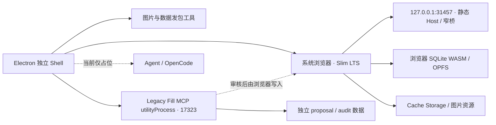
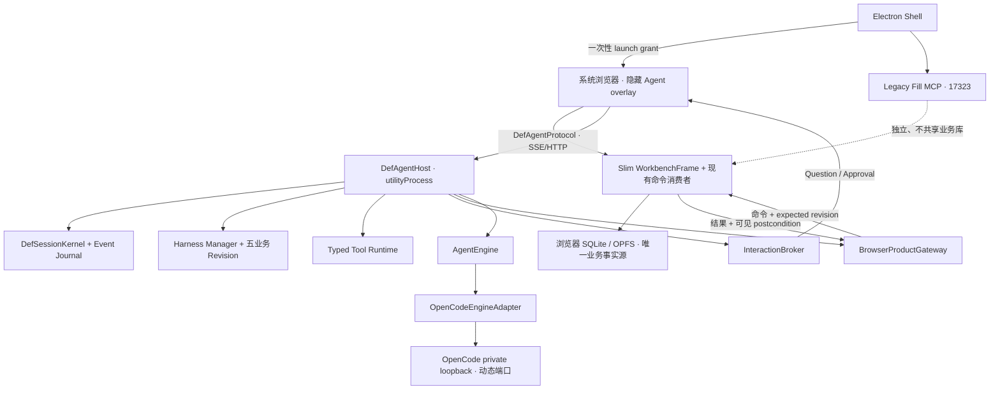

# OpenCode 引擎回迁与可替换 Agent 架构调研

日期：2026-08-06

性质：开工前调研，不是 Spec，不是 Tasks，也不代表已经开始迁移

目标分支：`codex/v1.8-lts-desktop-shell`，审计基线 `8bc9af76`

旧 AI 参考分支：`codex/def-opencode-spec9-2-implementation`，审计基线 `ea29a231`

共同基线：`de8f78bbca4ea39cb0cbad7da7ff50718ff07ea6`

## 0. 最终结论

这项工程可以开工，正确路线不是“把旧 OpenCode 分支合并回来”，也不是“先把 OpenCode 的 Session 从 Agent Loop 里硬拆掉”。正确路线是：

1. 永久保留 Slim LTS 的浏览器前端、浏览器 SQLite/OPFS 和独立 Electron Shell；
2. 把旧分支里真正属于 DEF 的 Harness、业务事务、Tool 合同迁回；
3. 新建 DEF 自己拥有的 Session、Turn、事件、审批和产品访问协议；
4. 让 OpenCode 作为第一套 `AgentEngine` 接入，允许它在适配器内部继续拥有自己的 Session、上下文压缩和模型循环；
5. 所有业务读写都经过浏览器侧 `ProductGateway`，绝不恢复旧 `17321` REST、旧 Node Timeline/Work Node SQLite 或旧数据服务；
6. 产品 UI 使用 Slim React 前端。OpenCode 原生 UI 只作为开发期行为参照和对跑工具，不作为长期产品协议；
7. Pi 暂时不实施，但从第一天用一套真实的引擎合同约束 OpenCode，等 OpenCode 迁移闭环后再做 Pi 适配。

一句话概括：

> 迁回的是 DEF 业务内核；OpenCode 只是被装进这个内核的第一台引擎。

这一方案同时满足四个目标：

- 保住 1.8 Slim 已经取得的前端、维护和响应优势；
- 尽快恢复成熟度最高的旧 AI 能力；
- 不恢复双数据库和三层旧 Sidecar；
- 后续替换 Pi 时，不需要再重写产品 Session、审批、Tool、Harness 和 UI。

## 1. 本报告回答的问题

本报告集中回答以下问题：

1. 当前 Slim 桌面分支是否已经具备接回 Agent 的基础；
2. 旧 AI 分支里哪些内容真的可复用，哪些只是 OpenCode 耦合；
3. OpenCode 是否应整套迁回、只迁 Agent Loop，还是做适配器；
4. OpenCode Session 与旧 DEF Session 强绑定时，怎样解耦才不会重写整个引擎；
5. 浏览器 SQLite 成为唯一业务事实源后，旧 Typed Tools 应怎样访问产品；
6. Shell 唤起独立 Agent 页面时，如何与单标签写租约、当前 Workbench 和隐藏路由协作；
7. 原生 OpenCode UI、现有魔改 UI、Slim React UI 应分别扮演什么角色；
8. OpenCode 与 Pi 的真实能力怎样映射，接口会不会只是“为了未来而虚构”；
9. 应按什么顺序实施、测试、回滚和打包；
10. 哪些旧内容严禁迁回。

## 2. 结论成立的硬约束

以下约束来自当前产品事实和此前已确认的产品方向，后续实施不得擅自改变。

| 约束 | 必须保持的结果 |
| --- | --- |
| 前端基线 | Slim LTS React 前端是唯一产品前端基线 |
| 桌面形态 | Electron 只承载独立 Shell、进程生命周期和本地工具，不用 `BrowserWindow` 承载业务前端 |
| 业务数据 | 浏览器 SQLite WASM/OPFS 是唯一业务事实源 |
| 旧数据库 | 旧 Node SQLite、旧 Timeline Repository、旧 Work Node Store、旧数据服务全部保持退役 |
| 旧 REST | `17321` AI CLI REST 和 `17322` DEF Sidecar 不恢复 |
| MCP | Legacy Fill MCP 继续独立运行在 `17323`，与 Agent 进程、环境变量和数据隔离 |
| 生产 Origin | 生产浏览器工作区继续固定为 `http://127.0.0.1:31457`，不能因 Agent 改成随机 Origin |
| 开发 Origin | `npm run electron:dev` 继续使用 `3030` 的 Slim 页面和 `31457` 的本地 Host bridge |
| Web 版本 | 普通线上 Web LTS 不显示 Agent 入口，也不依赖 Electron/Agent 才能运行 |
| 离线范围 | 本地 Electron Host 的 Agent 不做 PWA 断网启动承诺；原有 Web LTS 离线保护测试保持原样，但不是本轮 Agent 验收重点 |
| 依赖边界 | 已退役的 `xlsx`、`exceljs` 不得被旧分支依赖链带回 |
| CI/CD | 本轮先完成架构和本地验收设计，不把 CI/CD 改造混入第一轮迁移 |
| 业务语义 | 迁移不借机改伤害公式、游戏数据或五业务规则；差异必须由测试和明确的新需求驱动 |

当前约束的直接证据见：

- [当前系统全景](../current-system.md)
- [Slim Electron Shell 迁移审计](./v1.8-slim-electron-shell-migration-20260806.md)
- [桌面运行时边界检查](../../../scripts/check-desktop-runtime-boundaries.mjs)
- [Electron Shell 主进程](../../../electron/main.cjs)
- [当前 package 与打包清单](../../../package.json)

## 3. 调研方法与证据基线

### 3.1 本地代码审计

本轮同时审计了两条分支，而没有把当前工作区误认为全部事实：

| 对象 | 分支 / 提交 | 作用 |
| --- | --- | --- |
| 新产品基线 | `codex/v1.8-lts-desktop-shell@8bc9af76` | Slim 前端、独立 Shell、浏览器 SQLite、Legacy Fill MCP |
| 旧 AI 参考线 | `codex/def-opencode-spec9-2-implementation@ea29a231` | OpenCode、DEF Harness、Typed Tools、Interop、旧数据桥 |
| 历史共同点 | `de8f78bb...` | 判断两边独立演进范围 |

两个分支从共同基线后分别前进 37 和 249 个提交；直接比较有 6836 个文件变化、约 8.2 万行新增和 130 万行删除。这个差异量已经排除“整分支 merge 后修冲突”作为可靠方案。

可复核命令：

```bash
git rev-list --left-right --count \
  codex/def-opencode-spec9-2-implementation...codex/v1.8-lts-desktop-shell
git merge-base \
  codex/def-opencode-spec9-2-implementation \
  codex/v1.8-lts-desktop-shell
git diff --shortstat \
  codex/def-opencode-spec9-2-implementation..codex/v1.8-lts-desktop-shell
```

### 3.2 独立复核

除主审计外，本轮还做了一次独立只读复核。两次审计对以下结论一致：

- Harness Manager、五业务 Harness、事务和 Tool 合同是可迁移的 DEF 资产；
- Session、UI、审批交互、事件观察、Tool handler 和打包仍明显耦合 OpenCode；
- 旧 `def.js` 不能整体复制；
- 最大的新问题不是 OpenCode，而是旧 Tool 最终依赖已退役的 Node 业务数据服务。

### 3.3 上游资料

上游事实以 2026-08-06 读取的官方资料为准：

- [OpenCode v1.18.14 release](https://github.com/anomalyco/opencode/releases/tag/v1.18.14)
- [OpenCode Server](https://opencode.ai/docs/server/)
- [OpenCode SDK](https://opencode.ai/docs/sdk/)
- [OpenCode Plugins](https://opencode.ai/docs/plugins/)
- [Pi repository](https://github.com/earendil-works/pi)
- [Pi SDK](https://pi.dev/docs/latest/sdk)
- [Pi Extensions](https://pi.dev/docs/latest/extensions)
- [Pi RPC](https://pi.dev/docs/latest/rpc)
- [Pi Compaction](https://pi.dev/docs/latest/compaction)

## 4. 术语与责任

为避免后续继续把“Agent、OpenCode、DEF、页面”混成一个东西，本报告使用以下定义。

| 名称 | 含义 | 谁拥有 |
| --- | --- | --- |
| Slim Workbench | 当前 React 业务前端及其计算、Timeline、配置和页面状态 | 产品 |
| Electron Shell | 独立小窗口、托盘、发包工具、本地进程和系统浏览器启动器 | 桌面层 |
| DefAgentHost | 新增的本地 Agent 总入口，管理 DEF Session、事件、Harness、Tool 和引擎 | DEF |
| AgentEngine | 只负责模型、Agent Loop、引擎内部对话、压缩、stream、abort 的可替换接口 | 适配层 |
| OpenCodeEngine | `AgentEngine` 的第一套实现 | OpenCode 适配器 |
| ProductGateway | Agent 访问当前浏览器业务事实和执行业务命令的唯一通道 | DEF 与浏览器边界 |
| BrowserWorkbenchExecutor | 在持有 Web Locks 写租约的 Slim 页面中执行现有 29 类命令 | 产品浏览器端 |
| InteractionBroker | Question、审批、一次性 capability、超时和审计的权威状态机 | DEF |
| DefAgentProtocol | UI、测试和自动化观察 Agent 的稳定协议 | DEF |
| Engine Session | OpenCode 或 Pi 私有的会话 ID 和上下文 | 引擎适配器 |
| DEF Session | 与 Timeline、Axis、Harness 事务绑定的稳定产品会话 | DEF |

## 5. 当前 Slim 桌面分支的真实状态

### 5.1 当前运行拓扑



当前 [Electron 主进程](../../../electron/main.cjs) 只有约 500 行，和旧分支约 6770 行的主进程已经不是同一种架构。它负责：

- 单实例、托盘、Shell 小窗口；
- 系统浏览器启动；
- 生产静态 Host；
- 图片与数据 Release builder；
- Legacy Fill MCP 生命周期和窄浏览器桥；
- Agent 能力占位。

它不负责：

- 业务页面渲染；
- Timeline、Work Node 或配置数据库；
- Node 侧业务 SQLite；
- OpenCode、DEF Sidecar 或 AI REST。

### 5.2 当前边界测试是正确资产，不是迁移障碍

[桌面运行时边界检查](../../../scripts/check-desktop-runtime-boundaries.mjs) 当前明确保证：

- 六个旧运行时文件不存在；
- 主进程、preload 和发包工具不引用 Node SQLite、旧 repository、`17321`、`17322`；
- 打包清单没有 `agent/**`、`src/**` 或整个 `node_modules/**`；
- Electron 只 `loadFile()` 独立 Shell，不 `loadURL()` 业务前端；
- Legacy Fill MCP 仅用独立 proposal/audit 数据库；
- MCP 运行时会清除 `DEF_*` 和 `OPENCODE_*` 环境变量。

恢复 Agent 时应修改这份测试的“Agent 必须不存在”部分，但必须继续保留其余禁令。正确的新断言应是：

```text
允许 dist/agent/** 和一份平台 OpenCode runtime
仍禁止旧 17321/17322、旧 Node 业务库、旧 REST、旧 Electron 数据服务
仍禁止 agent/vendor/**、src/**、完整 node_modules/** 进入发布包
```

### 5.3 当前浏览器已经保留了重要的 Agent 接缝

[mainWorkbenchControl.ts](../../../src/utils/mainWorkbenchControl.ts) 仍定义了 29 类产品命令，覆盖：

- 选人和页面导航；
- 技能按钮增删；
- BUFF 单体、批量增删；
- 目标抗性和伤害计算；
- Timeline 快照；
- AI Work Node 创建、patch、validate、diff、checkout、restore；
- 武器、装备、整套配置；
- 配装 preview、apply、finalize 和失败后的原子恢复；
- 快照刷新。

同一文件还定义了 `MainWorkbenchSnapshot`，包含：

- `timelineId` 与 `activeTimelineId`；
- 当前 checkout；
- 已选干员；
- 可信技能目录；
- 技能按钮与 BUFF；
- 伤害报告；
- 武器、装备、套装效果和技能等级；
- 最近命令结果。

当前远程接缝：

- `pullRemoteMainWorkbenchCommands()`；
- `pushMainWorkbenchCommandResult()`；
- `pushMainWorkbenchSnapshot()`；

在瘦身时被有意识地保留为 no-op。这是恢复 Browser ProductGateway 的最佳落点，不需要重新发明一套业务命令。

### 5.4 接缝还不能直接视为完成的 ProductGateway

当前命令实际由两个 UI 所有者执行：

- [AppContext.tsx](../../../src/context/AppContext.tsx) 处理选人、视图、清空和页面打开；
- [CanvasBoard/index.tsx](../../../src/components/CanvasBoard/index.tsx) 处理其余复杂 Timeline、BUFF、配置和计算命令。

Canvas 执行器还明确要求 `document.visibilityState === 'visible'`，避免后台旧标签页推进 checkout。因此，如果 Shell 只打开一个纯聊天页面，而当前 Workbench 在另一个后台标签页：

- Agent 可以正常聊天；
- Host 可以正常排队命令；
- 但后台 Canvas 会拒绝执行；
- 用户会看到 Tool 超时，或更危险的“状态未知”。

这个问题不能靠延长超时解决。

### 5.5 首版最安全的页面方案

第一版不应先搬动 29 类复杂 handler。那会把引擎迁移、业务重构和 UI 重构绑成一次高风险改造。

建议新增一个只由 Shell 唤起的隐藏 Agent 路由，形式上是 Slim Workbench 的 overlay：

```text
Agent 隐藏路由
├── 仍挂载 WorkbenchFrame / AppProvider / CanvasBoard
├── 当前标签持有浏览器 SQLite 写租约
├── 现有命令处理器保持原样
└── 上层显示 DEF Agent React UI
```

这样：

- 页面仍是 Slim 前端；
- 当前标签可见，现有 Canvas 安全检查成立；
- 业务逻辑不需要在接 OpenCode前先大规模搬家；
- Agent UI 可折叠或关闭，用户能立即查看变更后的 Workbench；
- 路由不出现在普通 Web 导航，只能凭 Shell 的一次性 launch grant 打开。

在 OpenCode 对跑通过后，再把 handler 逐步抽成真正的 `BrowserWorkbenchExecutor` 服务。那是后续维护优化，不是第一阶段阻断项。

## 6. 旧 AI 分支的真实架构

### 6.1 调用链

```text
旧 Workbench
  → MainWorkbenchAiPanel
  → DefOpenCodeView
  → Electron 31457 /open-def-agent
  → DEF Agent Sidecar :17322
  → def-opencode-adapter
  → OpenCode binary :17445+
  → OpenCode Session / Message / Event / Permission / Question
  → DEF OpenCode Plugin
  → Harness Manager + Typed Tool wrapper
  → DEF REST :17321
  → 旧 Node Timeline / Work Node / 数据服务 / 浏览器投影
```

旧系统至少包含：

- Electron 主进程；
- AI CLI REST；
- DEF Agent Sidecar；
- OpenCode 私有 server；
- OpenCode SolidJS UI；
- React iframe 宿主；
- Node 业务数据层；
- 浏览器投影层。

所以“把 OpenCode 装回来”不能等同于恢复这条完整链路。

### 6.2 旧资产规模

| 范围 | 文件数 / 大小或行数 | 判断 |
| --- | ---: | --- |
| `agent/vendor/opencode` | 6010 文件，约 95.5 MB 源码 | 不能整体迁入 |
| `def-opencode-adapter/index.cjs` | 2386 行 | 多职责，必须拆 |
| `def-agent-server.cjs` | 1858 行 | UI 代理与 DEF 网关混合，必须拆 |
| `def-codex-interop.cjs` | 793 行 | 协议思想可留，实现需重写 |
| `def-tools/opencode/def.js` | 2591 行 | Schema、handler、REST、审批混合，必须拆 |
| `def-tools/opencode/plugin.js` | 104 行 | 适合作为 OpenCode 生命周期薄适配器参考 |
| `def-tools/registry.mjs` | 464 行 | 产品合同资产 |
| `def-harness-manager/runtime.cjs` | 1268 行 | 产品业务内核资产 |
| `def-harness-manager/**` | 22 文件，约 285 KB | 高复用价值 |
| `agent/harness/business/**` | 23 文件，约 271 KB | 高复用价值 |
| OpenCode UI build | 840 个 asset，约 27.47 MB | 不应作为最终 UI 必需项 |
| 旧 Mac OpenCode runtime | 1.17.11，99,556,450 bytes | 发布包主要增量之一 |

### 6.3 真正已经解耦的内容

| 资产 | 独立度 | 证据与结论 |
| --- | --- | --- |
| Harness Manager | 高 | 路由、Revision、阶段、Tool 投影、写域、事务、CAS、trace 基本不依赖 OpenCode SDK |
| 五业务 Harness | 高 | selection、loadout、timeline、buff、calculation 都有 definition、revision、phase、Tool 和终态 |
| 业务 Transaction | 高 | Session、Timeline、Axis、checkout、revision、proposal、capability、phase 都是机器状态 |
| Tool Registry | 中高 | canonical id、风险、host exposure、workspace scope、typed errors 已是产品合同 |
| Atomic team modules | 中高 | 配装候选、命令状态、rollback 逻辑可拆后复用 |
| Interop 外部能力 | 中 | start/continue/stop/transcript/events/questions 有价值，但内部仍轮询 OpenCode 消息 |
| Tool handler | 低到中 | 大量业务逻辑可复用，但被 OpenCode Schema、`context.ask` 和旧 REST 包住 |
| Session | 低 | DEF Session ID 实际等于 OpenCode Session ID |
| Approval / Question | 低 | DEF 记录与 OpenCode UI 状态混合 |
| UI | 低 | React 只挂 iframe，页面直接使用 OpenCode API |
| 生产打包 | 低到中 | binary 可构建，但完整 Agent + plugin + Tool 的 packaged 闭环未证明 |

准确判断不是“旧架构已经能随便换引擎”，而是：

> 业务控制内核大约已有三分之二的换引擎准备；完整产品链路还远未到直接替换的程度。

### 6.4 旧 Spec 9-2 的验收边界

旧 `verification.md` 明确写明：Task 1—14 完成，Task 15 仅部分完成。

已通过：

- Harness Manager 合同和 64 项聚合测试；
- 五业务只读黑盒；
- Selection 非空换人和反向恢复；
- 真实 iframe 可见性；
- 类型、构建、知识、仓库检查。

尚未完成：

- Selection 新增、删除、审批拒绝和完整下游失效；
- Loadout 预览、纠正、后续确认和 postcondition；
- Timeline 添加、移动、删除、审批和恢复；
- BUFF 单体、批量、写域隔离；
- Calculation 在上游 mutation 后重算；
- 换人 → 配装 → 计算的跨业务流程；
- Harness 热重载、撤销和并发候选；
- 完整 packaged Agent turn。

因此旧分支只能作为“已证明范围内的行为 Oracle”，不能被写成全部正确的黄金版本。

## 7. 最关键的迁移冲突：旧 Tool 后端已经失效

旧 `def.js` 的核心调用最终是：

```text
fetch(:17321/api/def-tools/call)
```

旧 `ai-cli-rest-server.mjs` 随后读取或修改：

- Node 侧 Timeline repository；
- Node 侧 AI Work Node store；
- Node 侧数据服务；
- Workbench snapshot mirror；
- 命令队列和结果。

Slim 迁移后，权威实现已经变成 [browserTimelineStore.ts](../../../src/platform/timeline/browserTimelineStore.ts) 与浏览器 SQLite。它已经提供：

- document、snapshot；
- Work Node、commit、audit；
- content revision CAS；
- checkout ref；
- diff、validate、rollback；
- 导入导出和存档转换。

因此：

| 做法 | 结果 |
| --- | --- |
| 把旧 `17321` 原样迁回 | 恢复双主库，直接否决 |
| 让 Node 直接打开 OPFS SQLite | 破坏浏览器安全、租约和数据所有权，否决 |
| 把业务数据持续镜像到 Agent DB | 产生陈旧副本和不确定写入，否决 |
| Agent 只读浏览器发布的快照，写入由浏览器执行并返回 postcondition | 正确方向 |

这也是整个新架构中优先级最高的边界。

## 8. OpenCode 与 Pi 的上游事实

### 8.1 OpenCode

旧 vendor 固定为 `1.17.11`；调研时官方最新稳定 release 是 `1.18.14`。

OpenCode 的优势：

- 完整 Session、message、stream、abort、summarize/compaction；
- provider 和 model 生态成熟；
- headless server、OpenAPI、SDK；
- plugin 生命周期和 Tool 执行；
- 已经有一套经过本项目大量魔改和实测的旧实现；
- 旧 DEF 黑盒、Session 恢复和 UI 行为都围绕它积累了证据。

OpenCode 的成本：

- 本质是 server-centric、多客户端平台，不只是一个小 Agent Loop；
- binary 体积明显；
- 原生 UI、Session、Permission、Question 和 API 很容易渗透到产品层；
- 本项目使用的阶段 Tool 投影并非 1.17.11 官方标准 hook，而是 vendor patch；
- 旧分支还修改了 17 个 OpenCode App UI 文件。

### 8.2 Pi

Pi 的优势：

- SDK 直接提供 `AgentSession`、事件、工具、abort、compaction 和 SessionManager；
- extension hook 可拦截 Tool、修改结果、调整 system；
- `setActiveTools` 天然适合 Harness 阶段 Tool 投影；
- RPC 模式适合无头进程和自定义 UI；
- 核心包比完整 OpenCode server/runtime 更轻；
- Electron 39.8.10 内置 Node 22.22.1，满足当前 Pi 包声明的 Node 22.19+ 运行要求。

Pi 的不足：

- 不自带本项目已经依赖的完整 OpenCode UI 和服务层；
- 没有可直接照搬的 DEF Session、审批、Harness 和产品桥；
- 旧分支没有 Pi 的真实业务验证证据；
- 现在先上 Pi 会同时承担“迁产品基线”和“换引擎”两种变量。

### 8.3 能力映射证明接口不是空想

| DEF 需要的能力 | OpenCode 实现 | Pi 实现 |
| --- | --- | --- |
| 创建/恢复引擎 Session | Server Session API | `AgentSession` + `SessionManager` |
| 运行一轮 | message / prompt API | `AgentSession.prompt()` |
| 流式事件 | SSE / message parts | AgentSession events |
| 中止 | `/session/:id/abort` | `abort()` |
| 压缩 | summarize/compaction | compaction API |
| 动态 Tool 集 | DEF vendor Tool transform patch | `setActiveTools` |
| Tool 前后拦截 | plugin before/after | `tool_call` / `tool_result` extension |
| system 注入 | plugin system transform | `before_agent_start` |
| 自定义 UI | Server/SDK | SDK 或 RPC |
| 产品审批 | 不应由 OpenCode 权威拥有 | 不应由 Pi 权威拥有 |

真正的共同边界是存在的，所以 `AgentEngine` 不是为了 Pi 而虚构的一层。

### 8.4 AI 是否必须依赖 Electron

AI 特性本身不必依赖 Electron。OpenCode、Pi 或其他 Agent 都可以运行在普通本地 daemon、CLI 或远程服务中。当前项目需要 Electron，是因为浏览器本身不能可靠地：

- 启停本地 Agent 进程；
- 保存不应暴露给网页的 provider 凭据；
- 管理平台 binary、日志、退出回收和签名产物；
- 为系统浏览器提供受控 loopback Host；
- 在不部署远程服务的情况下提供本地 AI。

因此当前最合理的关系是：

```text
Electron = 本地控制面 / 进程宿主
Slim 浏览器页面 = 产品 UI / 业务数据 owner
OpenCode 或 Pi = 可替换的 Agent 引擎
```

这不等于让 Electron 重新承载前端，也不意味着未来不能把 DefAgentHost 换成独立 daemon。只要 `DefAgentProtocol` 和 `ProductGateway` 不引用 Electron IPC，Electron 就只是当前最省事、最容易发包的宿主。

### 8.5 体量信息的正确读法

调研时 npm 元数据显示 Pi `0.84.0` 的三个相关包分别为：

| 包 | unpacked size | Node 要求 |
| --- | ---: | --- |
| `@earendil-works/pi-agent-core` | 1,845,487 bytes | `>=22.19.0` |
| `@earendil-works/pi-ai` | 3,856,890 bytes | `>=22.19.0` |
| `@earendil-works/pi-coding-agent` | 13,562,839 bytes | `>=22.19.0` |

OpenCode 和 Pi 均使用 MIT License。上述 npm 数字只说明 Pi 的代码分发形态更轻，不等于最终 Electron 安装包会按同样比例缩小；provider SDK、UI、资源和 bundle 策略仍会影响实际产物。

## 9. 方案比较

评分用于辅助决策，不是性能实测。满分 5；总分按数据安全 25%、维护性 20%、交付速度 15%、未来 Pi 15%、可测试性 15%、包体与运行成本 10% 加权。

| 方案 | 数据安全 | 维护性 | 速度 | Pi 准备 | 可测试 | 体积 | 加权结果 | 判断 |
| --- | ---: | ---: | ---: | ---: | ---: | ---: | ---: | --- |
| A. 整体合并旧 AI 分支 | 1 | 1 | 5 | 1 | 2 | 1 | 35/100 | 否决 |
| B. 恢复旧 Sidecar + 原生 UI，但加 ProductGateway | 4 | 3 | 4 | 3 | 4 | 2 | 69/100 | 只可作短期诊断 |
| C. DEF Host/Protocol/UI + OpenCode EngineAdapter | 5 | 5 | 3 | 5 | 5 | 4 | 92/100 | 推荐 |
| D. 直接 Pi-first | 5 | 4 | 1 | 5 | 3 | 5 | 78/100 | 顺序不合适 |
| E. 自己重写 Agent Loop | 5 | 2 | 1 | 5 | 2 | 5 | 67/100 | 无必要 |

### 9.1 为什么不整体合并

- 分支差异过大；
- 会把旧前端、旧 Electron、旧 REST、旧 Node SQLite 和已删除依赖一起带回；
- 很难判断冲突修复后究竟是旧行为、LTS 补丁还是新逻辑；
- 测试无法给这种大规模回退提供可信归因。

### 9.2 为什么不先重写 OpenCode Agent Loop

用户担心 OpenCode Loop 与 Session 强绑定，这个判断是对的；但解决方法不是切开 OpenCode 内部 Session。

`AgentEngine` 可以把 OpenCode 的 Session 当成私有实现：

```text
DEF Session（稳定产品身份）
  └── engineRef
      ├── kind = opencode
      ├── engineSessionId = ses_xxx
      └── runtimeVersion = 1.17.11-def.x
```

OpenCode 可以继续用自己的 Session 驱动 Loop、上下文和压缩。DEF 只是不再把这个 ID 当成产品 ID。这样既保留成熟实现，也让 Pi 可以拥有完全不同的 Session 结构。

### 9.3 为什么不直接 Pi-first

Pi 很适合目标形态，但现在直接换会失去旧分支最有价值的对照物。更可靠的顺序是：

1. 用 OpenCode 证明 DEF 引擎边界能承载现有功能；
2. 用旧 OpenCode 分支做已验证范围内的对跑；
3. 完成产品协议、Tool、审批和 UI 的独立；
4. 再用 Pi 实现同一套 conformance suite。

若 OpenCode 都无法在新接口下通过，说明接口有问题；若 OpenCode 通过而 Pi 不通过，问题才真正属于 Pi 适配。

## 10. 推荐目标架构



### 10.1 最终所有权

| 能力 | 最终 owner |
| --- | --- |
| 模型调用、provider stream | Engine |
| Engine 内部对话、压缩、重试 | Engine |
| 稳定产品 Session/Turn ID | DEF |
| Transcript 的产品投影 | DEF Event Journal |
| Harness 路由、版本、阶段 | DEF |
| Tool 名称、Schema、风险、写域 | DEF |
| 业务 Tool handler | DEF |
| 当前业务数据 | 浏览器产品 |
| 产品 mutation | 浏览器产品 |
| 审批、Question、一次性 capability | DEF InteractionBroker |
| Agent UI | Slim React |
| 进程、打包、Shell 状态 | Electron |
| OpenCode 私有端口/API | OpenCodeEngineAdapter，禁止向浏览器暴露 |

### 10.2 推荐源码边界

具体文件名可在正式 Spec 中收口，建议的依赖方向如下：

```text
agent/
├── core/
│   ├── contracts/          # Session、Turn、Event、Engine、Product、Interaction
│   ├── session/            # DEF Session 与 event journal
│   ├── harness/            # Manager 与五业务 Revision
│   ├── tools/              # Registry、handler、typed errors
│   ├── interaction/        # Question、Approval、capability
│   └── product/            # ProductGateway port，不含浏览器实现
├── engines/
│   └── opencode/           # 唯一允许 import OpenCode SDK/API 的位置
└── host/                   # DefAgentHost、协议路由、生命周期

src/
├── components/Agent/       # Slim React Agent UI
├── platform/runtime/       # desktop Agent browser bridge
└── utils/mainWorkbenchControl.ts

electron/
├── main.cjs                # 只做生命周期和 Shell IPC
└── agent-runtime.cjs       # utilityProcess 启停封装
```

强制依赖方向：

```text
UI → DefAgentProtocol
Host → core contracts
OpenCode adapter → core contracts
core tools → ProductGateway port
browser bridge → existing Workbench command consumers
```

禁止反向依赖：

- `agent/core/**` import OpenCode；
- `src/**` import OpenCode SDK；
- Tool handler import Electron；
- Electron main import 业务 Tool handler；
- OpenCode adapter import 浏览器 SQLite 实现。

## 11. 必须先定义的合同

### 11.1 `AgentEngine`

建议最小合同如下。名称可在 Spec 中微调，但责任不能改变。

```ts
interface AgentEngine {
  readonly kind: string;
  probe(): Promise<EngineHealth>;
  createSession(input: EngineSessionCreateInput): Promise<EngineSessionRef>;
  recoverSession(ref: EngineSessionRef): Promise<EngineRecoveryResult>;
  runTurn(input: EngineTurnInput): AsyncIterable<EngineEvent>;
  abortTurn(ref: EngineTurnRef): Promise<AbortResult>;
  compact?(ref: EngineSessionRef): Promise<CompactionResult>;
  disposeSession(ref: EngineSessionRef): Promise<void>;
  shutdown(): Promise<void>;
}
```

`EngineTurnInput` 可以包含：

- 本轮 system context；
- 当前 Harness 投影出的 Tool descriptors；
- 用户消息；
- `defSessionId`、`defTurnId` 的 opaque correlation metadata；
- abort signal；
- provider/model profile ref。

它不能包含：

- 浏览器 SQLite handle；
- Electron IPC 对象；
- React state；
- Work Node repository 实例；
- DEF approval 的最终授权权力。

### 11.2 `DefSessionV6`

旧 schema v5 把 `sessionID` 直接写成 OpenCode ID。目标至少应拆成：

```json
{
  "schemaVersion": 6,
  "defSessionId": "def-session-uuid",
  "host": "workbench",
  "timelineId": "timeline-uuid",
  "axisBindingId": "axis-uuid",
  "boundNodeId": "work-node-or-null",
  "engine": {
    "kind": "opencode",
    "sessionId": "ses_xxx",
    "runtimeVersion": "1.17.11-def.x"
  },
  "harness": {
    "stateVersion": 1,
    "transactionStore": ".def-harness-manager/transactions.json"
  },
  "createdAt": "ISO-8601",
  "updatedAt": "ISO-8601"
}
```

ID 必须分层：

| ID | 作用 |
| --- | --- |
| `defSessionId` | 产品会话稳定身份 |
| `clientTurnId` | 调用方幂等键 |
| `defTurnId` | DEF 内部一轮身份 |
| `engineMessageId` | OpenCode/Pi 私有消息映射 |
| `toolCallId` | 一次 Tool 调用 |
| `interactionId` | Question/Approval |
| `commandId` | ProductGateway 命令和浏览器结果对账 |

### 11.3 `DefAgentProtocol v2`

旧 `DefCodexInteropProtocol v1` 的外部能力值得保留，但实现要改成事件源，而不是轮询 OpenCode transcript。

最低能力：

- Session create/list/read/close；
- turn start/continue/stop；
- transcript read；
- event subscribe；
- interactions list/respond；
- current state；
- UI consumer register/close；
- `clientTurnId` 幂等。

建议事件集合：

```text
session.ready
session.recovered
turn.accepted
response.first-token
response.delta
tool.requested
tool.started
tool.result
tool.error
interaction.requested
interaction.resolved
turn.completed
turn.stopped
turn.provider-error
turn.failed
```

每个事件必须有：

- `sequence`，Session 内单调递增；
- `occurredAt`；
- `defSessionId`；
- 可选 `defTurnId`、`toolCallId`、`interactionId`；
- engine raw ID 只能放在诊断 metadata，不能成为前端主键。

Transcript 应由这份事件日志投影得到，UI、黑盒测试和审计读取同一来源，避免旧系统中“OpenCode UI 一套状态、Interop 再轮询出另一套状态”。

### 11.4 `InteractionBroker`

目标流程：

```text
Tool Handler
  → requestQuestion / requestApproval
  → InteractionBroker 持久化 pending
  → DefAgentProtocol 通知 React UI
  → 用户 answer / approve / reject
  → Broker 校验 session、turn、proposal hash、revision、expiry
  → DEF 生成一次性 capability
  → ProductGateway 执行
  → Broker 记录结果与审计
```

硬规则：

- OpenCode 原生 permission 的同意不能直接代表产品授权；
- approval 必须绑定 exact proposal、timeline、checkout、revision 和 hash；
- capability 一次性、短期、不可重放；
- reject、timeout、UI 关闭、引擎重启全部 fail closed；
- 引擎重启后不自动恢复 pending approval；
- Question 与 Approval 使用同一交互状态机，但风险和结果合同不同。

### 11.5 `ProductGateway`

建议合同：

```ts
interface ProductGateway {
  getSnapshot(binding: ProductBinding): Promise<ProductSnapshotEnvelope>;
  dispatch(command: ProductCommandEnvelope): Promise<ProductCommandReceipt>;
  awaitResult(commandId: string, options?: WaitOptions): Promise<ProductCommandResult>;
  reconcile(commandId: string): Promise<ProductCommandResult | null>;
}
```

命令 envelope 至少包含：

```json
{
  "protocolVersion": 1,
  "commandId": "uuid",
  "defSessionId": "uuid",
  "defTurnId": "uuid",
  "toolCallId": "uuid",
  "expected": {
    "timelineId": "uuid",
    "checkoutTargetId": "uuid",
    "checkoutUpdatedAt": 0,
    "snapshotDigest": "sha256",
    "contentRevision": 0
  },
  "command": {
    "op": "existing MainWorkbenchCommand op"
  }
}
```

结果至少包含：

- `done | rejected | conflict | error | uncertain`；
- typed error code；
- before/after revision；
- browser result；
- 可见 postcondition；
- 执行者 lease ID；
- 完成时间。

### 11.6 Browser bridge 传输

建议复用当前 MCP 的能力模式，但不要复用 MCP 的业务 proposal 状态。

推荐传输：

- Agent UI event：SSE；
- Browser Workbench 收命令：带 cursor 的长轮询；
- Browser 发布 snapshot/result：HTTP POST；
- 不需要 WebSocket；
- 不新增浏览器可访问的固定 Agent 端口，统一经过 `31457/agent-host/**`；
- OpenCode 自己使用随机 loopback 端口和随机 server password，仅 DefAgentHost 知道。

建议路由草案：

```text
POST /agent-host/ui/session
GET  /agent-host/ui/events
POST /agent-host/sessions
POST /agent-host/sessions/:id/turns
POST /agent-host/turns/:id/stop
GET  /agent-host/interactions
POST /agent-host/interactions/:id/respond

POST /agent-host/workbench/register
POST /agent-host/workbench/heartbeat
POST /agent-host/workbench/snapshot
GET  /agent-host/workbench/commands/next
POST /agent-host/workbench/commands/:id/result
GET  /agent-host/workbench/commands/:id
```

具体路径可以在实现时调整；重要的是 UI 协议、产品命令协议和 OpenCode 私有 API 三者不能混为一套。

## 12. 隐藏 Agent 路由与工作区租约

### 12.1 启动流程

```text
用户点击 Shell 的“打开 Agent”
→ Electron 启动/探测 DefAgentHost
→ Electron 生成一次性 AgentLaunchGrant
→ 系统浏览器打开同源隐藏 Agent 路由
→ 页面从 fragment 读取 grant 并立即清除 URL
→ 页面换取 AgentUiCapability
→ WebBootstrap 请求工作区写租约
→ 若另一标签持有租约，沿现有 BroadcastChannel 流程请求释放
→ 当前 Agent 标签初始化浏览器 SQLite
→ 挂载 WorkbenchFrame + Agent overlay
→ 注册 BrowserWorkbench consumer
→ Agent 状态变为 ready
```

### 12.2 无 grant 的行为

普通网站或用户手输隐藏路由时：

- 不自动启动 Agent；
- 不主动抢占工作区租约；
- 不显示 provider 或 Session 数据；
- 显示“请从桌面 Shell 打开 Agent”；
- 普通 AppShell 导航不出现入口。

### 12.3 多标签与后台页

- 只有持有 Web Locks writer 的页面能注册可写 consumer；
- consumer heartbeat 过期后 Host 立即停止发写命令；
- snapshot 中的 timeline/checkout/revision 与命令不一致时返回 conflict；
- 后台旧 tab 不能消费命令；
- Agent overlay tab 是当前可见 writer，所以现有 Canvas 约束继续成立；
- 以后抽离纯 BrowserWorkbenchExecutor 时，仍要保留 lease 与可见性/活动页约束，不能简单删除。

## 13. Tool 与 Harness 的迁移方式

### 13.1 四层拆分

旧 `opencode/def.js` 必须拆成四层：

```text
DEF Tool Contract
  → 名称、Schema、风险、scope、typed errors

DEF Tool Handler
  → 业务解析、Harness 规则、proposal、verification

DEF ProductGateway
  → 快照、命令、CAS、浏览器 postcondition

OpenCode Tool Wrapper
  → 把 OpenCode tool context 映射成 DEF ToolExecutionContext
```

通用 `ToolExecutionContext` 应只提供：

```text
defSessionId
defTurnId
toolCallId
timeline / checkout binding
interactionBroker
productGateway
trace
abortSignal
```

它不能提供 OpenCode 的 `context.ask`、原生 `messageID` 或 REST base URL。

### 13.2 Tool 分类后的去向

| Tool 类型 | 新实现位置 | 数据来源 |
| --- | --- | --- |
| Harness 内部 route | DefHarnessManager | DEF Session/Harness 状态 |
| 公开静态知识 | DEF Resource Provider 或浏览器资源 Gateway | 版本化资源包 |
| 当前 Workbench 只读 | ProductGateway | 当前浏览器 snapshot |
| Work Node 读写 | ProductGateway + 浏览器 store | 浏览器 SQLite |
| 当前 checkout mutation | proposal + approval + ProductGateway | 浏览器执行 |
| Session 私有 plan/artifact | DEF Session directory | Agent 元数据，不是业务主库 |
| approval/question | InteractionBroker | DEF 交互日志 |

### 13.3 五业务资产

优先迁入并保持语义：

- `agent/runtime/def-harness-manager/**`；
- `agent/harness/business/selection/**`；
- `agent/harness/business/loadout/**`；
- `agent/harness/business/timeline/**`；
- `agent/harness/business/buff/**`；
- `agent/harness/business/calculation/**`；
- `agent/runtime/def-tools/definitions.mjs`；
- `agent/runtime/def-tools/registry.mjs`；
- `agent/runtime/def-tools/atomic-team-*.mjs`；
- 对应合同测试和黑盒场景定义。

“迁入”不等于原文件逐字复制。所有 `sessionId`、文件路径和产品访问都要经过新合同。

## 14. UI 决策

### 14.1 不建议把原生 OpenCode UI 作为最终产品 UI

旧原生 UI 的实际成本不是一个 256 行 iframe：

- 1858 行 Sidecar 代理；
- 17 个被修改的 OpenCode App 文件；
- 27.47 MB UI build；
- Session、Permission、Question、event 和 provider API 直连；
- SolidJS 组件树，而当前 Slim 是 React 18。

保留它会把 OpenCode API 变成事实上的永久产品协议。

### 14.2 推荐做法

产品版从第一轮就建设最小 DEF React Agent UI：

- Session 列表/新建；
- 消息和 Markdown；
- Tool start/result/error 卡；
- Question；
- Approval 和精确 diff；
- 输入、发送、中止；
- readiness/provider error；
- 当前 Timeline/checkout 简要绑定；
- 收起 overlay 查看 Workbench。

OpenCode UI 的作用：

- 视觉和交互参考；
- 旧分支对跑时的人工 Oracle；
- 开发诊断页面，可由 feature flag 启用；
- 不进入正式用户协议和最终打包必需项。

这种选择比“先恢复原生 UI、以后再替换”多一些前端工作，却省掉长期维护整套 OpenCode Web API 兼容层，整体工作量更可控。

## 15. OpenCode 适配策略

### 15.1 第一轮固定 1.17.11，不同时升级

旧实现和所有历史证据都基于 1.17.11。虽然调研时最新稳定版是 1.18.14，第一轮迁移不应同时升级：

- vendor patch 需要逐项重放；
- 上游 Server/Plugin/UI 可能已经变化；
- 同时迁基线和升版本会破坏回归归因；
- 先达到旧行为等价，再单独升级更容易测试和回滚。

### 15.2 旧 vendor patch 的去留

旧分支相对 vendor 导入基线修改了 24 个 OpenCode 文件，约 `+649/-80`。

| Patch 类别 | 决策 |
| --- | --- |
| 阶段 Tool projection hook | 暂时保留为明确的 OpenCode adapter patch |
| `toolChoice=required` 与 singleton Tool | 保留并加 provider conformance test |
| DeepSeek required-tool thinking 兼容 | 保留为 adapter-specific 行为，必须有回归 |
| system transform 增加 directory | 仅在 Harness 绑定确实需要时保留 |
| stale Tool name 修复 | 保留在 OpenCode adapter，并用录制 provider case 验证 |
| Permission Action/Rule 修改 | 重新与 1.17.11 clean tag 比对，非必要不保留 |
| WebFetch 增加 POST/PUT/PATCH/DELETE | 删除；DEF 产品 Agent 不应靠通用 WebFetch 写业务服务 |
| 17 个 OpenCode UI 修改 | 不进入产品 runtime；只保留截图、行为和测试参考 |

### 15.3 Source 与产物管理

不建议重新提交 6010 个 vendor 文件。推荐：

```text
agent/vendor-lock/opencode.json
  上游仓库、tag、commit、archive SHA-256、license

patches/opencode/*.patch
  本项目最小 patch series

scripts/build-opencode-runtime.mjs
  拉取/校验源、应用 patch、按当前平台构建

dist/agent/opencode/**
  Host、plugin bundle、平台 binary、manifest、checksum、NOTICE
```

构建输入与发布产物分离：

- 开发/发布构建可以下载固定 source archive；
- source archive 和 models snapshot 都必须有 hash；
- 最终应用只含一份当前平台 binary；
- 不含完整 vendor、Vite、Bun、源码或整个 node_modules；
- plugin 和 Host 必须 bundle，不能在生产时 import vendor 源路径。

### 15.4 OpenCode 进程边界

- DefAgentHost 由 Electron `utilityProcess.fork` 懒启动；
- OpenCode binary 由 OpenCode adapter 启动；
- OpenCode 绑定 `127.0.0.1` 随机端口；
- 每次启动生成随机 server password；
- 浏览器永远不拿到 OpenCode URL/password；
- 只暴露 DEF 投影出的 Tool，默认禁用 shell、pty、file edit、share、VCS、任意 MCP 和通用写型 WebFetch；
- App 退出时先停止 turn，再停 OpenCode，再停 Host；
- 无活动 turn/interaction 时才允许未来实现 idle shutdown。

### 15.5 后续升级策略

完成 1.17.11 parity 后，升级 OpenCode 必须是独立变更：

1. 更新 source lock，不同时改 DEF 业务；
2. 在干净上游上逐片重放 patch，记录“保留/上游已吸收/删除”；
3. 运行 engine conformance、五业务 deterministic dual-run 和真实 provider blackbox；
4. 重建 Mac/Windows runtime 与 checksum；
5. 运行 packaged Agent turn；
6. 单独记录包体、启动和 provider 行为变化。

任何 patch 无法解释来源或没有测试时，都不应为了“旧分支里有”而保留。

## 16. Provider 与设置

Provider 配置不能继续隐式依赖 OpenCode UI。

推荐分层：

| 内容 | owner |
| --- | --- |
| API key / OAuth token | Engine 专用 credential store，位于 Electron userData，不发送到浏览器 |
| 可选 provider/model 列表 | Engine adapter |
| 产品选择的 Agent profile | DEF Session/Settings |
| thinking effort | DEF profile 映射为 engine 参数 |
| 当前 readiness 与脱敏错误 | Shell + DefAgentProtocol |

第一轮可以读取既有 OpenCode 配置作为兼容输入，但 Shell 至少要显示：

- Agent runtime 是否已安装/就绪；
- provider 是否可用；
- 当前模型；
- 打开 Agent；
- 重启 Agent；
- 查看脱敏日志。

不建议第一轮把所有 Provider 管理 UI 一起重做。先固定一个已验证 profile，等核心闭环后再扩展。

## 17. Session、恢复和旧数据迁移

### 17.1 新会话

- 先创建 `defSessionId`；
- 再由当前 engine 创建 `engine.sessionId`；
- engine 创建失败不删除 DEF Session，而是记录 `engine-unavailable`；
- DEF Session 绑定 timeline/axis/checkout，engine 只得到必要上下文。

### 17.2 OpenCode Session 丢失

- DEF Session 保持存在；
- adapter 可以创建新的 OpenCode Session；
- 更新 `engineRef`，写入 `session.recovered`；
- 已完成 Harness trace 保留；
- 未完成 Tool/Approval 标记 stale，不自动重放 mutation。

### 17.3 schema v5 → v6

迁移建议：

- 为旧目录生成新的 `defSessionId`；
- 旧 `sessionID` 写入 `engine.kind=opencode` 的 `engine.sessionId`；
- 保留 timelineId、axisBindingId、boundNodeId、Harness 状态；
- 清除/拒绝所有 pending approval、question 和不确定 mutation；
- 迁移前保存原文件备份；
- 迁移失败时旧目录只读，不破坏原数据。

### 17.4 Agent 元数据与业务数据

Agent 可以持久化：

- DEF Session binding；
- event journal；
- Harness transaction/trace；
- interaction audit；
- engine reference；
- provider profile ref。

Agent 不得持久化为权威副本：

- Timeline payload；
- 当前选人/配装/BUFF；
- Work Node 主数据；
- damage report 主数据；
- 浏览器数据包和图片库。

快照只可作为带 digest、revision、TTL 的诊断/执行输入，不能作为恢复业务状态的来源。

## 18. 迁移白名单

### 18.1 可迁移并整理为 DEF 内核

| 旧范围 | 动作 |
| --- | --- |
| `agent/runtime/def-harness-manager/**` | 迁入，替换 ID 和 Host 输入边界 |
| `agent/harness/business/**` | 迁入，保留版本和 hash |
| `def-tools/registry.mjs`、`definitions.mjs` | 迁入合同，补 runtime schema |
| `atomic-team-*.mjs` | 迁入通用业务层，改用 ProductGateway |
| Harness 合同测试 | 迁入并在 Slim 分支运行 |
| Spec 9-2 已验证场景 | 迁成 parity fixtures |
| Interop v1 能力模型 | 升级为 DefAgentProtocol v2 |
| OpenCode runtime manifest/checksum 思路 | 保留，重做产物链 |

### 18.2 必须拆后迁移

| 旧文件 | 新归属 |
| --- | --- |
| `def-opencode-adapter/index.cjs` | `OpenCodeEngineAdapter` + process manager |
| `def-agent-server.cjs` | `DefAgentHost` + protocol + engine-private adapter |
| `opencode/def.js` | contracts + handlers + ProductGateway + wrapper |
| `opencode/plugin.js` | OpenCode lifecycle adapter |
| `harness-manager-bridge.mjs` | 通用 HarnessLifecyclePort + OpenCode mapping |
| `def-codex-interop.cjs` | 通用 protocol/event journal；删除 transcript 轮询 |
| `DefOpenCodeView.tsx` | 只保留行为参考；产品改用 React Agent overlay |
| `build-opencode-runtime.mjs` | pinned archive + patch series + bundle + manifest |

### 18.3 明确禁止迁移

- 旧 `electron/main.cjs`；
- `electron/data-management-service.cjs`；
- `electron/timeline-repository.cjs`；
- `electron/ai-timeline-work-node-store.cjs`；
- `electron/sidecar-runtime.cjs`；
- `electron/workbench-renderer-transport.cjs`；
- `scripts/ai-cli-rest-server.mjs`；
- 旧 `17321`、`17322` 固定端口；
- 旧 Node 业务 SQLite；
- 旧 `src/**` 前端；
- 整个 `agent/vendor/opencode/**`；
- OpenCode UI 作为永久产品 API；
- schema v5 继续作为当前格式；
- `xlsx`、`exceljs` 和旧 Excel 依赖链；
- 生产运行时依赖 Vite/Bun/src 动态加载。

## 19. 推荐实施顺序与每段退出条件

这不是正式 Tasks；它是为了证明方案可以按可回滚的小步落地。

### 阶段 0：冻结基线与测试夹具

工作：

- 固定新旧分支 commit；
- 导出旧 Spec 9-2 已通过/未通过场景；
- 建立引擎无关的 Session、event、Tool、ProductGateway fixture；
- 记录当前 Shell 启动、内存、包体和现有测试基线。

退出条件：

- 旧分支不再被口头当成“全部通过”；
- 每个后续行为都知道对比什么。

### 阶段 1：DEF 合同与 Fake Engine

工作：

- 建 `DefSessionV6`、`DefAgentProtocol v2`、`AgentEngine`、`InteractionBroker` 合同；
- 建 deterministic Fake Engine；
- Host 可在没有 OpenCode 的情况下完成消息、Tool、Question、Approval、abort 事件闭环。

退出条件：

- UI/测试完全不认识 OpenCode 字段；
- Fake Engine conformance 全过。

### 阶段 2：Shell、隐藏路由与 Browser ProductGateway

工作：

- Shell 增加 Agent 状态和打开按钮；
- 增加一次性 launch grant；
- 增加隐藏 Agent overlay；
- 恢复三个 remote no-op；
- 补 runtime command schema、lease、snapshot digest、result reconciliation；
- 用 Fake Engine 跑一个只读和一个可回滚写操作。

退出条件：

- Agent 页面持有唯一 writer；
- 浏览器仍是唯一业务库；
- Host restart 后能根据 `commandId` 判断 done/error/uncertain；
- 旧端口仍关闭。

### 阶段 3：迁 DEF Harness 与 Tool 内核

工作：

- 按白名单迁 Harness Manager 和五业务 Harness；
- 拆 Tool contract/handler；
- 把旧 REST 访问改成 ProductGateway；
- 先完成五业务只读。

退出条件：

- 通用目录零 OpenCode import；
- 五业务只读合同和 deterministic blackbox 通过；
- 当前 Slim 数值/存档回归不变。

### 阶段 4：OpenCodeEngineAdapter

工作：

- 固定 1.17.11；
- 建 source lock 和 patch series；
- bundle plugin/Host；
- 私有动态端口启动；
- 映射 Session、stream、Tool、abort、compaction；
- 只开放只读业务。

退出条件：

- OpenCode 和 Fake Engine 通过同一 conformance suite；
- 旧五业务只读行为在新前端可见；
- 浏览器没有 OpenCode URL/API；
- 普通 Slim 启动时不启动 OpenCode。

### 阶段 5：Question、Approval 与 mutation

工作：

- InteractionBroker 成为权威；
- 完成 proposal、一次性 capability、CAS、postcondition；
- 补齐旧 Spec 9-2 未完成的 mutation 矩阵。

退出条件：

- approve/reject/timeout/reload/replay/stale 全部有自动验证；
- 任意不确定状态不会声称“已成功”；
- 五业务写操作都在隔离 SQLite fixture 通过。

### 阶段 6：恢复、会话和跨业务

工作：

- engine restart、Host restart、browser reload；
- schema v5 迁移；
- cross-business plan；
- Harness hot reload/revoke；
- transcript/event 恢复。

退出条件：

- DEF Session 不因 OpenCode Session 丢失而失去解释能力；
- 一条用户消息只有一个 `defTurnId`；
- abort 后不出现 completed；
- transcript 无重复。

### 阶段 7：UI 收口

工作：

- 完成 Slim React Agent UI；
- 对照旧 OpenCode UI 校验消息、Tool、Question、Approval；
- native UI 退出正式打包和用户流程。

退出条件：

- 产品 UI 不读取任何 OpenCode 私有字段；
- 诊断 feature flag 关闭时不需要 OpenCode UI assets。

### 阶段 8：打包、生命周期和性能

工作：

- Mac/Windows 各自构建一份平台 runtime；
- nested binary 签名/校验；
- packaged Agent 真实 turn；
- MCP 并存；
- 进程退出、端口和日志；
- 记录包体、冷启动、首 token、idle/active memory。

退出条件：

- 打包 App 完成一轮 deterministic Tool turn；
- App 退出后无 Agent/OpenCode 残留；
- 无旧业务库、旧端口、vendor、src、Vite/Bun；
- 普通 Slim 启动指标不因未使用 Agent 明显回退。

### 阶段 9：Pi readiness review

只做：

- 用 Pi API 写最小 conformance spike；
- 验证 Session、event、active tools、Tool callback、abort、compaction；
- 不迁产品业务，不同时发布第二引擎。

若 conformance 成立，再单独立 Pi 实施规格。

## 20. 测试体系

### 20.1 为什么必须分两类对跑

真实 LLM 输出非确定，不能逐字对比。测试分为：

1. **确定性对跑**：同一 scripted provider、同一 fixture、同一 Tool 调用序列，精确比较协议和业务后置状态；
2. **真实模型黑盒**：比较是否走对 Harness、Tool、审批和 postcondition，不比较自然语言逐字内容。

### 20.2 新旧分支对跑规则

同一份测试定义运行在：

- 旧参考分支的 OpenCode 链路；
- 新 Slim 分支的 OpenCodeEngineAdapter 链路。

归一化后比较：

- Harness business/operation/phase；
- 投影 Tool 集；
- Tool 调用顺序和 typed input；
- typed result/error；
- Question/Approval 生命周期；
- 产品状态 digest；
- checkout、revision、Work Node 关系；
- visible postcondition；
- terminal state。

不比较：

- 随机 UUID；
- 时间戳；
- OpenCode 内部 message ID；
- UI DOM 细节；
- 真实模型回答原文。

旧分支尚未通过的场景不能被用作黄金答案。它们要依据产品合同和人工确认的正确行为建立新期望。

### 20.3 分层测试矩阵

| 层次 | 必测内容 |
| --- | --- |
| 静态边界 | 禁旧文件、禁旧端口、禁 Node 业务 SQLite、禁 vendor/src/node_modules、禁 xlsx/exceljs |
| Engine conformance | create/recover/run/stream/tool/abort/compact/dispose/shutdown |
| Session | v6 创建恢复、v5 迁移、engine ref 轮换、删除、损坏文件 |
| Event | sequence、幂等、首 token、Tool 顺序、terminal 唯一、恢复无重复 |
| ProductGateway | grant、lease、snapshot digest、runtime schema、CAS、重复 command、超时、reconcile |
| Interaction | answer、approve、reject、timeout、reload、replay、stale、engine restart |
| Harness | 五业务 route、phase、Tool 投影、revision pin、hot reload、revoke、并发候选 |
| Selection | 读、增、删、换、拒绝、下游失效、可见状态 |
| Loadout | guide、catalog、preview、纠正、确认、apply、rollback、postcondition |
| Timeline | 创建、patch、移动、删除、validate、diff、审批、checkout、restore |
| BUFF | resolve、单体、批量、重复、写域、Work Node、postcondition |
| Calculation | 只读、上游 mutation 后 recompute、公式版本、归因、报告 |
| 跨业务 | 换人 → 配装 → 排轴/BUFF → 计算，中途拒绝和恢复 |
| 浏览器生命周期 | Agent 路由抢占租约、旧 tab 释放、刷新、关闭、secondary tab |
| 进程 | lazy start、重复打开、OpenCode crash、Host crash、App quit、端口冲突 |
| MCP 并存 | `17323` 正常、环境变量隔离、两个 runtime 互不停止/污染 |
| UI | Session、消息、Tool card、Question、Approval、abort、错误、收起查看 Workbench |
| 打包 | Mac/Windows runtime、checksum、签名、真实 packaged turn、退出清理 |
| 性能 | Shell idle、Agent cold ready、首 token、idle/active memory、包体 |

### 20.4 浏览器业务 fixture

Agent 测试不能直接使用用户正式存档。应建立独立可销毁 fixture，至少包含：

- 四人队伍和完整本地干员目录；
- 多技能、多按钮、多 Timeline 行；
- 单体与批量 BUFF；
- 武器、四件装备、3+1、套装效果；
- 抗性、减抗、无视抗性、碎甲、导电、燃烧、猛击；
- 原始记忆强度、敏捷、主能力、条件触发、叠层、默认触发、系数型 BUFF；
- 一个当前 checkout、一个分支 Work Node、一个 stale revision；
- 可预测的伤害结果与 digest。

这份 fixture 可以复用现有 Slim 数值矩阵的设计思想，但 Agent 验收关注的是“模型/Harness/Tool 是否正确驱动同一个计算内核”，不重新实现公式。

### 20.5 建议本地命令入口

正式 Spec 可落成类似命令：

```text
test:agent-contract
test:agent-engine:fake
test:agent-engine:opencode
test:agent-product-gateway
test:agent-harness
test:agent-dual
test:agent-blackbox
electron:smoke:agent
electron:smoke:packaged:agent
```

最终 `electron:check` 再聚合它们。CI/CD 暂缓不代表本地质量门可以省略。

开发命令还应保持清楚分工：

```text
npm run electron:dev          # 常用入口；Shell + Slim，Agent 点击后懒启动
npm run agent:runtime:prepare # 显式准备/校验固定 OpenCode runtime
npm run agent:host:dev        # 只调 DefAgentHost，不启动第二套业务前端
npm run agent:runtime:verify  # checksum、版本、plugin bundle 和最小 turn
```

不建议让每次 `npm run electron:dev` 都从 6010 个上游文件重新编译 OpenCode。开发入口应使用已校验的本地 runtime；只有 lock/patch 改变时才重建。

## 21. 打包与性能

### 21.1 已知体积事实

- 旧 vendor source：约 95.5 MB；
- 旧 OpenCode UI build：约 27.47 MB；
- 旧 Mac 1.17.11 binary：约 99.56 MB；
- 旧 Windows 清理后的 portable：105.71 MB；
- 旧 Windows unpacked：443.10 MB；
- 旧 packaged smoke 只证明 binary `--version`，没有证明完整 Agent Tool turn。

这些数字不能直接当作新包体承诺，但足以说明：

- OpenCode binary 是主要增量；
- 不打包 OpenCode UI、vendor 和完整 node_modules 很有价值；
- 下载包和解压体必须分别报告；
- Pi npm package 的 unpacked size 与 OpenCode 可执行文件不是同口径，不能用来直接宣传节省比例。

### 21.2 新发布包应包含

```text
dist/agent/host/**
dist/agent/contracts/**
dist/agent/harness/**
dist/agent/engine/opencode/plugin.bundle.*
dist/agent/engine/opencode/bin/<platform>/opencode-<version>
dist/agent/engine/opencode/manifest.json
dist/agent/engine/opencode/checksums.json
dist/agent/engine/opencode/LICENSE / NOTICE
```

不应包含：

```text
agent/vendor/**
agent 源码目录整体
src/**
Vite / Bun
完整 node_modules/**
OpenCode UI assets（正式产品不需要时）
其他平台 binary
```

### 21.3 性能策略

- 普通 Electron 启动不启动 DefAgentHost/OpenCode；
- 用户点击 Agent 时懒启动；
- Shell 可先显示“正在启动引擎”，再打开或唤醒页面；
- 不恢复旧 `warmAiRuntimeAtStartup`；
- 首轮只记录基线，不虚构固定毫秒预算；
- 基线稳定后再设质量门。

至少记录：

- Shell ready 时间和 idle RSS；
- Agent 点击到 Host ready；
- Host ready 到 OpenCode health；
- 第一条消息到首 token；
- idle 与 active RSS；
- App 退出后残留进程；
- app.asar、unpacked runtime、DMG/portable 大小。

## 22. 安全边界

### 22.1 浏览器入口

- launch grant 一次性、短期、放 fragment，交换后从 URL 删除；
- UI capability 放 `sessionStorage`，不放 localStorage；
- 生产只接受固定 31457 origin；开发只放行明确 3030 origin；
- 不使用 `Access-Control-Allow-Origin: *`；
- 普通线上网站没有本地 Host 时保持原有 Slim 行为。

### 22.2 产品写入

- Tool 不能直接写业务库；
- ProductGateway 写命令必须带 exact expected state；
- Browser executor 再次验证当前 writer lease、timeline、checkout、revision；
- Approval capability 一次性并绑定 command/proposal hash；
- timeout 后必须 reconcile，不能盲目重试 mutation；
- postcondition 失败时返回 typed failure，不能让模型声称成功。

### 22.3 进程与环境

- MCP 与 Agent 分成两个 utilityProcess；
- MCP 继续清除 `DEF_*`/`OPENCODE_*`；
- Agent 只得到必要 provider/engine 环境；
- provider secret 不写日志、不发浏览器；
- OpenCode 私有 server 使用 loopback + 随机口令；
- 禁止任意项目目录、shell、VCS、pty 和通用写型网络 Tool；
- 所有子进程受 Electron 生命周期回收。

## 23. 失败模式与规定动作

| 场景 | 必须行为 |
| --- | --- |
| Agent route 没有 writer lease | 不注册可写 consumer，提示接管 |
| 当前 snapshot 过期 | read 返回 stale，write 拒绝 |
| 浏览器 consumer 消失 | 当前 Tool fail closed，pending command 保留待 reconcile |
| Host 在 write 后崩溃 | 用浏览器 result log + commandId 对账，不重复写 |
| OpenCode 崩溃 | turn 失败，DEF Session 保留，pending approval 失效 |
| provider 断网 | provider-error，不改变业务状态 |
| 用户拒绝 | 写操作不发往浏览器，记录 rejected |
| 用户审批后 revision 改变 | capability 无效，返回 revision-conflict |
| App 退出 | stop turn → stop OpenCode → stop Host → stop MCP → close Host |
| 端口被占 | 31457 给出明确 Shell 错误；OpenCode 改用其他动态端口 |
| schema v5 损坏 | 旧目录只读并报告，不覆盖 |
| packaged plugin 缺失 | Agent unavailable，Slim Workbench 仍能使用 |

### 23.1 可观测性

Shell 状态至少应区分：

```text
disabled → dormant → starting → ready → busy
                           ↘ degraded / failed
```

日志应分层、轮转并脱敏：

| 日志 | 内容 | 禁止内容 |
| --- | --- | --- |
| Shell lifecycle | Host/OpenCode start、stop、exit、版本、端口占用 | provider secret |
| DefAgent event | Session/Turn/Tool/Interaction ID 与 typed state | 完整私密 prompt 默认不写 |
| Harness trace | business、phase、revision、Tool projection、verification | API key、原始 capability |
| Product command | commandId、op、expected/actual revision、结果 | 完整 SQLite payload |
| Engine diagnostic | provider code、OpenCode event mapping、abort/compaction | token、Authorization header |

Shell 可以提供“导出诊断包”，但导出前必须：

- 去除 secret、launch grant、session capability、approval capability；
- 默认不包含用户业务存档；
- 明确列出版本、manifest/checksum、进程退出码和最近 typed errors；
- 让报告能关联 `defSessionId → defTurnId → toolCallId → commandId`。

## 24. 风险排序

| 级别 | 风险 | 防线 |
| --- | --- | --- |
| P0 | 旧 Node 业务 SQLite/REST 被迁回 | 静态边界测试 + ProductGateway 唯一入口 |
| P0 | DEF Session 继续等于 OpenCode Session | schema v6 + 独立 ID |
| P0 | 旧 `def.js` 整体复制 | 四层拆分 + import boundary test |
| P0 | `context.ask` 继续作为最终授权 | InteractionBroker + 一次性 capability |
| P0 | 超时后重复 mutation | commandId + result reconciliation |
| P1 | Agent 独立 tab 不执行 Canvas 命令 | 首版 overlay 保持 Workbench 可见和挂载 |
| P1 | UI 继续直接理解 OpenCode | DefAgentProtocol + React UI |
| P1 | Tool projection patch 随升级失效 | 先固定 1.17.11 + adapter conformance |
| P1 | 旧未测 mutation 被误当回归 | 明确 Spec 9-2 剩余矩阵 |
| P1 | 开发可用、打包不可用 | packaged deterministic Tool turn |
| P1 | MCP/Agent 环境与退出互相污染 | 两个 utilityProcess + 生命周期测试 |
| P2 | 包体重新膨胀 | source lock + patch series + 单平台 binary |
| P2 | 首次点击启动慢 | lazy start 基线；必要时以后增加可选预热 |
| P2 | Provider 设置范围膨胀 | 第一轮固定已验证 profile |

## 25. 回滚策略

迁移必须始终保留以下 feature gates：

```text
agent.enabled
agent.engine = opencode
agent.mutations.enabled
agent.nativeUiDiagnostics.enabled
```

推荐回滚层次：

1. mutation gate 关闭：保留聊天与只读；
2. engine gate 关闭：Shell 恢复“Agent 暂不可用”，Slim/MCP 不受影响；
3. runtime rollback：换回上一份 manifest/checksum 的 OpenCode 产物；
4. 代码 rollback：由于业务数据从未迁到 Node，关闭 Agent 不需要转换用户 SQLite。

不能把“旧 17321/17322 再开起来”当作回滚方案。

## 26. 当前仍需在实施中实测的未知项

以下问题已有默认方向，但不能在调研报告里伪装成已验证事实：

| 未知项 | 默认决策 | 首次证明方式 |
| --- | --- | --- |
| 1.17.11 patch 在新 bundle 中是否完整可用 | 固定旧版本重放最小 patch | deterministic OpenCode conformance |
| 生产 Mac/Win nested binary 签名 | runtime 放 unpacked 受控目录 | 两平台 packaged smoke |
| Provider 凭据迁移 | 先兼容既有 OpenCode config | clean userData 启动 + 旧 userData 恢复 |
| v5 会话实际分布 | 只读发现，不自动全量导入 | migration dry-run report |
| 新 Agent UI 的最终视觉密度 | 参考旧 UI，使用 Slim 视觉系统 | 截图审查 + 手测 |
| 冷启动/内存/包体 | lazy start | 阶段 0 与阶段 8 实测 |
| 29 类 handler 何时脱离 UI | OpenCode 闭环后再抽 | ProductGateway parity 全过后单独重构 |
| Pi 的实际 provider/session 细节 | 不提前假设 | 阶段 9 conformance spike |

## 27. 开工判定

### 可以立即开始的内容

- 定义 `AgentEngine`、`DefSessionV6`、事件和 Interaction 合同；
- 建 Fake Engine；
- 建 Shell Agent capability 和隐藏 overlay 骨架；
- 建 Browser ProductGateway 合同与 runtime schema；
- 整理旧 Harness/Tool 的迁移白名单和 parity fixtures。

### 不能提前做的内容

- 整体 merge 旧 AI 分支；
- 恢复旧 REST/Node SQLite；
- 先升级 OpenCode；
- 先实现 Pi；
- 先搬动全部 Canvas 业务 handler；
- 先把原生 OpenCode UI 定成正式 UI；
- 在 packaged turn 未通过前发布给用户。

### 最终开工结论

方案已经足够明确，可以进入正式 Spec/Tasks 编写和第一段施工。推荐的第一段不是“装 OpenCode binary”，而是先做：

```text
DEF 合同 + Fake Engine
→ 隐藏 Slim Agent overlay
→ Browser ProductGateway
→ 证明浏览器唯一事实源
→ 再接 OpenCode
```

这样接 OpenCode时，引擎面对的是已经成立的产品边界；将来接 Pi 时，Pi 面对的是同一套边界。整个工程不会因为追求更轻的引擎，再重复一次前端、Session、审批、Tool 和数据层重构。
