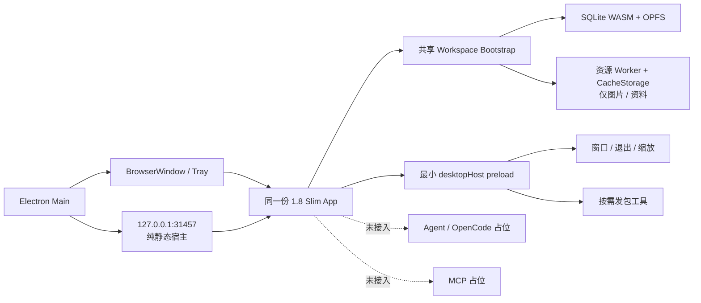

# 1.8 Slim Electron Shell 职责审计与迁移方案

> 审计日期：2026-08-06  
> Electron 现状基线：`origin/main@073132d55d9253cb45c366b3beb93425f5330557`（当前研究分支中的 Electron 文件与该基线一致）  
> 新前端基线：`codex/v1.8-lts-slimming@622d4cf1e252e7a1a3b7ddd31abc3847c31e2933`

## 结论

这轮不应把 1.8 Slim 合并进现有 AI 主线后继续削减旧 Shell，也不应让 Slim 去兼容 Electron 现有的全部接口。

最稳妥的做法是：**从 1.8 Slim 创建新的桌面分支，只移植 Electron 的窗口外壳、固定本地静态宿主、桌面生命周期和无状态发包工具。**

目标边界如下：

- Slim 前端继续独占 SQLite WASM、OPFS、工作区、存档、图片库、图片缓存和官方资源包。
- Electron 不再读写业务 SQLite，不再维护图片目录、图片 Release、数据包安装或工作节点仓库。
- Electron 只负责窗口、托盘、单实例、桌面缩放、应用退出、打包签名，以及按需打开的发包工具。
- OpenCode 与 MCP 只保留明确的“未接入”能力占位；本轮不启动进程、不监听端口、不打包运行时。
- Web 与桌面使用同一个 Slim `App` 和同一套业务代码，只在启动与宿主能力层分流。

这不是把旧 Electron Shell 改小，而是以旧实现为参考，重新建立一个薄 Shell。

本轮还有三个硬边界：

- 暂缓 CI/CD 与自动发布链改造，只保证本地开发和本地打包路径成立；
- 桌面端不复制 Web 的断网 App Shell、离线页面恢复和页面更新机制；安装包内的本地静态服务器就是页面来源；
- 旧 Node SQLite 不迁移、不兼容、不双写，也不作为任何运行时回退源。旧文件可以暂时原地保留，但新程序不得读取或修改。

## 一、当前 Electron 实际承担了什么

当前实现已经远超桌面外壳的职责：

| 证据 | 数量 |
| --- | ---: |
| `electron/main.cjs` | 6,843 行 |
| `electron/preload.cjs` 暴露的方法 | 56 个 |
| `ipcMain.handle` | 69 个 |
| loopback HTTP 精确路由判断 | 72 处 |
| 自动管理的子服务 | 3 个 |
| `public/shell/index.html` + `shell.js` | 3,302 行 |
| Electron 数据管理、Timeline 仓库、旧 Work Node Store | 4,623 行 |

启动时，Electron 不仅创建窗口和托盘，还会初始化数据管理、启动本地桥、启动 AI REST、DEF Agent、Legacy Fill 服务、预热 OpenCode、预热旧 Web 页面和图片缓存（`electron/main.cjs:6796-6810`、`electron/main.cjs:480-488`）。

### 现有职责分类

| 当前职责 | 现有位置 | 目标动作 | 原因 |
| --- | --- | --- | --- |
| 单实例、窗口、托盘、隐藏/恢复、缩放 | `electron/main.cjs:134-405`、`491-520` | 保留并拆小 | 这是正常 Shell 职责 |
| 本地静态页面宿主 | `electron/web-host.cjs`、`electron/main.cjs:1102-2055` | 重写为纯静态宿主 | Slim 需要稳定 HTTP origin，但不需要业务 REST bridge |
| Shell 控制台页面 | `public/shell/index.html`、`public/shell/shell.js` | 不移植 | BrowserWindow 应直接显示 Slim App |
| Node SQLite、工作区、存档、Work Node | `data-management-service.cjs`、`timeline-repository.cjs`、`ai-timeline-work-node-store.cjs`、`main.cjs:5296-6794` | 不移植 | Slim 已在浏览器 SQLite 中完整实现 |
| 图片根目录、文件增删改、`/user-images`、图片缓存预热 | `main.cjs:4187-5295` | 不移植 | Slim 图片库已由 SQLite BLOB + CacheStorage 管理 |
| 图片/数据 Release 检查、下载、安装、切换 | `main.cjs:2397-3863` | 不移植 | 这是旧前端资源宿主逻辑；Slim 已有自己的资源包安装链 |
| AI REST `17321` | `main.cjs:3888-3982` | 占位，不启动 | 本轮不落实 AI 引擎 |
| DEF/OpenCode sidecar `17322` | `main.cjs:4061-4184` | 占位，不启动 | 本轮不落实 OpenCode |
| Legacy Fill/MCP `17323` | `main.cjs:3992-4059` | 占位，不启动 | 本轮不落实 MCP |
| Renderer capability、业务 REST 代理、Interop | `workbench-renderer-transport.cjs`、`main.cjs:620-2055` | 不移植 | 它们服务于旧的浏览器外置工作区与 AI 数据桥 |
| 图片发包、选择目录、打开目录 | `main.cjs:2283-2379`、`scripts/build-image-release-manifest.mjs` | 保留现有产物格式，接到 Slim 已有转换脚本 | 图片发包器的输出正是 Slim 当前使用的上游输入 |
| 数据发包 | `main.cjs:2283-2379`、`scripts/build-data-release-package.mjs` | 保留用途，解除旧 Electron 数据服务依赖 | 发包是开发工具，不应重新成为数据宿主 |
| 图标、签名、entitlements、electron-builder | `electron/assets/**`、`entitlements.mac.plist`、`package.json` | 保留并收缩打包清单 | 这是桌面发行职责 |

## 二、为什么 SQLite 和图片可以完全交给 Slim

这不是设想，Slim 已经具备对应实现：

- `src/platform/database/webDatabase.worker.ts` 使用 `@sqlite.org/sqlite-wasm` 和 OPFS SAH Pool，并创建资料包、工作区、快照、Work Node、审计、自定义图片等表。
- `src/platform/timeline/browserTimelineStore.ts` 已经是 Timeline repository 的浏览器实现。
- `src/platform/storage/persistentStorage.ts` 和 `src/utils/userWorkspaceBridge.ts` 已经把业务工作区写入浏览器 SQLite。
- `src/platform/resources/webImageLibrary.ts` 管理官方图片索引和自定义图片 BLOB。
- `src/platform/resources/imagePackage.ts` 负责图片包下载、SHA-256 校验、解压和 CacheStorage 安装。
- `src/components/WebApp/WebBootstrap.tsx:40-105` 已经串起数据库、持久存储、工作区、图片库、资源包和主题初始化。

因此，继续保留 Electron 的 Node SQLite 与图片目录系统，不是“兼容”，而是制造第二份数据真相。

## 三、目标运行拓扑



### 必须使用稳定 loopback origin

生产桌面端继续使用固定的 `http://127.0.0.1:31457/`，不要改成 `file://`，也不要每次随机端口。

原因：

1. Service Worker、CacheStorage 和 OPFS 都以 origin 为边界。
2. 改端口等于改 origin，会让用户看到一个全新的空数据库。
3. `file://` 对 Service Worker、WASM MIME、Worker 和资源路径的兼容性更差。
4. 绑定 `127.0.0.1` 可以保持本地访问边界，不需要对局域网开放。

同时保持现有 `appId` 与稳定的 Electron session partition；升级时不得主动清除 Chromium storage/cache。

固定端口被其他程序占用时必须给出明确错误并停止启动，不能静默改用随机端口。随机端口虽然能打开页面，却会把用户带到一个新的空 OPFS origin。

### 静态宿主需要适配 Slim

现有 `electron/web-host.cjs` 可以作为参考，但需要补齐：

- `.wasm` 使用 `application/wasm`。
- `.zip`、`.json` 和 Worker 脚本可正常下载。
- `index.html`、`sw.js`、`version.json` 和资源清单禁止长期缓存。
- 带 hash 的 Vite 静态资产可以使用 immutable 缓存。
- query string 不影响静态文件定位。
- 图片与资料使用的资源 Worker 能以 `/` 为 scope 注册。
- HTTP server 完成监听后再创建并加载 BrowserWindow。

宿主只提供静态文件，不再提供 `/local-data/**`、`/image-assets/**`、`/user-images/**`、`/def-agent/**` 或 `/mcp-fill-host/**`。

桌面端没有 Web 站点断网可达性的需求：只要应用正在运行，本地服务器就可用。因此桌面构建不得让 Service Worker 拦截导航或缓存 App Shell，也不显示 Web 页面更新入口。若图片与资料仍需要 Service Worker 读取 CacheStorage，应使用只处理这些资源的桌面模式，并自动激活；页面 HTML、JS、CSS 始终直接来自当前安装包。

## 四、Web 与桌面如何共用同一个前端

不要在页面里散落 `if (window.desktopRuntime)`。应把当前 `WebBootstrap` 拆成一层共享启动和两个薄入口。

### 共享 Workspace Bootstrap

两端都执行：

- workspace lease；
- SQLite WASM / OPFS 初始化；
- persistent storage 与 user workspace 初始化；
- 图片库初始化；
- 官方数据包与图片包检查/安装；
- Service Worker 图片控制器；
- 主题初始化；
- 最终渲染同一个 `AppProvider + App`。

### WebBootstrap 只保留 Web 特性

- 网站访问门禁；
- Web 页面版本检查与手动激活更新；
- Web 离线恢复提示；
- 浏览器语境的文案。

### DesktopBootstrap 只增加桌面特性

- 读取 `desktopHost.getCapabilities()`；
- 跳过网站访问密码；
- 显示桌面版本与桌面宿主状态，不显示网站远端更新入口；
- 注册只管理图片与资料缓存的桌面资源 Worker，不让它接管页面导航或 App Shell 版本；
- 退出前触发前端 flush，并向 Main 回执；
- 有能力时显示发包工具入口；
- 显示 Agent/OpenCode 与 MCP 的明确占位状态。

`App`、计算逻辑、页面、路由、SQLite schema、图片库和资料包逻辑不分叉。

## 五、最小 preload / IPC

建议把当前 56 个 preload 方法收缩为下列能力组，而不是继续暴露业务 CRUD：

```ts
type DesktopHostCapabilities = {
  host: 'desktop';
  shell: true;
  releaseTools: {
    images: boolean;
    data: boolean;
  };
  agent: {
    available: false;
    plannedProvider: 'opencode';
    reason: 'placeholder';
  };
  mcp: {
    available: false;
    reason: 'placeholder';
  };
};
```

允许的 preload 能力只需要：

- `getCapabilities()`；
- `getAppInfo()`；
- `getSettings()` / `setScale()`；
- `quit()`；
- `onBeforeQuit()` / `confirmReadyToQuit()`；
- `pickReleaseSource()` / `pickReleaseOutput()`；
- `buildImageRelease()` / `buildDataRelease()`；
- `revealPath()`。

不允许暴露：

- 任意 SQL、任意文件读写或任意命令执行；
- Timeline、Work Node、存档、装备库、图片库 CRUD；
- AI/MCP 的假健康接口或空代理接口。

占位的含义是 UI 明确显示“尚未接入”，而不是保留一条会失败的旧调用链。

## 六、OpenCode 与 MCP 的占位方式

### OpenCode

- 前端保留一个懒加载的 Agent 页面或侧栏入口。
- 当前状态固定为 `available: false`，展示“本版本尚未接入本地 Agent”。
- 不打包 `agent/server/**`、`agent/runtime/**`、OpenCode UI 或 OpenCode runtime。
- 不启动 `17321`、`17322`，不执行预热，不保留 session 恢复代码。

能力合同使用通用 `agent` 名称；本轮 UI 可以写 OpenCode 占位，但不要让 Shell API 与 OpenCode 私有协议绑定。以后改用 Pi 时不需要再改 Electron 外壳合同。

### MCP

- 保留一个独立的 MCP 占位入口，状态固定为 `available: false`。
- 不打包 `@modelcontextprotocol/sdk`、Legacy Fill runtime、proposal repository 或 `17323` 服务。
- 不保留旧 MCP Fill 审批与保存 IPC。

## 七、发包工具如何保留

保留的是“选择输入、生成发布产物、打开输出目录”这项能力，不是旧数据宿主。

### 图片发包

现有 `build-image-release-manifest.mjs` 生成 `assets-release-manifest.json` 和完整图片 ZIP。重新核对 Slim 后确认，这套产物不是需要淘汰的旧格式，而是 Slim 当前 Web 发布流程的上游输入：

1. `build-web-image-manifest.mjs` 读取指定的 `assets-release-manifest.json`，生成 `public/web-image-manifest.json` 和浏览器图片索引；
2. `prepare-web-image-package.mjs` 校验并取得完整 ZIP，再生成浏览器发布所需的分片信息。

因此图片发包器本身可以基本不动，Electron 继续负责选择图片源、输出目录、执行脚本和打开结果目录即可。需要适配的是两段工具之间的交接：去掉 Slim 脚本对 `v1.7.3` 和 macOS 固定目录的默认依赖，把本次生成的 `assets-release-manifest.json` 路径显式传给转换步骤。不要把图片发包器与 Web 转换器合并成一套新格式。

当前工具只负责生成可上传到 GitHub Release 的文件，并不负责创建 Release 或上传附件；自动上传若以后需要，应作为独立发布步骤实现。

### 数据发包

现有 `build-data-release-package.mjs` 依赖 `electron/data-management-service.cjs`，并从 Electron 的 Local Data / Share Data 目录取源文件。这个依赖必须解除。

新工具应当：

1. 让用户显式选择 Slim 导出的数据文件或仓库中的发布源；
2. 在临时目录中校验并生成 Slim 使用的 `web-data-manifest.json`/数据产物；
3. 把结果写入用户选择的输出目录；
4. 不读取或修改当前正在运行的 OPFS 数据库。

发包页面应作为 Desktop-only 懒加载页面放在设置区域。普通 Web 构建没有 capability 时不显示入口；工具代码也不要进入首屏业务 chunk。

## 八、文件级迁移清单

| 现有文件/目录 | 处理方式 |
| --- | --- |
| `electron/main.cjs` | 仅作参考，重新写薄入口，不在原文件上继续切割 |
| `electron/preload.cjs` | 重写为最小 `desktopHost` |
| `electron/web-host.cjs` | 保留思路，按 Slim 的 WASM、ZIP、SW 缓存要求改造 |
| `electron/assets/**` | 保留 |
| `electron/entitlements.mac.plist` | 保留并复核最小权限 |
| `electron/data-management-service.cjs` | 不移植 |
| `electron/timeline-repository.cjs` | 不移植 |
| `electron/ai-timeline-work-node-store.cjs` | 不移植 |
| `electron/workbench-renderer-transport.cjs` | 不移植 |
| `electron/sidecar-runtime.cjs` | 本轮不移植 |
| `public/shell/index.html`、`shell.js` | 不移植，BrowserWindow 直接加载 Slim App |
| `agent/**`、OpenCode runtime、Legacy Fill runtime | 本轮不进入桌面打包清单 |
| electron-builder 图标、签名、Windows portable、Mac DMG 配置 | 移植到 Slim `package.json`，删除 AI/MCP/runtime 文件清单 |
| 图片发包脚本 | 复用现有 builder；通过明确路径接入 Slim 已有 Web manifest/分片转换脚本 |
| 数据发包脚本 | 以 Slim 数据格式为事实源，重写为不依赖旧 Electron 数据服务的无状态 wrapper |

仅 Electron/Shell 自己的数据、图片与旧控制台部分就可以避免带回约 1.5 万行代码；AI/MCP runtime 还会进一步从本轮安装包中排除。

## 九、推荐实施顺序

### 第 1 步：建立 Slim 桌面分支

从 `codex/v1.8-lts-slimming` 创建新分支，例如 `codex/v1.8-lts-desktop-shell`。不要从 AI 主线合并整棵前端。

### 第 2 步：先让薄 Shell 只打开 Slim

- 加入 Electron 依赖、图标、签名和最小 builder 配置。
- 开发环境加载 Slim 的 `3030`。
- 生产环境启动固定 `31457` 静态宿主并加载 Slim `dist/` 根页面。
- 暂时不加入 Agent、MCP 和发包 UI。

### 第 3 步：拆共享 Bootstrap

- 从 `WebBootstrap` 提取共享 Workspace 启动。
- 加入 `DesktopBootstrap`，关闭网站门禁和 Web 更新文案分支。
- 保证 Web 构建行为不变。

### 第 4 步：加入两个明确占位

- Agent/OpenCode：可见但不可用，不发请求。
- MCP：可见但不可用，不发请求。

### 第 5 步：接入无状态发包工具

- 先图片，后数据。
- 所有输入/输出均由用户选择。
- 以 Slim manifest 与现有 Web 发布流程为唯一格式事实源。

### 第 6 步：收紧打包和安全边界

- 确认安装包中没有旧 Shell 页面、Node SQLite、Agent、OpenCode、MCP、Legacy Fill。
- preload 只暴露白名单能力。
- 保持 `contextIsolation: true`、`nodeIntegration: false`，并启用 renderer sandbox。
- 禁止任意导航、任意 `window.open`、任意文件访问和任意命令执行。

## 十、验收条件

### 前端与数据

- Web 和 Electron 运行的是同一份 Slim `App` 代码与同一套业务测试。
- Electron 首次启动可以从安装包内的本地文件完成资料/图片初始化并进入工作台。
- 创建或修改排轴、自定义资料和图片后，完全退出并重新启动仍能恢复。
- Electron Main 与 preload 中不存在业务 SQLite 和图片 CRUD。
- Electron 运行时和打包文件中不存在旧 Node SQLite 数据服务、迁移器或双写路径。
- 桌面端不改变任何计算结果。

### 宿主

- 生产环境只监听固定 `127.0.0.1:31457` 静态宿主。
- `17321`、`17322`、`17323` 均不监听，也没有对应子进程。
- WASM、Worker、Service Worker、JSON 和图片 ZIP 的 MIME/缓存行为正确。
- 隐藏窗口、托盘恢复、单实例、缩放、退出前 flush 在 Windows 与 Mac 均通过。

### 占位

- OpenCode 与 MCP 页面显示明确的“尚未接入”，不会无限加载或报网络错误。
- 占位状态来自统一 capability，而不是各页面自行探测端口。

### 发包

- 图片和数据发包均在临时目录 smoke test 中生成可被 Slim 校验的产物。
- 发包失败不会修改当前用户数据库、图片缓存或工作区。

### 测试策略

- 复用 Slim 的类型、单元、数值与关键 UI/E2E 测试；桌面迁移不新增断网 App Shell 或离线恢复测试。
- 将同一份关键 UI/E2E 流程参数化，对 Web 和 Electron renderer 各跑一次。
- 新增桌面专项：静态宿主合同、WASM/ZIP MIME、重启持久化、图片缓存、资源 Worker 不接管导航、占位无进程、旧 Node SQLite 不可达、发包工具 smoke。
- 最终进行 Windows 与 Mac 本地打包后手测；CI/CD 与自动发布暂缓。

## 十一、需要提前防住的风险

1. **不能改 origin。** 改 host、port 或 session partition 都会表现为“数据消失”。
2. **不能清 Chromium storage。** 旧图片更新代码中的 cache clear 不应移植。
3. **不能把 Web 的 App Shell 缓存和页面更新机制带进桌面。** 桌面页面由当前安装包的本地服务器直接提供；Service Worker 只允许服务图片与资料缓存，不得拦截导航。
4. **图片与数据发包不能一概而论。** 图片 builder 的输出已被 Slim 转换脚本直接消费，可以复用；数据 builder 仍依赖旧 Electron 数据服务，不能原样移植。
5. **退出要有 flush 握手。** Electron 不管理数据库，但要给 renderer 完成最后一次持久化的机会。
6. **旧 Node SQLite 必须彻底退出运行链。** 不做启动迁移、不读取旧库、不双写；升级时也不主动删除旧文件，以免形成不可恢复的数据破坏，但它只能作为静态遗留文件存在。
7. **Web 与桌面不共享实时数据。** 它们使用相同代码和格式，但属于不同 origin；同步是另一项功能。
8. **固定端口冲突不能降级到随机端口。** 应显示可操作的占用错误，否则“成功启动”会掩盖新的空数据 origin。

## 十二、本轮明确不做

- 不实现 OpenCode、Pi 或任何 Agent engine。
- 不实现 MCP server、MCP Fill 或审批流。
- 不让 Electron 读取或写入业务 SQLite。
- 不让 Electron 管理官方图片、自定义图片或图片索引。
- 不改计算逻辑、业务页面或 Slim schema。
- 不实现 Web 与桌面的实时同步。
- 不迁移或兼容旧 Node SQLite。
- 不实现桌面断网 App Shell、离线页面恢复或 Web 页面更新。
- 不改造 CI/CD、自动发布或桌面自动更新链。

## 最终判断

这条路线可行，而且比“把 Slim 前端硬塞进旧 Electron Shell”更简单。

真正需要适配的只有三处：稳定本地静态宿主、共享/桌面 Bootstrap（含仅服务图片与资料的资源 Worker）、无状态发包入口。其他旧 Electron 能力大部分不是兼容资产，而是应该随旧前端一起退役的重复实现，尤其不能保留旧 Node SQLite 作为兼容层。
