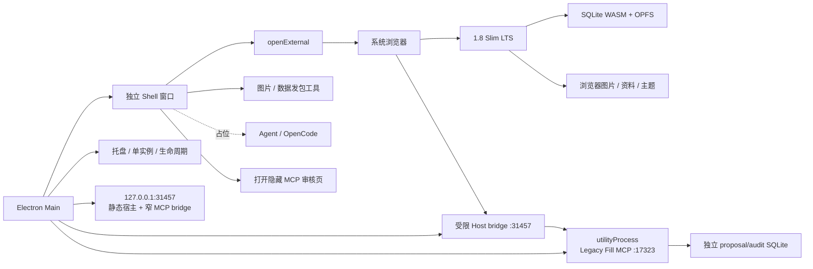

# 1.8 Slim 独立 Electron Shell 职责审计与迁移方案

> 审计日期：2026-08-06
> Electron 参考基线：`main` 中的旧 DEF Shell
> 浏览器前端基线：`codex/v1.8-lts-slimming`

## 结论

Electron 不承载 Slim LTS 的配装、排轴和设置页面。目标结构是旧 Shell 已经采用过的产品形态：

- Electron 自己显示一份独立、很薄的 Shell 控制台；
- Shell 启动本地静态服务，并通过系统默认浏览器打开 Slim LTS；
- Slim LTS 页面继续只使用浏览器能力，业务 SQLite、OPFS、图片和资料都归浏览器；
- Slim 页面已经具备的主题、存储、备份和资料管理继续留在 Slim 设置页；
- 浏览器无法承担的桌面生命周期、发包工具、Agent/MCP 状态留在独立 Shell；
- Agent/OpenCode 仍是占位；Legacy Fill MCP 只恢复独立 daemon、提案审计库和浏览器审核桥，不恢复旧 Node 业务 SQLite、旧 REST 或 DEF runtime。

初版方案曾误写为“BrowserWindow 直接显示 Slim App”，也据此做过一次实现。该方向会把 Shell 设置和发包工具塞进业务前端，并让系统浏览器形态消失，和实际产品边界不符。本文件已经按独立 Shell 结构纠正。

## 一、正确的运行拓扑



这里有两个不同的页面：

1. Electron BrowserWindow 只加载 `electron/shell/index.html`，它是本地控制壳；
2. Slim LTS 由系统浏览器访问 `3030`（开发）或 `31457`（生产）。

系统浏览器不会获得 preload，也不能调用 Electron IPC。Shell 页面才拥有经过白名单限制的 `desktopHost`。

## 二、职责归属

| 能力 | Slim 浏览器页面 | 独立 Electron Shell |
| --- | --- | --- |
| 配装、排轴、伤害计算 | 是 | 否 |
| 主题和页面设置 | 是 | 否 |
| SQLite WASM、OPFS、存档、备份 | 是 | 否 |
| 官方资料、图片包、自定义图片 | 是 | 否 |
| 打开系统浏览器 | 否 | 是 |
| 本地静态页面服务 | 否 | 是 |
| 单实例、托盘、隐藏、退出 | 否 | 是 |
| Shell 自身缩放 | 否 | 是 |
| 图片与数据 Release 产物 | 否 | 是 |
| Agent/OpenCode 状态 | 否 | 仅占位 |
| Legacy Fill MCP 进程、客户端配置、审核页唤起 | 隐藏审核页负责最终确认 | 是 |
| Node SQLite / 旧数据迁移 | 否 | 否 |

“前端已经承载的设置留在前端”和“仍需要独立 Shell”并不冲突。前者是用户工作区设置，后者是桌面宿主与开发工具设置。

## 三、旧 Electron 中哪些保留

旧 `main` 的 Electron 实现曾达到约 6,800 行，并混合了窗口、HTTP bridge、Node SQLite、图片目录、数据迁移、AI REST、OpenCode、MCP 和发包工具。

| 旧职责 | 本轮动作 | 理由 |
| --- | --- | --- |
| 独立 Shell 窗口、托盘、单实例 | 保留并重写 | 正常桌面外壳职责 |
| 打开系统浏览器 Web | 保留 | 正确的前端承载方式 |
| 固定 loopback 静态宿主 | 保留并收缩 | 生产浏览器需要本地页面来源 |
| Shell 缩放、关闭与退出 | 保留 | 只影响控制壳 |
| 图片/数据发包工具 | 保留为无状态工具 | 浏览器页面无法直接使用原生目录选择器 |
| Node SQLite、Timeline repository、Work Node store | 删除 | Slim 浏览器 SQLite 是唯一业务数据源 |
| 图片根目录、图片 CRUD、旧更新器 | 删除 | Slim 已在浏览器中管理图片与资源包 |
| AI REST、OpenCode/DEF sidecar | 不移植 | Agent 继续只留占位 |
| Legacy Fill MCP | 选择性恢复 | 仅 7 个 MCP 工具、8 类资源、提案审计库与 Host 审核状态机 |
| 业务 REST bridge、通用 renderer capability | 删除并收窄 | 只保留快照发布 scope 与一次性 MCP 审核授权 |

## 四、本地浏览器模式

生产 Shell 固定托管 `http://127.0.0.1:31457/`。端口不能随机变化，因为浏览器 OPFS、CacheStorage 和 Service Worker 都按 origin 隔离；换端口会表现为一份新的空工作区。

Shell 打开的地址带 `__desktop_shell=1` 标记。Slim 仍是浏览器页面，但据此做两项本地托管适配：

- 跳过公开网站访问门禁和远端页面更新入口；
- 使用 `/sw-desktop.js` 只处理图片、资料与可选主题，不拦截导航、HTML、JS 或 CSS。

这不是 Electron renderer 模式。页面中不存在 `window.desktopHost`，设置页也不显示 Shell 发包工具。浏览器 SQLite 继续由浏览器自己持久化和导出。

开发环境使用 `http://127.0.0.1:3030/?__desktop_shell=1`；生产环境使用固定 `31457`。普通 Web LTS 访问不带该标记，继续保持原有门禁、页面更新和离线行为。

## 五、独立 Shell 的最小接口

preload 只允许以下能力：

- 读取 Shell 版本、平台和浏览器工作台地址；
- 读取和设置 Shell 自身缩放；
- 在系统浏览器打开 Slim LTS；
- 完全退出应用；
- 选择图片源、数据源和输出目录；
- 生成图片/数据 Release 产物；
- 打开本次会话生成的结果目录。
- 读取 Legacy Fill MCP 状态；
- 由 Shell 显式唤起隐藏的 `/#/mcp-fill` 审核页。

明确禁止：

- 任意 SQL、任意文件读写或任意命令执行；
- Timeline、存档、Work Node、装备库和图片库 CRUD；
- 把 preload 注入系统浏览器；
- 通过 renderer 自报路径绕过原生目录选择器；
- 启动或探测已退役的 `17321`、`17322`；`17323` 只用于受控 Legacy Fill MCP daemon。

浏览器没有 preload。普通工作页只持有“发布四域资料快照”的进程期 capability；点击 Shell 的“打开 MCP 填表”后，Electron 才生成 30 秒、单次使用的 review grant。grant 位于 URL fragment，页面读取后立即清除，并交换成只在该标签页 `sessionStorage` 中存在的审核 session。普通工作页不能列提案、审核或保存。

MCP 只暴露 7 个工具：`fill_get_current`、`fill_search_library`、`fill_get_template`、`fill_validate`、`proposal_create`、`proposal_list`、`proposal_inspect`。它不能批准或保存；正式资料仍只能由隐藏审核页经浏览器 OPFS SQLite 写入。

MCP daemon 由 Electron 官方 `utilityProcess.fork` 启动和回收，不再用打包后的应用可执行文件配合 `ELECTRON_RUN_AS_NODE` 冒充 Node。生产包把 `dist/legacy-fill/**` 解包到 `app.asar.unpacked`，因此入口脚本、领域运行时和只读资源都有普通文件系统路径。

## 六、发包工具

图片工具继续生成 `assets-release-manifest.json` 与完整 ZIP。数据工具从用户明确选择的 Slim `data/` 或 `public/data/` 目录生成 `web-data-manifest.json` 与 ZIP。

两种工具都满足：

- 输入和输出必须经 Native Dialog 选择；
- 只读源目录，不访问浏览器 OPFS；
- 不依赖旧 Electron 数据服务；
- 拒绝与源目录重叠的破坏性输出路径；
- 只生成本地文件，不自动创建或上传 GitHub Release。

CI/CD 与自动发布按约定暂缓。

## 七、开发与生产入口

```bash
# 推荐：Vite 3030 + 独立 Electron Shell
npm run electron:dev

# 兼容旧习惯的同义入口
npm run electron:shell

# 已有 dist 时启动生产 Shell；本地 Web 服务使用 31457
npm run electron:start
```

`npm run electron:dev` 不会把 `3030` 塞进 Electron 窗口。Electron 显示 Shell，Shell 中的“打开浏览器工作台”才会唤起系统浏览器。

## 八、验收条件

### 结构

- Electron 窗口 URL 是本地 `electron/shell/index.html`，不是 Slim URL；
- 系统浏览器能打开 Slim 页面，且 `window.desktopHost` 为 `undefined`；
- Slim 设置页没有 Electron Shell 或发包工具；
- Shell 页面能显示版本、浏览器地址、Agent 占位、MCP 运行状态和发包入口。

### 数据与运行时

- Electron 源码、依赖和安装包不包含旧 Node 业务 SQLite 数据服务；Legacy Fill 的独立 SQLite 只保存提案、快照和追加式审计；
- 浏览器 SQLite/OPFS 仍通过 Slim 原测试验证；
- `17321`、`17322` 不监听；Shell 运行时 `17323` 提供 MCP，Shell 退出后随父进程关闭；
- Shell 不读取、关闭或迁移浏览器数据库，只接收浏览器主动发布的只读快照。

### 安全与打包

- Shell renderer 保持 `contextIsolation: true`、`nodeIntegration: false`、`sandbox: true`；
- IPC 调用必须来自唯一 Shell WebContents 和固定 Shell 文件；
- 系统浏览器无 preload；普通页面没有审核 capability；
- `app.asar` 包含独立 Shell 页面、静态宿主和两个发包 builder；可执行的 `dist/legacy-fill/**` 位于 `app.asar.unpacked`；
- `app.asar` 不包含 Web `sw.js`、旧 Node 业务 SQLite、DEF/OpenCode 或旧 REST runtime。

### 测试

- Slim 既有类型、单元、数值和关键浏览器 E2E 继续通过；
- 静态宿主、资源 Worker、发包 builder 和运行时边界 smoke 通过；
- Electron smoke 明确检查“Shell 在 Electron、Slim 在系统浏览器”，并用真实新标签页完成四域 MCP → 审核 → OPFS 写回；
- 打包后的 macOS 应用重复同一结构及四域提案往返测试，并验证 MCP 子进程随 Shell 退出；Windows 真机验收留在对应平台。

## 九、本轮不做

- 不实现 OpenCode、Pi 或其他 Agent engine；
- 不实现通用 MCP 文件/脚本能力；Legacy Fill MCP 仅限提案工作流；
- 不让 Electron 读写业务 SQLite、图片库或存档；
- 不恢复旧 Node SQLite 兼容层；
- 不让 Electron BrowserWindow 承载 Slim 前端；
- 不实现 Web 与桌面浏览器数据同步；
- 不改造 CI/CD、自动上传、桌面自动更新、签名或公证流水线。

## 最终判断

独立 Shell + 系统浏览器仍是最合适的结构。Legacy Fill MCP 被限制成一个可移植的旁路：daemon 只读浏览器发布的快照并生成提案，用户在 Shell 唤起的隐藏网页中确认，最终仍由浏览器 SQLite 写入。Electron 不重新取得业务数据所有权，未来 Agent 引擎也可以直接作为标准 MCP 客户端接入。
