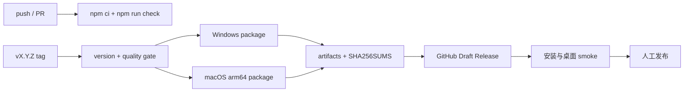

# CI/CD 设计

## CI

`.github/workflows/ci.yml` 在 `main` push 与所有 pull request 上运行。它使用锁定的 Node 24/npm 11 环境和 `npm ci`，只执行可重复、无桌面依赖的 `npm run check`。并发提交会取消旧 CI，避免浪费 runner。

CI 不启动 Electron、provider 或真实 Workbench consumer。原因是这些测试依赖本机 UI、会话授权和可观察审批卡；在没有隔离 fixture 与可靠 UI runner 前，把它们放进普通 CI 会制造假绿或随机红。

## CD

`.github/workflows/release.yml` 由 `vMAJOR.MINOR.PATCH` tag 触发：

1. 校验 tag 与 `package.json` version 完全一致，并重跑质量门。
2. 使用 Bun `1.3.14` 安装锁定的 vendored OpenCode workspace。
3. Windows x64 runner 构建 portable `.exe`，macOS arm64 runner 构建 `.dmg`。
4. 在各自平台从打包后的 asar 启动 sidecar，验证 unpacked esbuild 与可写数据路径。
5. 汇总产物，生成 `SHA256SUMS`。
6. 创建 GitHub Draft Release；只有人工检查后才公开。



## 发布操作

```bash
npm version 1.8.0 --no-git-tag-version
npm install --package-lock-only --ignore-scripts
npm run check
git commit -am "release: prepare v1.8.0"
git tag v1.8.0
git push origin main v1.8.0
```

首次实际 tag 应视为 CD 的生产验收：记录两个 runner、产物名称、checksum、安装结果和 Draft 到发布的人工决定。没有这条证据前，文档只声称“发布流程已实现并经过本地静态验证”。

## 供应链取舍

- Actions 固定到完整 commit SHA 并保留版本注释，由 Dependabot 月度更新；关键发布前检查 action release notes。
- npm 和 Bun 都使用 frozen lock；根目录只允许 `package-lock.json`。
- GitHub token 采用最小权限：普通 job 只读，仅 Draft job 获得 `contents: write`。
- 当前不在仓库保存签名凭据。签名/公证接入应使用环境保护和专用 secrets，并新增 ADR。

参考：[GitHub Actions 安全强化](https://docs.github.com/actions/security-for-github-actions/security-guides/security-hardening-for-github-actions)、[GitHub-hosted runner 架构与标签](https://docs.github.com/actions/reference/runners/github-hosted-runners)、[Electron code signing](https://www.electron.build/code-signing.html)。
