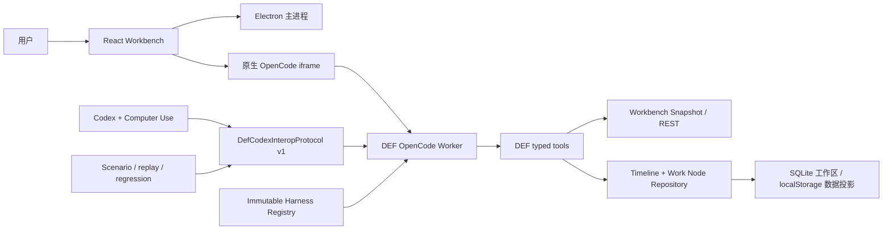

# 当前系统全景

## 系统定位

DEF 是一个 Electron 桌面工作台：React 负责排轴与角色配置产品界面，原生 OpenCode iframe 承载工作 Agent，typed tools 把 Agent 的意图限制在产品领域操作内。Codex 通过本地 interop 协议充当教师与诊断者，验证器和 replay 充当独立裁判。

这不是“训练模型权重”的系统。当前可训练对象是可热切换、可回滚的 Harness 包，以及工具合同、知识路由和验证场景。

## 组件职责

| 组件 | 入口 | 职责 | 不负责 |
| --- | --- | --- | --- |
| 产品前端 | `src/` | 排轴、角色配置、AI 模式宿主、真实 UI 状态 | 模拟 Agent transcript |
| Electron shell | `electron/main.cjs` | 窗口、进程编排、本地 bridge、repository 接入 | Agent 领域推理 |
| 数据管理服务 | `electron/data-management-service.cjs` | 用户 SQLite、数据包、排轴存档、迁移与数据包校验 | 直接操作渲染器 localStorage |
| AI CLI REST | `scripts/ai-cli-rest-server.mjs` | snapshot、typed product operations、Work Node/CAS | 直接绕过审批修改 UI |
| DEF sidecar | `agent/server/def-agent-server.cjs` | native session、OpenCode worker、plugin/tool 适配 | 复制一套产品事实源 |
| Interop runtime | `agent/runtime/def-codex-interop.cjs` | turn、events、transcript、questions、幂等与关联 | 作为产品聊天 UI |
| Harness runtime | `agent/harness/def-harness.cjs` | 不可变包、Registry、stable/candidate/rollback、session pinning | 在线修改既有 session 的人格 |
| 验证脚本 | `scripts/def-harness-*.mjs` | Scenario、native replay、regression、promotion 证据 | 用 package self-check 冒充真实 Agent 验收 |

## 依赖原则

1. 产品事实来自产品状态和 repository；Harness 只能教 Agent 如何读取与行动，不能硬编码事实答案。
2. 只读查询可以直接返回；有副作用的操作必须经过 prepare、原生审批、revision 校验、commit 和 postcondition。
3. Interop 是诊断事实源，Computer Use 只确认真实界面可见，不替代工具与终态记录。
4. Harness candidate 只影响新建并明确绑定的 session；已存在 session 保持固定 hash。
5. 通用运行时代码不得依赖某一篇攻略的角色 ID、装备答案或计算结果。
6. 完整数据包只能经“应用数据”拆分；下载只写入 Share Data，排轴存档必须先转换为新的 SQLite 工作区。

## 当前结构性债务

- `electron/main.cjs` 与 `scripts/ai-cli-rest-server.mjs` 仍偏大，下一步应按 process orchestration、repository adapter、typed-resource domains 拆分，而不是大爆炸重写。
- 桌面黑盒依赖真实 Electron/OpenCode/UI consumer，尚不适合普通无头 CI。
- vendored OpenCode 带来较重的安装和打包成本，需要独立缓存与上游升级策略。
- Harness 自动诊断、hidden regression 和自动返修仍属于后续能力；promotion 保持人工决策。
- 首次 GitHub Hosted Runner 的跨平台安装包尚需真实跑通后，才能把“工作流存在”升级为“发布链已生产验证”。
- 数据管理服务仍保留读取旧 catalog/参考存档格式的兼容路径；新 UI 与新发布流程只以 Local Data、Share Data、本地存档和共享存档为产品对象。
