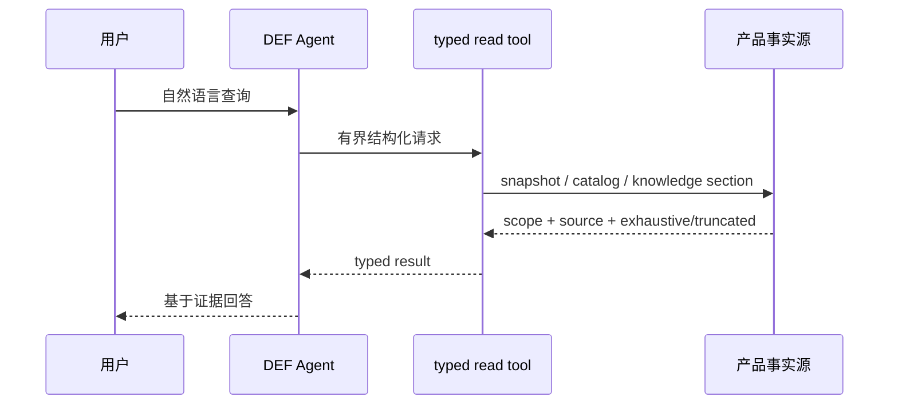
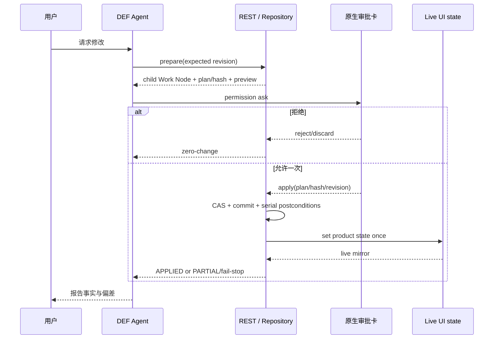

# 数据生命周期与写入协议

## 查询路径

批量场景优先使用团队级 resource，避免逐人循环。知识读取采用“两阶段”：先在 allowlist 中检索 reference/section，再按精确 ID 读取连续 Markdown。工具必须告诉 Agent 数据的 scope、来源以及是否完整，空结果不能被误解成全库不存在。

## Mutation 路径

关键不变量：

- 审批不可由 Harness 或 Agent 文本绕过；mutation tool 的 permission 策略是 `ask`。
- prepare 绑定 checkout、parent/child node、`contentRevision`、plan hash 和能力范围。
- CAS 失败返回冲突，不静默覆盖；模型不得无界重试。
- 拒绝删除本次未提交 child，checkout、live mirror、commit 数和产品配置保持不变。
- apply 后以 child、commit、live 三方一致性作为成功事实；只完成部分时必须返回 `PARTIAL`，不能宣称全部完成。
- renderer-owned 数据只能通过明确 adapter 写入，不能猜测 Work Node 字段。

## 数据分层

| 分层 | 典型位置 | 生命周期 | 版本控制 |
| --- | --- | --- | --- |
| 内建资料 | `public/data/`、`src/data/` | 随应用版本演进 | 是 |
| SQLite 工作区 | `user/user.sqlite` | 当前可编辑排轴、节点树、checkout、审计与工作副本 | 本机持久化；可导出存档 |
| Web 数据投影 | 浏览器 `localStorage` / `sessionStorage` | 当前已应用的干员、Buff、装备、武器等页面状态 | 否；由“应用数据”写入 |
| Local Data / Share Data | 开发态 `data/localdata/`、`data/sharedata/`；发布态 runtime data root | 可保存、可发布或下载的完整数据包 | 用户显式保存；Share Data 接收下载 |
| 本地 / 共享存档 | runtime data root 的 `timeline-archives/` | 仅排轴与节点树的可搬运对象 | 本机持久化；可转换为新 SQLite 工作区 |
| Harness 源包 | `agent/harness/baseline/`、`examples/` | 代码审查后变更 | 是 |
| Harness 构建与 run | `.runtime/def-harness/` | 可清理、可再生成 | 否 |
| vendored 上游 | `agent/vendor/opencode/` | 明确同步上游版本 | 是 |
| 验收证据 | `docs/specs/**/verification*.md` | 随 Spec 冻结 | 是，必须脱敏 |

数据包、存档与工作区的写入方向不可互换：下载的完整包只写入 Share Data；“应用数据”才会将数据部分投影到浏览器存储，并把包内排轴存档导入共享存档。独立存档不能直接应用到页面，必须先新建并导入 SQLite 工作区。删除数据包或 SQLite 工作区也不得隐式删除独立存档。
