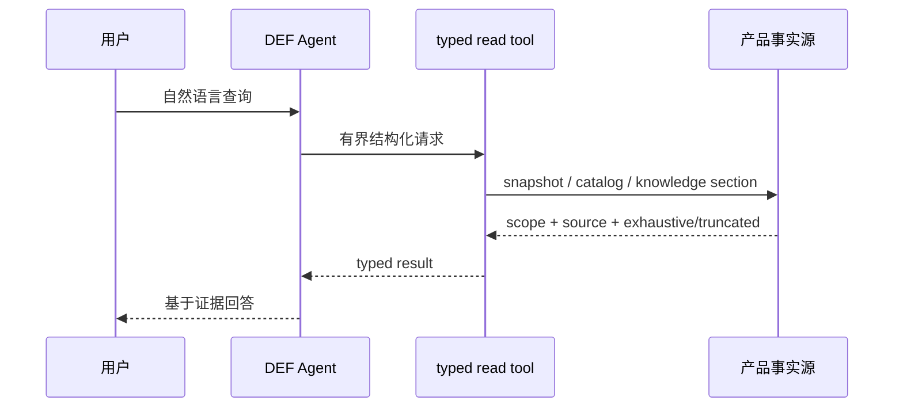
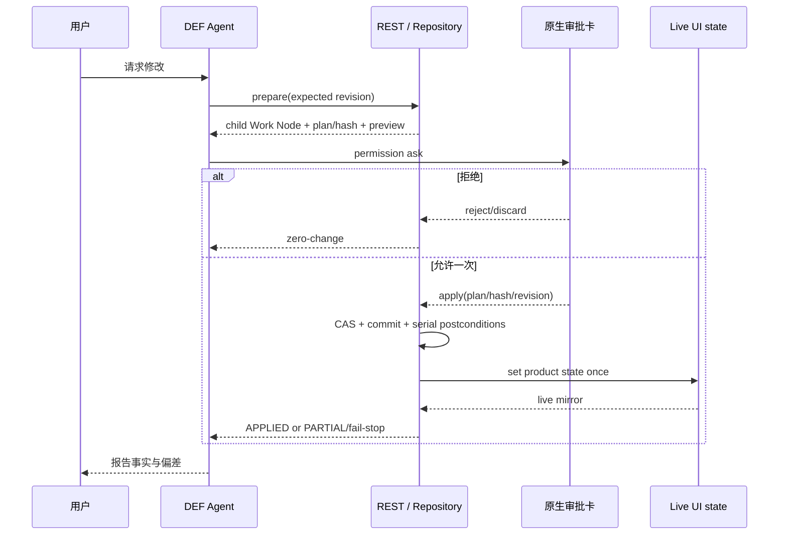

# 数据生命周期与写入协议

## 查询路径

批量场景优先使用团队级 resource，避免逐人循环。知识读取采用“两阶段”：先在 allowlist 中检索 reference/section，再按精确 ID 读取连续 Markdown。工具必须告诉 Agent 数据的 scope、来源以及是否完整，空结果不能被误解成全库不存在。

## Mutation 路径

关键不变量：

- 审批不可由 Harness 或 Agent 文本绕过；mutation tool 的 permission 策略是 `ask`。
- prepare 绑定 checkout、parent/child node、`contentRevision`、plan hash 和能力范围。
- CAS 失败返回冲突，不静默覆盖；模型不得无界重试。
- 拒绝删除本次未提交 child，checkout、live mirror、commit 数和产品配置保持不变。
- apply 后以 child、commit、live 三方一致性作为成功事实；只完成部分时必须返回 `PARTIAL`，不能宣称全部完成。
- renderer-owned 数据只能通过明确 adapter 写入，不能猜测 Work Node 字段。

## 数据分层

| 分层 | 典型位置 | 生命周期 | 版本控制 |
| --- | --- | --- | --- |
| 产品共享数据 | `data/sharedata/`、`src/data/` | 随产品版本演进 | 是 |
| 用户/运行数据 | 开发态 `data/localdata/`；发布态 Electron userData（Windows portable 为程序旁 `data/`） | 本机长期或临时 | 默认否 |
| Harness 源包 | `agent/harness/baseline/`、`examples/` | 代码审查后变更 | 是 |
| Harness 构建与 run | `.runtime/def-harness/` | 可清理、可再生成 | 否 |
| vendored 上游 | `agent/vendor/opencode/` | 明确同步上游版本 | 是 |
| 验收证据 | `docs/specs/**/verification*.md` | 随 Spec 冻结 | 是，必须脱敏 |
