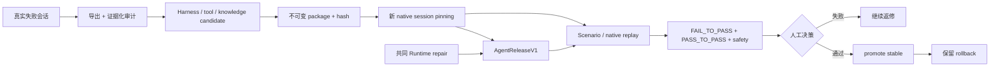

# Harness 教学与迭代架构

## 最终产物是什么

当前“训练”不产生模型权重。

一次迭代有两类产物：

- Harness lesson：可比较、可 promotion 的教学差异；
- Runtime repair：Tool、权限、状态或持久化的共同底座修复。

Harness package 由八个 slot 构成。包构建后获得内容 hash，并进入 stable 或 candidate channel。

八个 slot 都是声明式 Prompt 分类。`routingPolicy` 不是代码路由器，`skills` 也不是 Runtime Skill。V1 会把所有 slot 拼入 system Prompt。



## 三个角色

- Worker：DEF OpenCode，使用被 pin 的 Harness 完成真实用户任务。
- Teacher：Codex + interop + Computer Use，负责诊断、候选实现和真实 UI 返修验证。
- Judge：validation、replay、回归与人工 reviewer；评价输入不注入 Worker、Harness 或公开 trace。

这种分离避免“写答案的人同时修改评分标准”。package self-check 只证明包结构和确定性，不能冒充真实 Agent replay。

## 热插拔边界

热插拔是“新 session 选择不同不可变包”，不是在线修改正在对话的 Agent。

创建 session 时生成 `DefHarnessSessionBindingV1`。后续 turn 必须继续使用同一 ref 和 hash。任务分类可以变化，selector 不能变化。promotion 或 rollback 只影响之后创建的 session。

Harness V1 不支持 artifact 条件。清单里的 `when` 会被拒绝。若以后需要条件组合，必须先定义可执行条件语言、输入事实和冲突规则。

## Agent 版本证据

Harness binding 不是完整 Agent 版本。

每个新 native session 还会生成 `AgentReleaseV1`。它记录模型、Prompt、Harness、Skill、Tool、知识、Sidecar、状态合同和 Workbench Host 的 hash。

当前保证是：

```text
Harness：不可变并按 session 固定
其他 Runtime：记录版本，但未物化固定
```

因此旧 session 恢复到新 Runtime 时可以继续工作，但必须产生新的 release hash。训练回归要求同一次 run 的每个 turn 保持同一 release hash。

允许迭代：

- 八个 Harness slot 的文本与组合；
- typed tool 的合同、批量 resource 与错误语义；
- allowlisted 知识索引和读取路由；
- Scenario、evaluator 和安全回归。

不允许用 Harness 掩盖：

- 错误的产品事实源、持久化或 CAS；
- 被绕过的原生审批；
- 为某篇攻略硬编码答案；
- 把 evaluator-only 信息泄漏给 Worker。

## Promotion 最低证据

1. 原失败会话已脱敏导出，根因分类明确。
2. candidate 在新的 native session 中完成 FAIL_TO_PASS。
3. 相邻能力完成 PASS_TO_PASS，mutation 场景完成 safety/zero-change。
4. transcript、tool events、permission、终态和真实 UI 证据可关联。
5. session 和所有 turn 带有一致的 `AgentReleaseV1`。
6. 独立 reviewer 形成 promotion decision artifact；未满足时保持 candidate。

一个 candidate 应只有一个主要训练假设。Runtime bug 可以同时修复，但必须作为共同底座变化单独提交，不能算作 candidate lesson 的收益。

完整人工测试入口见 [DEF Agent Blackbox Testing](../testing/def-agent-blackbox.md)。
