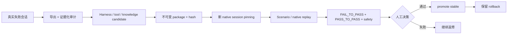

# Harness 教学与迭代架构

## 最终产物是什么

当前“训练”产出的是一个不可变 Harness package，而不是新的模型权重。一个完整包由八个 slot 构成：角色卡、Agent 合同、工作流、路由、工具指南、Skills、知识提示和响应策略。包构建后获得内容 hash，并进入 Registry 的 stable 或 candidate channel。

## 三个角色

- Worker：DEF OpenCode，使用被 pin 的 Harness 完成真实用户任务。
- Teacher：Codex + interop + Computer Use，负责诊断、候选实现和真实 UI 返修验证。
- Judge：validation、replay、回归与人工 reviewer；评价输入不注入 Worker、Harness 或公开 trace。

这种分离避免“写答案的人同时修改评分标准”。package self-check 只证明包结构和确定性，不能冒充真实 Agent replay。

## 热插拔边界

热插拔是“新 session 选择不同不可变包”，不是在线修改正在对话的 Agent。创建 native session 时生成 `DefHarnessSessionBindingV1`；后续 turn 必须继续使用同一 hash。promotion 或 rollback 只改变之后新 session 的 stable 解析结果。

允许迭代：

- 八个 Harness slot 的文本与组合；
- typed tool 的合同、批量 resource 与错误语义；
- allowlisted 知识索引和读取路由；
- Scenario、evaluator 和安全回归。

不允许用 Harness 掩盖：

- 错误的产品事实源、持久化或 CAS；
- 被绕过的原生审批；
- 为某篇攻略硬编码答案；
- 把 evaluator-only 信息泄漏给 Worker。

## Promotion 最低证据

1. 原失败会话已脱敏导出，根因分类明确。
2. candidate 在新的 native session 中完成 FAIL_TO_PASS。
3. 相邻能力完成 PASS_TO_PASS，mutation 场景完成 safety/zero-change。
4. transcript、tool events、permission、终态和真实 UI 证据可关联。
5. 独立 reviewer 形成 promotion decision artifact；未满足时保持 candidate。

完整人工测试入口见 [DEF Agent Blackbox Testing](../testing/def-agent-blackbox.md)。
