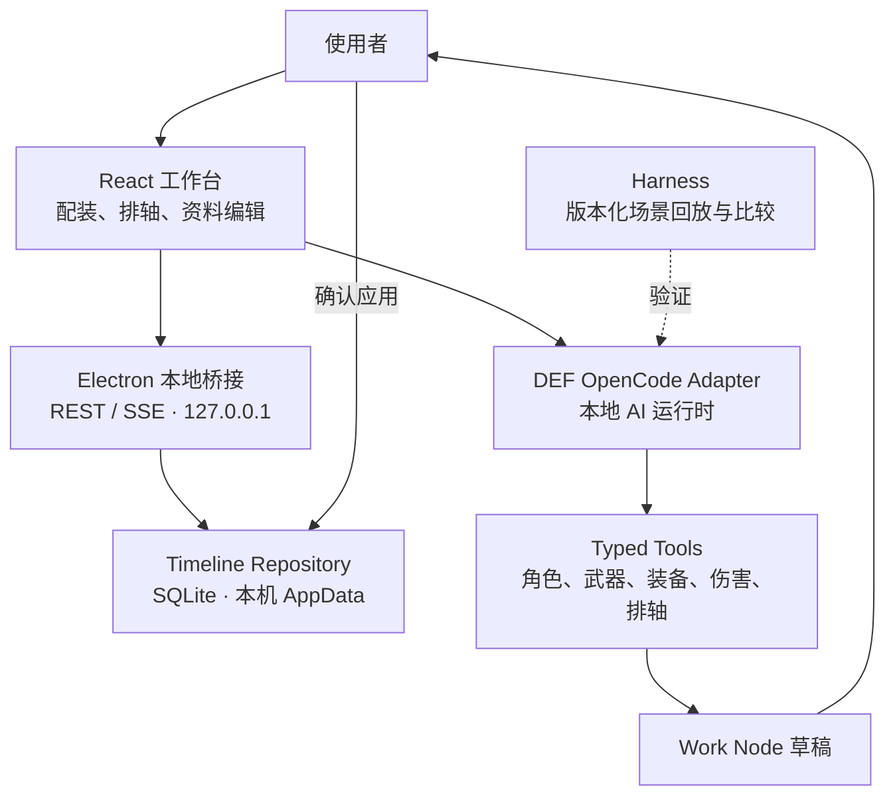

# 架构总览

[← 返回项目入口](../../README.md)

终末地伤害工作台的核心不是“网页里接一个聊天框”，而是把配装、排轴和 AI 修改都放进一个本地、可追溯的工作流。桌面应用保存事实，AI 只能在被定义的边界内生成提案，用户决定是否应用。

## 设计原则

1. **本地优先**：排轴与资料的正式事实源在桌面应用本机，不依赖云端数据库。
2. **先提案，后应用**：AI 的改动先进入隔离草稿，经过检查与确认才会影响当前方案。
3. **边界可见**：Agent 只可调用已定义的领域工具，不能任意读项目、执行 Shell 或修改未知目录。
4. **能力可复现**：运行时、规则和场景都可版本化；候选改动须以真实会话回放验证。

## 全局结构



浏览器渲染层访问的是 `127.0.0.1` 的本地桥接，而不是云端 API；桥接连接 Electron 主进程、本地 SQLite 和本地 Agent。图片资源的版本检查与下载是另一条 GitHub Release 发布链路，不是排轴数据同步。

## 排轴：从编辑器到可恢复文档

排轴不是一份会被覆盖的页面状态，而是一份 SQLite 文档。它大致由下列对象组成：

```text
TimelineDocument
├─ Snapshot：用户保存的不可变恢复点
├─ Work Node：AI 生成的隔离分支草稿
├─ CheckoutRef：当前已应用的目标
└─ Audit Event：保存、恢复、校验、审批与删除事件
```

- 完整配置按内容哈希保存；快照与 Work Node 引用同一份不可变 payload，便于去重和校验。
- `localStorage`、`sessionStorage` 和旧 JSON 仅用于迁移或缓存，不是版本事实源。
- 分享时从本地库生成版本化可移植包；导入会先校验 schema、哈希和引用，再原子写入为新文档。

这也是 AI 必须先落到 Work Node 的原因：它可以探索另一种排轴，而不会把正在使用的正式方案直接覆盖掉。

## AI：把“能做事”限制成可检查的提案

项目内置并启动经构建的上游 OpenCode 源码，再由 DEF adapter 为 Workbench 与 AI CLI 约束会话、技能和可见能力。模型并不拥有任意本机权限；实际操作要经过 Typed Tools 进入领域接口。

| 层次 | 责任 |
| --- | --- |
| OpenCode Runtime | 承载本地会话、模型交互与工具调度。 |
| DEF adapter | 将终末地工作流映射到运行时，并收紧会话、技能和能力策略。 |
| Typed Tools | 提供角色、武器、装备、伤害、排轴等显式操作；拒绝任意文件、Shell、任务编排和未知目录写入。 |
| Work Node | 保存基线、工作副本、补丁、校验、Diff 与风险，让提案可检查、可应用、可丢弃。 |

## Harness：验证运行时，而非证明一次演示成功

Harness 将 Agent 的规则、技能、路由和工作流打成带版本与内容哈希的工件。候选改动在真实本地会话中回放指定场景，并与稳定版本比较：目标问题是否修复、原本可用的流程是否退化，以及预览是否意外改动了用户状态。裁判输入不进入 Agent 的可见提示与轨迹，避免系统只是在记住答案。

## 目录责任

```text
src/                    React 页面、组件、领域逻辑与计算器
electron/               主进程、预加载和本地能力桥接
agent/runtime/          DEF tools、OpenCode adapter 与 Work Node 运行时
agent/harness/          Harness 工件、会话回放与评估逻辑
scripts/                构建、数据处理与 smoke 脚本
public/data/            角色、武器、装备等静态资料
```

实现与验证细节会继续沉淀在各个 [Spec](../specs/README.md) 中；本页只描述跨功能稳定的架构边界。
