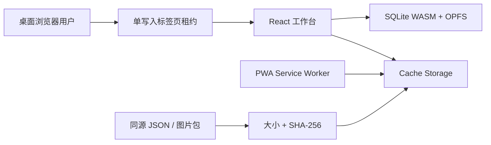

# Web LTS 1.8 架构总览

## 产品形态

1.8 LTS 是一个静态部署、离线优先的桌面浏览器应用。React 负责界面与业务编排；SQLite WASM 通过 OPFS 保存用户数据库；Cache Storage 与 Service Worker 保存经过校验的官方资料。仓库不再包含桌面壳、本地 HTTP 服务、Agent、MCP 或云端账号系统。

```mermaid
flowchart LR
  User["桌面浏览器用户"] --> Lease["单写入标签页租约"]
  Lease --> UI["React 工作台"]
  UI --> DB["SQLite WASM + OPFS"]
  UI --> Cache["Cache Storage"]
  SW["PWA Service Worker"] --> Cache
  Packages["同源 JSON / 图片包"] --> Verify["大小 + SHA-256"]
  Verify --> Cache
```

## 启动顺序

1. 申请 Web Locks/BroadcastChannel 写入租约；未持有时不打开写数据库。
2. 初始化 SQLite WASM、OPFS VFS、表结构和持久存储适配层。
3. 恢复当前用户工作区与自定义图片 BLOB。
4. 检查官方 JSON 包和图片包；缺失时进入首次下载页。
5. 加载开始页、排轴工作区、数据工作区或设置路由。

页面版本采用“自动检查、用户确认更新”：正常启动与受控导航继续使用当前完整安装的 Service Worker 页面壳；联网后只自动读取轻量 `version.json`，不会下载或切换运行文件。发现服务器版本不同时，菜单和设置页才开放更新按钮；用户点击后完整缓存、校验、激活并重新载入。启动文件损坏时的恢复流程仍可主动修复，不受此日常更新策略限制。

## 页面架构

| 路由区域 | 责任 |
| --- | --- |
| 首次进入 | 资料下载确认、校验进度 |
| 开始页 | 工作区概览、最近方案与快捷入口 |
| 排轴工作区 | 选人、角色配置、时间轴、Buff、计算、报告与 Work Node |
| 数据工作区 | 干员、武器、装备、Buff 和图片资料维护 |
| 设置 | 存储占用、数据库导入导出、资料包删除 |

路由使用 hash，静态服务器无需配置 SPA 回退。界面只面向桌面尺寸，不承诺手机布局。

## 依赖方向

- React 页面只调用浏览器平台层、领域服务和 repository，不接触文件系统或进程 API。
- Timeline repository 与 Work Node 事务在浏览器 SQLite 中完成，不依赖 UI 状态作为事实源。
- 官方资源和用户数据分开保存；重装资料包不会覆盖私人排轴或自定义图片。
- 导入导出是跨浏览器、跨设备流转用户数据的唯一显式边界。
