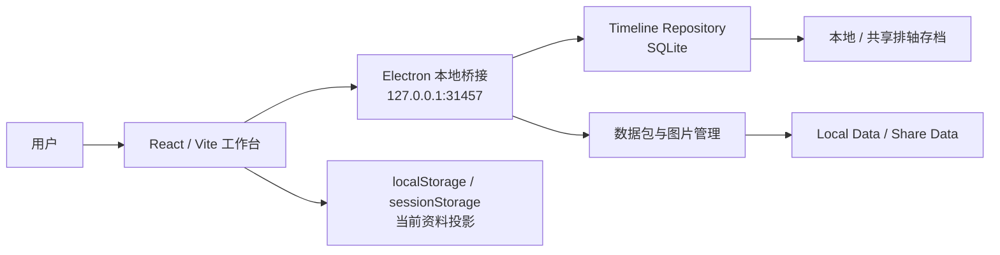

# 架构总览

[← 返回项目入口](../../README.md)

1.8 LTS 是一个本地优先的伤害计算与排轴工作台。React 负责业务界面，Electron 提供桌面窗口与受控本地桥接，SQLite 保存排轴文档、快照和 Work Node；角色、武器、装备与 Buff 的当前投影保留在浏览器存储中。


```mermaid
flowchart LR
  User["用户"] --> UI["React / Vite 工作台"]
  UI --> Bridge["Electron 本地桥接\n127.0.0.1:31457"]
  Bridge --> Repo["Timeline Repository\nSQLite"]
  Bridge --> Data["数据包与图片管理"]
  UI --> Storage["localStorage / sessionStorage\n当前资料投影"]
  Repo --> Archive["本地 / 共享排轴存档"]
  Data --> Package["Local Data / Share Data"]
```

## 稳定边界

- SQLite 是当前排轴、快照、节点树和 checkout 的事实源。
- 浏览器存储保存当前已应用的业务资料投影；完整数据包只有经用户明确“应用数据”后才改变投影。
- 网络下载只进入 Share Data，不自动覆盖 Local Data、浏览器状态或当前 SQLite 工作区。
- 本地/共享排轴存档转换为新的 SQLite 工作区后才能使用，不直接覆盖当前页面。
- 图片资源、完整数据包和应用安装包是三条独立发布链。

1.8 LTS 不包含 DEF OpenCode、Harness、AI CLI 或 MCP 服务。历史持久化键中的 `def.*` 和 Work Node API 中的 `ai-timeline-*` 名称为兼容既有用户数据而保留，不代表仍内置 Agent 运行时。

## 目录责任

```text
src/             React 页面、领域逻辑、计算器与浏览器桥接
electron/        桌面主进程、SQLite、数据与图片服务
scripts/         构建、数据处理、合同与 smoke 脚本
public/data/     内建产品资料
public/shell/    桌面 Shell 页面
docs/            当前架构、指南、仍有效规格与维护记录
```
