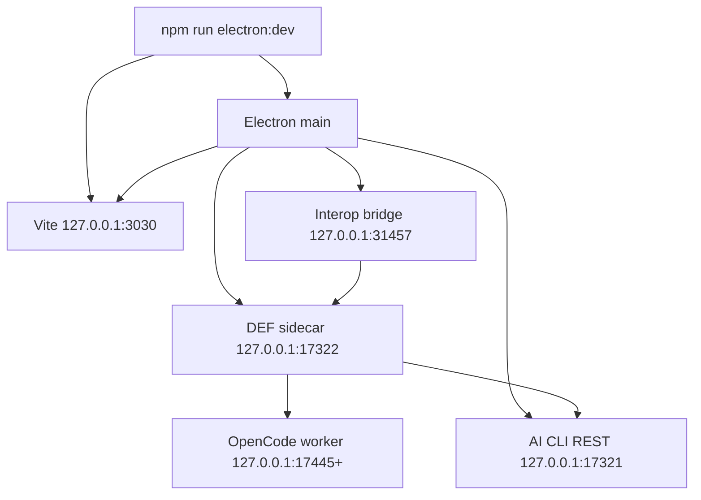

# 运行拓扑

## 开发态

| 端口 | 所有者 | 用途 | 暴露范围 |
| --- | --- | --- | --- |
| `3030` | Vite | Workbench 开发页面 | loopback |
| `31457` | Electron bridge | `DefCodexInteropProtocol v1` | loopback + bearer/origin 约束 |
| `17321` | AI CLI REST | snapshot 与产品 typed operations | loopback |
| `17322` | DEF sidecar | native session 与 OpenCode 适配 | loopback |
| `17445+` | OpenCode workers | 每 workspace 的原生 worker | loopback、动态递增 |

## 启动与健康

`electron:dev` 是开发期常驻入口。已有实例不应因普通验证被重启；只有端口/registry 缓存形成明确阻塞时，才执行一次受控重载。Interop 的 `status` 同时报告 bridge、sidecar、snapshot 和活动 UI consumer，调用方不能只凭端口监听就宣称系统可测试。

降级语义必须明确：

- snapshot 不可用时，只读 turn 可以标记 `snapshotAvailable=false` 后继续有限回答；依赖产品状态的 mutation preview 必须 fail-closed。
- UI consumer 不可用时，不创建伪 session，返回稳定的 `ui-consumer-unavailable`。
- OpenCode/plugin registry 只在进程启动时加载时，源码新增工具需要受控重载；不得用重复 prompt 掩盖未加载。

## 发布态

安装包包含 `dist/`、Electron、DEF server/runtime、AI CLI REST、sidecar SSR 所需 `src/` 和 Vite runtime，以及构建得到的 OpenCode core binary。`agent/vendor/` 是构建输入，不进入最终应用包。OpenCode core 与平台对应的 esbuild child-process binary 位于 `app.asar.unpacked`，其余 JavaScript 保持在 asar 内。

安装包内的 `app.asar` 只保存只读程序与知识资源。SQLite、now-storage、tool governance、临时 Agent scripts 和 Vite SSR cache 均由 Electron 显式传入可写的 userData/runtime 路径；Windows portable 模式的产品数据保留在 portable executable 旁的 `data/`。任何运行时服务都不得回退到向 `app.asar` 写入。

发布态仍使用 loopback 多进程拓扑，而不是把所有职责塞进 Electron 主进程。进程退出由 shell 统一回收，协议调用使用显式 health/error 状态而不是无界重试。
