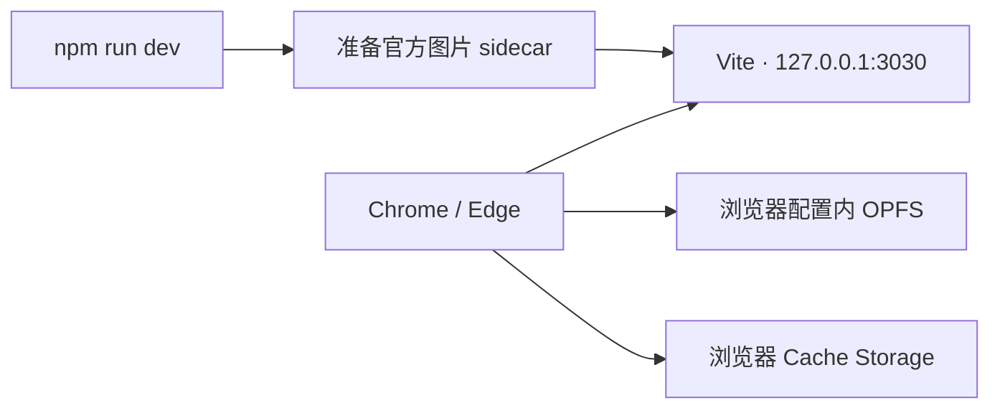
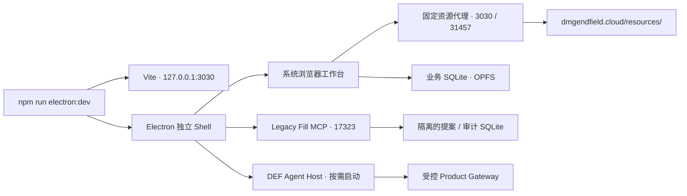

# 运行拓扑

## 本地开发


```mermaid
flowchart LR
  Command["npm run dev"] --> Prepare["准备官方图片 sidecar"]
  Prepare --> Vite["Vite · 127.0.0.1:3030"]
  Browser["Chrome / Edge"] --> Vite
  Browser --> OPFS["浏览器配置内 OPFS"]
  Browser --> Cache["浏览器 Cache Storage"]
```

仅运行 `npm run dev` 时，唯一固定端口是 `3030`，不会启动 Electron、MCP 或 Agent。

## Desktop Shell 开发


```mermaid
flowchart LR
  Command["npm run electron:dev"] --> Vite["Vite · 127.0.0.1:3030"]
  Command --> Shell["Electron 独立 Shell"]
  Shell --> Browser["系统浏览器工作台"]
  Shell --> MCP["Legacy Fill MCP · 17323"]
  Shell --> Agent["DEF Agent Host · 按需启动"]
  Browser --> Proxy["固定资源代理 · 3030 / 31457"]
  Proxy --> Cloud["dmgendfield.cloud/resources/"]
  Browser --> OPFS["业务 SQLite · OPFS"]
  MCP --> Audit["隔离的提案 / 审计 SQLite"]
  Agent --> Gateway["受控 Product Gateway"]
```

生产桌面静态宿主固定在 `127.0.0.1:31457`。开发态 Vite 与生产静态宿主都只把固定前缀代理到 `dmgendfield.cloud/resources/`，不开放任意上游；服务器不可用时资源消费者退回已打包版本并显示“内置版本”。旧业务端口 `17321`、`17322` 不得恢复；MCP 的 `17323` 只服务填表提案，不承载业务资料库。

## 本地生产预览

```bash
npm run build:local
npm run preview
```

`build:local` 会把静态应用、WebAssembly、JSON 资料、图片清单、图片压缩包、MCP/Agent 与统一发包 runtime 放入 `dist/`。`preview` 仅绑定 `127.0.0.1`，不会上传或发布内容。

## Web 生产部署

网站生产发布只从 `codex/v1.8-lts-slimming` 执行，并通过 Caddy/Nginx 服务于 `https://dmgendfield.cloud`。Desktop 分支的 `dist/` 用于本地 Shell/安装包，不得直接替代 Slimming 的国内站点产物。
