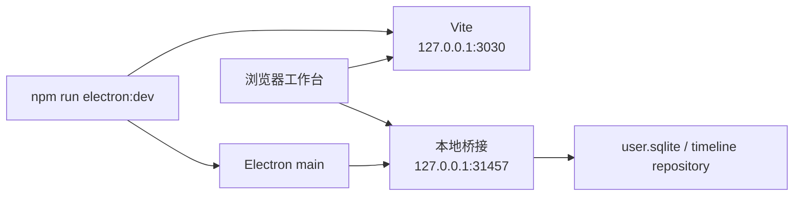

# 运行拓扑

## 开发态

```mermaid
flowchart LR
  Command["npm run electron:dev"] --> Vite["Vite\n127.0.0.1:3030"]
  Command --> Electron["Electron main"]
  Electron --> Bridge["本地桥接\n127.0.0.1:31457"]
  Browser["浏览器工作台"] --> Vite
  Browser --> Bridge
  Bridge --> SQLite["user.sqlite / timeline repository"]
```

| 端口 | 所有者 | 用途 |
| --- | --- | --- |
| `3030` | Vite | 开发页面与 Shell 静态资源 |
| `31457` | Electron | 本地数据、图片、Shell 控制与生产 Web 托管 |

浏览器访问受保护的 `/local-data/*` 路由时必须携带 Electron 启动时注入的 renderer capability，并满足受信任 Origin/Referer 约束。

## 发布态

安装包携带 `dist/`、`electron/`、`package.json`，以及数据包和图片发布所需的两个独立 builder 模块。程序资源位于 asar；SQLite、数据包、图片更新、日志与 capability 文件写入 userData/runtime。发布态不启动额外的 Agent、OpenCode、AI REST 或 MCP 子进程。
