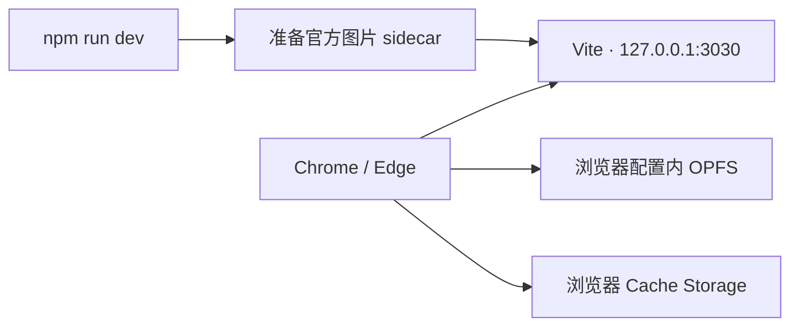

# 运行拓扑

## 本地开发


```mermaid
flowchart LR
  Command["npm run dev"] --> Prepare["准备官方图片 sidecar"]
  Prepare --> Vite["Vite · 127.0.0.1:3030"]
  Browser["Chrome / Edge"] --> Vite
  Browser --> OPFS["浏览器配置内 OPFS"]
  Browser --> Cache["浏览器 Cache Storage"]
```

唯一固定端口是 `3030`。没有 Electron 进程、loopback bridge、sidecar API 或额外业务端口。

## 本地生产预览

```bash
npm run build:local
npm run preview
```

`build:local` 会把静态应用、WebAssembly、JSON 资料、图片清单和图片压缩包放入 `dist/`。`preview` 仅绑定 `127.0.0.1`，不会上传或发布内容。

## 静态部署

`dist/` 可放到支持 HTTPS 与正确 MIME 类型的静态服务器。应用使用 hash 路由，不要求服务端 rewrite；服务器应允许 `.wasm`、`.json` 和 `.zip` 下载。真实访问控制必须由静态站点前置网关实现。
