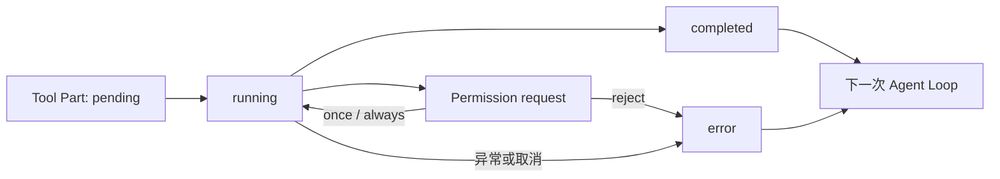

# 运行中的状态、持久化与恢复

`while True` 足够解释 Agent Loop，却解释不了“跑到一半怎么办”。模型可能一次返回多个 Tool Call，工具可能等待审批、执行失败或被取消；更麻烦的是，请求超时不一定代表副作用没有发生。

这些情况不适合继续塞进 Loop 的入门伪代码。回到当前项目看，它们也不是由一张巨大的状态机解决的。

## 同一次运行里有几层状态

| 层 | 当前实现关心的状态 | 解决什么问题 |
|---|---|---|
| Session | `idle / busy / retry` | 会话现在是否正在生成，是否等待 Provider 重试。 |
| Tool Part | `pending / running / completed / error` | 某个 Tool Call 收到了多少输入，是否开始、完成或失败。 |
| Permission | 待处理请求以及 `once / always / reject` 回复 | 一次具体调用是否能继续。 |
| Interop Turn | `accepted / completed / stopped / timeout / max-step / provider-error / bridge-error` | 外部测试或教师如何判断这一轮的终态。 |
| 产品修改 | Work Node、revision、commit、Checkout 与 live 状态 | 副作用究竟准备到哪一步，是否真的应用。 |

它们互相关联，但不应该压成一个枚举。比如工具等待用户批准时，Tool Part 仍然可以是 `running`；等待本身由 Permission 子系统保存，并不会凭空多出一个 `approval-pending` Tool 状态。

## Tool Call 怎样被记下来

OpenCode 把 Tool Call 存成 Message 下的一种 Part。除了工具名和输入，还会记录 `sessionID`、`messageID`、`partID` 和 `callID`。其中 `callID` 用来把 Provider 发出的调用、后续 Tool Result 和错误对应起来。

状态变化不是只推给 UI：Processor 每收到 `tool-call`、`tool-result` 或 `tool-error` 事件，都会更新这条 Tool Part。完成状态会保存输出、起止时间、metadata 和附件；失败状态保存错误与起止时间。Message 和 Part 通过事件投影写入 OpenCode 的 SQLite，界面和后续 Loop 都从同一份记录重建上下文。

同一条 Assistant Message 可以包含多个 Tool Part，每个 `callID` 独立关联自己的结果。Runtime 能同时追踪多个调用；DEF 的产品修改则在领域工具内部串行并 fail-stop，避免多个副作用一起失控。

这解决了“发生过什么”，却没有保证任意执行都能从中间恢复。Tool handler 可能正在操作外部进程或产品界面，数据库里的一条 `running` 记录并不是它的执行检查点。

## 审批等待也是运行时状态

Permission 请求包含 request ID、Session、权限名、匹配范围、metadata 和关联工具。当前 OpenCode 实现把尚未回答的请求放在运行时内存 Map 里，用 Deferred 暂停工具执行。用户回复 `once`、`always` 或 `reject` 后，等待才会结束。

这意味着 Permission 事件可以被界面观察，批准规则也可以影响后续调用，但“正在等待的 Promise”本身不是可跨进程恢复的业务事务。Worker 如果在这时消失，正确做法不是假装审批仍会自动续上，而是重新读取 Session、产品状态和待处理问题，确认下一步。

## 取消时要把半截状态收口

DEF Adapter 使用 AbortController，并调用 OpenCode 的 `/abort` 停止当前 Session。受控制的取消会继续走 Processor cleanup：尚未结束的 Tool Part 被写成 `error`，错误为 `Tool execution aborted`，metadata 标记 interrupted，Assistant Message 也补上完成或错误信息。

这样 UI 不会永远显示一个正在运行的工具，下一次 Loop 也能识别被清理的孤立调用。它仍然只说明 Runtime 已停止等待；如果工具在取消前已经触发产品副作用，最终事实要回到产品状态检查。

## 重试之前先分清失败发生在哪一层

Provider 的限流和部分 5xx 错误可以指数退避。重试期间 Session 进入 `retry`，记录 attempt、原因和下一次尝试时间；Context Overflow 则转向 Compaction，不作为普通网络错误重复请求。

Tool Error 会落到对应 Tool Part，交给后续模型步骤判断。产品修改更谨慎：一次 Apply 超时，可能是“根本没执行”，也可能是“执行成功但响应丢了”。后者如果直接重试，会产生重复副作用。

因此 DEF 的修改链路在执行前绑定 Session、父子 Work Node、revision、working payload hash 和有期限的 prepared capability。原生审批卡片展示本次 Work Node、Checkout revision 和具体配装差异；Apply 开始后 capability 会被标记为 consumed。Checkout、父子 revision 或 hash 有任何变化，就拒绝继续。响应不确定时先读取 commit、Checkout 和 live mirror 做 reconciliation，而不是让模型无界重发。

Turn 投递还有一层 correlation。Interop 使用调用方提供的 `clientTurnId` 识别重复请求；Sidecar 是否接受 Prompt 不确定时，不会立刻重发，而是观察 Transcript 中是否出现了本次 User Message，以及 Assistant 的 `parentID` 是否指向它。旧回答不能冒充本轮完成，已经进入 `stopped`、`timeout` 或 Provider Error 的终态也不会被晚到事件覆盖。

批量修改也没有假装成全有或全无。当前实现按对象串行执行，第一处失败就停止；之前已经完成的结果明确返回 `PARTIAL`，不能被总结成全部成功。

## 持久化不等于恢复执行栈

当前项目持久保存了几类事实：Session 里的 Message/Part、Timeline Repository 里的 Work Node/Commit/Binding，以及浏览器侧已经应用的 live 状态。如果本地 Session Binding 仍在、上游 OpenCode Session 却返回 404，Adapter 可以在同一隔离目录重新创建 Session，并重新绑定原来的 Harness 与产品坐标。

它恢复的是身份和边界，不是把崩溃前的 JavaScript 调用栈接着跑。恢复以后仍要重新读取当前 Checkout、未完成 Tool Part、是否还有 Permission 请求和产品 Postcondition，再决定继续、放弃还是提示人工处理。

Compaction 也遵循同样的分层。它可以摘要旧对话、裁剪旧 Tool Result，但审批事实和产品状态不应该只存在于模型摘要里。真正的修改事实仍在 Work Node、Commit、Checkout、审计记录和 live mirror 中；上下文压缩或 Session 恢复后，Agent 应重新读取这些事实源。

对应实现主要在：

- `agent/vendor/opencode/packages/schema/src/v1/session.ts`
- `agent/vendor/opencode/packages/opencode/src/session/processor.ts`
- `agent/vendor/opencode/packages/opencode/src/session/prompt.ts`
- `agent/vendor/opencode/packages/opencode/src/permission/index.ts`
- `agent/runtime/def-opencode-adapter/index.cjs`
- `agent/runtime/def-codex-interop.cjs`
- `scripts/ai-cli-rest-server.mjs`
- `electron/timeline-repository.cjs`

测试和审计这些状态时，会反复读取相同证据、区分已确认事实与待验证假设。这类流程不适合全部硬编码进 Runtime，却值得交给 Codex 稳定复用，于是项目里有了[开发者自己的 Skill](./07-developer-skill.md)。
