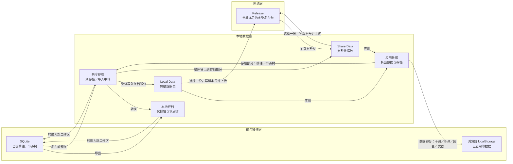

# 数据管理：SQLite、数据包、存档与 Release Spec

## 目标

在不改变主界面业务编辑方式的前提下，恢复并收敛既有的 Local Data／Share Data 模型。

- 前台工作态只有 **SQLite** 和浏览器 **localStorage**。
- Local Data 与 Share Data 是两类完整数据包；它们包含干员、Buff、装备、武器等数据部分，并携带一个存档部分。
- 本地存档与共享存档是独立的排轴／节点树对象，不等同于 Local Data 或 Share Data。
- 网络只搬运带版本号的完整数据包：下载落入 Share Data；发包从 Local Data 或 Share Data 选取一份内容。

本 Spec 取代此前“catalog + 参考存档 + 联网存档库”的产品模型。网络不是第三个存档库，用户界面不得出现“联网存档”或“参考存档”分类。

## 术语与事实源

| 对象 | 内容 | 正式用途 | 前台可直接调用 |
| --- | --- | --- | --- |
| SQLite 工作区 | 当前排轴、节点树、checkout、审计、工作副本 | 唯一可编辑、可直接应用的排轴状态 | 是 |
| 浏览器 localStorage | 已应用的干员、Buff、装备、武器等数据投影 | 前台数据工作态 | 是 |
| Local Data | 完整数据包及其存档部分 | 本地保存、自定义数据、可应用／可发布输入 | 否 |
| Share Data | 完整数据包及其存档部分 | 共享保存、下载落点、可应用／可发布输入 | 否 |
| 本地存档 | 仅排轴与节点树 | 本地可搬运排轴 | 否；只能转换为 SQLite |
| 共享存档 | 仅排轴与节点树 | 导入中转、发布前预存档、写回数据包存档部分 | 否；只能转换为 SQLite |
| Release | 带版本号的完整数据包 | 上传／下载通道 | 否 |

`Local Data`、`Share Data`、本地存档、共享存档均属于本地数据层；它们不是前台的直接事实源。

## 权威数据流



## 不变量

1. 下载器只校验和写入**完整包**到 Share Data；下载时禁止解析、拆分或直接更新 SQLite／localStorage。
2. 只有“应用数据”可以把完整包拆成数据部分与存档部分。数据部分进入浏览器 localStorage；存档部分进入共享存档。
3. 本地存档不从 Local Data 生成。它的来源只能是 SQLite 导出，或共享存档转换。
4. 共享存档是中转对象：它接受应用数据导入的存档部分，接受 SQLite 的发布前预存档，并可整体写回 Local Data 或导出到 Share Data 的存档部分。
5. 本地／共享存档均不能直接应用。选择任一存档时，必须新建 SQLite 工作区及导入根节点；节点树只显示数量，不在存档列表渲染。
6. SQLite 工作区可直接应用；删除 SQLite 工作区不得删除任一存档。删除数据包不得隐式删除独立存档。
7. 发包没有数据源目录选择。用户从 Local Data 或 Share Data 选择一个完整包，填写版本号及输出目录，生成 `data-release-manifest.json` 与一个 ZIP。
8. Release 可以仅有图片包。数据更新检查在未找到 `data-release-manifest.json` 时显示“当前 Release 未包含数据包”，不得报错。

## 数据包与兼容

### 完整数据包

继续兼容既有 `def.localdata.archive.v1` 文件及 `storage.local`／`storage.session` 结构。新写入可增加 `timelineArchives` 存档部分：

```ts
{
  type: 'def.localdata.archive.v1',
  schemaVersion: 1,
  id: string,
  name: string,
  sections: ['all'] | string[],
  storage: { local: Record<string, unknown>, session: Record<string, unknown> },
  timelineArchives?: TimelineArchive[]
}
```

- 数据部分包括干员、Buff、装备、武器和原有非排轴 storage 内容。
- 存档部分是 `timelineArchives`。旧包中 `def.timeline.snapshot-archive.v1`、旧 timeline session 字段由“应用数据”兼容解析后导入共享存档；原始文件不改写。
- 将共享存档写回完整包时，原子覆盖该包的 `timelineArchives`，不覆盖其数据部分。

### 排轴存档

`TimelineArchive` 保留完整 payload、Work Node 树、当前节点位置、payload hash、nodeCount 与格式版本。新存档来源为 `local` 或 `shared`；读取旧 `reference`／`pending-reference` 文件时可迁移为共享存档，但 UI 不再暴露旧名称。

存档转换成 SQLite 时：

1. 校验 schema、payload hash 与节点树；
2. 新建 SQLite 文档与一个导入根节点；
3. 导入有效 Work Node 树，尝试映射当前节点；不一致时 checkout 回退导入根并记录兼容诊断；
4. 在同一事务更新工作副本、checkout 与审计事件；
5. 不修改来源存档。

## Release 协议

`data-release-manifest.json` 与图片 manifest 位于同一 Release 地址，但彼此独立。数据 manifest 至少含：

```ts
{
  type: 'dmg.local-data-release-manifest.v1',
  manifestVersion: 1,
  dataVersion: string,
  releaseTag: string,
  generatedAt: string,
  minShellVersion?: string,
  source: { scope: 'local' | 'share', id: string, fileName: string },
  package: { fileName: string, sizeBytes: number, sha256: string }
}
```

ZIP 只包含 `manifest.json` 与一份完整数据包 JSON。生成器和安装器必须：

- 拒绝路径穿越、重复文件、额外文件、超限大小及 hash 不一致；
- 使用临时目录校验后原子写入 Share Data；
- 相同版本且相同 hash 幂等；相同版本但不同 hash 拒绝覆盖；
- 下载完成后不自动“应用数据”、不自动转换存档、不自动切换 SQLite 工作区；
- 保留写入时间、Release 来源与版本，以便列表显示“下载的数据包”。

## UI 设计

### Shell「数据」页

1. 顶部是“数据更新”：固定显示与图片相同的 Release 地址、当前下载版本、检查更新与“下载到 Share Data”。不再显示 catalog、参考存档或联网存档。
2. 中部是“数据包”：`本地数据` 与 `共享数据`为按钮切换的两个列表，不是并排混合列表。卡片只显示名称、版本／来源、更新时间、数据键数量与存档数量。
3. 选中数据包后提供“应用数据”“打开位置”“删除”。应用前沿用原有的保存确认；应用由既有 Web storage 逻辑完成，并把存档部分导入共享存档。
4. “保存当前数据”保留“保存到本地”“保存到共享”两项，沿用现有完整包保存逻辑；保存时把当前共享存档整体写入新包的存档部分。
5. 底部“数据发布包”：先选择当前列表中的 Local Data 或 Share Data 项，再填写版本、可选 Release Tag／最低 Shell 版本、输出目录。不得显示“数据源目录”选择器。
6. 迁移记录只显示历史迁移状态、来源文件、结果和重试；不作为常驻产品数据分类。

### 主界面「恢复排轴」

标签固定为“本地存档”“共享存档”“SQLite”。删除“待发布”“联网存档”。

- 本地／共享存档：转换为 SQLite、删除；共享存档可转为本地存档；本地存档可转为共享存档。
- SQLite：应用、导出本地存档、预存到共享存档、删除（当前工作区不可删除）。
- 列表只展示摘要、格式版本、节点数量和当前节点标记。

## 迁移与删除边界

- 首次运行先备份旧本机／共享 JSON、旧 SQLite 快照和旧 reference outbox；迁移不得删除原文件。
- 旧本地存档迁入本地存档；旧 pending-reference／reference outbox 迁入共享存档；重复导入按内容 hash 幂等。
- 旧 Release catalog／参考存档安装结果只作为兼容可读记录，不再进入新恢复 UI。
- 本任务不删除 Local Data、Share Data、旧存档、SQLite 或任何用户文件；删除能力只作用于用户显式选择的单个条目。

## 验收

1. Shell 可列出、保存、应用和删除 Local Data／Share Data，两个列表由按钮切换。
2. 从网络下载的完整包只出现在 Share Data；执行“应用数据”后数据写入 localStorage、存档出现在共享存档。
3. SQLite 导出的本地／共享存档与节点树可转换为新 SQLite 工作区；本地存档不依赖 Local Data 存在。
4. 共享存档可完整写入任一数据包的存档部分，且不破坏数据部分。
5. 从 Local Data 或 Share Data 任选一份可生成带版本号的全量包；无需选择源目录；下载、hash 校验和落入 Share Data 通过。
6. 主界面不显示“待发布”“参考”“联网存档”；Shell 不显示 catalog／参考存档更新语义。
7. 旧数据与旧存档保持可读取或可迁移；本次流程不自动删除用户内容。
