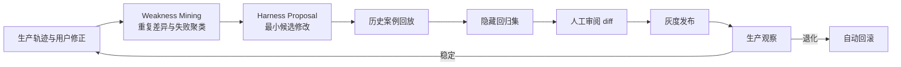

# Spec 8 专项预研究：DEF Harness 自进化

## 研究状态

预研究完成。本文件独立研究 Harness 自训练思想对 DEF 的产品与架构启示，不修改 `spec.md`、验收标准或任务拆分。

本研究中的“自训练”默认不更新模型权重，而是让 Agent 外部运行结构从可验证的执行经验中持续改进。更准确的名称是：

> **Harness 自进化：从生产轨迹中发现重复弱点，提出最小运行时修改，并且只在回放、回归和人工审阅通过后发布。**

## 一、核心判断

Harness 自进化非常适合 DEF，甚至可能成为 DEF 相比普通游戏知识问答 Agent 更重要的长期壁垒。

原因是 DEF 的目标不是生成一段看似合理的回答，而是把游戏知识转译为可以检查和应用的战斗方案。现有 Workbench、Work Node、typed tools、validation、diff、revision、approval/use 和用户最终编辑，天然提供了比 Agent 自我评价更可靠的训练信号。

```text
YZ / 官方知识给 DEF 一个专家起点
              +
真实排轴、校验和用户修正给 DEF 工作经验
              ↓
可验证、可回滚的 Harness 进化
```

这条路线不意味着允许 Agent 自由改 system prompt、知识库或权限规则。模型可以参与发现问题和提出候选修改，但“什么叫正确”“什么叫安全”和“是否发布”必须由独立 verifier、回归集与人工审批控制。

## 二、Harness 的定义与 DEF 映射

[Anthropic 的 Managed Agents 架构](https://www.anthropic.com/engineering/managed-agents)将系统拆为 session、harness 和 sandbox：session 是 append-only 事件记录，harness 负责模型循环与工具路由，sandbox 承担实际执行环境。这种分离对 DEF 很合适：模型只是“brain”，Harness 是可版本化的运行策略，Workbench 是产生真实结果的环境。

| 通用概念 | DEF 对应物 | 是否可进化 |
| --- | --- | --- |
| Base model | 当前 OpenCode provider/model | 本阶段不训练权重 |
| Session | provider-visible messages、tool trace、结果和用户修正 | 只追加，不能事后改写 |
| Agent Contract | 身份、职责、能力与回复原则 | 可提出候选，人工审阅 |
| Capability Manifest | 当前 host、权限、可见工具 | 由代码生成，不允许模型修改 |
| WorkbenchTurnState | 当前队伍、checkout、revision、gate | 每 turn 精确重算，不作为长期记忆 |
| Skills | timeline/game-knowledge 的程序知识 | 主要进化对象 |
| Tool mediation | 工具选择、参数准备、恢复路径 | 可进化，但副作用边界不可变 |
| Knowledge policy | 查询层级、证据充分性、冲突处理 | 可进化；事实本体需独立审阅 |
| Execution environment | Work Node、resource、validation/diff | 真相与反馈来源 |
| Voice Profile | 玩家表达结构、个人解释偏好 | 低风险、有界进化 |

因此 DEF Harness 不应等同于一段大 prompt，而应被理解为以下版本化组合：

```text
HarnessVersion =
  AgentContractVersion
  + SkillBundleVersion
  + ToolRoutingPolicyVersion
  + KnowledgePolicyVersion
  + StateSerializerVersion
  + ResponsePolicyVersion
```

每次黑盒执行都应记录该组合，才能判断某次成功或失败究竟由哪个版本造成。

## 三、自训练究竟训练什么

### 1. Skill 与程序知识

这是首要进化对象。例如多次出现：

```text
用户：“照秋栗那套先排一下”
Agent：查询并解释了打法，但没有建立 Work Node 草稿。
```

系统可以基于多条相似轨迹提出最小候选修改：

```text
当请求同时包含“已知打法引用”与“排轴动作意图”时，
game-knowledge 查询完成后交接 timeline-workbench，停在 validated diff。
```

候选必须分别回放知识问答、排轴预览、明确应用和歧义请求，证明它改善目标行为且没有让普通问答误建草稿。

[SkillRevise](https://arxiv.org/abs/2606.01139)研究了依据执行轨迹诊断 skill 缺陷、生成修订并通过重新执行选择版本的方法；论文同时明确指出，稀疏或错位的 verifier 会导致 skill 过拟合可见检查。DEF 应采用“execution-grounded revision”，但必须维护隐藏回归集，不能让修改者同时看到全部验收答案。

### 2. 工具路由与错误恢复

重复失败可以逐步从语言提醒下沉成确定性 guard：

| 重复问题 | 初期修复 | 成熟修复 |
| --- | --- | --- |
| checkout 变化后继续操作旧 node | skill 中增加恢复说明 | runtime 强制 rebind gate |
| 知识问答误调用写工具 | prompt/tool description 收紧 | intent policy 禁止进入写入态 |
| 生成草稿后忘记 validation/diff | workflow checklist | node 状态机不允许申请 use |
| YZ 数值直接当实时事实 | knowledge skill 增加警告 | evidence policy + official resource 核对 |

这体现 Harness 自进化的重要方向：不是无限增长提示词，而是将被反复证明必要的约束迁移到 typed state、deterministic workflow 和 verifier。

### 3. 知识检索策略

可以从轨迹中学习：

- 哪些玩家别名经常无法命中正式资源；
- 某类问题只需要 terminology，还是需要 Operator Card、Rotation 或 Evidence；
- 什么情况下应扩展相邻角色、前后动作或跨视频关系；
- 哪些卡片反复因版本过期或条件缺失导致错误；
- 哪些查询需要先读取当前 Workbench 状态。

这些经验可以生成 alias、routing、ranking 和 evidence-policy 候选，但不能自动生成 runtime truth。知识 Claim 的发布仍需来源 span、版本、冲突状态和 reviewer。

### 4. 个人方案与表达偏好

如果用户连续多次把极限伤害方案改成稳定循环方案，DEF 可以形成有范围的个人偏好：

```json
{
  "preference": "stability_over_peak_damage",
  "scope": ["fire-team"],
  "evidenceCount": 6,
  "confidence": 0.82,
  "source": "accepted-work-node-diffs",
  "reversible": true
}
```

该偏好只改变候选排序、默认取舍和解释方式，不能覆盖游戏事实、validation 或 approval。用户应能查看、关闭和删除这类学习结果。

## 四、训练信号与 Learning Event

DEF 应按可信度使用反馈，而不是把所有对话等价存入 memory：

1. deterministic validation 是否通过；
2. diff 是否符合明确用户意图；
3. 用户是否批准 use；
4. 用户应用后是否立即撤销或再次修改；
5. 相似任务在新状态下能否复现；
6. 用户明确的文字评价；
7. Agent 自我评价。

最后一项只适合帮助归因，不能独立触发长期规则更新。

建议记录统一的 `DefLearningEvent`：

```json
{
  "eventId": "...",
  "taskIntent": "preview_known_playbook",
  "harnessVersion": "...",
  "contractVersion": "...",
  "skillVersions": {},
  "knowledgeIndexVersion": "...",
  "turnStateHash": "...",
  "toolTraceRef": "...",
  "validation": { "passed": true, "issues": [] },
  "draftDiffRef": "...",
  "userOutcome": "edited_then_applied",
  "userDeltaRef": "...",
  "failureLabels": ["rotation-condition-missing"],
  "privacyScope": "local-user",
  "createdAt": "..."
}
```

原始 session/tool trace 保持 append-only；`failureLabels`、归因和改进建议是可修订的派生数据，不能覆盖原始证据。

## 五、Harness 进化闭环



[Self-Harness](https://arxiv.org/abs/2606.09498)将此类过程概括为 Weakness Mining、Harness Proposal 和 Proposal Validation，并在 Terminal-Bench-2.0 上报告了跨多个模型的 held-out 改善。它是 2026 年的新研究，应视为方向性证据而非成熟生产规范。DEF 应进一步加入人工审批、权限隔离、灰度与回滚。

[OpenAI 的自改进税务 Agent 案例](https://openai.com/index/building-self-improving-tax-agents-with-codex/)提供了更适合垂直产品的约束：生产差异不会自动成为 Codex 修改任务；只有重复差异经过专家审阅、归类为可行动发现，并具备明确成功条件后，才进入有界改进流程。DEF 应采用同样的“reviewed finding → bounded task”门槛。

### 候选修改必须最小化

每个 `HarnessProposal` 只允许针对一个可归因弱点，并记录：

- failure cluster 与代表轨迹；
- 修改对象和版本；
- 修改前后 diff；
- 预期改善的 case；
- 可能退化的相邻 case；
- replay、holdout 和安全检查结果；
- reviewer、灰度范围和 rollback target。

不接受“重写整个 system prompt”式候选，因为无法归因，也无法判断哪个变化导致退化。

## 六、不可学习内核

以下规则不能由 Agent 或 Harness Proposal 自治修改：

- permission、host isolation 与 provider-visible tool allowlist；
- approval/use 边界与所有真实副作用；
- checkout、revision、CAS 和 rebind 语义；
- validation 对业务正确性的定义；
- 官方 resource 的事实优先级；
- provenance/evidence 的必填要求；
- 隐藏回归集和成功判定；
- 用户数据的隐私范围；
- 从单次会话向全局用户发布经验。

原则是：

> Agent 可以提出怎样更好地完成任务，不能自行修改什么叫完成、什么叫安全。

[Harnessing LLM Agents with Skill Programs](https://arxiv.org/abs/2605.17734)提出让程序化反馈在易失败状态主动介入，并强调稳定 skill library 的演化。DEF 可以借鉴“状态触发的 executable guardrail”，但 teacher review 不能由同一个待修改 Agent 自己替代。

## 七、失败分类比自由反思更重要

Harness 自进化的第一版产品不应是“自动改 prompt”，而应是高质量失败分类：

| 类别 | 例子 | 可能修改层 |
| --- | --- | --- |
| self-model | 不知道自己能建立排轴草稿 | Agent Contract / capability exposition |
| intent-routing | 把解释请求误判为写入请求 | routing policy |
| knowledge-recall | 没识别 `42`、`小羊` | terminology / search policy |
| evidence | 将旧视频阈值当实时事实 | evidence policy |
| state-staleness | checkout 已变仍操作旧 node | state serializer / hard gate |
| tool-selection | 选择错误工具家族 | tool description / mediation |
| parameter-grounding | 猜测 button id 或 slot | resource-first procedure |
| workflow-omission | 未 validate/diff 就声称完成 | deterministic workflow |
| user-preference | 反复给极限方案而用户总改稳定方案 | local preference profile |
| expression | 结论不清或用主播口吻掩盖不确定性 | Voice Profile |

只有同类问题重复出现、能够定位责任层、存在可靠 verifier 时，才应该生成修改候选。一次偶发失败先进入 observation，不立刻沉淀规则。

## 八、产品形态

Harness 自进化首先应是一种后台复利能力，而不是面向普通玩家暴露的“训练中心”。

### 玩家侧

- “根据你最近保存的火队方案，默认优先稳定循环”；
- “这个偏好来自你修改并应用过的 3 个方案”；
- “仅本次使用 / 以后优先这样 / 不要从这次学习”；
- 查看和删除个人偏好；
- 明确区分“社区建议”“当前事实”“你的偏好”。

### 维护者侧：Harness Evolution

- 最近重复失败与影响范围；
- 代表轨迹和 failure labels；
- 候选 skill/policy 修改 diff；
- 修改前后 replay 与 holdout 指标；
- 新增成功、退化和安全 case；
- 接受、拒绝、灰度、暂停和回滚；
- 当前用户/模型/host 的 Harness 版本分布。

最终用户感知应该是“DEF 越来越懂我的打法，而且不再重复犯同一种错”，而不是要求用户理解 prompt、trace 或 skill evolution。

## 九、成熟度路线

### L0：可归因观测

- 每 turn 记录 contract、manifest、state、skills、knowledge 和 tools 版本；
- 保留 validation、diff、approval/use 与用户最终 delta；
- 建立 failure taxonomy，但不自动修改任何资产。

### L1：离线弱点发现

- 相似失败聚类；
- 输出 evidence-backed finding；
- 人工判断是知识、skill、工具还是产品交互问题。

### L2：候选生成与回放

- 自动生成单点 `HarnessProposal`；
- 回放历史 case；
- 使用从未参与候选生成的隐藏回归集；
- 只展示建议，不自动发布。

### L3：灰度与回滚

- 人工批准候选；
- 按 model/host/小流量灰度；
- 监控目标指标和相邻退化；
- 超过阈值自动回滚到已知稳定版本。

### L4：有界个人适应

- 从用户接受和修正过的 Work Node 学习偏好；
- 默认 local-user scope；
- 偏好可解释、可撤销、有置信度衰减；
- 不学习安全规则和事实。

本阶段不进入在线模型权重训练、Agent 自动发布知识、Agent 自动修改 verifier 或生产 prompt 的无审阅进化。

## 十、验证与指标

Harness 自进化不能只看总体成功率，应同时观察：

| 指标 | 目的 |
| --- | --- |
| target-cluster success delta | 候选是否解决目标弱点 |
| adjacent-case regression | 是否伤害相邻意图 |
| hidden holdout success | 是否只记住已见 case |
| wrong-tool rate | 工具路由是否改善 |
| validation/diff closure rate | 是否完成真实工作流 |
| user-edit distance | 草稿距用户最终版本是否缩小 |
| immediate undo/re-edit rate | 用户是否很快推翻应用结果 |
| unsupported-claim rate | 是否增加无证据知识 |
| permission violation rate | 必须始终为零 |
| prompt/skill token growth | 是否用堆规则掩盖架构问题 |
| rollback frequency | 灰度机制和候选质量是否健康 |

应按 model、host、意图、知识版本和 HarnessVersion 切片，避免总体平均值掩盖某个模型或工作流的退化。

## 十一、与 Spec 8 主架构的关系

Harness 自进化不新增第四类工具，也不要求多 Agent swarm。它横跨 Spec 8 六个模块，但作用不同：

```text
Knowledge Compiler：从失败中提出抽取/冲突修订候选
Knowledge Runtime：学习查询路由，不自治发布事实
Agent Contract：低频、人工审阅的自我模型修订
Manifest / TurnState：不可由模型修改，只提供真实现场
Skills：主要进化对象
Voice Profile：只学习有界表达与个人偏好
```

建议把它实现为独立的 offline evolution pipeline，而不是塞进每个在线 turn。在线 Agent 只产生可归因轨迹；离线管线负责聚类、候选、回放和报告；发布继续经过维护者审批。

## 十二、外部参考与采用结论

| 参考 | 可借鉴 | DEF 不照搬 |
| --- | --- | --- |
| [Anthropic：Managed Agents](https://www.anthropic.com/engineering/managed-agents) | session、harness、sandbox 分离 | 直接采用其基础设施实现 |
| [Anthropic：Effective harnesses for long-running agents](https://www.anthropic.com/engineering/effective-harnesses-for-long-running-agents) | 跨 session 留下明确状态和可验证进度 | 现在先引入专门多 Agent 角色 |
| [OpenAI：Self-improving tax agents](https://openai.com/index/building-self-improving-tax-agents-with-codex/) | reviewed finding、bounded task、生产证据与 eval | 将垂直税务实现直接套到游戏 |
| [Self-Harness](https://arxiv.org/abs/2606.09498) | weakness mining、最小修改、回归接受 | 无人工审批的生产自治修改 |
| [SkillRevise](https://arxiv.org/abs/2606.01139) | trace-conditioned skill revision、重新执行选版 | 只优化可见 verifier、忽略安全部署 |
| [Harnessing LLM Agents with Skill Programs](https://arxiv.org/abs/2605.17734) | 失败状态触发程序化 guard、稳定 skill evolution | 让同一 Agent 兼任 teacher/verifier |

其中 2026 年 Harness/skill 自进化论文仍很新，当前应将它们作为架构假设与实验方向，不能当作已经充分验证的生产标准。DEF 最可靠的基础仍是自己的 typed tools、Workbench 状态、真实用户 delta 和黑盒回归。

## 最终判断

DEF 不需要先训练一个新模型，便能获得明显的持续学习能力：

1. 让每次真实任务产生可归因的执行证据；
2. 从重复失败中定位 Harness 的具体责任层；
3. 生成最小、可解释的修改候选；
4. 通过历史回放、隐藏回归和安全检查验证；
5. 经人工批准后灰度发布并保持可回滚；
6. 只在用户可见、可撤销的范围内学习个人打法偏好。

这形成一条更稳健的长期路线：**模型提供通用智能，YZ 提供领域起点，Workbench 提供真实环境，Harness 则把经验逐步编译为 DEF 自己的能力。**
