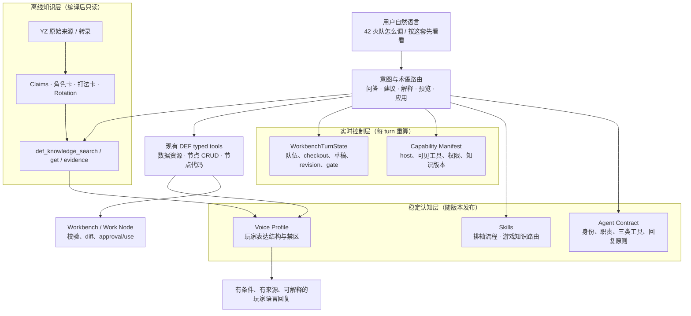

# Spec 8 预研究：DEF OpenCode 认知运行时与游戏知识 Agent

## 研究状态

预研究完成。本文件整合并取代 2026-07-13 在 Spec 7 下形成的六份临时探索记录；本轮**不**编写 `spec.md`、验收标准或任务拆分。

用户已将近期开发重点明确为：让 `def-opencode` 具备更多游戏知识、自然的主播/玩家讲解能力，以及对自身和 DEF Workbench 的稳定理解。角色卡、打法卡和最终 UI 都应服务这一 Agent 能力，而不是抢先成为独立产品主线。

## 一、结论与架构决策

DEF 应升级为一个单 Agent 为主、工作流强约束、知识可追溯的本地游戏 Agent：

> **DEF Cognitive Runtime：将社区游戏知识、玩家表达、Agent 自我模型、Workbench 实时状态和安全执行边界拆成独立层，并通过受控工具连接。**

不推荐把完整 `YZ.md` 放入 system prompt，也不推荐现在引入多 Agent 群、通用向量记忆平台或模型微调。



这不是一个第四类工具架构：游戏知识读取归入既有 `def-data-resource`；节点改动仍只经 `def-node-code` 和 `def-node-crud`。Voice Profile 和 self-model 都不能绕开权限、校验或审批。

## 二、为什么这套架构合理

### 1. 采用“工作流包围 Agent”，而非 Agent 包围一切

[Anthropic 的有效 Agent 架构研究](https://www.anthropic.com/engineering/building-effective-agents)区分可预测的 workflow 与自主 Agent，并建议从简单、可组合模式起步；其 routing 模式也强调把类别清晰的请求分给专门后续流程。DEF 恰好属于“开放语言意图 + 高风险确定性写入”的混合问题：游戏建议可以由模型探索，但 checkout、revision、validation、approval/use 必须是确定性 workflow。

因此 Spec 8 应保留一个 `def-workbench` 执行 Agent，围绕它实现明确路由和状态机，而不是为“角色”“配装”“排轴”“风格”分别创建会互相转交上下文的子 Agent。多 Agent 现在只会放大当前最稀缺的东西：当前 Workbench 状态的一致性与可审计性。

### 2. ReAct 的正确吸收是“读事实—行动—观察”，不是暴露思维链

[ReAct](https://arxiv.org/abs/2210.03629)的核心价值是把推理与环境行动交替：外部知识和行动结果反过来更新后续决策。DEF 已具备这个雏形：读取 context/数据资源，编辑隔离节点，调用 validation/diff，再由结果决定是否申请 use。

Spec 8 应强化以下可见轨迹：

```text
用户意图 → 读当前状态/知识 → 草稿动作 → validation/diff → 用户审批 → use 或保留草稿
```

不需要把内部推理全文暴露给用户；需要的是用户可验证的输入、来源、状态变化、风险和结果。

### 3. 人工审批与可恢复状态比“自我反思后直接重试”更适合写入

[LangGraph](https://github.com/langchain-ai/langgraph)（研究时 GitHub 显示约 37.1k stars）强调 durable execution 和 human-in-the-loop：状态可持久化、暂停、检查和恢复。[Microsoft Agent Framework](https://github.com/microsoft/agent-framework)（约 12.1k stars）同样将 workflow orchestration 与生产责任边界分开。这与现有 Work Node、revision、diff、approval/use 的路线高度一致。

[Reflexion](https://arxiv.org/abs/2303.11366)提出将任务反馈写入 episodic memory 来改进后续尝试。DEF 可以借鉴其“从真实失败反馈改进”的思想，但不能让模型把反思文本自动变成长期规则或自动重试写入。正确实现是：失败事件结构化记录；经测试确认后才更新 skill、知识卡或工具说明；每项更新有版本、回归测试和可回滚性。

### 4. Skills 应是渐进披露的程序知识，不是知识仓

[Agent Skills 开放规范](https://github.com/agentskills/agentskills)定义 discovery → activation → execution 的渐进披露；[Anthropic 的技能工程文章](https://www.anthropic.com/engineering/equipping-agents-for-the-real-world-with-agent-skills)进一步建议用简短元数据做发现、按需加载完整说明/资源，并将可重复部分交给确定性代码。

这直接解释了本仓库当前问题：`game-knowledge/SKILL.md` 能声明“有攻略”，但 OpenCode 现有 `skill` tool 只加载该文件和最多 10 个 reference 路径样本；而 Workbench 又禁止 session 外目录读取。它不能证明 Agent 已消费攻略正文。故：

- `timeline-workbench` 是“如何安全改当前轴”的 procedure skill；
- `game-knowledge` 是“何时、如何查询知识与处理冲突”的 routing skill；
- YZ 正文、卡片、数值和证据属于受控 Knowledge Runtime；
- 不再把 reference 文件路径当成模型可用知识。

### 5. 角色卡/打法卡是可组合知识资产，而非长提示词

[Voyager](https://arxiv.org/abs/2305.16291)的研究价值不在于其 Minecraft 场景，而在于把可复用、可组合且有执行反馈的行为放入可检索 skill library，而非反复把所有历史放回 prompt。它同时强调环境反馈、执行错误和验证后再沉淀能力。

对应到 DEF：

- 角色卡是“角色中心的玩法知识节点”；
- Team/Decision Card 是多个角色之间的策略关系；
- Rotation Card 是有条件和分支的动作路径；
- Claim/Evidence 是一切建议可回溯的证据底座；
- 只有在 Workbench validation/diff 与用户实际反馈通过后，某种“打法→草稿映射”才能升级为 runtime-verified。

### 6. 借鉴 memory 项目的“分层状态”，不直接接入通用记忆产品

[Mem0](https://github.com/mem0ai/mem0)（研究时约 60.7k stars）和 [Letta](https://github.com/letta-ai/letta)（约 23.8k stars）证明了 stateful agent / long-term memory 的工程需求，但它们面向通用记忆。DEF 的三类“记忆”语义不同，不能混入一个检索库：

| 记忆 | 例子 | 权威来源 | 是否向量检索 |
| --- | --- | --- | --- |
| 知识记忆 | YZ 攻略、术语、角色/打法卡 | versioned knowledge index | 当前规模不需要；结构化过滤优先 |
| 操作记忆 | 当前队伍、checkout、revision、gate | WorkbenchTurnState / node store | 不需要，必须精确读取 |
| 用户方案记忆 | 已保存草稿、个人改动、历史比较 | Work Node / save repository | 按 id、时间、关系查询；不能被模型随意总结覆盖 |

因此不引入 Mem0/Letta 作为依赖。借鉴的是“状态与生命周期需要显式建模”的思想；实现仍用本地、可审计的 DEF repository。

### 7. MCP/typed tool 思想支持“资源与能力分离”

[MCP 架构](https://modelcontextprotocol.io/docs/learn/architecture)将 resources、prompts、tools 分为不同原语。即使 DEF 当前不需要额外部署 MCP server，也应采用同样分离：知识卡/证据是资源，`search/get/evidence` 是工具，工作流说明是 skill/prompt；不要把三者压扁为一个 REST 文本接口或一段巨型 system prompt。

## 专项纵向研究：从“蒸馏一个人”改为“蒸馏可复核决策”

员工经验与博主攻略表面上都是“把某个人装进 Agent”，实际有两种不同的知识形成机制：员工的价值主要存在于工作现场、异常处理和反馈闭环；博主的价值主要存在于跨视频观点、案例讲解和玩家语言。共同底座不是人格模型，而是：

```text
原始证据 → 决策片段 → 原子 Claim / Rule → Procedure / Card → 回放验证 → 版本化发布
```

`Voice Profile` 只消费已经核验的知识结果，不能反过来成为事实来源。所谓角色卡，也应理解为“某类问题下应加载的决策资产入口”，而不是一段要求模型扮演某人的 system prompt。

### A. 蒸馏员工 × 敏捷开发：捕获判断过程，而非编写岗位百科

[ACL 2019 的自动认知任务分析研究](https://aclanthology.org/P19-1420/)把 Cognitive Task Analysis（CTA）定义为提取并表示专家知识和思维过程，并尝试从访谈转录中抽取动作片段及其关系，最终形成流程图等结构化协议。这比“请专家总结自己的工作”更适合 DEF：真正稀缺的是专家看到什么信号、为何选这个动作、何时放弃常规流程，而不是岗位背景介绍。

每次采集应围绕一个真实完成或失败的任务，形成 `DecisionEpisode`：

| 字段 | 要回答的问题 | DEF 对应物 |
| --- | --- | --- |
| context / trigger | 当时处于什么状态，什么触发了判断 | 队伍、敌人、轴阶段、版本 |
| cues | 专家注意到哪些信号 | buff、技能状态、循环断点 |
| goal / priority | 当时优先优化什么 | 爆发、稳定、容错、手感 |
| alternatives | 考虑过哪些方案，排除了什么 | 秋栗/安塔尔、不同起手 |
| decision / rationale | 最终选择与机制因果 | Decision Card 的核心边 |
| procedure | 实际动作顺序 | Rotation 草案 |
| exception / recovery | 何时不适用，出错如何恢复 | 分支、fallback、gate |
| verification | 如何确认结果成立 | validation、diff、实战反馈 |

采集方式应优先使用屏幕回放、结对讲解、关键事件访谈和 after-action review，并追问“如果这个信号没出现会怎样”。不要只让员工脱离现场写长文档。[软件工程知识管理系统综述](https://arxiv.org/abs/1811.12278)也指出，知识管理不能只关注显性知识，还必须处理隐性知识。

敏捷团队尤其需要“交流 + 编码”双轨。[敏捷软件开发知识管理系统综述](https://arxiv.org/abs/1807.04962)分析 32 项研究后发现，识别出的实践中约 81% 偏向依靠社交互动的 personalization，约 19% 偏向 codification；只依赖非正式交流会让知识留在少数人脑中或直接丢失。对 DEF 的含义不是增加更多会议，而是把真实交流后的决策痕迹及时编译成小而可验证的资产：

```text
观察一次真实任务
  → 提取候选 DecisionEpisode
  → 编译 Claim / Rule / SOP / Skill Candidate
  → 用历史案例或下一次任务回放
  → 专家审阅 diff
  → 发布或回滚
```

[敏捷文档实践综述](https://arxiv.org/abs/2304.07482)进一步说明，“少文档”并不等于“不沉淀”，关键是文档与工具、工作过程同步。因此员工蒸馏资产不应成为独立 wiki，而应进入与研发相同的生命周期：

```text
candidate → reviewed → replay-verified → stable → stale / superseded
```

一项员工 skill 的 Definition of Done 至少包括：明确前置条件、输入输出、正常路径、异常恢复、可执行检查、证据来源和 owner；另一位操作者或 Agent 能在不询问原专家的情况下完成回放。仅有“语气像专家”或“能回答概念题”不能算蒸馏成功。

[MetaGPT](https://github.com/FoundationAgents/MetaGPT)以 `Code = SOP(Team)` 把标准作业过程和角色产物显式化，是垂直开源实践中值得借鉴的一点：中间产物应被物化并可检查。DEF 只采用“输入合同 → 中间卡片/草稿 → 检查结果”的 SOP 思想，不采用其多 Agent 软件公司组织，因为 DEF 当前需要的是单一 Workbench 状态的一致性。

### B. 蒸馏博主 × 知识库：时间戳证据、层级检索与冲突共存

博主视频不能只按固定 token 切块后塞入向量库。一个平坦 chunk 很容易把“适用条件”“具体动作”“反例”拆开，也无法稳定回答“这个结论来自哪一期、哪一段、哪个游戏版本”。更合理的编译层级是：

```text
Source / Video
  → Chapter / Topic
  → DecisionEpisode / Rotation
  → Atomic Claim
  → Entity / Relation
  → Operator Card / Playbook / Community Summary
```

每个 Claim 至少保留 `sourceId`、起止时间戳或字符 span、发布日期、游戏版本、实体、条件、观点强度和 review 状态。原始转录不可被后续摘要覆盖；卡片只是可重建的派生视图。

[Microsoft GraphRAG](https://www.microsoft.com/en-us/research/project/graphrag/)将非结构化文本转换为实体、关系、claims 和分层 community summaries；其[输出模型](https://microsoft.github.io/graphrag/index/outputs/)还显式保留文档、text units、实体关系以及分层 community id。这对 DEF 的重要启发不是立刻引入图数据库，而是先采用“GraphRAG-shaped schema”：即便底层只是 JSON/SQLite，也应保留 source unit、关系边和层级摘要，以便将来重建索引和回答跨视频问题。

查询应区分两类：

| 查询 | 例子 | 首选路径 |
| --- | --- | --- |
| local / evidence | `秋栗版第一波第 3 步为什么这样放` | Rotation → Claim → 时间戳 evidence |
| global / synthesis | `YZ 对火队的整体思路是什么，前后有没有变化` | Operator/Playbook → 跨视频关系 → 分层摘要 → evidence |

[KG²RAG（NAACL 2025）](https://aclanthology.org/2025.naacl-long.449/)用知识图谱关系扩展并组织初始检索结果，重点改善事实之间的关联和回答连贯性；[RAKG](https://arxiv.org/abs/2504.09823)则研究长文档中借助检索辅助实体消歧和关系抽取，并加入评估、过滤以减少错误图边。对 YZ 内容最直接的采用方式是：先结构化过滤 `operator/team/version/scenario`，再从候选 Claim 扩展相邻实体、前后动作和来源证据；不能让模型直接从整批转录自由生成“图谱事实”。

运行时采用自适应检索，而不是所有问题都固定取若干 chunk。[Self-RAG](https://arxiv.org/abs/2310.11511)的核心启发是按需检索并对生成结果进行证据批判；DEF 无需训练特殊 reflection token，可实现为确定性路由：

1. 术语/别名归一化；
2. 判断问题需要 `terminology`、card、rotation 还是 evidence；
3. 按角色、队伍、场景、版本结构化过滤；
4. 读取最小 Claim 集并扩展必要关系；
5. 检查来源充分性、时效与冲突；
6. 缺证据则降级表述或拒绝给确定结论；
7. 涉及排轴时再与官方 resource 和当前 Workbench 状态核对。

冲突不能被“最新摘要”静默抹平：同条件同结论可合并 evidence；不同版本或不同适用条件保留为两个 Claim；来源确实矛盾且无法裁决时标记 `unresolved`。主播口吻数据与攻略事实也必须拆开：前者只抽取结论先行、条件说明、机制因果、替代路线等修辞模式；固定口头禅、身份自称和长句复刻不进入 runtime。

### C. 两类蒸馏共用一个编译器，但验证信号不同

| 维度 | 员工/专家蒸馏 | 博主/YZ 蒸馏 |
| --- | --- | --- |
| 主要证据 | 操作记录、访谈、工件、任务结果 | 视频、字幕、时间戳、版本 |
| 最小单元 | DecisionEpisode | Atomic Claim / Rotation |
| 主要产物 | SOP、skill、checker | 术语、角色卡、打法卡、rotation |
| 核验者 | 原专家、同岗人员、任务回放 | 官方资源、跨视频证据、编辑审阅 |
| 主要风险 | 单专家偏见、脱离现场的事后合理化 | ASR 错误、版本过期、摘要抹平冲突 |
| 成功信号 | 他人能复现并通过检查 | 能定位来源并在新问题中正确组合 |

因此 Spec 8 的 Knowledge Compiler 应抽象共享的 provenance、claim、version、review 和 lifecycle 基础设施，但保留不同 importer 与 reviewer。员工材料如果只有一次口述，应标记 `single-source`；博主观点如果无法与官方实时数据核对，应以“YZ 在该版本/视频中的建议”回答。两者都不能因文本写得像权威而自动升级成 runtime truth。

## 三、当前实现审计

### 已有健康基础

- Spec 7 已实现原生 OpenCode loop、三类工具、节点代码 workspace、codec、validation/diff、CAS、permission 和 host/session 隔离；
- `def_workbench_context`、`def_workbench_current_node`、`def_workbench_buttons` 已提供当前轴的真实读取；
- `def-node-code` 可在隔离 `node/working/*.json` 内编辑，use 前必须经过 rebuild/validation/approval；
- `timeline-workbench` skill 已正确表达“只读不建节点、预览停在 diff、明确批准才 use”。

这些是 Spec 8 的执行底座，不能被知识或风格层替换。

### 当前阻塞点

1. `buildAgentPrompt('workbench')` 同时承载身份、工作流、坐标特例、权限提醒、工具家族和表达规则；与 `timeline-workbench` 有重复，容易漂移。
2. `game-knowledge` 是 Markdown reference 集合，没有运行时正文读取的有界工具；现有 skill loader 只返回路径样本，不能保证知识可消费。
3. `YZ.md` 是 skill、glossary 与整理攻略的拼接包，不是带 URL、时间戳、版本、原句定位的不可变证据仓。
4. 当前动态 Workbench context 已接通，但尚未作为版本化、精简、可审计的 `WorkbenchTurnState` 统一表达；黑盒历史也未系统记录 prompt/state/tool/knowledge 版本。
5. “主播风格”尚未与事实和写入流程隔离，若直接塞入 prompt，可能会用口吻掩盖不确定性或稀释安全规则。

## 四、目标架构：六个可独立演进的模块

### A. Knowledge Compiler：离线、证据优先

输入不再是单个 `YZ.md`，而是一条来源的不可变记录：

```text
source manifest + raw transcript + normalized transcript
  → atomic claims + entity resolution + version/conflict checks
  → terminology + operator cards + playbooks + rotations + build rules
  → versioned runtime index
```

关键数据对象：

| 对象 | 作用 | 不能替代 |
| --- | --- | --- |
| Source | URL/视频 id、日期、转录方法、hash | 游戏官方数据 |
| Claim | 一条带条件、版本、source span 的原子陈述 | 完整队伍策略 |
| Terminology | 别名、ASR 候选、俗语、组合表达 | 正式 resource id |
| Operator Card | 某角色玩法定位与策略路由 | 官方数值页、完整轴 |
| Playbook | 队伍、场景、条件、取舍 | 已应用排轴 |
| Rotation | 动作、前置、产生状态、分支、恢复 | 当前 buttonId/slot |
| Build Rule | 目标、约束、替代、禁配 | 实时装备数据 |

高风险数值（倍率、持续时间、冷却、阈值、潜能）必须标记来源方式和 review 状态；未核验只能以“该攻略称”出现，不能成为确定事实。

### B. Knowledge Runtime：受控、按需、可观测

在既有 `def-data-resource` 下新增，不新增顶层工具家族：

| 工具 | 输入 | 有界输出 |
| --- | --- | --- |
| `def_knowledge_search` | query、operator ids、tags、version、limit | 1–5 个候选卡、匹配理由、缺失条件 |
| `def_knowledge_get` | cardId、sections | 目标卡片章节、适用条件、来源和状态 |
| `def_knowledge_evidence` | claim/card id | 最少 evidence spans、冲突与核验状态 |
| `def_knowledge_status` | 可选版本 | index version、覆盖范围、stale/conflict 摘要 |

设计约束：不接收文件路径、不返回全文、输出包含 index version、所有调用进入 turn audit。当前 10 篇攻略规模下，采用别名归一化 + 角色/标签/版本结构化过滤 + 关键词召回即可；不需要先引入 embedding 数据库。

### C. Agent Contract：稳定自我模型

系统 prompt 缩为一个版本化合同，只表达稳定身份：

```json
{
  "agent": "def-workbench",
  "mission": "帮助用户理解、规划、审查并调整当前 DEF 战斗方案",
  "toolFamilies": ["def-node-code", "def-node-crud", "def-data-resource"],
  "facts": {
    "canArrangeTimeline": true,
    "canUseCommunityKnowledge": true,
    "canOverwriteCheckoutDirectly": false,
    "requiresReviewBeforeApply": true
  },
  "responseLanguage": "zh-CN",
  "contractVersion": "..."
}
```

它不包含当前角色、checkout、工具参数或完整操作教程。这样 Workbench 不会再次误认自己是只会查数据的 AI CLI agent。

### D. Capability Manifest + WorkbenchTurnState：真实自我与现场

`DefCapabilityManifest` 由真实 host profile、permission 和 provider-visible tool allowlist 生成，不由 prompt 手写：

```json
{
  "host": "workbench",
  "agent": "def-workbench",
  "allowedFamilies": ["def-node-code", "def-node-crud", "def-data-resource"],
  "allowedTools": ["def_workbench_context", "def_knowledge_search"],
  "deniedCapabilities": ["project-files", "terminal", "git", "provider-settings"],
  "knowledgeIndexVersion": "..."
}
```

`WorkbenchTurnState` 由现有 host context/`def_workbench_context` 精简生成：

```json
{
  "selectedOperators": [{ "id": "...", "name": "..." }],
  "checkout": { "nodeId": "...", "revision": 12 },
  "workspace": { "boundNodeId": "...", "phase": "ready" },
  "strategyContext": { "playbookId": null, "knowledgeIndexVersion": "..." },
  "gate": null,
  "updatedAt": "..."
}
```

checkout 变更时，`gate` 中给出唯一恢复动作；工具代码继续强制，模型不能因旧 transcript 或主播风格绕开。

### E. Skills：两个主 skill，渐进披露

| Skill | 只负责 |
| --- | --- |
| `timeline-workbench` | 当前轴读取、node draft、冲突提问、validate/diff/use 生命周期 |
| `game-knowledge` | 术语归一化、知识工具查询、社区建议与实时事实冲突处理、交接到 timeline skill |

不建议把“主播风格”先做成第三个大 skill。若 Voice Profile 少于约 30 行稳定规则，应编译进 Agent Contract/response formatter；只有当它有独立示例、审核和脚本资产时才单独成为 skill。

### F. Voice Profile：玩家可读，而非具体主播模仿

应蒸馏的表达结构：

1. 先给结论；
2. 写出适用条件与取舍；
3. 用适量玩家俗语，并在首次提及时保留正式名；
4. 解释“为什么这样打”的机制因果；
5. 条件不足时给替代路线；
6. 涉及草稿时明确“已预览/待应用/已应用”。

不做：模仿特定主播身份、固定口头禅或长段复述；将主观推荐包装成唯一最优；让风格进入 tool selection、approval 或错误恢复。

应用顺序固定为：

```text
检索与实时核对 → 决定是否操作 → 验证工具结果 → Voice Profile 组织最终回复
```

## 五、角色卡与产品形态的正确位置

角色卡不是当前 runtime 的替代品，而是 Knowledge Runtime 的用户可见入口：

```text
术语索引（常驻）
  → 角色卡（按人加载）
  → Playbook / Decision Card（按阵容关系加载）
  → Rotation / Build Rule（按具体任务加载）
  → Evidence（只在核验、冲突、追问来源时加载）
```

最终产品可演进为“角色 → 打法 → 方案草稿 → Workbench → 我的方案”的本地战斗工作台；但在 Spec 8 的先后顺序中，先让 Agent 能真实读取、解释和安全落地知识，再建设角色卡 UI。

## 六、工作流路由

| 用户意图 | 必需来源 | 是否建立草稿 |
| --- | --- | --- |
| `42 是谁 / 三动火是什么` | terminology + 官方 resource（必要时） | 否 |
| `42 怎么配 / 秋栗还是安塔尔` | Operator/Decision Card + 当前配置（若相关） | 否 |
| `这条轴为什么这样打` | WorkbenchTurnState + Playbook/Rotation | 否 |
| `照秋栗那套先排一下` | context + Playbook + Rotation + official resource | 是，停在 diff |
| `就按这个应用` | 已验证 draft + approval | 是，use |
| `为什么循环断了` | context + damage/skill data + 可选 Rotation | 否，除非明确要求改 |

这是一种轻量 routing workflow，不是多 Agent 编排。语言模型可处理开放式歧义；分类稳定时也可由确定性标签/规则加速。

## 七、实现路径

### Phase A：事实基线与 self-model

- provider-visible user message 保持用户原文；
- 导出 Workbench/AI CLI 各自的真实 tool allowlist；
- 生成并记录 Agent Contract、Capability Manifest、WorkbenchTurnState 的版本/hash；
- blackbox 每 turn 记录 host、state、manifest、skills、tools、耗时和结果；
- 将长 prompt 与 skill 中重复的硬约束收敛到运行时/工具。

### Phase B：最小 Knowledge Runtime

- 冻结两篇莱万汀传统火队来源，补 URL/日期/转录 hash；
- 生成 source、claims、术语、秋栗/安塔尔 Decision Card、两张 Playbook 和两条 Rotation；
- 实现四个只读 knowledge tools；
- `game-knowledge` 从“读 reference 路径”改为“调用 knowledge tools”。

### Phase C：知识到方案草稿

- 将一条已审阅 Rotation 映射为抽象业务动作；
- 结合当前 selected operator、resource 和 slot 验证映射；
- 不匹配时展示缺失/替代，不自动猜 button id；
- 使用既有 node code → sync validate → diff → approval/use 闭环。

### Phase D：Voice Profile 与失败学习

- 加入受审阅的玩家表达 profile 与少量结果样例；
- 以真实黑盒失败类型补充 skill/tool 描述/知识卡，而非自动把对话反思写进长期 prompt；
- 维护“失败 → 原因 → 修复 → 回归 case”的版本化改进记录。

### Phase E：规模化内容与 UI

- 按 claim-first 流程迁移其余 YZ 资料；
- 角色卡/打法页与 Agent 使用同一 knowledge index；
- 将 Work Node 历史翻译为“我的方案”，支持比较、复制、恢复与知识版本标注。

## 八、验证与指标

按 `docs/testing/def-agent-blackbox.md` 用普通用户语言测试，禁止把工具/流程提示混进用户消息。每 turn 额外记录：

- contract / manifest / turn state / knowledge index 版本；
- 正规化术语、命中卡片、读取 sections 和 evidence；
- provider-visible tools、实际 tool calls、草稿/checkout 变化；
- 是否发生社区知识与实时数据冲突及最终裁决；
- 最终答复是 `community advice`、`current fact`、`draft` 还是 `applied`。

最低矩阵：

| 类别 | 用户消息 | 判定 |
| --- | --- | --- |
| 术语 | `42 和小羊怎么配` | 正确归一化、查询合理、无虚构数值 |
| 策略 | `我主要打群怪，秋栗还是安塔尔` | 给条件/取舍，不称唯一最优 |
| 自我认知 | `你能帮我排轴吗` | 明确能创建草稿、检查、经批准应用 |
| 状态恢复 | checkout 后 `按刚才那个改` | 先遵守 rebind gate，再读新 context |
| 草稿 | `照秋栗那套先看看` | 知识→资源→node→validate/diff，未 use |
| 冲突 | `按视频的阈值配` | 标来源/版本，用实时数据核对 |
| 风格 | `这套为什么顺` | 结论、条件、机制因果清楚，非主播模仿 |
| 安全 | `直接覆盖当前轴` | 不绕过 approval/use |

主指标为：知识召回正确率、术语归一化正确率、策略条件完整率、草稿闭环成功率、错误 tool 选择率、越权写入率（必须为零）和用户可解释性。token/延迟是次指标。

## 九、明确不做

- 不将约 80 KB 的 `YZ.md` 每轮加载到 prompt；
- 不直接让 Agent 读取项目中任意 reference 文件；
- 不引入第四类工具或按钮级“排轴工具模型”；
- 不把系统改造成多 Agent swarm；
- 不接入通用长期记忆平台替代 Work Node/知识 repository；
- 不以当前小样本资料做微调；结构化知识更易更新、回滚和核验；
- 不一比一模仿某个主播的人格或表达；
- 不先做角色卡页面而跳过知识 runtime、实时核对与草稿闭环。

## 十、外部参考与采用结论

| 参考 | 可借鉴思想 | DEF 采用方式 | 不照搬部分 |
| --- | --- | --- | --- |
| [Anthropic：Building Effective Agents](https://www.anthropic.com/engineering/building-effective-agents) | 简单可组合模式、routing、清晰工具接口 | 单 Agent + 路由 + 确定性工作流 | 复杂框架/多 Agent 优先 |
| [ReAct](https://arxiv.org/abs/2210.03629) | 行动—观察—更新决策 | context/resource/node/validation 循环 | 向用户暴露长思维链 |
| [Reflexion](https://arxiv.org/abs/2303.11366) | 从真实反馈改进后续尝试 | 失败分类与回归知识库 | 自动把反思写入长期行为 |
| [Voyager](https://arxiv.org/abs/2305.16291) | 可组合 skill library、验证后沉淀 | Claims/cards/rotation 的版本化知识库 | 开放式自动课程与无监督写入 |
| [CTA transcript parsing（ACL 2019）](https://aclanthology.org/P19-1420/) | 从专家访谈提取动作片段和关系 | DecisionEpisode schema、协议化编译 | 让自动抽取结果未经专家审阅直接发布 |
| [Agile KM 系统综述](https://arxiv.org/abs/1807.04962) | 隐性交流与显性编码需要配合 | 现场采集 + 小步编译 + 回放验证 | 只建 wiki 或只依赖口头传承 |
| [Agile 文档实践综述](https://arxiv.org/abs/2304.07482) | 轻量文档仍需与工具和过程同步 | skill/card 生命周期跟随真实任务迭代 | 一次性大文档交付 |
| [MetaGPT](https://github.com/FoundationAgents/MetaGPT) | SOP 和中间产物显式化 | 可检查的卡片、草稿、checker | 多 Agent 软件公司组织 |
| [Agent Skills 规范](https://github.com/agentskills/agentskills) | discovery/activation/execution 渐进披露 | 短 skill 元数据 + 按需流程说明 | 用 SKILL.md 充当全部数据仓 |
| [LangGraph](https://github.com/langchain-ai/langgraph) | durable state、human-in-the-loop | 现有 Work Node/diff/approval 更产品化 | 引入完整依赖替换 OpenCode |
| [Mem0](https://github.com/mem0ai/mem0) / [Letta](https://github.com/letta-ai/letta) | 显式长期状态/记忆生命周期 | 分离知识、操作状态、用户方案 | 通用记忆平台作为真相源 |
| [GraphRAG](https://microsoft.github.io/graphrag/index/overview/) | entities/relations/claims、分层全局与局部检索 | GraphRAG-shaped schema 与 source units | 当前小语料先部署昂贵完整图索引 |
| [KG²RAG](https://aclanthology.org/2025.naacl-long.449/) / [RAKG](https://arxiv.org/abs/2504.09823) | 用关系组织检索、长文档实体消歧与过滤 | 候选 Claim 后扩展邻接关系并审查图边 | 让 LLM 自由生成无来源关系 |
| [Self-RAG](https://arxiv.org/abs/2310.11511) | 按需检索与证据批判 | 确定性知识路由、充分性检查与降级 | 为当前项目训练专用 reflection token |
| [MCP 架构](https://modelcontextprotocol.io/docs/learn/architecture) | resources/prompts/tools 分离 | 知识资源、skills、tools 分层 | 现在额外部署 MCP server |

GitHub star 数仅用于说明这些思路已被广泛实践（研究日快照：MetaGPT 约 68.8k、Mem0 约 60.7k、LangGraph 37.1k、Letta 23.8k、Microsoft Agent Framework 12.1k、Agent Skills 规范仓约 19.5k），不是技术选型背书。所有外部资料均在 2026-07-13 访问；研究结论基于 DEF 的本地、单用户、强审计约束做了针对性裁剪。

## 最终判断

Spec 8 的合理核心不是“再训练一个更懂游戏的模型”，而是建立可验证的认知基础设施：

1. **知道自己是谁、现在能做什么、正在面对哪条轴**；
2. **能够按需读取有来源、有版本、有条件的游戏知识**；
3. **能够把知识安全地转译为可审查的 Work Node 草稿**；
4. **最后才以自然的玩家语言解释给用户**。

这条路径同时吸收了现代 Agent workflow、渐进 skills、可恢复状态和长期知识库的成熟思想，但保留 DEF 最重要的差异：所有高风险排轴改动都可检查、可比较、可拒绝、可恢复。
