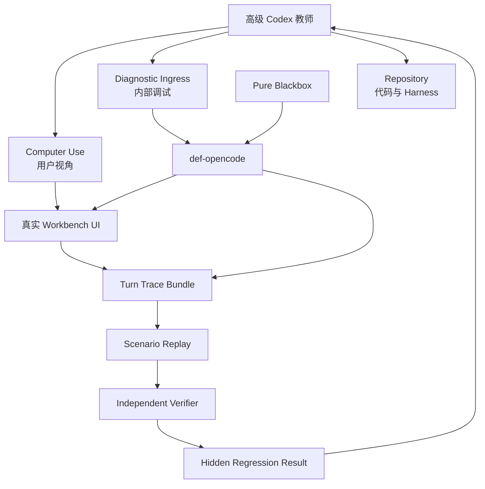

# Spec 8-1-2：Teacher Harness 与独立验证

## 状态

规格已形成；必须在 Spec 8-1-1 验收通过后再启动任务拆分与实现。

## 一句话定调

**让高级 Codex 能通过 Computer Use、显式诊断入口和完整执行证据观察、归因与重放 DEF，并由独立 verifier 和隐藏回归裁决返修是否有效。**

## 前置条件

- Pure Blackbox 已保持用户原文；
- Agent Contract、Capability Manifest、WorkbenchTurnState 与 HarnessDescriptor 已稳定；
- provider-visible tool allowlist 可准确导出；
- 现有黑盒话术矩阵已形成可复用基线。

## 目标

1. 建立与 Pure Blackbox 明确分离的 Diagnostic 通道；
2. 为每个 turn 生成完整、append-only 的 `DefTurnTraceBundle`；
3. 将 Computer Use 的真实 UI 观察与内部 session/tool/state 证据关联；
4. 建立可版本化 Scenario 与隔离 Replay；
5. 建立结构、业务、行为、UI 四层 verifier；
6. 建立 FAIL_TO_PASS、PASS_TO_PASS 与 hidden regression；
7. 使 Codex 可以诊断和提出返修，但不能自行修改裁判规则。

## 总体架构



## 第一部分：Diagnostic 通道

Pure Blackbox 与 Diagnostic 必须在协议和报告中显式区分：

| 通道 | provider-visible user text | 调试注入 | 能否作为真实能力证据 |
| --- | --- | --- | --- |
| Pure Blackbox | 用户原文 | 禁止 | 可以 |
| Diagnostic | 完整记录最终文本 | 允许、结构化 | 只能作为诊断证据 |

Diagnostic 可以用于指定工具、复现错误状态或缩短定位路径，但必须记录：

- 原始请求；
- 注入内容及原因；
- 最终 provider-visible messages；
- 发起者、testRunId、sessionId；
- 是否允许 mutation；
- 关联的目标 failure/scenario。

任何带调试注入的成功结果不得写成“普通用户短句已稳定通过”。

## 第二部分：Turn Trace Bundle

每个测试 turn 生成统一证据：

```json
{
  "schemaVersion": 1,
  "testRunId": "...",
  "turnId": "...",
  "sessionId": "...",
  "ingressMode": "pure-blackbox",
  "rawUserText": "...",
  "providerVisibleUserText": "...",
  "harnessDescriptor": {},
  "manifestRef": "...",
  "turnStateBeforeRef": "...",
  "turnStateAfterRef": "...",
  "timing": {},
  "toolTrace": [],
  "knowledgeTrace": [],
  "validation": null,
  "diffRef": null,
  "checkoutBefore": null,
  "checkoutAfter": null,
  "uiEvidence": [],
  "finalAnswer": {},
  "judgments": []
}
```

至少记录：请求、首响、首个工具、完成时间、pending command、stop/timeout/max-step/provider error、工具参数与结果、状态变化、validation/diff、approval/use 和最终回答。

原始事件 append-only；failure label、人工判断、Codex 归因和返修建议作为追加记录，不覆盖原始证据。

## 第三部分：Computer Use 观察

外部 Codex 通过 Computer Use 验证真实桌面 Workbench：

- 建立角色与排轴前置状态；
- 打开 AI 模式并确认 DEF ready；
- 输入普通用户消息；
- 观察 streaming、工具、permission、diff 与 approval UI；
- 检查草稿、应用、错误恢复和 checkout 后的真实可见状态；
- 保存关键截图/观察结果并关联 testRunId、turnId 和 UI event。

本阶段不在 DEF 内新增 Computer Use tool。Teacher Harness 只负责关联外部观察与内部证据。Chrome Extension 可作为浏览器/Windows 补充，但不能用 DOM/API 成功替代桌面可见性结论。

## 第四部分：Scenario 与 Replay

`DefTeacherScenario` 至少包含：

- 场景 id/version；
- 前置 fixture 或建立步骤；
- 单 turn 或多 turn 普通用户消息；
- ingress mode；
- 允许和禁止的业务结果；
- verifier ids；
- 是否要求 Computer Use；
- fixture、Harness、knowledge 和 model/provider 版本要求。

用户消息和验收说明必须分离保存，不能把 expected tool、安全要求或测试编号放进用户文本。

Replay 要求：

- 使用隔离 timeline、session 和 Work Node；
- 不继承生产会话隐式状态；
- 相同 fixture/Harness/schema 可重复建立；
- 允许自然语言不同，但关键意图、工具路径、业务结果与安全性质可比较；
- 环境、provider 和非确定性差异进入报告。

## 第五部分：独立 Verifier

验证分四层：

1. **结构层**：trace 完整性、tool family、参数和状态转换；
2. **业务层**：typed validation、semantic diff、revision/CAS、checkout 与污染检查；
3. **行为层**：意图满足、追问/预览/应用边界、知识与实时事实裁决；
4. **UI 层**：用户是否真实看到并能完成对应交互。

Codex/LLM 可以生成 rubric 和解释失败，但确定性业务不变量拥有最终优先级。verifier/fixture 环境错误必须与 Agent 行为失败分别标记。

## 第六部分：Hidden Regression

- FAIL_TO_PASS：证明目标弱点已经修复；
- PASS_TO_PASS：证明相邻已有能力没有退化；
- safety invariants：permission violation、绕过 approval/use、污染 current checkout 等一票否决；
- hidden cases：返修 Codex 在修改阶段不能读取完整输入和答案；
- UI cases：至少保留关键桌面可见链路，不把 API 成功当 UI 成功。

隐藏集合可以由独立 evaluator workspace/service 保管；具体实现可在 tasks 中确定，但不能与返修上下文共用同一可读取目录。

## 第七部分：教师权限

- 仅本地开发模式启用；
- bind localhost，使用临时 token/testRunId；
- release 不暴露未授权 mutation ingress；
- 默认停在 diff，不允许无人值守 use 用户真实方案；
- 教师可以改仓库，不可以改 verifier、隐藏答案、安全定义和原始 trace；
- 每次返修保留代码 diff、原因、回放结果和 rollback commit；
- 测试过程不主动关闭或重启已有 `electron:dev`，除非修改 Electron bridge 或发生明确阻塞。

## 验收标准

- [ ] Pure Blackbox 与 Diagnostic 在协议、trace 和报告中明确分离。
- [ ] 每个测试 turn 产生完整、append-only 的 Turn Trace Bundle。
- [ ] Computer Use 观察能与 session、tool trace、TurnState、validation/diff 关联到同一 testRunId。
- [ ] 至少一个单 turn 和一个多 turn scenario 可在隔离 fixture 中重放。
- [ ] 结构、业务、行为和 UI 四层 verifier 均能输出独立判断。
- [ ] 目标 FAIL_TO_PASS 与相邻 PASS_TO_PASS 可以联合运行。
- [ ] 返修 Codex 无法读取 hidden case 完整答案。
- [ ] safety invariant 失败能硬拒绝候选，即使 LLM judge 给出正面评价。
- [ ] verifier/fixture failure 与 Agent failure 分开报告。
- [ ] Teacher/Diagnostic mutation 入口在 release 或非授权环境不可用。

## 明确不做

- 不接入 YZ 知识样本；
- 不自动生成或发布 HarnessProposal；
- 不自动修改 prompt/skills；
- 不开发面向玩家的 Teacher/Harness UI；
- 不训练模型权重；
- 不提前进入 8-1-3。

## 完成定义

当高级 Codex 能以用户视角和内部证据同时观察一次 DEF turn，将其隔离重放，并由不受 Codex 控制的回归与 verifier 给出可复核结论时，8-1-2 完成。
