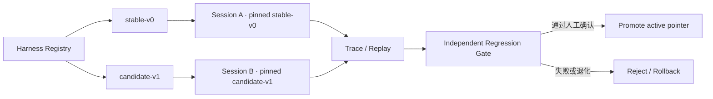

# Spec 8-1-2：可热插拔 Harness 基础建设

## 状态

已完成；Package/Registry、native session pinning、真实 Scenario/Regression 与 safety gate 均已验证。详见 [Task 8-1-2：打通可训练 Harness](./task8-1-2.md)。

## 一句话定调

**把角色卡、提示词、知识、Skills 与策略收敛为可版本化、按 Session 固定、可并行验证和快速回滚的热插拔 Harness，同时冻结 DEF 底层运行时与独立裁判。**

## 本阶段判断

DEF 当前基础能力已经可用。本阶段不追求“让 Agent 自动改造整个架构”，而是先建立一块安全、明确的可教学表面：

```text
可教学 Harness 包
  → stable / candidate 并存
  → 新 Session 选择并固定一个版本
  → 相同 Scenario 对照运行
  → Trace + Regression 判定
  → promote 或 rollback
```

这使后续蒸馏博主风格、补充游戏知识和改进 Agent 指南时，可以替换教学内容而不破坏已经可用的协议、工具和 Workbench。

## 可热插拔层

首版 `DefHarnessPackage` 只容纳：

- Agent Contract / 系统提示词；
- 角色卡，例如未来的 `yz.md`；
- 游戏知识包与项目知识包；
- Skills 及其加载条件；
- 意图路由与知识路由；
- 工具说明和工具选择指导；
- 回复、追问、预览与不确定性策略；
- 不包含可执行代码的声明式工作流。

本阶段建设这些插槽和示例包，不要求正式接入或蒸馏 YZ 内容，也不要求大规模游戏知识入库。

## 冻结层

以下内容属于 Harness Host、真实能力或独立裁判，不进入自动候选修改面：

- Electron bridge、sidecar 与 `DefCodexInteropProtocol`；
- typed tools 的实现及业务校验；
- 状态存储、数据库结构和 migration；
- permission、approval/use 与安全边界；
- evaluator、hidden cases 和 safety invariants；
- `agent/vendor/opencode` 核心代码。

冻结不代表以后永远不能人工升级，而是它们不能伪装成“热插拔训练结果”。需要代码、schema 或进程重启的变化必须进入独立开发任务。

## 核心运行模型



约束如下：

1. Harness package 发布后不可原地修改，以 id、version 和 content hash 标识；
2. Session 创建时选择版本并固定，运行中不得漂移；
3. active pointer 变化只影响之后创建的 Session；
4. stable 与 candidate 可以并行运行，且不得串用缓存、知识或配置；
5. 普通用户默认使用 stable；候选只由显式测试入口选择；
6. 显式候选测试加载失败时必须 fail closed，不能悄悄改用 stable 制造假通过；
7. 普通 stable 加载异常时保留上一份已验证 stable，并输出可观察错误；
8. promotion 与 rollback 都是显式、可审计操作，不自动发布。

## 最小训练闭环

“可热插拔”本身只是加载能力。要达到“可以开始训练”，8-1-2 还需提供最小对照闭环：

- 记录每个 turn 实际使用的 Harness id/hash；
- 用新 fixture 和新 Session replay 同一 Scenario；
- 对 stable 与 candidate 运行 FAIL_TO_PASS、PASS_TO_PASS 和 safety checks；
- 区分环境阻塞、协议失败、Agent 失败与裁判失败；
- 形成带证据的 candidate decision；
- 能把 active pointer 指回上一稳定版本。

完整的自动失败归因、Codex 自主返修、复杂 hidden evaluator 平台和 UI 驱动调测仍留给 8-1-3 及后续阶段。

## 验收标准

- [x] 可构建并校验不可变 `DefHarnessPackage`；
- [x] 至少覆盖 prompt/contract、role card、knowledge、skills、routing、tool guidance、response policy 插槽；
- [x] Registry 能同时保存 stable 和 candidate，并校验 hash 与兼容性；
- [x] 新 Session 可显式选择 Harness，且整个 Session 版本保持不变；
- [x] stable/candidate 并行 Session 不串配置；
- [x] active pointer 切换不影响已有 Session；
- [x] candidate 加载失败的测试明确失败，普通稳定路径不被破坏；
- [x] Trace 能证明本次运行使用的确切 Harness 版本；
- [x] 最小 replay/regression 能比较 stable 与 candidate；
- [x] PASS_TO_PASS 与 safety 失败能够阻止 promotion；
- [x] rollback 能恢复上一 stable，并只影响新 Session；
- [x] 一个受控候选完成 package → pin → replay → verify → promote/reject → rollback 演示。

## 明确不做

- 不训练或微调模型权重；
- 不让 Harness 热替换任意 TypeScript/JavaScript 代码；
- 不热更新 bridge、sidecar、typed tools、数据库或 verifier；
- 不自动生成、应用、提交或发布候选；
- 不正式蒸馏 YZ 或建设大规模知识库；
- 不建设云端训练平台、管理后台或分布式评测；
- 不提前实现 8-1-3 的 Codex 自动诊断返修。

## 完成定义

当维护者可以在不覆盖当前稳定 DEF 的前提下，把一组提示词、角色卡、知识、Skills 和策略打成候选 Harness，为新 Session 显式装载，通过最小对照回归作出接受或拒绝决定，并可立即把新 Session 回退到上一稳定版本时，8-1-2 完成。
