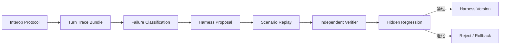

# Spec 8-1-2：Harness 迭代框架基础建设

## 状态

已进入任务阶段；详细实施与验收见 [Task 8-1-2：打通可训练 Harness](./task8-1-2.md)。

## 一句话定调

**在已打通的 Codex 联调协议之上，建立 Harness 描述、执行证据、场景回放、独立验证、失败归因、返修候选和版本回滚的最小迭代框架。**

## 前置条件

- `DefCodexInteropProtocol v1` 已稳定；
- Pure Blackbox 与 Diagnostic 已分线；
- run/session/turn/UI ids 可可靠关联；
- Codex 能读取事件、transcript 和 Workbench 状态；
- 教师入口的本地安全边界已通过验收。

## 目标

1. 定义可版本化 `DefHarnessDescriptor`；
2. 为每个 turn 生成完整 `DefTurnTraceBundle`；
3. 定义 Scenario、fixture 和 Replay；
4. 建立结构、业务、行为、UI 四层 verifier；
5. 建立 FAIL_TO_PASS、PASS_TO_PASS 与 hidden regression；
6. 建立 failure taxonomy；
7. 建立 `HarnessProposal`、`HarnessVersion` 和 rollback 基础记录；
8. 保持在线 DEF 执行与离线 Harness 迭代分离。

## 总体架构



8-1-2 建设框架并用受控样例证明每个部件工作，不要求 Codex 完成正式真实返修；真实联调留给 8-1-3。

## 第一部分：Runtime Harness 描述

`DefHarnessDescriptor` 至少包含：

```json
{
  "schemaVersion": 1,
  "codeCommit": "...",
  "agentContractVersion": "...",
  "capabilityManifestHash": "...",
  "turnStateSchemaVersion": 1,
  "skillVersions": {},
  "toolRegistryVersion": "...",
  "toolMediationVersion": "...",
  "knowledgeIndexVersion": null,
  "responsePolicyVersion": "..."
}
```

其中：

- Agent Contract 表达稳定身份和职责；
- Capability Manifest 由真实 permission/visible tools 生成；
- WorkbenchTurnState 每 turn 重算 checkout、revision、workspace 与 gate；
- skills 表达 procedure；
- tool schema/result 表达局部合同和下一动作；
- user message 始终保持用户表达。

本阶段只要求描述和追踪这些层，不要求大规模改写所有 prompt/skills。

## 第二部分：Turn Trace Bundle

```json
{
  "schemaVersion": 1,
  "testRunId": "...",
  "scenarioId": "...",
  "turnId": "...",
  "sessionId": "...",
  "ingressMode": "pure-blackbox",
  "rawUserText": "...",
  "providerVisibleUserText": "...",
  "harnessDescriptor": {},
  "turnStateBeforeRef": "...",
  "turnStateAfterRef": "...",
  "timing": {},
  "toolTrace": [],
  "validation": null,
  "diffRef": null,
  "checkoutBefore": null,
  "checkoutAfter": null,
  "uiEvidence": [],
  "finalAnswer": {},
  "judgments": []
}
```

记录请求、首响、首个工具、完成时间、pending command、stop/timeout/max-step/provider error、工具参数与结果、状态变化、approval/use 和 UI evidence。

原始事件 append-only；failure labels、Codex 归因、人工判断和返修建议只能追加，不能覆盖原始证据。

## 第三部分：Scenario 与 Fixture

`DefHarnessScenario` 至少包含：

- scenario id/version；
- fixture id/version 或建立步骤；
- 单 turn/多 turn 普通用户消息；
- ingress mode；
- 允许和禁止结果；
- verifier ids；
- 是否要求 Computer Use；
- model/provider/Harness 前置要求。

用户消息与验收说明分离保存，不允许 expected tool、安全提示或 case 编号进入 user text。

Fixture 必须隔离 timeline、session、Work Node 和 checkout；不能复用生产用户隐式状态。

## 第四部分：Replay

- 相同 fixture/Harness/schema 可重新建立；
- replay 不重复消费原生产 session；
- 模型语言允许不同，但意图、工具路径、业务结果和安全性质可比较；
- 每次运行记录 model/provider、Harness、environment 差异；
- 事件断线续读不能触发重复 turn；
- Electron/sidecar 环境失败与 Agent 行为失败分别标记。

## 第五部分：独立 Verifier

验证分为：

1. **结构层**：trace 完整性、tool family、参数与状态转换；
2. **业务层**：typed validation、semantic diff、revision/CAS、checkout；
3. **行为层**：意图满足、追问/预览/应用、安全与事实边界；
4. **UI 层**：用户是否真实看到并能完成对应交互。

LLM/Codex 可以帮助生成 rubric 和解释失败，但确定性业务不变量拥有更高优先级。

## 第六部分：Regression 结构

- FAIL_TO_PASS：证明目标弱点修复；
- PASS_TO_PASS：证明相邻能力没有退化；
- safety invariants：permission、approval/use、checkout 污染等一票否决；
- hidden cases：返修上下文不能读取完整输入和答案；
- UI cases：API 成功不能代替真实可见成功。

隐藏集合应存放在返修 Codex 不可读取的 evaluator workspace/service；具体实现进入 tasks 决定。

## 第七部分：Failure Taxonomy

首版至少包含：

| 类别 | 示例 | 责任层候选 |
| --- | --- | --- |
| protocol | session/event/state 无法关联 | interop bridge |
| self-model | 否认自己能排轴 | Agent Contract |
| intent-routing | 解释请求误进入写入 | routing/skill |
| state-staleness | checkout 变化后操作旧 node | TurnState/hard gate |
| tool-selection | 选择错误工具家族 | mediation/tool description |
| parameter-grounding | 猜 buttonId/slot | resource-first procedure |
| workflow-omission | 未 validate/diff 就称完成 | deterministic workflow |
| ui-observability | 内部成功但 UI 不可见 | bridge/frontend |
| expression | 表达掩盖不确定性 | response policy |

分类是可修订判断，必须引用 trace，不得覆盖原始事件。

## 第八部分：HarnessProposal

每个候选只处理一个可归因弱点，并记录：

- failure cluster 与代表 traces；
- 基线 HarnessDescriptor/Version；
- 修改对象和代码/Harness diff；
- 目标 FAIL_TO_PASS；
- 相邻 PASS_TO_PASS 与安全风险；
- replay/verifier/hidden regression 结果；
- reviewer、rollback target 和状态。

拒绝整体重写 system prompt、修改 verifier 提高分数、单次偶发失败直接形成长期规则。

## 第九部分：HarnessVersion 与回滚

稳定版本至少关联：

- code commit；
- HarnessDescriptor；
- scenario/verifier suite version；
- reviewer、发布时间、上一稳定版本；
- 目标改善和已知限制；
- rollback target。

本阶段可使用 Git + 本地文件/SQLite，不建设完整管理后台，不要求自动灰度。

## 验收标准

- [ ] 每个测试 turn 产生完整、append-only 的 Turn Trace Bundle。
- [ ] HarnessDescriptor 能追溯 contract、manifest、state schema、skills、tools 和代码版本。
- [ ] 至少一个单 turn 与一个多 turn scenario 可在隔离 fixture 中 replay。
- [ ] 四层 verifier 分别输出结论，环境失败与 Agent 失败分开。
- [ ] FAIL_TO_PASS、PASS_TO_PASS 和 safety invariants 可联合执行。
- [ ] 返修上下文无法读取 hidden case 完整答案。
- [ ] Failure classification 能引用代表 traces 并定位责任层。
- [ ] HarnessProposal 是单点、可解释、可回滚的结构化候选。
- [ ] HarnessVersion 可以关联代码、证据、裁判版本和上一稳定版本。
- [ ] 用受控演示候选证明 proposal → replay → verifier → accept/reject 数据流可运行。

## 明确不做

- 不要求 Codex 完成正式真实返修；
- 不接入 YZ/Knowledge Runtime；
- 不自动发布 HarnessProposal；
- 不训练模型权重；
- 不开发 Harness Evolution UI；
- 不提前进入 8-1-3。

## 完成定义

当一次 DEF 执行能够被完整版本化记录、隔离重放、独立裁决，并可以形成有证据、可回滚的 Harness 候选记录时，8-1-2 完成。
