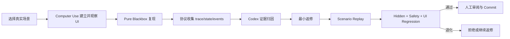

# Spec 8-1-3：Codex 协议联调与初版验证

## 状态

实施中；首个真实 failure 的诊断、最小返修与 candidate replay 已开始。第二个真实 failure（武器 resolver 把未装配状态误作配置页武器库为空）已完成 runtime/tool contract 修复并记录在 Task/verification；尚未 promotion 或完成本 Spec。详见 [Task 8-1-3：首次真实会话诊断与教学返修](./task8-1-3.md)。

## 一句话定调

**由高级 Codex 真实使用联调协议和 Harness 框架，结合 Computer Use 完成一次 DEF 失败诊断、最小返修、独立回归与提交，验证可训练基建初版成立。**

## 前置条件

- `DefCodexInteropProtocol v1` 已可稳定调用；
- Pure Blackbox 与 Diagnostic 已严格分线；
- Turn Trace Bundle、Scenario、Replay、Verifier、Regression 已可运行；
- HarnessProposal/Version/rollback 记录已建立；
- hidden cases、安全定义和原始 trace 对返修 Codex 保持只读或不可见。

## 目标

1. 形成 Codex Teacher 的标准联调 runbook；
2. 让 Codex 同时使用 Computer Use、interop protocol、trace 和仓库工具；
3. 从真实 Pure Blackbox case 选择并复现一个 DEF failure；
4. 基于证据进行责任层归因，而不是默认修改 prompt；
5. 实现一个最小、可解释、可回滚返修；
6. 通过目标、相邻、安全和 UI 回归；
7. 产出首份正式 Harness 初版验证记录；
8. 确认系统达到进入 Spec 8-2 受控训练的条件。

## 总体流程

## 第一部分：Codex Teacher Runbook

标准流程必须分为四个互不混淆的阶段：

### 1. 观察

- 检查 handshake 与当前 HarnessVersion；
- 通过 Computer Use 建立真实 Workbench 前置状态；
- 使用 Pure Blackbox 发送普通用户原文；
- 保存 UI、events、transcript、state、validation/diff；
- 在修改任何代码前冻结 baseline trace。

### 2. 诊断

- 判断失败属于 protocol、UI、self-model、state、routing、tool、workflow 或 expression；
- 必要时使用 Diagnostic 通道缩小问题，但不把其结果当真实能力证明；
- 引用代表 trace/event/state/code 证据；
- 形成单一 primary cause 和可能的 contributing causes。

### 3. 返修

- 创建一个 HarnessProposal；
- 只修改与 primary cause 对应的最小责任层；
- 保留代码/Harness diff；
- 不修改 hidden cases、verifier、安全定义和 baseline trace；
- 修改 Electron bridge 时按规则重启，已有常驻进程不因无关修改被主动重启。

### 4. 验证

- replay 原 FAIL_TO_PASS；
- 运行相邻 PASS_TO_PASS；
- 运行 permission/approval/checkout 等 safety invariants；
- 再用 Computer Use 走真实 UI；
- 人工审阅证据和代码 diff 后才 commit 新 HarnessVersion。

## 第二部分：首轮场景选择

首轮必须选择真实、可复现、影响明确的 DEF 问题，优先级：

1. Pure Blackbox 与真实 UI 行为不一致；
2. Agent Contract/self-model 或普通语言路由错误；
3. checkout/state 恢复错误；
4. 工具选择或 validate/diff 工作流遗漏；
5. 其他已经有明确 verifier 的问题。

不选择：

- 需要大规模 YZ 知识才能判断的问题；
- 只有审美偏好、没有明确成功条件的问题；
- 为演示闭环而人为制造并写死答案的问题；
- 必须同时重构多个子系统的问题。

## 第三部分：Computer Use 与协议联合证据

同一次 testRunId 至少关联：

- Computer Use 前置状态和关键截图；
- Pure Blackbox raw/provider-visible text；
- session/turn/ui event ids；
- tool trace、Workbench state、validation/diff；
- 用户可见最终回复和 UI 状态；
- baseline 与 repaired HarnessDescriptor；
- replay/verifier/regression 结果；
- repository diff 与 commit。

只有 API 成功但 UI 不可见，或 UI 看似成功但 state/validation 不成立，都不能判定通过。

## 第四部分：独立性检查

初版验证必须主动证明：

- 返修 Codex 未读取 hidden case 完整答案；
- verifier 和 safety invariants 在返修前后无未授权变化；
- Diagnostic 提示没有进入最终 Pure Blackbox replay；
- regression 由独立命令/进程运行，而不是由 Codex 自述结果；
- baseline 与 repaired 运行使用可比较 fixture；
- 人工 reviewer 能从 evidence bundle 复核通过原因。

## 第五部分：验证报告

产出一份首版验证记录，至少包括：

- scenario/failure 标题；
- baseline 环境、HarnessVersion 和复现步骤；
- UI/trace/state 证据；
- failure classification 与根因；
- HarnessProposal 和代码 diff 摘要；
- FAIL_TO_PASS、PASS_TO_PASS、safety、UI 结果；
- 退化、限制和未覆盖范围；
- reviewer 结论；
- 新 HarnessVersion、commit 和 rollback target；
- 是否允许进入 Spec 8-2。

## 进入 Spec 8-2 的 Gate

只有同时满足以下条件，Spec 8-1 才算完成：

- Codex 联调协议无需临时内部脚本即可工作；
- Pure Blackbox 不携带测试答案；
- trace/replay/verifier 证据完整；
- 一个真实 failure 已被最小返修并通过独立回归；
- safety invariants 无退化；
- Computer Use 证明真实 UI 闭环；
- 新版本可追溯、可回滚；
- 已知限制被明确记录，而不是以“初版”掩盖。

## 验收标准

- [ ] Codex 按标准 runbook 完成观察、诊断、返修、验证四阶段。
- [ ] baseline failure 来自 Pure Blackbox 与真实 UI，不依赖 Diagnostic 提示。
- [ ] 根因引用 protocol/trace/state/code 证据，并定位到单一主要责任层。
- [ ] HarnessProposal 是最小、可解释、可回滚修改。
- [ ] 原 FAIL_TO_PASS 通过，相关 PASS_TO_PASS 与 safety invariants 无退化。
- [ ] Computer Use 复验与内部 state/validation 结论一致。
- [ ] hidden cases、verifier、安全定义和 baseline trace 未被返修流程修改。
- [ ] 人工 reviewer 可以复核证据并批准或拒绝。
- [ ] 新 HarnessVersion 已提交并包含 rollback target。
- [ ] 完成首版验证报告，明确是否允许进入 Spec 8-2。

## 明确不做

- 不接入或训练 YZ/Knowledge Runtime；
- 不自动生成下一轮返修任务；
- 不自动发布 HarnessProposal；
- 不在线训练模型权重；
- 不建设 Harness Evolution 产品 UI；
- 不用一次成功宣称持续自进化已经完成；
- 不提前实现 Spec 8-2 的知识、skills 和风格蒸馏。

## 完成定义

当高级 Codex 能稳定使用正式协议和 Harness 框架，在真实 UI 上修复一个实际 DEF failure，并由独立回归、人工审阅和可回滚提交共同证明结果时，8-1-3 完成，Spec 8-1 的可训练基建初版成立。
