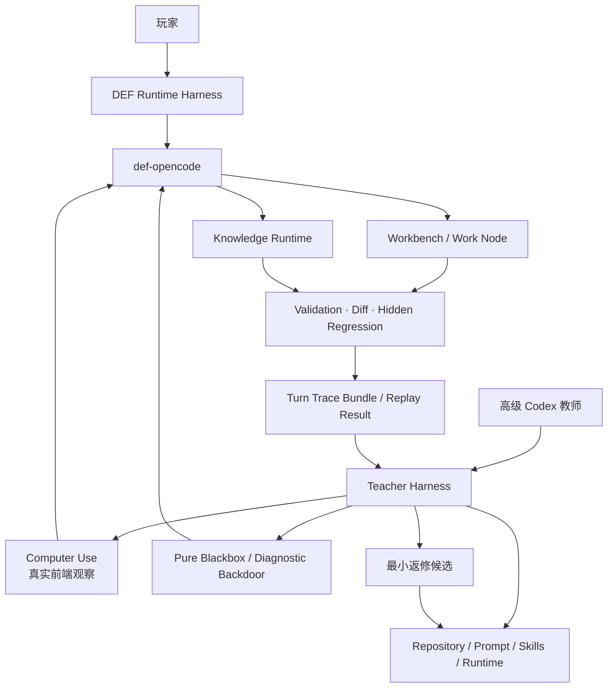

# Spec 8-1：DEF 可训练基建

## 状态

规格已形成，等待后续任务拆分与实现；本文件不提前编写 `tasks.md`。

## 一句话定调

**铺好 DEF Runtime Harness、Codex Teacher Harness、知识入口、轨迹观测、场景回放与独立验证基础，使 `def-opencode` 第一次具备开始训练、安全返修和证明改进有效的条件。**

## 背景

Spec 7 已完成原生 OpenCode loop、三类 DEF tools、节点代码工作区、Work Node、validation/diff、CAS、permission、host/session 隔离与本地产品化。现有系统已经能够执行领域任务，但其能力改进仍主要依靠人工观察、临时 prompt 调整和零散黑盒记录：

1. `def-opencode` 的身份、能力、动态 Workbench 状态和技能说明尚未形成统一、版本化的 Runtime Harness；
2. 现有 `/def-agent/workbench-test/prompt` 后门仍存在，但会把工具与写入流程提示拼进 provider-visible user message，无法证明普通用户原话下的真实能力；
3. session、tool trace、Workbench snapshot、UI event、validation/diff 和最终用户修正尚未汇成可归因、可重放的训练证据；
4. Codex 可以读取代码和返修项目，Computer Use 可以观察真实前端，但二者还没有围绕 DEF 形成稳定的教师调测协议；
5. YZ 与游戏知识仍是 Markdown 资料集合，尚无适合后续蒸馏、核验和版本治理的最小运行时入口；
6. 当前回归主要证明单次功能是否成功，尚不能稳定回答某项 Harness 修改改善了什么、退化了什么、是否应该发布。

Spec 8-1 不以“让 DEF 一次变得很聪明”为目标，而是让系统具备可训练性：每次成功或失败都能被观察、归因、重放、验证并转化为有界返修输入。

## 总体目标

1. 建立 `def-opencode` 的版本化 Runtime Harness，分离稳定身份、真实能力、动态现场、skills、知识和表达层。
2. 建立 Codex Teacher Harness，使高级 Codex 能结合 Computer Use、调试入口、trace 与仓库代码诊断和返修 DEF。
3. 将现有黑盒后门拆为纯黑盒与显式诊断两种模式，纯黑盒必须保持用户原文。
4. 为每个 turn 生成完整、可关联、可导出的训练证据，而不是只保存聊天文本。
5. 建立可重放场景、隐藏回归和独立 verifier，使修改者不能自行宣布修改成功。
6. 建立最小 Knowledge Runtime 入口和 provenance schema，为 Spec 8-2 的 YZ/游戏知识蒸馏准备稳定接口。
7. 建立 Harness 版本、候选修复、灰度与回滚所需的基础数据，但不在本阶段自动修改或自动发布 Harness。

## 核心原则

### 1. Worker、Teacher、Verifier 分离

```text
def-opencode
  = 工作 Agent / 被训练对象

Codex + Computer Use + Debug Backdoor
  = 教师 Agent / 诊断与返修执行者

validation + replay + hidden regression
  = 独立裁判
```

Codex 可以提出和实现修改，但不能修改成功定义、隐藏回归内容或安全规则；`def-opencode` 的自我评价不能成为发布依据。

### 2. Runtime Harness 不等于巨型 prompt

Runtime Harness 是可版本化组合：

```text
Agent Contract
+ Capability Manifest
+ WorkbenchTurnState
+ Skill Bundle
+ Tool Mediation Policy
+ Knowledge Policy / Index Version
+ Response Policy
```

稳定规则、动态事实、程序知识、事实资源与工具副作用必须分层，不能继续通过重复 prompt 互相补丁。

### 3. 在线执行与离线进化分离

在线 `def-opencode` 只执行用户任务并产生 trace；失败聚类、候选生成、代码返修和回放验证属于离线 Teacher Harness。任何训练过程不得偷偷改变当前用户 turn 的规则或知识版本。

### 4. 可验证结果优先于语言评价

训练信号优先级固定为：typed validation、semantic diff、revision/checkout 结果、用户最终应用与修改、UI 可见结果、用户文字反馈、Agent 自我评价。低可信信号不能覆盖高可信信号。

### 5. 先铺闭环，再扩大语料

Spec 8-1 只允许使用少量受审阅的 YZ/游戏知识样本证明 source → claim → query → evidence → Workbench 草稿闭环；批量迁移、完整角色卡和主播语言蒸馏属于 Spec 8-2。

## 总体架构



本阶段不新增第四类 DEF 工具。知识查询归入 `def-data-resource`；节点修改继续只经过 `def-node-code` 和 `def-node-crud`。

## 第一部分：DEF Runtime Harness

### 1.1 Agent Contract

建立短小、稳定、版本化的 `DefAgentContract`，只描述：

- Agent id、host 与任务使命；
- 三类工具边界；
- 能否查询知识、建立草稿、校验、申请应用；
- 不可直接覆盖 checkout、不可绕过 approval 等稳定事实；
- 回复语言和事实/建议/草稿/已应用状态的基本表达要求。

Agent Contract 不得包含当前队伍、checkout、工具参数教程、完整 skill 流程或 YZ 正文。其内容变化必须产生新版本/hash，并进入每次 turn trace。

### 1.2 Capability Manifest

`DefCapabilityManifest` 必须由真实 host profile、permission 和 provider-visible tool allowlist 生成，不能由 prompt 手写推测。至少包含：

```json
{
  "schemaVersion": 1,
  "host": "workbench",
  "agent": "def-workbench",
  "allowedFamilies": ["def-node-code", "def-node-crud", "def-data-resource"],
  "allowedTools": [],
  "deniedCapabilities": [],
  "knowledgeIndexVersion": "...",
  "generatedAt": "..."
}
```

Workbench 与 AI CLI 必须分别导出自己的 manifest；trace 中记录的 visible tools 必须与 provider 实际可见工具一致。

### 1.3 WorkbenchTurnState

建立每 turn 重新计算的 `WorkbenchTurnState`，统一表达：

- selected operators；
- axis/timeline id；
- current checkout node/revision；
- bound workspace node/revision/phase；
- pending draft/approval；
- strategy/knowledge context；
- checkout-changed 等 hard gate 与唯一 next action；
- updatedAt、schemaVersion 和事实来源。

动态状态通过独立 system/context source 注入，不伪装成 user message，不重复完整操作教程。checkout、revision 和 gate 仍由工具代码强制。

### 1.4 Skills 职责收敛

本阶段保留两个主要 skills：

- `timeline-workbench`：当前轴读取、草稿、validate/diff、approval/use 与恢复；
- `game-knowledge`：术语归一化、知识查询、来源/冲突处理以及何时交接 timeline。

Agent Contract、skills、tool schema/result 和 WorkbenchTurnState 必须各有单一职责。现有重复硬约束需要在实现时收敛，不能继续靠三份近似提示维持行为。

### 1.5 最小 Knowledge Runtime

在 `def-data-resource` 下建立只读知识入口，不新增顶层工具家族：

- `def_knowledge_search`；
- `def_knowledge_get`；
- `def_knowledge_evidence`；
- `def_knowledge_status`。

本阶段只要求：

- source/claim/card/rotation 的最小 schema；
- source span、日期、游戏版本、review/conflict 状态；
- index version；
- 结构化过滤与有界返回；
- 至少一组受审阅小样本可以完成查询、证据定位和 Workbench 草稿交接。

不要求批量解析全部 `YZ.md`、向量数据库、完整 GraphRAG 或大规模角色卡 UI。

## 第二部分：Codex Teacher Harness

### 2.1 两条调测通道

现有 Workbench 后门必须拆清语义：

| 通道 | 用途 | provider-visible user text | 是否允许调试注入 |
| --- | --- | --- | --- |
| Pure Blackbox | 证明真实用户语言下的产品能力 | 与 `rawUserText` 完全一致 | 否 |
| Diagnostic | 定位特定工具、状态或流程问题 | 明确记录最终文本 | 允许，但必须结构化标记 |

Pure Blackbox 可以沿用现有 `/def-agent/workbench-test/prompt` 路由，但必须移除 `buildWorkbenchTestPrompt` 对用户消息追加的工具/流程教程；host、agent、state 和 manifest 通过独立字段传递。

Diagnostic 不能伪装成普通用户验收结果。所有记录和报告必须标注 ingress mode。

### 2.2 Computer Use 前端观察

Teacher Harness 必须支持外部 Codex 通过 Computer Use 检查真实桌面 Workbench：

- 选择角色并进入主界面；
- 打开 AI 模式并确认 DEF ready；
- 输入普通用户文本；
- 观察 streaming、tool/permission/diff UI；
- 确认草稿、审批、应用和错误恢复对用户可见；
- 保存关键截图或 UI 观察结果并关联 test run/turn。

Spec 8-1 不在 DEF 内部实现新的 Computer Use tool。Computer Use 属于高级 Codex 的外部观察能力；Teacher Harness 负责提供稳定 UI、test id 与内部 trace 关联。

Chrome Extension 路线可以继续作为 Windows/浏览器测试补充，但不能用 DOM/API 成功代替桌面用户可见结论。

### 2.3 教师诊断能力

一次 Teacher run 必须能够同时获得：

- UI 结果；
- raw/provider-visible messages；
- session transcript 与 event stream；
- tool calls、参数、结果和错误；
- Capability Manifest 与 WorkbenchTurnState；
- knowledge hits/evidence；
- Work Node、validation、diff、revision 与 checkout 变化；
- 相关 Harness 版本；
- repository commit/dirty state（仅教师侧）。

高级 Codex 可据此把问题归因到 UI、bridge、self-model、routing、skill、knowledge、state、tool 或 verifier 层，并提出最小代码/Harness 返修。

### 2.4 教师权限边界

- Teacher Harness 仅在开发模式和本地受控环境启用；
- 默认 bind localhost，并要求明确的临时认证/运行 id；
- release 构建不得暴露教师 mutation ingress；
- 教师测试使用隔离 timeline、session 和 Work Node；
- 默认停在 diff，不允许无人值守 use 用户真实方案；
- 教师可以修改仓库，但不得修改隐藏回归内容、成功标准或生产证据；
- 每项返修保留代码 diff、原因、验证结果和 rollback commit。

## 第三部分：可观测训练证据

### 3.1 Turn Trace Bundle

每个黑盒 turn 生成统一、可导出的 `DefTurnTraceBundle`，至少包含：

```json
{
  "schemaVersion": 1,
  "testRunId": "...",
  "turnId": "...",
  "sessionId": "...",
  "ingressMode": "pure-blackbox",
  "rawUserText": "...",
  "providerVisibleUserText": "...",
  "harness": {
    "contractVersion": "...",
    "manifestHash": "...",
    "turnStateHash": "...",
    "skillVersions": {},
    "knowledgeIndexVersion": "..."
  },
  "timing": {},
  "toolTrace": [],
  "knowledgeTrace": [],
  "validation": null,
  "diffRef": null,
  "checkoutBefore": null,
  "checkoutAfter": null,
  "uiEvidence": [],
  "finalAnswer": {},
  "judgment": null
}
```

原始事件 append-only；failure label、人工判断和修复归因作为可追加派生记录，不覆盖原始 trace。

### 3.2 时间与状态记录

延续 `docs/testing/def-agent-blackbox.md` 的要求，每 turn 至少记录：

- 请求提交时间；
- 首个可见响应时间；
- 首个 tool call 时间；
- 完成时间；
- pending command 数量；
- current timeline 是否变化；
- approval/use 是否发生；
- stop、timeout、max-step 与 provider error。

定性成功但缺少时间、状态或工具证据的记录，不得成为完整训练样本。

### 3.3 用户最终 delta

如果用户修改了 Agent 草稿后再应用，Teacher Harness 应关联：

```text
Agent draft
→ 用户编辑 delta
→ 最终 applied node
```

Spec 8-1 只负责记录与关联，不自动将 delta 编译成 skill 或个人偏好；这属于 Spec 8-2/8-3。

## 第四部分：Scenario、Replay 与独立裁判

### 4.1 Scenario Definition

建立可版本化的 `DefTeacherScenario`，表达：

- 自然语言用户输入和多 turn 后续；
- 前置 Workbench fixture 或建立步骤；
- ingress mode；
- 允许观察的状态；
- 业务期望与禁止结果；
- 是否要求 Computer Use；
- verifier ids；
- scenario version。

场景中的 user messages 必须与真实用户语言分离保存，不能混入 expected tool、验收说明或安全提示。

### 4.2 Replay

Teacher Harness 必须支持在隔离环境中重放同一 scenario，并产生可比较结果：

- 相同 fixture/schema/knowledge/Harness 版本可复现；
- 非确定性模型输出允许文字不同，但关键意图、工具路径、业务结果与安全性质可比较；
- replay 不复用生产 session 的隐式状态；
- 每次结果记录 model/provider/Harness/version 与环境差异。

### 4.3 验证层级

验证按四层汇总，不以单一 LLM judge 代替：

1. **结构验证**：trace 字段、tool family、参数、状态转换；
2. **业务验证**：typed validation、semantic diff、revision/CAS、checkout；
3. **行为验证**：意图是否满足、是否误写入、是否正确追问/预览/应用；
4. **UI 验证**：用户是否能看到并完成对应交互。

LLM/Codex 可以帮助生成 rubric 和解释失败，但业务不变量由确定性代码判定。

### 4.4 Hidden Regression

- 至少维护目标 case 与相邻回归 case 两类集合；
- 候选修复 Agent 不得在返修上下文中获得隐藏 case 的完整输入和答案；
- FAIL_TO_PASS 证明目标问题修复；
- PASS_TO_PASS 证明原有查询、草稿、审批、安全和状态恢复没有退化；
- permission violation、绕过 approval、污染 current checkout 等安全失败为硬拒绝；
- verifier 或 fixture 自身异常必须与 Agent failure 分开标记。

## 第五部分：失败归因与返修基础

### 5.1 Failure Taxonomy

本阶段建立稳定的首版分类：

| 类别 | 示例 | 责任层候选 |
| --- | --- | --- |
| self-model | 否认自己能排轴 | Agent Contract |
| intent-routing | 解释请求误进写入 | routing/skill |
| knowledge-recall | 不识别玩家别名 | terminology/search |
| evidence | 将旧视频阈值当实时事实 | knowledge policy |
| state-staleness | checkout 变化后继续旧 node | TurnState/hard gate |
| tool-selection | 选择错误工具家族 | mediation/tool description |
| parameter-grounding | 猜 buttonId/slot | resource-first procedure |
| workflow-omission | 未 validate/diff 就称完成 | deterministic workflow |
| ui-observability | 内部成功但前端不可见 | bridge/frontend |
| expression | 风格掩盖不确定性 | response policy |

失败分类是人工可修订的派生结论，不是原始事实。

### 5.2 最小返修候选

建立 `HarnessProposal` 基础记录，但 Spec 8-1 不自动发布：

- 关联 failure cluster 和代表 traces；
- 只修改一个可归因责任层；
- 保存修改前后 diff；
- 声明目标 case、相邻风险和 rollback target；
- 附 replay、hidden regression 和 UI 结果；
- 经过人工批准后才允许成为新 HarnessVersion。

拒绝无法归因的“整体重写 system prompt”和单次偶发失败触发的长期规则。

### 5.3 Harness Version

每次稳定发布至少能追溯：

- code commit；
- Agent Contract version；
- skill bundle version；
- tool mediation/allowlist version；
- state serializer version；
- knowledge index version；
- scenario/verifier suite version；
- release time、reviewer 和上一稳定版本。

本阶段可以用本地文件/SQLite/Git 组合实现，不要求建设完整管理后台。

## 第六部分：在线与教师工作流

### 6.1 普通用户 turn

```text
用户原文
→ 生成 Manifest / TurnState
→ Runtime Harness 路由
→ 按需查询知识或当前事实
→ 必要时创建 Work Node 草稿
→ validation / diff / approval
→ 玩家可读回复
→ 追加 Turn Trace Bundle
```

### 6.2 Codex 教师返修

```text
选择 scenario
→ Computer Use 建立/确认真实 UI 状态
→ Pure Blackbox 发送普通用户原文
→ 汇总 UI + trace + state + validation/diff
→ Codex 定位责任层
→ 形成并实现最小返修
→ 重放目标 case
→ 运行隐藏与相邻回归
→ 人工审阅
→ 提交新 HarnessVersion 或回滚
```

Teacher run 必须明确区分“观察”“诊断”“修改”“验证”四种阶段，避免边测边改导致证据失真。

## 第七部分：安全与隐私

以下属于不可学习、不可由 Harness Proposal 自治修改的内核：

- permission 与 host/session isolation；
- provider-visible tool allowlist 的代码事实；
- approval/use 与真实副作用边界；
- checkout、revision、CAS 和 rebind 语义；
- validation 对业务正确性的定义；
- official resource 的事实优先级；
- provenance/evidence 必填规则；
- hidden regression 和成功判定；
- 用户数据 scope、删除与导出规则。

生产 trace 默认本地保存；任何未来跨用户汇总或上传必须在后续阶段单独定义授权、脱敏和保留周期，Spec 8-1 不默认开启。

## 验收标准

### A. Runtime Harness

- [ ] Workbench turn 能导出真实 Agent Contract、Capability Manifest 和 WorkbenchTurnState 版本/hash。
- [ ] provider-visible tool allowlist 与 manifest 一致，Workbench/AI CLI 继续隔离。
- [ ] checkout 变化、revision 与 rebind gate 由动态状态表达且由工具硬拒绝兜底。
- [ ] Agent Contract、skills、tool schema 和动态状态的职责不再重复承载同一套完整教程。
- [ ] 最小 Knowledge Runtime 可对受审阅样本完成 search/get/evidence/status，并返回 index version 与来源。

### B. Pure Blackbox 与 Diagnostic

- [ ] Pure Blackbox 的 `rawUserText` 与 `providerVisibleUserText` 完全一致。
- [ ] host、agent、manifest、turn state 通过独立字段/source 传递，不拼进 user text。
- [ ] Diagnostic 调试注入在 trace 中清晰可见，不能被报告为纯黑盒成功。
- [ ] 后门仍能驱动真实 MainWorkbenchAiPanel 可见链路。

### C. Teacher Harness

- [ ] 高级 Codex 能关联一次测试的 Computer Use 观察、session、tool trace、snapshot、validation/diff 和代码版本。
- [ ] 能对至少一个失败 case 给出有证据的责任层归因，而非只改 prompt。
- [ ] 能完成一次最小返修 → 重放 → 回归 → 人工审阅 → commit 的闭环记录。
- [ ] Teacher ingress 仅在本地开发模式启用，release/生产不能暴露未授权 mutation。

### D. Trace 与 Replay

- [ ] 每个 turn 产生完整 `DefTurnTraceBundle`，包含版本、时间、工具、状态、结果和 UI evidence 引用。
- [ ] 同一 scenario 能在隔离 fixture 上重放，结果可按业务性质比较。
- [ ] 原始 trace append-only，人工 judgment/failure label 不覆盖证据。
- [ ] Agent draft、用户编辑 delta 与最终 applied node 可以关联。

### E. 独立验证

- [ ] 目标 FAIL_TO_PASS case 和相邻 PASS_TO_PASS case 分离。
- [ ] 返修 Codex 无法在修改阶段读取隐藏 case 的完整答案。
- [ ] permission、approval、checkout 污染等安全失败能硬拒绝候选。
- [ ] verifier/fixture 环境失败与 Agent 行为失败分开报告。
- [ ] 黑盒验收遵循 `docs/testing/def-agent-blackbox.md` 的普通用户话术和完整时序记录。

## 明确不做

- 不在 Spec 8-1 自动修改或自动发布生产 prompt/skills；
- 不让 `def-opencode` 或 Codex 修改 verifier、隐藏回归或安全规则；
- 不做在线模型权重训练；
- 不批量迁移全部 YZ 内容；
- 不完成主播角色模仿或完整 Voice Profile 训练；
- 不先建设面向玩家的角色卡/打法卡大 UI；
- 不引入多 Agent swarm 或第四类 DEF tool；
- 不以 LLM judge 的主观评分代替 validation/diff；
- 不建设完整 Harness Evolution 管理后台；
- 不从单次用户会话自动形成全局知识或偏好。

## 与后续阶段的交接

Spec 8-1 完成时，系统应已经能够稳定地产生“可用于训练的证据”和“可验证的返修结果”，但尚未开始规模化训练。

- Spec 8-2 在此基础上消费 YZ/游戏知识、真实轨迹和用户修正，训练/蒸馏 knowledge、skills、routing 与玩家表达；
- Spec 8-3 再将已经被证明有效的持续进化、个人适应、版本治理和回滚能力转化为正式产品体验。

Spec 8-1 的最终完成定义是：

> **任意一次 DEF 成功或失败都可以被真实观察、准确归因、隔离重放、安全返修，并由独立证据证明返修没有破坏已有能力。**
