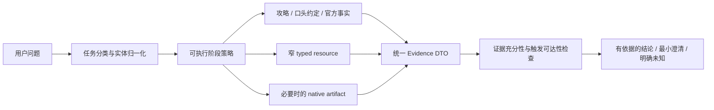

# Spec 9 预研究：DEF OpenCode 证据运行时与任务编排

## 研究状态

预研究完成，形成于 2026-07-21 的五轮 DEF 主界面 AI 模式黑盒回归与代码审计。本目录作为下一轮 DEF OpenCode 工作的入口；本轮只固化事实、根因、架构约束与待决策问题，**不提前编写 Spec、Task、验收拆分或 Harness promotion 方案**。

输入会话：

- `ses_07ab85874ffeFojcecgjSMGTDM`：汤汤无指定套装 3+1；
- `ses_07ab60539ffeVfw8Vyuo9PPxo1`：别礼指定潮涌 3+1；
- `ses_07ab32981ffe6DDJZMvyY4WFS6`：装备目录对比；
- `ses_07ab21446ffewsdDFQ32NIYfSB`：汤汤定位与专武；
- `ses_07ab03a6effesfIqDqqq33z87B`：赛希条件触发与武器选择。

## 一、结论

这批问题不能概括为“模型不够聪明”或“再补几句提示词”。系统已经拥有多项正确的底层能力，但目前缺少一个把**用户任务、权威事实、工具能力、证据充分性和回答边界**连接起来的可执行运行时。

下一轮应围绕两件事升级：

1. **证据运行时**：让 typed resource、知识约定和 native artifact 使用一致、可读、可追溯的事实合同；
2. **任务编排器**：把攻略优先、角色分析、属性筛选、3+1 组合、条件触发验证等高价值任务写成可执行阶段，而不是只写在 prompt 或 Skill 里期待模型自觉遵守。

目标结构如下：



这不是把所有只读请求强制送进 native artifact。精确名称、单个技能、单件装备等简单事实仍应优先走窄 typed tool；只有穷举、跨实体比较、完整字段核对和 3+1 组合等任务才升级到 artifact 或专用组合能力。

## 二、五轮回归告诉了我们什么

| 会话 | 观察结果 | 已证实问题 | 需要保留的能力 |
| --- | --- | --- | --- |
| 汤汤无指定套装 3+1 | 14 次工具、3 次错误，约 90 秒；先做无效探测，再并行尝试三个套装 | 一次性 planner capability 与多候选 fan-out 冲突；没有跨套装的正式 3+1 阶段机 | 属性优先与双配件组合方向正确 |
| 别礼潮涌 3+1 | 7 次工具、无错误，工具链基本正确 | 最终把未被证据证明的“寒冷伤害属于法术伤害并触发潮涌”写成事实；回答漏 stable id、套装归属、排序依据、缺失与歧义 | 指定套装的 3+1 solver 能正确选择两个相同部位的配件 |
| 装备目录对比 | 8 次工具、1 次确定性错误；拆成两个精确 artifact 后成功 | producer 生成两个 data file，consumer 却硬性要求恰好一个；属于合同冲突，不是 SQLite 或竞态 | 精确套装 artifact 的事实内容可用 |
| 汤汤定位与专武 | 10 次工具、无错误，最终答案大体正确 | guide-first 只存在于提示词；技能查询词未命中时因为 resolver 宽松条件返回该角色全部 11 个技能；成功 materialize 后未消费 | 角色攻略、技能事实和武器 planner 可组成正确答案 |
| 赛希条件触发 | 27 次工具、无错误，约 108 秒；正确约定到第 15 次工具才读取 | convention-first 只存在于 Skill 文本；随后仍拉取全量 75 把武器；单行 JSONL 被 2000 字符截断，关键 `skill3` 不可读 | 条件触发约定本身正确，武器事实最终也可核验 |

这些会话共同证明：**最终答对不等于链路健康，最终答错也不一定是数据库缺数据。** 应分别评价任务路由、事实合同、工具效率、证据覆盖和终态表达。

## 三、已证实的代码根因

### 1. 高价值推理规则停留在自然语言层

`agent/runtime/def-opencode-adapter/index.cjs` 已声明 guide-first、weapon fit、attribute-first 3+1 等原则；`agent/runtime/def/skills/game-knowledge/SKILL.md` 也要求条件触发优先读取 combat conventions。

但 `agent/runtime/def-tools/opencode/def.js` 的 turn policy 只对 exact-skill-facts 建立了真正的可执行 guard。其余原则没有阶段状态、允许工具集合、完成条件或失败出口，所以模型仍可：

- 先调用多个泛化知识工具，再读取用户口头约定；
- 对三个候选套装分别消耗一次性 planner；
- materialize 后不读取 artifact；
- 已取得窄事实后继续全库搜索。

这类问题不能只靠继续加 prompt 解决。

### 2. Artifact 的逻辑合同与物理布局互相冲突

`scripts/ai-cli-rest-server.mjs` 的 equipment `domain-full-fallback` 会生成两个 data file；`agent/runtime/def-tools/opencode/def.js` 的消费端却要求 `files.length === 1`。因此相同合法请求会稳定触发合同错误。

另一个问题是 full catalog 使用“一实体一行、整行压缩”的 JSONL。原生 read 对长行截断后，即使文件包含关键字段，Agent 也实际读不到行尾内容。这里必须区分：

- 逻辑 manifest 是否允许多个实体类型或多个 shard；
- 每个实体是否有稳定地址；
- 原生工具能否完整读取单个实体；
- hash 和 revision 能否证明读取的是同一版资料。

“把完整库丢给 Agent”只有在物理表示可检索、可定位、可完整读取时才成立。

### 3. 技能解析没有 fail closed

`scripts/ai-cli-rest-server.mjs` 的 skill resolver 在没有匹配技能身份时，会因 `requestedCharacter` 条件而保留该角色的全部技能。因此“角色正确、技能词错误”不会返回明确未命中，而会伪装成一个 11 条的成功集合。

这会污染后续推理：模型可能从无关技能中挑选看似合理的证据，也无法判断别名、ASR 或 catalog 缺口究竟发生在哪里。

### 4. 工具返回事实不等于回答拥有证明

别礼潮涌会话中，工具只提供 buff 名称/类型，condition 与 description 为空；最终回答却补出了元素类型和触发关系。这说明当前 response 层没有结构化区分：

- 工具直接事实；
- 口头约定或攻略 claim；
- 根据多个事实计算得到的结论；
- 尚未验证的推测。

条件触发问题尤其需要 `triggerReachability`：必须明确“谁产生什么事件/状态、谁消费、作用对象、前置条件、是否实际可达”，不能仅凭两个名称相似就宣称联动成立。

### 5. Planner 的 capability 粒度与真实任务不匹配

当前 planner 更像“单目标调用一次”的能力，但真实请求可能需要：

- 在多个套装之间筛选；
- 对同一套装探索多个 3+1 候选；
- 比较数把武器后再给出取舍；
- 先读攻略，攻略缺失后再转技能和属性推导。

如果 capability 仍是 turn-global 的一次性预算，Agent 的合理探索会被误判成重复；如果无限开放，又会恢复 N+1 和死循环。预算必须绑定到正式 stage、target 和 input identity。

## 四、下一轮的架构约束

### 1. 不建立全局强制 artifact 路由

建议保留三级读取路径：

| 任务 | 首选路径 | 升级条件 |
| --- | --- | --- |
| 精确角色、技能、单件装备、单把武器事实 | 窄 typed resource | 身份歧义、字段不完整或需要比较 |
| 攻略、玩家口头约定、条件触发规则 | 知识 typed resource / conventions | 需要回溯完整来源或跨文档综合 |
| 穷举目录、跨实体比较、完整字段核验、3+1 组合 | 专用 typed planner 或 native artifact | 由任务阶段决定，不由关键词粗暴强制 |

artifact 是证据载体，不是“更聪明的路由”。也不应让 legacy equipment/loadout tools 成为绕过 typed contract 的旁路。

### 2. 把常见任务编译成阶段机

下一轮至少研究三类阶段机，但具体 API 留待 Spec 决定。

#### Operator / weapon fit

```text
攻略检索
  → 有可用方案：核对实时角色与武器事实
  → 无方案：读取角色技能组与主副属性
  → 提取伤害重点、触发条件和关键词
  → 收集候选武器完整被动
  → 验证 equipper/receiver/triggerReachability
  → 给出排序、取舍和未知项
```

#### 3+1 equipment

```text
攻略检索
  → 确定角色目标与属性关键词
  → 若用户指定套装，先限制套装；否则先做套装候选筛选
  → 获取完整 fixedStat/effects/slot/stable id
  → 生成合法的 3 件套 + 1 散件组合
  → 允许两个相同部位配件；不得预设必须是配件+护手+护甲
  → 比较属性覆盖、套装生效和散件补缺
  → 输出逐件证据、缺失与歧义
```

这里需要保留用户已经教给 Agent 的人工方法：先偷攻略；没有攻略再读技能组，依据角色主副属性、伤害倍率与机制形成关键词；指定套装时先在套装内筛选；高匹配配件可重复选用，再用散件补足较弱的护手或护甲。

#### Trigger analysis

```text
读取 combat conventions / 已审阅口头约定
  → 解析生产者、事件、附着/治疗/爆发等中间状态
  → 读取涉及角色、武器、装备的精确事实
  → 构建 triggerReachability 链
  → 检查作用对象和装备者身份
  → 只报告可证明链路；未证明部分明确断开
```

阶段机不是暴露模型思维链，而是让工具序列、证据来源、完成条件和失败原因可观测。

### 3. 建立统一 Evidence DTO

不同工具至少应对齐以下字段语义：

```text
entityId / entityType / displayName
sourceKind / sourceId / sourceRevision
factPath / value
claimStatus: direct | derived | convention | unresolved
conditions / appliesTo / producer / consumer
missingFields / ambiguities / catalogIssues
```

组合与排序结果还应返回：

- 候选 stable ids；
- 每件 slot、fixedStat、effects、套装归属；
- 套装计数与合法性；
- 命中哪些目标关键词；
- 排名依据和未使用候选的主要取舍；
- 无法验证的优先级或触发关系。

回答层只能消费这些字段形成确定性陈述；未被 DTO 支持的补全必须降级为推测或提出最小澄清。

### 4. 让 artifact 对原生工具友好

推荐的研究方向是“manifest + 可寻址实体文件”，而不是一条超长 JSONL：

```text
retrieval/<artifactId>/
  manifest.json
  indexes/by-name.json
  indexes/by-set.json
  entities/equipment/<stable-id>.json
  entities/weapons/<stable-id>.json
```

每个实体文件应为可读的 pretty JSON，保证一次 read 能拿到完整字段。manifest 可正式描述多实体类型、多 shard、record count、revision、hash 与 selection mode；consumer 按 manifest schema 验证，而不是硬编码一个文件。

全库 artifact 仍保持 session-local、read-only、TTL、原子物化和 revision 隔离，不开放 raw local storage、项目目录或写权限。

### 5. 将错误预算绑定到 stage + target + input

建议的预算键：

```text
turnId + stageKind + targetEntityId + canonicalInputHash + errorCode
```

- 同一根因只允许有限重试；
- target 或输入不同，不应被前一个失败全局熔断；
- nonretryable 首错后，同一操作标为 `not-attempted`，而非伪造第二次 backend failure；
- 阶段失败必须返回 structured `nextAction`，回答只能如实报告实际执行过的步骤。

## 五、应保留而不是推倒重来的能力

本次回归已经证明以下能力有效，下一轮改造不能为了统一架构把它们回退：

- exact skill 可以解析嵌套命中，例如 Q 父技能与 B hit 子路径；
- 指定套装的 3+1 solver 能理解双配件，而非固化“三个不同部位”；
- weapon planner 能完成 12/12 全量比较并表达无序取舍；
- combat conventions 中已有的条件触发规则内容正确；
- native artifact 保持 session-local、read-only，不产生 mutation 或 approval；
- 五轮只读回归均未改变 checkout、Work Node 或前端状态。

## 六、建议实施顺序

这不是 Task 拆分，只是降低返工的依赖顺序：

1. **先统一 artifact producer/consumer schema 和实体物理布局。** 否则阶段机仍会消费不可读或被拒绝的资料。
2. **再收紧 resolver 和 Evidence DTO。** 先让“命中、未命中、缺字段、触发不可证”表达可靠。
3. **再实现三类高价值阶段机。** 优先 operator-fit、3+1、trigger-analysis；预算绑定到 stage/target/input。
4. **最后调整 Harness prompt 和回复模板。** Prompt 只描述意图和表达原则，不重复承担已经可执行的 guard。
5. **完成新会话黑盒回归后再讨论 promotion。** 单次答对或模拟测试不能作为 promotion 证据。

## 七、后续 Spec 需要决定的问题

1. 3+1 应由一个跨套装 typed orchestrator 直接生成候选，还是由阶段机编排 artifact 与纯函数组合器？
2. full weapon/equipment facts 的主路径应是批量 typed DTO，还是 manifest 下的 per-entity artifact？两者是否按候选规模切换？
3. `落草汤汤` 与 catalog `落草` 的关系应进入正式 alias/ASR lexicon，还是先作为显式歧义要求用户确认？
4. combat conventions 如何返回实体 id，使触发规则能直接批量拉取精确角色、武器和装备事实？
5. `triggerReachability` 由服务端确定性计算到什么程度，哪些关系允许由 Agent 基于已审阅 convention 派生？
6. 别礼寒冷伤害是否属于法术伤害、是否能触发潮涌第二段，当前资料仍未证明；在取得权威数据前必须保持 unresolved。

## 八、下一轮成功的最低判据

后续 Spec 的验收设计至少应覆盖：

- 同一原文任务不再出现泛化知识探测、未消费 artifact 或无目标全库扫描；
- artifact manifest 与 consumer 合同一致，单个实体的完整字段可由原生 read 读取；
- 错误技能词不会返回该角色全部技能，而是结构化未命中与候选别名；
- 无指定套装和指定套装 3+1 均只调用一次正式组合阶段，并支持双配件；
- 条件触发结论包含 producer、event/state、consumer、appliesTo 和可达性证据；
- 证据不足时回答明确 unresolved、缺失字段或最小澄清，不编造元素类型、触发关系和收益优先级；
- 精确简单事实仍走窄 typed tool，没有被全局强制送入 artifact；
- 全程保持只读边界，不产生 mutation、approval、branch、commit 或 checkout 变化。

## 九、非目标

- 本研究不修改 Harness、typed tools、local storage、SQLite 或 Workbench；
- 不编写或执行下一轮实现 Task；
- 不 promotion candidate Harness；
- 不向上述失败会话重新投递；
- 不把模型隐藏思维链作为可观测或验收对象；
- 不把用户口头约定自动升级为无来源的游戏真理。口头约定应进入可审阅、可版本化、带适用条件的知识分支。
