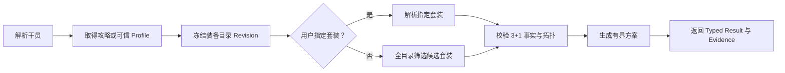

# Spec 9：DEF OpenCode 职责收口与训练返修

## 状态

规格完成，待实施 [Task 9-1](./task9-1.md)。

文档分支为 `codex/def-opencode-spec9`。
它从 `codex/merge-main-code-bloat-20260722@0a01c19` 开始迭代。

本规格建立在以下事实之上：

- [预研究](./research.md) 已记录五轮真实 DEF 会话；
- [训练架构根因审计](../../architecture/audits/def-agent-training-root-cause-20260721.md) 已定位规则重复与训练失真；
- [架构冲突总账](../../architecture/audits/def-agent-architecture-conflict-map-20260722.md) 中的第一批确定性冲突已经收口；
- `AgentReleaseV1` 已能记录一次运行实际使用的 Prompt、Harness、Skill、Tool、Knowledge、Service 与 Host 指纹。

Spec 9 不再讨论是否建设通用 Agent 工作流。它只解决一个问题：

> **每条能力、规则和失败必须有一个明确的主要负责人。**

## 一、一个问题，两处应用

### 1.1 运行时

```text
用户意图
  → Agent 判断要使用哪项能力
  → Tool 接收结构化请求
  → Service 完成确定流程
  → Tool 返回结果与证据
  → Agent 向用户解释
```

每一层只做自己的工作。

Agent 不再背诵确定的 Tool 顺序。
Tool 不再用 description 保存第二份业务流程。
Service 不再把失败恢复交给 Prompt 猜测。

### 1.2 审计与返修

```text
真实会话证据
  → 判断发生了什么
  → 找到被违反的合同
  → 选出唯一主要 owner
  → 只返修 owner
  → 删除旧重复规则
  → 验证原问题与相邻能力
```

运行时和返修使用同一张职责表。
这就是本项目的教师驱动训练工作流。

它不是模型权重训练，也不是 DEF 自动修改自己。

## 二、当前为什么会乱

现有 3+1 配装路径最能说明问题。

同一套步骤目前同时出现在：

- `agent/runtime/def-opencode-adapter/index.cjs` 的基础 Prompt；
- `agent/runtime/def/skills/timeline-workbench/SKILL.md`；
- `agent/harness/baseline/stable-v0/` 的 workflow、routing、tool guidance 与 response policy；
- `agent/runtime/def-tools/opencode/def.js` 的多个 Tool description；
- `scripts/ai-cli-rest-server.mjs` 的真实 guide、profile、catalog 与 solver 实现。

模型需要依次传递 profile、capability、artifact、revision 和 set。
任一步失败，都可能继续靠另一段教学文本补救。

结果是：

- 一条规则有多个老师；
- 文本修改很难归因；
- 新规则通常只增加，不替换；
- 确定性错误容易被误判成 Harness 问题；
- 修复后旧 Prompt、Skill 和 Harness 仍然留下。

Spec 9 的目标不是再增加一层。
目标是让旧层退出不属于自己的职责。

## 三、名词与职责

### 3.1 名词

| 名词 | 本规格中的含义 |
| --- | --- |
| Base Prompt | 创建 DEF Agent 时注入的最小系统合同 |
| Harness Package | 按 Session 固定的声明式教学内容与实验差异 |
| Runtime Skill | Agent 按任务加载的能力说明、术语和软性方法 |
| Tool | 模型可见的结构化能力合同 |
| Service | Tool 背后的确定性领域实现 |
| Host | Workbench、Session、工作区、checkout、UI 和进程生命周期 |
| Knowledge | 游戏事实、攻略、约定、别名与来源 |
| Agent Release | 一次真实运行所使用组件的可追踪指纹 |
| Teacher Audit | Codex 对真实会话进行证据化审计与返修分流 |
| Scenario / Verifier | 判断修复是否成立的独立检查，不参与生产行为 |

### 3.2 唯一职责表

| 层级 | 权威职责 | 当前主要位置 | 明确不负责 |
| --- | --- | --- | --- |
| Base Prompt | Agent 身份、默认语言、最小交互边界 | `buildAgentPrompt()` | 领域 Tool 顺序、重试、Schema、游戏事实 |
| Harness Package | 一个可验证的教学假设、回答倾向或实验差异 | `agent/harness/**` | 权限、状态机、确定流程、Tool 实现 |
| Runtime Skill | 任务识别、领域术语、何时使用高层能力、怎样解释结果 | `agent/runtime/def/skills/**` | 安全门、持久化、精确多 Tool 编排 |
| Tool | 模型可见名称、输入、输出、错误与风险范围 | `agent/runtime/def-tools/opencode/def.js`、`registry.mjs` | 保存完整业务流程、宿主生命周期、回答风格 |
| Domain Service | 阶段、顺序、分支、校验、重试、revision、结果与 postcondition | `scripts/def-core/**`；REST 文件只负责接线 | 猜用户意图、决定语气、保存第二份攻略 |
| Knowledge | 可版本化事实、攻略、约定、别名和来源 | `agent/runtime/def/skills/game-knowledge/**`、可信数据源 | Tool 顺序、权限、Session 状态 |
| Permission / Mutation | 授权、审批、CAS、幂等、提交、回滚与写后验证 | 现有 native permission、Sidecar、repository | 依靠 Agent 承诺安全 |
| Host | Session、timeline、workspace、checkout、UI consumer、进程与恢复 | adapter、Electron、Workbench、repository | 配装推荐、游戏推理、回答排名 |
| Agent Release | 记录真实组件版本与 hash | `agent-release.cjs`、Interop state | 替代组件职责或承诺完全复现 |
| Teacher Audit | 读证据、定 owner、限定返修范围、形成交接 | `.agents/skills/harness-audit-assistant/**` | 默认修改代码、替 Agent 作产品决策 |
| Scenario / Verifier | 验证 outcome、trace、quality 与安全不变量 | `agent/harness/scenarios/**`、`scripts/*contract-test*`、桌面黑盒 | 通过修改评分规则制造 PASS |

### 3.3 Harness 与 Runtime Skill 继续分开

两者不合并，但边界收紧。

Harness Package 负责一个可比较的教学假设。
Runtime Skill 负责产品中按需加载的能力说明。

两者都可以告诉 Agent“什么时候使用 3+1 推荐能力”。
但只能有一个位置保存详细识别规则。

首选 owner 是 Runtime Skill。
Harness 只在实验确实要改变识别或表达时覆盖这一点。

两者都不得保存以下内容：

- guide、profile、artifact、facts、planner 的固定调用顺序；
- capability token 的传递规则；
- catalog revision 的一致性算法；
- 套装拓扑、重复配件和排序算法；
- nonretryable 失败后的恢复状态机。

这些内容属于 Service。

## 四、什么叫“引用”，什么叫“重复”

其他层可以引用 owner 的合同。
它们不能重新实现同一条规则。

以下属于合法引用：

- Runtime Skill 写“3+1 请求使用复合推荐 Tool”；
- Tool 返回 Service 计算出的 `planDigest`；
- Agent 按 Tool 的 `missing` 字段说明证据不足；
- Scenario 断言拒绝后状态未变化；
- 文档解释一条代码不变量。

以下属于重复职责：

- Prompt 再写一遍五个 Tool 的调用顺序；
- Skill 再解释 capability 何时失效；
- Tool description 再定义套装排序算法；
- Harness 用相反措辞覆盖 Service 的失败语义；
- Host 根据回答文字猜测业务是否完成。

接口适配可以转换字段名。
但转换必须有合同测试，并且不能改写业务含义。

## 五、新规则怎样选择 owner

按下面顺序判断：

```text
它必须永远成立吗？
  → 代码、权限或状态合同

它描述确定阶段、分支或失败吗？
  → Domain Service

它是名称、事实、攻略或来源吗？
  → Knowledge

它帮助 Agent 识别任务或解释结果吗？
  → Runtime Skill

它只改变口吻或一个实验假设吗？
  → Harness Package

它只证明是否修好了吗？
  → Scenario / Verifier
```

如果一次问题跨越多层，仍要选一个主要 owner。

其他改动只能是：

- 接口适配；
- 生成物更新；
- 旧重复规则删除；
- 测试或文档更新。

不能把同一行为规则重新写进多个运行时位置。

## 六、第一个纵向收口：3+1 配装

### 6.1 当前路径

当前典型路径为：

```text
def_data_operator_build_guide
  → 必要时 def_data_operator_build_profile
  → def_data_native_catalog_materialize
  → 未指定套装时 def_data_equipment_set_fit_shortlist
  → def_data_equipment_3plus1_facts
  → def_data_equipment_3plus1_plan
```

这些 primitive 已证明有价值。
问题是模型承担了确定的编排。

### 6.2 目标能力

新增一个模型可见 Tool：

```text
def_data_equipment_3plus1_recommend
```

Agent 只提交用户目标和约束。
Service 在一次调用内完成全部确定步骤。



### 6.3 V1 输入

```ts
type DefEquipment3Plus1RecommendationInputV1 = {
  operatorQuery: string
  setQuery?: string
  constraints?: {
    requiredEquipmentQueries?: string[]
    excludedEquipmentQueries?: string[]
    compareEquipmentQueries?: Array<{
      query: string
      slot?: 'armor' | 'glove' | 'accessory1' | 'accessory2'
    }>
    duplicateAccessoryPolicy?: 'catalog-default' | 'allow' | 'forbid'
    minimumSetPieces?: 3 | 4
  }
  shortlistLimit?: 1 | 2 | 3
  priorPlanDigest?: string
}
```

约束如下：

- `setQuery` 缺失时，Service 自己完成套装筛选；
- 名称歧义由 Service 返回，不由 Agent 猜 id；
- `compareEquipmentQueries` 用于“为什么不用某件装备”这类比较，不强制选入；
- 选择类 `constraints` 只能收紧结果，不能绕过槽位、套装或 catalog 合法性；
- 纠正请求必须提交完整的新输入；
- `priorPlanDigest` 只表示新方案替代旧方案；
- Service 不得复用旧 capability、旧 artifact 或旧排序结果；
- 不支持的自由约束由 Agent 转成最小澄清，不塞进隐藏文本字段。

#### 6.3.1 输入边界与默认值

V1 不把“有界”留给实现者解释。

| 字段 | 边界 | 默认值 |
| --- | --- | --- |
| `operatorQuery` | NFKC、trim 后 1–160 字符 | 无，必填 |
| `setQuery` | NFKC、trim 后 1–160 字符 | 缺失表示由 Service 选套装 |
| `requiredEquipmentQueries` | 0–4 项；每项 1–160 字符 | `[]` |
| `excludedEquipmentQueries` | 0–8 项；每项 1–160 字符 | `[]` |
| `compareEquipmentQueries` | 0–8 项；每项含 1–160 字符 query 与可选受控 slot | `[]` |
| 三个装备查询数组合计 | 规范化去重后不超过 16 项 | — |
| `duplicateAccessoryPolicy` | `catalog-default / allow / forbid` | `catalog-default` |
| `minimumSetPieces` | `3 / 4` | `3` |
| `shortlistLimit` | `1 / 2 / 3` | `3` |
| `priorPlanDigest` | `sha256:` 加 64 位小写十六进制 | 缺失 |

字符串先做 NFKC、trim 和连续空白折叠。
required/excluded 数组内部按规范化 query 去重。
compare 按“规范化 query + slot”去重。
跨 required、excluded、compare 的相同查询继续保留，用于冲突与比较判定。

Root、constraints 和 compare item 都使用 `additionalProperties=false`。
整数必须是 JSON integer，未知字段直接返回输入错误。

V1 没有自由文本 `goal`。
Service 固定执行“干员适配的 3+1 装备推荐”。
调用现有 Guide/Profile 纯函数时，内部 canonical goal 固定为 `damage`；support/utility 角色仍由结构化职业与 reviewed conventions 分支覆盖。
更自由的优化目标必须先澄清，不能塞入隐藏 Prompt。

#### 6.3.2 装备约束语义

所有装备查询都在同一份 catalog snapshot 中解析为 stable id。

- `required`：最终每个方案必须至少包含一次该 stable id；
- `excluded`：最终方案不得在任何槽位使用该 stable id；
- `compare`：只生成比较证据，不改变候选、评分和排序；
- 同一个 resolved stable id 同时出现在 `required` 和 `excluded` 时，属于 `400` 输入错误；
- `required` 或 `excluded` 存在多个可信候选时，进入 `NEEDS_INPUT`；
- `required` 或 `excluded` 找不到可信实体时，进入 `UNRESOLVED`；
- `compare` 找不到实体时，该 comparison 为 `unresolved`，但不阻止已完整证明的方案进入 `READY`；
- `required` 无法满足槽位、套装数量或 duplicate policy 时，进入 `UNRESOLVED`，不得静默放宽；
- 重复提交同一个 required 配件只表示“至少使用一次”，不表示占两个配件槽。

compare 指定 slot 时，只与第一 READY plan 的该槽位比较。
候选不兼容该槽位时，comparison 为 `unresolved`。

compare 未指定 slot 时，按 armor、glove、accessory1、accessory2 顺序，对候选兼容的每个槽位各生成一条 comparison。
这不会要求用户再次选择槽位。

`catalog-default` 沿用当前 catalog 规则：同一 stable accessory 可占 `accessory1` 与 `accessory2`，前提是 catalog 声明两个槽位均兼容。

`allow` 不能扩大 catalog 兼容性。
`forbid` 则过滤所有重复 stable id 的方案。

### 6.4 V1 输出

领域结果保持强类型。
Evidence 只做外层信封。

```ts
type DefEvidenceState = 'READY' | 'NEEDS_INPUT' | 'UNRESOLVED'

type DefSourceRefV1 = {
  kind: 'guide' | 'catalog' | 'convention' | 'user-constraint'
  id: string
  revision?: string
  sectionId?: string
}

type DefMissingFactV1 = {
  code: string
  field: string
  message: string
}

type DefAmbiguityV1 = {
  field: string
  candidateCount: number
  truncated: boolean
  candidates: Array<{ id?: string; label: string; kind: string }>
}

type DefMinimalQuestionV1 = {
  field: string
  prompt: string
  options?: Array<{ id: string; label: string }>
}

type DefRankingBasisV1 = {
  preferenceKey: string
  preferenceLabel: string
  preferenceKind: string
  priorityIndex: number
  weight: number
  facts: Array<{
    path: string
    effectId: string
    label: string
    typeKey: string
  }>
}

type EvidenceEnvelope<T> = {
  protocolVersion: 1
  contract: 'DefEquipmentThreePlusOneRecommendationV1'
  state: DefEvidenceState
  requestDigest: string
  sourceRefs: DefSourceRefV1[]
  completeness: 'complete' | 'partial'
  missing: DefMissingFactV1[]
  ambiguities: DefAmbiguityV1[]
  result: T | null
  nextQuestion?: DefMinimalQuestionV1
  supersedesPlanDigest?: string
}

type DefEquipment3Plus1RecommendationV1 = {
  operator: { id: string; name: string }
  profileEvidence: {
    state: 'GUIDE_FOUND' | 'PARTIAL_GUIDE_FOUND' | 'GUIDE_NOT_FOUND'
    profileHash: string
    preferenceGroups: Array<{
      key: string
      label: string
      kind: 'primary-attribute' | 'secondary-attribute' | 'elemental-damage' | 'skill-damage' | 'general-damage' | 'other'
      acceptedTypeKeys: string[]
    }>
    evidenceRefs: string[]
  }
  catalogEvidence: { revision: string; exhaustive: true }
  selectedSet: {
    id: string
    name: string
    matchKeys: string[]
    rankingBasis: DefRankingBasisV1[]
  } | null
  plans: Array<{
    planId: string
    items: Array<{
      stableId: string
      name: string
      slot: 'armor' | 'glove' | 'accessory1' | 'accessory2'
      setId: string | null
      matchKeys: string[]
      rankingBasis: DefRankingBasisV1[]
    }>
    setMembershipCount: number
    missing: DefMissingFactV1[]
    ambiguities: DefAmbiguityV1[]
  }>
  comparisons: Array<{
    query: string
    candidate: { stableId: string; name: string } | null
    slot: 'armor' | 'glove' | 'accessory1' | 'accessory2' | null
    selectedStableId?: string
    decision: 'selected' | 'not-selected' | 'unresolved'
    reasons: string[]
    missing: DefMissingFactV1[]
  }>
  planDigest: string | null
}
```

`READY` 才能返回可推荐方案。

`NEEDS_INPUT` 只返回一个最小问题。

`UNRESOLVED` 表示现有可信资料无法证明结论。
Agent 不得把它改写成“应该可以”。

状态字段还有以下不变量：

- `READY`：`result` 非空，`selectedSet` 非空，`plans` 为 1–3 项，`planDigest` 非空；
- `profileHash`、`requestDigest`、`planId` 和 `planDigest` 均使用 `sha256:<64 lowercase hex>`；
- 每个 READY plan 恰好包含四个槽位，顺序固定为 armor、glove、accessory1、accessory2；
- `NEEDS_INPUT`：`result=null`，恰好一个 `nextQuestion`，不返回方案；
- `UNRESOLVED`：`result=null`，至少一个 `missing` 或 `ambiguities`，不返回伪方案；
- comparison 无法解析时，READY 可以保持成立，但 `completeness=partial`；
- `sourceRefs` 按 kind、id、revision、sectionId 稳定排序；
- `missing`、`ambiguities`、`matchKeys` 和 `rankingBasis` 使用稳定 code 或稳定排序，不依赖对象插入顺序。

comparison 以第一 READY plan 为基准：

- 候选正占用目标 slot：`selected`；
- 候选兼容目标 slot，但在同一 comparator 下落后：`not-selected`，并返回该 slot 的 `selectedStableId`；
- 候选不存在：`candidate=null`、`slot=null`、`unresolved`；
- 候选不兼容显式 slot 或证据不足：保留 candidate/slot，decision=`unresolved`；
- `reasons` 使用稳定 reason code，不能只返回自然语言结论。

#### 6.4.1 状态优先级

一次调用按下面顺序选择唯一出口：

1. Schema、认证、Session 或内部执行失败：Tool error；
2. 存在用户选择即可消除的歧义：`NEEDS_INPUT`；
3. 可信来源不足、约束不可满足或无法证明收益：`UNRESOLVED`；
4. 得到完整合法方案：`READY`。

多个字段同时歧义时，只问一个问题。
问题优先级固定为：operator、set、required、excluded。
同类字段按原始输入顺序选择第一项。

`candidates` 与 `nextQuestion.options` 最多 8 项。
完整数量写入 `candidateCount`；超过 8 项时 `truncated=true`，不得声称候选已经穷尽。

#### 6.4.2 Digest 合同

Digest 复用当前 catalog 的规范化规则：递归按 object key 排序、忽略 `undefined`、保留 array 顺序，再对 UTF-8 JSON 执行 SHA-256。
输出格式统一为 `sha256:<64 lowercase hex>`。

`requestDigest` 在输入校验后即可生成。
它的输入固定为：

- contract；
- 规范化后的 `operatorQuery` 与 `setQuery`；
- required/excluded 的规范化查询稳定排序；
- compare 查询保留用户输入顺序，并包含显式 slot 或 `null`；
- `minimumSetPieces`、`duplicateAccessoryPolicy`、`shortlistLimit`；
- 不包含 `priorPlanDigest`。

`planDigest` 只在 READY 时生成。
它覆盖 `requestDigest`、resolved operator id、Profile evidence hash、catalog revision、selected set 的 match/ranking evidence，以及按最终顺序排列的 plans、槽位、stable id、set membership、match keys 与 ranking basis。

每个 `planId` 单独覆盖 selected set id，以及固定槽位顺序下的 stable id。
它标识装备布局，不包含回答文本。

Session id 与 turn id 不进入 Digest。
相同输入和相同证据应跨新 Session 得到相同 Digest。

`priorPlanDigest` 只做格式校验和谱系标记。
它不参与评分，不授权读取旧状态，也不要求 Service 保存旧 plan。
合法值原样进入 `supersedesPlanDigest`。

#### 6.4.3 Tool error 合同

系统故障不伪装成上述业务状态。
Tool error 使用 `DefEquipmentThreePlusOneRecommendationErrorV1`：

```ts
type DefEquipment3Plus1FailureStage =
  | 'validate-input'
  | 'authorize-session'
  | 'resolve-operator'
  | 'resolve-profile'
  | 'capture-catalog'
  | 'resolve-constraints'
  | 'resolve-set'
  | 'validate-facts'
  | 'solve-plan'
  | 'build-evidence'

type DefEquipment3Plus1NextAction =
  | 'FIX_INPUT'
  | 'RETRY_FRESH_TURN'
  | 'REPORT_AND_STOP'

type DefEquipment3Plus1ErrorV1 = {
  contract: 'DefEquipmentThreePlusOneRecommendationErrorV1'
  code: string
  failureStage: DefEquipment3Plus1FailureStage
  retryable: boolean
  nextAction: DefEquipment3Plus1NextAction
  message: string
  sourceRevision?: string
}
```

输入错误映射 `400`，Session/认证错误映射 `403`，可信来源 stale 或 identity 冲突映射 `409`，未预期异常映射 `500`。
业务终态始终是成功的 typed result，不借 HTTP error 表达 `NEEDS_INPUT` 或 `UNRESOLVED`。

`retryable=true` 只表示不改变用户输入也可能在新 Turn 成功的瞬时故障。
确定性 Schema、identity、证据和约束失败必须为 false。

一旦 catalog 已捕获，后续 error 必须携带其 revision。
未执行的阶段不得出现在错误证据里。

### 6.5 Service 拥有的阶段

Service 是以下规则的唯一 owner：

1. 干员精确解析；
2. `GUIDE_FOUND / PARTIAL / NOT_FOUND` 分支；
3. Profile 生成与证据完整性校验；
4. 单次不可变 catalog snapshot 与 revision；
5. 指定套装解析或未指定套装筛选；
6. 四个物理槽位与至少三件套装归属；
7. catalog 允许时的重复配件；
8. 四件同套合法与散件严格改善条件；
9. 有界候选、排序依据、缺失与歧义；
10. correction 的全量重算与旧 plan 失效关系；
11. 结构化终态和失败出口。

所有阶段消费同一个 catalog snapshot。
内部 helper 可以复用现有实现，但不能复制算法。

对新的 3+1 recommend 路径，REST 文件只接收请求、调用 Service、映射 HTTP 错误。
它不继续保存第二份 3+1 规则。
本纵切不要求同时抽空 REST 中所有无关旧 Tool，但迁移后的 3+1 函数不得留下副本。

#### 6.5.1 内部信任边界

旧链路的 fallback token、planner profile capability 和 artifact id，解决的是“模型在多个 Tool 之间搬运对象时可能篡改或串线”。

复合 Service 内部没有这条不可信边界。
因此它采用下面的规则：

- 不调用模型可见 Tool export；
- 不在内部铸造或传递 fallback token、planner profile capability、artifact id；
- Guide、Profile 和 catalog snapshot 以单次调用内的冻结对象传给下一阶段；
- Profile evidence hash 与 catalog revision 进入最终 Digest；
- Session/turn identity 只用于入口认证、隔离和审计；
- correction 是一次全新的调用，重新读取 Guide、Profile 和 catalog；
- `priorPlanDigest` 不恢复旧 capability、artifact、候选或排序。

旧原子 Tool 若因独立消费者暂时保留，仍维持原有 token/capability 防篡改合同。
不得为了复合 Service 而削弱旧入口。

#### 6.5.2 模块与依赖方向

实现固定为两个领域模块和一个无业务语义的共享工具：

| 模块 | 唯一职责 |
| --- | --- |
| `scripts/def-core/stable-json.mjs` | object key 排序、undefined 省略、稳定 JSON 与 SHA-256；供 equipment、weapon 和 Profile 共同复用 |
| `scripts/def-core/equipment-3plus1-domain.mjs` | catalog 投影、规范化、stable id 解析、套装筛选、拓扑、重复策略、约束、排名与 Digest 纯函数 |
| `scripts/def-core/equipment-3plus1-recommendation.mjs` | 阶段编排、状态选择、Evidence Envelope 与 error 语义 |

`stable-json.mjs` 固定导出：

```ts
canonicalizeDefStableValue(value)
serializeDefStableValue(value)
hashDefStableValue(value)
```

`hashDefStableValue()` 返回 64 位小写十六进制，不带 `sha256:`。
各公开合同在边界处添加前缀，保持现有 catalog revision 兼容。

现有 equipment、weapon、Profile hash 必须迁移为复用该工具。
不得在 equipment module 复制 serializer。

`operator-build-evidence.mjs` 继续拥有 Guide/Profile 的纯算法，并导出 Guide Profile 编译、convention 判定与 partial merge 所需函数。
不得在推荐模块复制 Profile 推导。

Domain module 固定导出：

```ts
buildDefEquipmentCatalogSnapshot({ library, storageKey, capturedAt })
resolveDefEquipmentGearSet({ snapshot, query, aliasIndex })
resolveDefEquipmentEntity({ snapshot, query })
buildDefEquipmentSetFitShortlist({
  snapshot,
  profile,
  constraints,
  minimumSetPieces,
  shortlistLimit
})
buildDefEquipmentThreePlusOneFacts({ snapshot, targetSetId })
buildDefEquipmentThreePlusOnePlan({
  snapshot,
  targetSetId,
  profile,
  constraints,
  shortlistLimit
})
```

`operator-build-evidence.mjs` 新增公开的：

```ts
compileGuidePlannerProfile(operatorId, guideStrategy, guideContentHash)
operatorRequiresCombatConvention(rawOperator)
mergePartialGuidePlannerProfile(profile, {
  guideState,
  guidePreferenceGroups,
  guideContextScope,
  guideContentHash
})
```

Partial merge 参数不得携带 fallback token、Session capability 或 mutable server map entry。

推荐 Service 的公开入口固定为：

```ts
createDefEquipment3Plus1RecommendationService(ports)
  .recommend({ sessionId, turnId, input })
```

`ports` 的键固定为：

```ts
{
  readOperatorCatalog(): Promise<Record<string, unknown>>,
  loadGuideReferences(): Promise<GuideReference[]>,
  readGuideSection(input: { referenceId: string; sectionId: string }): Promise<GuideSectionResult>,
  resolveCombatConventions(input: CombatConventionQuery): Promise<DefCombatConventionBundleV1>,
  readEquipmentLibrarySource(): Promise<{ library: EquipmentLibrary; storageKey: string }>,
  readGearSetAliasIndex(): Promise<Map<string, string>>
}
```

这些 Port 只能提供可信来源读取：

- operator catalog；
- allowlisted guide references；
- exact guide section；
- reviewed combat conventions；
- equipment library source；
- gear-set alias index。

Port 不返回最终方案，不决定状态，也不包含 provider message、Prompt、回答风格或模型 Tool。
Service 合同测试必须使用内存 fixture ports。
`recommend()` 本身是 async，并对每个 Port 结果做 shape 校验后才进入下一阶段。

`ai-cli-rest-server.mjs` 是这条新路径的 composition root。
对 recommend route，它只负责接入这些 ports、认证、调用和 HTTP 映射。
当前文件中的 catalog、set-fit 和 3+1 领域函数必须移动到 core 后再复用，不能保留拷贝。

#### 6.5.3 Profile 分支

| Guide 状态 | Service 行为 |
| --- | --- |
| `GUIDE_FOUND` | 读取 exact section，编译 Guide Profile；不得再调用 fallback |
| `PARTIAL_GUIDE_FOUND` | 保留 Guide 已证明的 preference groups，只用结构化 operator evidence 与必要 conventions 补缺口 |
| `GUIDE_NOT_FOUND` | 只用结构化 operator evidence；support/utility 角色需要 reviewed combat conventions |

Partial merge 必须复用 `mergePartialGuidePlannerProfile()`。
它不能用 fallback 覆盖 Guide 已证明的 group。

Fallback 结果只有在 `DefOperatorBuildProfileV1.state=PROFILE_READY` 时才能进入规划。
`INSUFFICIENT_OPERATOR_EVIDENCE` 映射为 `UNRESOLVED`。
Profile 少于两个互不重叠的 verified preference groups 时同样映射为 `UNRESOLVED`。
Guide section、operator catalog 或 convention 读取本身损坏，才是 `resolve-profile` Tool error。

#### 6.5.4 排名与 tie-break

V1 固定 `minimumMatchesPerPiece=2`，不向模型开放。

未指定套装时，set comparator 顺序固定为：

1. eligible；
2. set bonus match count；
3. covered preference count；
4. weighted score；
5. stable set id 仅用于确定输出顺序。

eligible 必须同时满足 typed three-piece effect、Profile match，以及当前 required/excluded、minimumSetPieces、duplicate policy 下至少一个合法拓扑。
不得先选一个已经被用户约束排除的套装，再以 `UNRESOLVED` 结束而忽略其他合法套装。

若前四项完全相同，stable id 不能冒充业务优势。
Service 返回 `NEEDS_INPUT`，候选为并列套装。

方案 comparator 顺序固定为：

1. qualified piece count；
2. weighted score；
3. covered preference count；
4. set membership count；
5. `slot:stableId` stable key 仅用于确定输出顺序。

若前四项完全相同，并列 `planId` 一起进入 READY shortlist。
每个并列方案写入 `top-ranking-tie` ambiguity，Envelope 为 `completeness=partial`。
stable key 只控制展示顺序，Agent 必须说明没有唯一赢家。

返回 plans 仍受 `shortlistLimit` 限制。
并列数量超过限制时，ambiguity 记录完整 candidateCount 与 `truncated=true`。

非并列的 close alternatives 也可以与第一方案一起进入 READY shortlist。

Search-space limit、output-size limit 和现有 effect type-key 评分在本 Task 中保持不变。
任何算法变化必须先修改 Spec，并在 `implementation-map.md` 记录基线差异。

### 6.6 Tool 拥有的合同

Tool 只负责：

- 模型可见名称；
- V1 输入 Schema；
- V1 输出和 error 映射；
- Session、只读 scope 和风险标记；
- 将当前 turn/session identity 交给 Service；
- 把 typed result 原样返回给 Agent。

Tool description 只说明“做什么、需要什么、返回什么”。
它不再教授内部阶段顺序。

#### 6.6.1 注册矩阵

新能力必须同时出现在下列位置：

| 层 | 固定值或改动 |
| --- | --- |
| Sidecar definition | `def.equipment.3plus1.recommend`；scope=`session-private`；riskLevel=`read`；approval=`none` |
| Access policy | 加入 `SESSION_PRIVATE_TOOLS` 与 `DATA_RESOURCE_TOOLS` |
| Native target | `def.data.resource.equipment_3plus1_recommend` → `def_data_equipment_3plus1_recommend` |
| Canonical mapping | `dataTargetFor()` 必须先匹配 recommend，再匹配宽泛的 3plus1 facts |
| Sidecar schema | `buildDefToolDefinitions()` 使用本节固定 V1 输入，不得退回空 object schema |
| Sidecar policy | authenticated registered native session；Workbench 与 AI CLI 可见 |
| Sidecar handler | 调用 Recommendation Service；只映射 typed result/error |
| OpenCode export | `def_data_equipment_3plus1_recommend`；输入映射一一对应；原样返回 typed result |
| AgentRelease | definitions/registry、OpenCode implementation 与 `scripts/def-core` 的现有指纹必须同时变化 |

权威 definition 位于 `agent/runtime/def-tools/definitions.mjs`。
Registry、native target 与模型 export 都是这份合同的适配，不得各自重新定义含义。

### 6.7 原子能力怎样处理

本任务不删除仍有真实消费者的 primitive。

但新的 3+1 Service 必须直接调用领域函数。
它不能在服务端模拟一串模型 Tool 调用。

实施时必须盘点：

- `def_data_equipment_set_fit_shortlist`；
- `def_data_equipment_3plus1_facts`；
- `def_data_equipment_3plus1_plan`。

若它们只服务旧 3+1 模型编排，应转为 internal 或停止向 Workbench 暴露。

若仍有独立消费者，必须记录：

- 调用方；
- 保留原因；
- owner；
- 退出条件。

产品运行时不得同时教授“复合 Tool 路径”和“旧原子 Tool 路径”。

### 6.8 只读边界

3+1 推荐全程只读。

它不得：

- fork、bind、use 或删除 Work Node；
- 修改 checkout；
- 创建 approval；
- 修改 operator config；
- 写入用户 SQLite；
- 把推荐结果冒充已应用结果。

后续用户明确要求应用时，继续使用现有 preview、原生审批和 postcondition。
Spec 9 不重写 mutation gateway。

## 七、删除旧规则也是交付物

复合能力上线后，必须删除对应重复教学。

### 7.1 Base Prompt

删除 3+1 的 guide、artifact、facts、planner 精确顺序。
Base Prompt 不再出现这条领域工作流。

### 7.2 Runtime Skill

保留：

- 如何识别 3+1 请求；
- 使用复合 Tool；
- 如何向用户解释 `READY / NEEDS_INPUT / UNRESOLVED`；
- 推荐不等于应用。

删除内部阶段、token 传递、revision 与 solver 规则。

### 7.3 Harness

不得原地修改已注册的 immutable package。

需要形成新的 package/version。
新版本只保留本次必要的识别或回答差异。
它不再复制 3+1 内部顺序。

Harness activation 仍需独立验证与人工决定。
本规格不授权自动 promotion。

### 7.4 Tool description

旧的长流程说明改为合同说明。
内部算法只在 Service 和测试中存在。

如果新能力上线后没有删除任何旧规则，本纵切判定失败。

## 八、训练与返修使用同一职责表

### 8.1 审计输出

`harness-audit-assistant` 的每份 `audit.md` 必须包含：

1. 观察到的事实；
2. 被违反的合同；
3. 唯一主要 owner；
4. owner 判断依据；
5. 允许修改的位置；
6. 禁止复制规则的位置；
7. 需要删除的旧重复规则；
8. 最小复现；
9. 原问题验证；
10. 相邻能力与安全验证。

不引入复杂 Finding 数据库。
这些内容继续写成可读 Markdown。

### 8.2 返修路由

| 观察结果 | 主要 owner |
| --- | --- |
| 事实缺失、来源错误、别名不完整 | Knowledge |
| Tool 不存在、Schema 或结果语义错误 | Tool |
| 固定阶段漏执行、token 失效、revision 或排序错误 | Domain Service |
| 权限、审批、CAS、幂等、写后状态错误 | Permission / Mutation |
| Session、workspace、checkout、UI consumer 串线 | Host |
| 能力完整，但 Agent 不能稳定识别任务或解释结果 | Runtime Skill |
| 只需要改变语气、篇幅或一次教学假设 | Harness Package |
| 无法说明实际使用了哪套组件 | Agent Release |
| 无法判断是否修好 | Scenario / Verifier |
| provider、runtime、端口或 fixture 不可用 | Test Environment，不得伪装成产品失败 |

### 8.3 跨层问题

跨层问题仍只选一个主要 owner。

例如：

- Tool 返回字段缺失，Agent 随后猜测：主要 owner 是 Tool；回答约束只作相邻验证；
- 精确 node id 在审批前被 `blocked-session-mismatch` 拒绝：主要 owner 是 Domain Service 的 node ownership 校验；只有证据证明 Host 传错 binding 时才改判 Host；
- Service 已返回完整结果，多个 fresh session 仍频繁选错能力：主要 owner 才可能是 Runtime Skill；
- UI 没显示审批时，按 Interop 的最后阶段定 owner：请求未创建归 Permission / Mutation，pending 已创建但 UI 未呈现才归 Host。

返修提示词必须写清主要 owner。
“Harness、Tool、Service 都检查一下”不是可执行返修范围。

## 九、验证模型

### 9.1 三类证据

| 证据 | 证明什么 |
| --- | --- |
| Contract test | Schema、阶段、错误、revision 与纯函数不变量 |
| Interop / Scenario | Agent 实际调用了什么，结果和产品状态是否一致 |
| Computer Use | 真实 UI 是否可见，审批与最终产品状态是否一致 |

测试不能修改生产行为来制造 PASS。

### 9.2 3+1 必测矩阵

- 指定套装，`GUIDE_FOUND`；
- 指定套装，`PARTIAL_GUIDE_FOUND`；
- 指定套装，`GUIDE_NOT_FOUND`；
- 未指定套装，由 Service 选择候选；
- 套装不存在；
- 套装或装备名称歧义；
- catalog 字段缺失或 identity 冲突；
- 双配件合法；
- 四件同套合法；
- 用户禁止重复配件；
- 用户纠正并携带 `priorPlanDigest`；
- 新 revision 下不复用旧 plan；
- `READY / NEEDS_INPUT / UNRESOLVED` 均可观察；
- 任何路径前后产品 state hash、checkout、pending approval 不变。

### 9.3 黑盒判据

自然语言 3+1 请求只调用一次：

```text
def_data_equipment_3plus1_recommend
```

不得再由 Agent 编排：

- guide/profile；
- native catalog materialize；
- set shortlist；
- 3+1 facts；
- 3+1 plan。

Tool 内部阶段通过 typed result 和 trace metadata 可观察。
不暴露模型隐藏思维链。

最终回答必须保留：

- stable id；
- slot；
- 套装归属；
- 匹配依据；
- 缺失与歧义；
- 未被证据证明的关系保持 unresolved。

### 9.4 相邻能力

下列路径必须保持：

- 精确装备事实仍走窄 typed resource；
- source-only 攻略仍走准确 reference + section；
- 武器适配不被 3+1 Service 接管；
- 推荐不产生 mutation 或 approval；
- 后续应用仍走 preview、审批和 postcondition；
- AgentRelease 能说明本次运行的真实组件组合。

## 十、实施完成定义

Task 9-1 完成必须同时满足：

- Spec 9 的职责表与真实文件一致；
- 3+1 有一个模型可见复合 Tool；
- 确定阶段只存在于 Service；
- Tool 输出强类型结果与 Evidence Envelope；
- 指定和未指定套装均不需要 Agent 编排原子 Tool；
- 旧 Prompt、Skill、Harness 和 Tool description 规则被删除或明确退出；
- 审计 Skill 必须给出唯一主要 owner 和返修边界；
- 合同、Scenario 和桌面黑盒证据分别记录；
- 全程只读，产品状态不变；
- AgentRelease 记录本次真实运行组合；
- Harness candidate 未经人工批准不得 promotion；
- 完成后按仓库规则自动提交，不 push。

## 十一、非目标

- 不建设通用 Task Runtime；
- 不引入 LangGraph 或工作流 DSL；
- 不把所有自然语言任务写成状态机；
- 不训练模型权重；
- 不让 DEF 自动修改或批准自己；
- 不建设通用 Finding 数据库；
- 不重写 Harness Registry；
- 不重写 Work Node、审批、CAS 或 postcondition；
- 不在本规格中迁移武器适配、攻略团队计划或 timeline authoring；
- 不处理独立 MCP Fill；
- 不自动 promotion Harness；
- 不以一次回答正确代替链路、证据和状态验证。

## 十二、后续判断

只有再完成武器适配和攻略团队计划两个同类纵切后，才讨论是否存在可复用的通用任务合同。

判断依据不是名字相似。
必须实际重复出现：

- 相同阶段生命周期；
- 相同 correction 失效传播；
- 相同失败恢复；
- 相同 Evidence 终态。

若这些机制没有重复，就继续保留清楚的领域 Service。
不增加新的通用框架。
