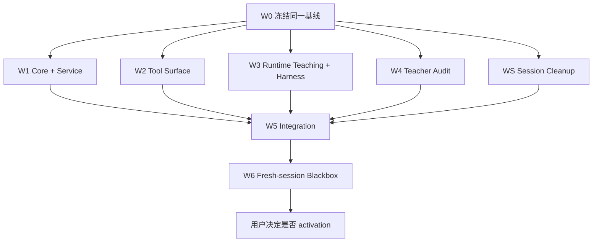

# Task 9-1：收口 3+1 职责并接通训练返修

## 状态

待实施。首轮并行分发方案已冻结，仍需执行 W0 基线门后开工。

本 Task 是 [Spec 9](./spec.md) 的唯一实施任务。
允许按检查点分批编码、验证和提交。

规格基线为 `codex/merge-main-code-bloat-20260722@0a01c19`。
它只用于说明本规格从哪里开始，不再作为编码基线。

实际开工时必须从包含下列内容的同一个干净提交建立所有工作分支：

- 本 Spec/Task 的最新已同意提交；
- 已通过验收的 `def_node` Session ownership 修复；若该修复未通过，则先包含其后续修复；
- 用户明确要求先合入的其他修复。

W0 将这个提交记为 `SOURCE_BASELINE_COMMIT`。
完成 `implementation-map.md` 后再产生唯一的 `DISPATCH_COMMIT`。
所有首轮工作包必须从该精确 `DISPATCH_COMMIT` 建分支，并在 `verification.md` 同时记录两个 SHA。
不得再直接从 `0a01c19` 各自开工。

Task 完成必须同时交付：

1. 真实职责清单；
2. 一个复合 3+1 只读 Tool；
3. Service 内部的确定阶段；
4. 显式绑定新 candidate 的 AgentRelease 中，旧 Prompt、Skill、Harness 和 Tool description 规则退出；
5. 开发侧审计 Skill 的 owner 路由；
6. 合同、Scenario 与桌面黑盒证据；
7. DEF Shell Agent 页的人工会话清理。

## 一、开工边界

### 1.1 开工前必读

- `AGENTS.md`；
- `docs/testing/def-agent-blackbox.md`；
- 本目录的 `research.md` 与 `spec.md`；
- `docs/architecture/audits/def-agent-training-root-cause-20260721.md`；
- `docs/architecture/audits/def-agent-architecture-conflict-map-20260722.md`；
- `.agents/skills/harness-audit-assistant/SKILL.md` 及其两份 reference；
- 当前 3+1 Tool、Service、Harness、Skill 和 Scenario 实现。

### 1.2 Git 与数据边界

- 从已合并的干净基线创建独立 `codex/` 分支；
- 先记录 `git status --short --branch`；
- 保护用户已有改动；
- 不读取、修改或清理用户正式 SQLite；
- 不复用历史失败 session；
- 不向旧 Harness Registry package 原地写入；
- 不修改 `agent/vendor/opencode`；
- 不 push；
- 每个完成的 coding/fix checkpoint 按 `AGENTS.md` 自动提交。

### 1.3 本 Task 不做

- 不建设通用 orchestrator、Task Runtime 或 DSL；
- 不修改 mutation gateway；
- 不扩展到武器、攻略团队或 timeline authoring；
- 不处理独立 MCP；
- 不自动 promotion Harness；
- 不建设 Session 归档、TTL、自动过期或后台清扫；
- 不用 Prompt 兼容旧 3+1 链路。

## 二、候选实现完成定义

以下条件缺一不可：

- [ ] Workbench 中的自然语言 3+1 请求只需要一次 `def_data_equipment_3plus1_recommend`；
- [ ] guide/profile/catalog/set/facts/plan 在 Service 内部完成；
- [ ] 指定套装和未指定套装均支持；
- [ ] `READY / NEEDS_INPUT / UNRESOLVED` 有稳定合同；
- [ ] 失败包含 `failureStage / retryable / nextAction`；
- [ ] correction 不复用旧 capability、artifact 或 plan；
- [ ] 3+1 全程只读，前后产品状态一致；
- [ ] 原子 3+1 Tool 的保留或退出有调用方证据；
- [ ] immutable stable package 的兼容入口在 activation 前保持可用；
- [ ] Base Prompt 不再教授 3+1 内部顺序；
- [ ] Runtime Skill 只保留识别与解释；
- [ ] 新 Harness package 不复制内部顺序；
- [ ] Tool description 不保存算法；
- [ ] 审计报告必须选择唯一主要 owner；
- [ ] 原问题、相邻只读能力和 mutation 安全边界均有验证；
- [ ] DEF Shell Agent 页可以人工清理旧 `ai-cli` Session；
- [ ] 当前 Session 与全部 Workbench Session 不受清理影响；
- [ ] `verification.md` 如实记录通过、失败、阻塞和未覆盖；
- [ ] 当前结论明确标记为“可供 activation 决策”，不冒充已经正式切换；
- [ ] 代码与文档已经自动提交，未 push。

## 三、Checkpoint A：冻结现状与职责清单

### A1. 记录当前调用链

- [ ] 用 `rg` 列出 3+1 规则在以下位置的全部副本：
  - `agent/runtime/def-opencode-adapter/index.cjs`；
  - `agent/runtime/def/skills/timeline-workbench/SKILL.md`；
  - `agent/harness/baseline/stable-v0/**`；
  - 现有 candidate/example Harness；
  - `agent/runtime/def-tools/definitions.mjs`；
  - `agent/runtime/def-tools/opencode/def.js`；
  - `agent/runtime/def-tools/registry.mjs`；
  - `agent/runtime/def-opencode-adapter/agent-release.cjs`；
  - `scripts/ai-cli-rest-server.mjs`；
  - `scripts/def-core/**`；
  - `agent/harness/scenarios/**`；
  - `docs/testing/def-agent-blackbox.md`。
- [ ] 区分运行时副本、测试断言和说明文档；测试断言不算生产 owner。
- [ ] 记录每个现有 Tool 的模型可见名称、Sidecar route、输入、输出、风险、scope 和 handler。
- [ ] 记录 3+1 当前全部模型可见调用次数与 token/capability 传递点。

### A2. 盘点真实消费者

- [ ] 搜索以下 Tool 的所有生产、测试和文档调用方：
  - `def_data_equipment_set_fit_shortlist`；
  - `def_data_equipment_3plus1_facts`；
  - `def_data_equipment_3plus1_plan`。
- [ ] 对每个调用方标记 `production / test / documentation / none`。
- [ ] immutable Harness package 按生产消费者处理，不得归为普通文档。
- [ ] 当前 `stable-v0` 仍引用旧 3+1 Tool，因此本 Task 保留其 Workbench model exposure。
- [ ] 记录保留原因、owner 与 activation 后退出条件；不得凭猜测隐藏。

### A3. 固化 owner

- [ ] 以 `spec.md` 第三节为唯一职责表；若真实结构不同，先更新规格并说明原因。
- [ ] 为 3+1 写出下面七条 owner 记录：
  - 干员与攻略/Profile：Service 调用 Knowledge；
  - catalog snapshot/revision：Service；
  - 套装解析/筛选：Service；
  - topology/duplicate policy：Service；
  - 排序、缺失、歧义：Service；
  - 模型输入/输出合同：Tool；
  - 任务识别与用户解释：Runtime Skill。
- [ ] 明确 Base Prompt、Harness 和 Host 不拥有上述算法。

### A4. 基线证据

- [ ] 保存现有合同测试结果。
- [ ] 保存 `equipment-3plus1-topology-v1` 与 `equipment-3plus1-set-selection-v1` 当前期望。
- [ ] 记录当前模型可见 3+1 Tool 链长度。
- [ ] 记录只读前后 checkout、pending approval 与 state hash。

### A5. 写出实施映射

- [ ] 新建本目录下的 `implementation-map.md`。
- [ ] 为下列现有私有函数记录 `现位置 → 新模块/导出 → 旧调用方`：
  - catalog canonicalize/hash/project/snapshot；
  - set 与 equipment stable-id resolution；
  - topology/facts；
  - set-fit shortlist；
  - 3+1 planner；
  - Guide Profile compile、convention-required 判定与 partial Profile merge。
- [ ] 明确 `discoverDefOperatorBuildGuide` 与 `deriveDefOperatorBuildProfile` 的旧 token/capability 路径只服务保留的原子 Tool。
- [ ] 明确复合 Service 直接消费冻结的可信对象，不使用模型中转 token、capability 或 artifact。
- [ ] 为每个高冲突文件指定一个实施工作包 owner。

### A 完成口径

- [ ] 任何实施者都能从清单中指出一条规则当前在哪里、迁移到哪里、旧副本怎样退出。
- [ ] 不因开始编码而丢失旧调用方或兼容边界。

## 四、Checkpoint B：建立复合 Tool 合同

### B1. Tool 注册

- [ ] 按下面的固定映射登记模型可见能力：

  ```text
  modelVisibleName: def_data_equipment_3plus1_recommend
  sidecarRoute: def.equipment.3plus1.recommend
  family: def-data-resource
  canonicalTarget: def.data.resource.equipment_3plus1_recommend
  scope: session-private
  riskLevel: read
  approval: none
  allowedHosts: workbench, ai-cli
  ```

- [ ] 在 `definitions.mjs` 增加权威 Sidecar definition。
- [ ] 在 `registry.mjs` 同时更新：
  - `SESSION_PRIVATE_TOOLS`；
  - `DATA_RESOURCE_TOOLS`；
  - `DEF_NATIVE_TARGETS`；
  - `dataTargetFor()`，且 recommend 匹配必须位于宽泛 3plus1 匹配之前。
- [ ] 在 `buildDefToolDefinitions()` 增加显式输入 Schema。
- [ ] 在 `applyDefToolInvocationPolicy()` 加入 authenticated native session 边界。
- [ ] Sidecar dispatcher 只调用 Recommendation Service 并映射 typed error。
- [ ] `registry.mjs`、OpenCode export 和 Sidecar route 必须一一对应。
- [ ] 模型 Schema 与 route Schema 做 identity 或明确 adapter mapping 合同测试。
- [ ] description 只说明能力、输入、终态和只读边界。
- [ ] description 不列内部 Tool 顺序。

### B2. 输入 Schema

- [ ] 实现 `DefEquipment3Plus1RecommendationInputV1`：
  - `operatorQuery`：NFKC/trim 后 1–160 字符，必填；
  - `setQuery`：1–160 字符，可选；
  - `requiredEquipmentQueries`：最多 4 项；
  - `excludedEquipmentQueries`：最多 8 项；
  - `compareEquipmentQueries`：最多 8 项；每项为 `{ query, slot? }`，只比较、不强制选入；
  - compare slot 只能为 armor、glove、accessory1、accessory2；
  - 每项装备 query 1–160 字符；三个数组规范化去重后合计最多 16 项；
  - `duplicateAccessoryPolicy`：`catalog-default / allow / forbid`，默认 catalog-default；
  - `minimumSetPieces`：3 或 4，默认 3；
  - `shortlistLimit`：1–3，默认 3；
  - `priorPlanDigest`：可选，格式为 `sha256:<64 lowercase hex>`。
- [ ] 字符串统一做 NFKC、trim 与连续空白折叠。
- [ ] required/excluded 按 query 去重；compare 按 query+slot 去重；跨语义数组的相同查询保留。
- [ ] root、constraints、compare item 均设 `additionalProperties=false`；整数拒绝小数与字符串数字。
- [ ] required 与 excluded 在解析成同一个 stable id 后返回 `400` 输入错误。
- [ ] required 必须出现在每个方案中；excluded 必须从全部槽位排除。
- [ ] compare 不进入候选过滤、评分或排序。
- [ ] compare 指定 slot 时只比较第一 READY plan 的该槽；未指定时为每个兼容槽生成 comparison。
- [ ] required/excluded 歧义进入 `NEEDS_INPUT`；无可信实体进入 `UNRESOLVED`。
- [ ] compare 无可信实体只产生 unresolved comparison，不单独阻塞合法方案。
- [ ] `allow` 不得扩大 catalog 槽位兼容性；`forbid` 过滤重复 stable id。
- [ ] 用户约束不得放宽 catalog、槽位或套装合法性。
- [ ] 不增加任意 JSON、隐藏 prompt 或自由表达式字段。
- [ ] 不增加自由文本 `goal`；V1 内部 canonical goal 固定为 `damage`，support/utility 仍走结构化角色分支。

### B3. 输出 Schema

- [ ] 实现 `EvidenceEnvelope<DefEquipment3Plus1RecommendationV1>`。
- [ ] 成功合同固定为 `DefEquipmentThreePlusOneRecommendationV1`，`protocolVersion=1`。
- [ ] 只允许 `READY / NEEDS_INPUT / UNRESOLVED` 三个业务状态。
- [ ] `READY` 包含 operator、profile evidence/profileHash、catalog revision、selected set、1–3 个 plans 和 `planDigest`。
- [ ] selected set 包含其 three-piece effect 的 matchKeys 与 rankingBasis。
- [ ] 每个 plan 包含稳定 `planId`，并恰好包含 armor、glove、accessory1、accessory2 四项。
- [ ] 每件装备包含 `stableId`、name、slot、set id、match keys 与 ranking basis。
- [ ] 被用户点名质疑的装备进入 `comparisons`，并返回 selected / not-selected / unresolved 与证据。
- [ ] 每条 comparison 包含原 query 与 slot；候选不存在时 candidate/slot 均为 null。
- [ ] not-selected 包含该槽当前 `selectedStableId`。
- [ ] comparison reasons 使用稳定 code，不只返回自然语言。
- [ ] `NEEDS_INPUT` 为 `result=null`，只返回一个最小问题及有界候选。
- [ ] ambiguity/nextQuestion 最多返回 8 个候选，并保留 candidateCount 与 truncated。
- [ ] `UNRESOLVED` 为 `result=null`，保留 missing、ambiguities 和 source refs，不生成伪方案。
- [ ] 多歧义时按 operator、set、required、excluded 的固定优先级提一个问题。
- [ ] comparison unresolved 时允许 READY，但 `completeness=partial`。
- [ ] 系统错误使用 Tool error，不伪装为业务终态。
- [ ] Tool error 合同固定为 `DefEquipmentThreePlusOneRecommendationErrorV1`。
- [ ] `failureStage` 与 `nextAction` 只能使用 Spec 9 枚举。
- [ ] HTTP 映射固定为 input=400、auth/session=403、stale/identity=409、unexpected=500。
- [ ] catalog 捕获后的错误必须携带 source revision。

### B4. correction 合同

- [ ] 每次推荐计算稳定 `requestDigest` 和 `planDigest`。
- [ ] Digest 使用 object key 排序、忽略 undefined、保留 array 顺序的 canonical JSON，再执行 SHA-256。
- [ ] `requestDigest` 覆盖规范化外部输入与默认值；不包含 priorPlanDigest、session/turn id、Profile 或 catalog。
- [ ] `planDigest` 只在 READY 时生成，覆盖 requestDigest、resolved ids、Profile evidence hash、catalog revision 与最终稳定 plans。
- [ ] `planId` 只覆盖 selected set id 与固定槽位顺序的 stable ids。
- [ ] correction 使用完整替换输入，而不是自然语言 patch。
- [ ] 有 `priorPlanDigest` 时返回 `supersedesPlanDigest`。
- [ ] `priorPlanDigest` 只做格式和谱系标记，不参与评分、不读取旧 plan。
- [ ] Service 总是重新读取当前可信 evidence 和 catalog revision。
- [ ] 不复用上一轮 planner capability、artifact、候选或排名。
- [ ] 新 catalog revision 下不能把旧 plan 说成当前结果。

### B 完成口径

- [ ] Tool 合同可以脱离 Prompt 独立解释。
- [ ] 输入、输出和失败均有自动合同测试。

## 五、Checkpoint C：把确定流程收进 Service

### C1. 建立领域 Service

- [ ] 新建 `scripts/def-core/stable-json.mjs`，承接当前 generic canonicalize/serialize/hash；equipment、weapon、Profile 共同复用。
- [ ] 新建 `scripts/def-core/native-catalog-value.mjs`，承接 equipment/weapon 共用的 catalog identity 规范化与安全业务值投影。
- [ ] 新建 `scripts/def-core/equipment-3plus1-domain.mjs`，承接 catalog、解析、拓扑、约束、排名与 Digest 纯函数。
- [ ] 新建 `scripts/def-core/equipment-3plus1-recommendation.mjs`，承接阶段、状态、Envelope 与 error。
- [ ] Domain exports 与 ports 的名称、参数完全按 Spec 9 第 6.5.2 节实现。
- [ ] 公开入口固定为 `createDefEquipment3Plus1RecommendationService(ports).recommend({ sessionId, turnId, input })`。
- [ ] `ports` 只允许读取 operator catalog、guide references、exact guide section、combat conventions、equipment library source 与 gear-set aliases。
- [ ] `operator-build-evidence.mjs` 继续拥有 Profile 推导，并按 Spec 导出 Guide compile、convention 判定与 partial merge；推荐模块不得复制。
- [ ] 对新的 recommend 路径，`scripts/ai-cli-rest-server.mjs` 只保留 port wiring、route、认证、调用与 HTTP error 映射。
- [ ] 本 Task 不顺带迁移无关旧 Tool；但已迁出的 3+1 领域函数不得在 REST 留副本。
- [ ] 不把现有函数复制成第二套算法；移动或复用 helper。
- [ ] Service API 显式接收 session/turn identity 和有界输入。
- [ ] Service 不接收 provider message、Prompt 或回答风格。
- [ ] Service 合同测试使用内存 fixture ports，不读取正式产品数据。

### C2. 内部阶段

- [ ] `resolve-operator`：精确 identity；歧义进入 `NEEDS_INPUT`。
- [ ] `resolve-profile`：执行 GUIDE_FOUND / PARTIAL / NOT_FOUND 分支。
- [ ] `capture-catalog`：一次性捕获不可变 equipment snapshot 与 revision。
- [ ] `resolve-constraints`：将 required/excluded/compare 解析成 stable id。
- [ ] `resolve-set`：指定套装精确解析；未指定时完整筛选候选。
- [ ] `validate-facts`：校验槽位、套装数量、重复配件与 catalog identity。
- [ ] `solve-plan`：生成有界计划、match keys、ranking basis、missing 与 ambiguities。
- [ ] `build-evidence`：生成 Evidence Envelope 与 digest。
- [ ] 每个阶段有明确输入、输出和 failure stage。

### C3. 确定性规则

- [ ] 所有阶段消费同一个 catalog revision。
- [ ] 3+1 表示四个物理槽位中至少三次目标套装归属。
- [ ] 允许 catalog policy 认可的同一配件占两个配件槽。
- [ ] 四件同套方案合法。
- [ ] 散件只有严格改善已验证 profile match 时才胜出。
- [ ] set effect fit 先于 piece coverage；不能从 `fixedStat` 推导干员主副属性。
- [ ] 不合并不同 effect type key。
- [ ] 未证明的元素、触发或伤害收益保持 unresolved。
- [ ] 固定 `minimumMatchesPerPiece=2`，不新增模型输入。
- [ ] set 与 plan comparator 使用 Spec 9 第 6.5.4 节顺序。
- [ ] 未指定套装时，只把当前 constraints 下至少有一个合法拓扑的套装标为 eligible。
- [ ] set 业务分数完全并列时返回 `NEEDS_INPUT`；stable id 只保证候选顺序。
- [ ] plan 业务分数完全并列时保留并列 plans，标记 `top-ranking-tie`，并使 completeness=partial。
- [ ] 保留现有 search-space limit 与 output-size limit；如需改变，先改 Spec 并提供基线差异。

### C4. 只读与状态

- [ ] Service 不调用 Work Node、operator config patch、approval 或 mutation route。
- [ ] Service 不写用户 SQLite、checkout 或 local storage。
- [ ] 调用前后记录 state hash、checkout、pending command 和 pending approval。
- [ ] 任一变化均使测试失败。

### C5. 原子能力收口

- [ ] 复合 Service 直接调用领域函数，不调用模型 Tool export。
- [ ] 复合 Service 内部不铸造或传递 fallback token、planner profile capability、artifact id。
- [ ] 冻结 Profile 与 catalog snapshot 只存在于当前调用内。
- [ ] Session/turn identity 只用于认证、隔离和审计，不进入排名与 Digest。
- [ ] 保留的旧原子 Tool 继续执行原有 token/capability 防篡改合同。
- [ ] 本 Task 保留旧 3+1-only native targets、OpenCode exports 与 authenticated Sidecar routes，兼容 immutable `stable-v0` 和旧 Session。
- [ ] 新 candidate 不教授、不要求也不调用这些 primitive。
- [ ] 保留的 primitive owner 为 Tool Surface；退出条件为人工 activation、旧 Session/Harness 支持策略和 active-package Tool reference gate 三项同时完成。
- [ ] 不新增 guide/profile/catalog/facts/plan 的第二组模型 Tool。

### C 完成口径

- [ ] 指定套装与未指定套装都可通过一次 Service 调用完成。
- [ ] Service 单独测试时不需要 Agent、Prompt 或 Harness。

## 六、Checkpoint D：删除运行时重复规则

### D1. Base Prompt

- [ ] 从 `buildAgentPrompt('workbench')` 删除 ATTRIBUTE-FIRST 3+1 的精确链路。
- [ ] 删除 capability、artifact、facts、planner 的传递教学。
- [ ] 不在 Base Prompt 新增复合 Tool 的长说明。
- [ ] 保留最小身份、语言和全局交互边界。

### D2. Runtime Skill

- [ ] 将 `timeline-workbench/SKILL.md` 的 3+1 大段流程替换为短规则：
  - 识别 operator-specific 3+1；
  - 调用 `def_data_equipment_3plus1_recommend`；
  - 按 typed state 解释；
  - 推荐不等于应用。
- [ ] 删除内部 token、artifact、revision、topology 和 solver 教学。
- [ ] 保留精确装备事实、source-only guide、weapon fit 等相邻能力的现有边界。

### D3. Harness

- [ ] 不修改已注册 package 内容。
- [ ] 从当前同意的 stable 内容构建新目录 `agent/harness/examples/spec9-3plus1-composite-v1/`。
- [ ] manifest 固定为：
  - `harnessId=def-equipment-3plus1-composite`；
  - `version=9.1.0-candidate.1`；
  - `sourceCommit` 写入 `implementation-map.md` 中冻结的准确 baseline commit。
- [ ] candidate 的实际构建/注册 commit 另记入 `verification.md`，不让 manifest 自引用。
- [ ] 新 package 先 build/register 为 immutable candidate，保存完整 `{ harnessId, version, contentHash }` ref。
- [ ] 一个 package 只表达“使用复合 3+1 能力”这一项变更。
- [ ] routing/workflow/tool-guidance 不再复制内部阶段。
- [ ] response policy 只规定如何表达 READY、缺失、歧义和未应用状态。
- [ ] 新 Session 只能通过完整 candidate ref 显式绑定，不能依赖目录名猜版本。
- [ ] 不自动 promotion；记录人工决策门。
- [ ] 首轮集成只形成可测试候选，不把这组运行时教学变化作为正式默认运行时落地。
- [ ] W6 只使用显式绑定 candidate 的 fresh Session；旧 Session 不参与新版本验收。

### D4. Tool description 与测试文档

- [ ] 缩短旧 3+1 primitive description，并标明只承担兼容入口；新 candidate 不引用它们。
- [ ] 更新 `docs/testing/def-agent-blackbox.md` 的 3+1 路径为一次复合 Tool 调用。
- [ ] 更新 Scenario required/forbidden tools 和 call-count 断言。
- [ ] 删除“教学句子必须存在”一类旧断言，改为合同与行为断言。

### D5. 结构检查

- [ ] 增加聚焦检查，确保 candidate 对应的 Base Prompt、Runtime Skill 与 Harness 不再出现旧 3+1 精确链路。
- [ ] 聚焦检查不得扫描历史 immutable package 后误判为当前 candidate 教学。
- [ ] 检查不能误伤 native catalog 的其他合法用途。
- [ ] 所有模型可见 `def_*` 名称继续通过 Tool reference contract。

### D 完成口径

- [ ] 新能力增加后，运行时业务教学文本实际减少。
- [ ] 显式绑定新 candidate 的 `AgentReleaseV1` 不存在复合路径与旧模型编排路径并行教学。
- [ ] 历史 stable package 原样保留，但不参与 candidate 结构断言或 W6 会话。

## 七、Checkpoint E：让审计返修使用同一 owner

### E1. 更新开发侧 Skill

- [ ] 更新 `.agents/skills/harness-audit-assistant/SKILL.md`。
- [ ] 强制审计前读取 Spec 9 的职责表。
- [ ] 默认只读边界保持不变。
- [ ] 不把开发 Skill 复制进产品 Runtime Skill。

### E2. 更新审计量表

- [ ] 为每个 Finding 增加：
  - violated contract；
  - primary owner；
  - owner evidence；
  - allowed edit locations；
  - forbidden duplicate locations；
  - duplicate rules to remove；
  - original regression；
  - adjacent/safety regression。
- [ ] `ENVIRONMENT` 继续与产品失败分开。
- [ ] 确定性 Tool/Service 错误不得路由为 Harness 补丁。
- [ ] 证据不足时 owner 标为假设，不生成肯定修法。

### E3. 更新返修交接模板

- [ ] 开工提示词只授权修改 primary owner 和必要接口适配。
- [ ] 明确禁止在 Prompt、Skill、Harness、Tool description 多处复制同一规则。
- [ ] 要求修复时删除已失去职责的旧规则。
- [ ] 要求用新 Session 验证，不向失败 Session 重复投递。

### E4. 三个路由样例

- [ ] Tool 合同承诺字段但 typed result 缺失，Agent 随后猜测：Tool Contract 为主要 owner；若合同诚实报告数据源缺失，则另判 Knowledge Finding。
- [ ] 精确 node id 在审批前 `blocked-session-mismatch`：Domain Service 的 node ownership 校验为主要 owner；Host 只作为待证接口假设，不是 Harness。
- [ ] Tool/Service 完整，多个 fresh session 仍无法识别任务：Runtime Skill owner。
- [ ] 三个样例都生成不同、受限的返修范围。

### E 完成口径

- [ ] 另一位 Codex 只读同一份证据时，可以得到相同主要 owner。
- [ ] 返修提示词不再默认要求“同时加强 Harness、Tool 和 Prompt”。

## 八、Checkpoint F：聚焦自动验证

### F1. Service 合同矩阵

- [ ] `GUIDE_FOUND` 指定套装成功。
- [ ] `GUIDE_FOUND` 不调用 fallback。
- [ ] `PARTIAL_GUIDE_FOUND` 只补缺口，不覆盖 Guide 已证明 group。
- [ ] `GUIDE_NOT_FOUND` 只使用结构化 operator evidence 与必要 reviewed conventions。
- [ ] fallback 为 `INSUFFICIENT_OPERATOR_EVIDENCE` 时返回 `UNRESOLVED`。
- [ ] Profile 少于两个互不重叠 preference groups 时返回 `UNRESOLVED`，不进入 planner。
- [ ] 未指定套装由完整 catalog 选择。
- [ ] set 业务分数完全并列时返回 `NEEDS_INPUT`，stable id 只控制候选顺序。
- [ ] plan 业务分数完全并列时返回多个 READY plans、`top-ranking-tie` 与 partial completeness。
- [ ] 并列计划超过 shortlistLimit 时保留 candidateCount/truncated，不伪称唯一最佳。
- [ ] 套装不存在且无可信候选时返回 `UNRESOLVED`；存在近似候选时返回 `NEEDS_INPUT`；catalog 损坏才返回 Tool error。
- [ ] 名称歧义返回 `NEEDS_INPUT` 和一个问题。
- [ ] 多个歧义只按固定优先级返回一个问题。
- [ ] catalog identity 冲突 fail closed。
- [ ] required item 每个方案都包含；excluded item 在所有槽位都不存在。
- [ ] 未指定套装时跳过被 constraints 排空的套装，并继续选择其他合法套装。
- [ ] required/excluded 解析为同一 stable id 时返回 400。
- [ ] required/excluded 不存在时 UNRESOLVED；compare 不存在时 comparison unresolved 且不改变排序。
- [ ] 双配件合法。
- [ ] duplicate policy=catalog-default 与当前 catalog policy 一致。
- [ ] duplicate policy=allow 不扩大槽位兼容性。
- [ ] duplicate policy=forbid 生效。
- [ ] 四件同套合法。
- [ ] 散件只有严格改善时入选。
- [ ] correction 重新计算并返回 supersedes digest。
- [ ] 相同业务输入下，priorPlanDigest 只改变 supersedesPlanDigest；requestDigest、planId、planDigest、候选与排序均不变。
- [ ] 相同输入与证据在不同 Session 得到相同 Digest。
- [ ] “为什么不用某件装备”返回有证据的 comparison，不把质疑当作强制应用。
- [ ] `{ query: "悬河供氧栓", slot: "accessory2" }` 只比较 accessory2，不丢失“配件二”语义。
- [ ] 新 revision 不复用旧 plan。
- [ ] shortlist 最多三个。
- [ ] 全部路径状态不变。

### F2. Tool/route 合同

- [ ] model export、registry、route、handler 一致。
- [ ] 未认证或未注册 native session fail closed。
- [ ] input size、枚举、required/excluded 冲突被拒绝。
- [ ] error stage 和 nextAction 不丢失。
- [ ] 新 recommend 与三个 legacy primitive 均在 Tool reference contract 中可解释；candidate 只调用 recommend。
- [ ] legacy primitive 继续要求 authenticated registered native session，且没有新增教学调用方。

### F3. 运行指纹

- [ ] Tool/Service/Skill/Harness 变化反映到 `AgentReleaseV1` 对应 hash。
- [ ] 回归 artifact 保存 runtime commit、releaseHash、Harness ref、model 与 scenario version。
- [ ] 旧 session 只作为历史证据，不作为修复后 PASS。

### F4. 建议命令

按实际改动选择，至少运行：

```text
npm run test:def-equipment-3plus1-recommendation
npm run test:def-operator-build-planning
npm run test:def-harness-guide-first
npm run test:def-harness-turn-routing
npm run harness:check
npm run interop:check
git diff --check
```

- [ ] 新建 `scripts/def-equipment-3plus1-recommendation-contract-test.mjs`，覆盖 Service、状态、约束、Digest 和只读不变量。
- [ ] 新建 `scripts/def-equipment-3plus1-tool-surface-contract-test.mjs`，覆盖 definitions、registry、native target 与 OpenCode export；W2 可独立通过。
- [ ] 新建 `scripts/def-equipment-3plus1-registration-contract-test.mjs`，在集成分支覆盖 authenticated policy、Sidecar schema、dispatcher 与 Service wiring。
- [ ] `package.json` 新增 `test:def-equipment-3plus1-recommendation`，串行运行上述三个 hermetic contract test。
- [ ] 将新 package script 接入 `test:def-operator-build-planning` 或 `check`，只保留一个权威聚合入口。
- [ ] 影响 architecture gate 时接入 `test:def-architecture-contracts` 或 `npm run check`。
- [ ] 不把桌面实时依赖测试强塞进普通 hermetic 单测。

### F 完成口径

- [ ] 自动检查证明合同、安全与结构边界。
- [ ] 失败命令和环境阻塞如实写入 verification。

## 九、Checkpoint G：真实 Agent 与桌面黑盒

### G1. 测试环境

- [ ] 按 `docs/testing/def-agent-blackbox.md` 使用正式 Interop 路径。
- [ ] 使用隔离工作树、隔离 fixture 和全新 native session。
- [ ] 记录正确的 `AgentReleaseV1` 与 Harness candidate ref。
- [ ] Interop 记录 turn/tool/question/error/final state。
- [ ] Computer Use 只确认真实 UI，不替代协议证据。

### G2. 必测自然语言

- [ ] 指定套装：`为别礼挑选一套装备，3 潮涌+1，需要主副属性都对。`
- [ ] 未指定套装：`为汤汤挑一套 3+1 装备，优先适配她的输出机制，不指定套装。`
- [ ] correction：先问 `给别礼规划一套 3 潮涌+1，先给我确认方案，不要应用。`，再问 `配件二为什么不用第二个悬河供氧栓？`
- [ ] unresolved：`为别礼配 3 潮涌+1；如果资料不能证明寒冷伤害会触发潮涌第二段，就明确说不能证明。`

### G3. Trace 判据

- [ ] 每轮只出现一次 `def_data_equipment_3plus1_recommend`。
- [ ] 不出现旧 guide/profile/materialize/shortlist/facts/plan 模型编排。
- [ ] 不出现 generic knowledge、legacy equipment、Work Node 或 mutation fallback。
- [ ] Tool card、最终回答和 Interop typed result 一致。
- [ ] 没有 question 时不得声称已提问。
- [ ] 没有 approval、commit 或 postcondition 时不得声称已应用。

### G4. 结果判据

- [ ] stable id、slot、set membership 与 match keys 完整。
- [ ] 双配件和四件同套按 typed result 表达。
- [ ] missing/ambiguity 不被自然语言抹掉。
- [ ] 未证明的触发、元素和伤害收益保持 unresolved。
- [ ] checkout、SQLite state、pending command、approval 均不变。
- [ ] 记录首字时间、完成时间、Tool 次数与最终状态。

### G5. 相邻回归

- [ ] 精确装备事实仍走窄 typed Tool。
- [ ] source-only guide 仍只读准确 section。
- [ ] weapon fit 原路径保持。
- [ ] operator config preview 不产生写入。
- [ ] 一项现有 mutation 审批合同只跑自动安全回归，不在本 Task 手改正式数据。

### G 完成口径

- [ ] 指定、未指定、纠正、unresolved 四类真实会话均有独立结论。
- [ ] 单次 PASS 不掩盖未覆盖分支。

## 十、Checkpoint H：文档、决策与提交

### H1. Verification

- [ ] 新建 `verification.md`。
- [ ] 记录 baseline commit、实现 commits、AgentRelease、Harness ref 与 Scenario version。
- [ ] 分别记录合同测试、Interop、Computer Use 和状态证据。
- [ ] 每项标记 PASS / FAIL / BLOCKED / NOT RUN。
- [ ] 记录旧 primitive 的保留/退出结果。
- [ ] 记录删除了哪些 Prompt、Skill、Harness 和 description 规则。

### H2. Harness 决策

- [ ] 生成 candidate 的 regression 结果。
- [ ] PASS_TO_PASS 与 safety 未完成时禁止 promotion。
- [ ] Task 不自动修改 stable pointer。
- [ ] 需要 activation 时，向用户提供 candidate ref、收益、退化和回滚目标，等待明确决定。

### H3. 最终检查

- [ ] `git status --short --branch` 只包含本 Task 文件。
- [ ] `git diff --check` 通过。
- [ ] 没有密钥、真实 transcript、`.runtime` 或本地 SQLite 进入提交。
- [ ] 没有无关格式化、vendor 改动或 MCP 改动。
- [ ] Spec、Task、testing doc、Scenario 与代码一致。

### H4. 自动提交

- [ ] 每个已完成 fix/coding checkpoint 自动提交。
- [ ] 最终文档与 verification 自动提交。
- [ ] 最终汇报 commits、测试、未覆盖和是否等待 Harness activation。
- [ ] 不 push。

## 十一、Checkpoint I：DEF Shell 手动清理会话记录

### I1. 先固定真实语义

- [ ] 记录“返回”目前只调用 `onClose`，不代表 Session 已删除。
- [ ] 记录当前没有 native Session TTL 或定时清扫。
- [ ] 复用 `DELETE /api/native/session/:sessionID` 的真删除语义。
- [ ] 清理只属于 Host，不写入 MCP、Harness、Prompt、Runtime Skill 或 Tool registry。

### I2. 批量清理入口

- [ ] 在 `agent/server/def-agent-server.cjs` 增加 `POST /api/native/sessions/cleanup`。
- [ ] 请求只接受 `{ host: "ai-cli", keepSessionID }`。
- [ ] `keepSessionID` 必须解析为有效的 `ai-cli` binding；无效时整体拒绝，不能退化为“全部删除”。
- [ ] 目标只来自服务端已有 DEF binding 枚举，不接受 renderer 传入目录或 Session 列表。
- [ ] 只处理 `host === "ai-cli"` 且不是当前 Session 的记录。
- [ ] 每个目标目录必须仍位于 DEF 管理的 `sessions/ai-cli` 根目录内。
- [ ] 抽出并复用单会话删除 helper；不得复制 pending question、upstream delete、轴解绑和目录删除逻辑。
- [ ] 单个目标失败时继续处理其他合法目标，并在 `failed` 中返回 session id 与错误码。
- [ ] 重复请求幂等；已不存在的记录不算失败。

### I3. DEF Shell 按钮

- [ ] 只在 `DefOpenCodeView` 的 `host === "ai-cli"` 工具栏显示“清理会话记录”。
- [ ] 点击后使用现有确认机制或 `window.confirm`；不新建对话框系统。
- [ ] 确认文字说明删除不可恢复，当前会话会保留。
- [ ] 取消确认时不发请求。
- [ ] 请求期间禁用按钮，避免并发清理。
- [ ] 成功后刷新 iframe 的会话列表，但不新建或切换当前 Session。
- [ ] UI 分别报告删除数、已不存在数和失败数；部分失败不得显示全部成功。
- [ ] Workbench 工具栏不出现该按钮。

### I4. 聚焦验证

- [ ] 新建 `scripts/def-native-session-cleanup-contract-test.mjs`。
- [ ] 测试只使用临时 Session 根目录和伪上游，不读取或删除用户正式会话。
- [ ] 覆盖当前 Session 保留、旧 `ai-cli` 删除、Workbench 隔离、无效 keep 拒绝、部分失败和重复清理。
- [ ] 运行 `node scripts/def-native-session-cleanup-contract-test.mjs` 与 `git diff --check`。
- [ ] W6 用 Computer Use 验证按钮可见范围、取消无副作用、确认后当前会话仍可用。

### I 完成口径

- [ ] UI 隐藏和 Session 真删除不再混为一谈。
- [ ] 用户可以主动清理旧记录，不需要先建设归档或自动过期。

## 十二、并行实施与分发合同

本节是后续一次性分发多个智能体的执行清单。
它只拆交付边界，不改变 Spec 9 的职责 owner。

原拆分中的 Domain extraction 与 Recommendation Service 不再分给两个智能体。
Service 必须直接导入真实 Domain，并独立跑通合同测试；把两者拆开会产生无法测试的半成品分支。

Runtime teaching cleanup 与 Harness candidate 也不再拆开。
现有结构测试同时读取 Base Prompt、Runtime Skill、Harness、Scenario 与黑盒文档；分开修改会让两个分支互相等待。

首轮固定为五个独立写入包：W1、W2、W3、W4、WS。
WS 只处理 Host 会话清理，不进入 3+1 业务链。

### 12.1 W0：集成负责人开工门

W0 不是子 Agent 任务。
集成负责人在一次性分发前完成。

- [ ] 等待当前 `def_node` Session ownership 修复的手动验收结论。
- [ ] 若通过，将修复提交与最新 Spec 9 文档合到一个干净集成分支；若失败，先纳入后续修复。
- [ ] 记录唯一的 `SOURCE_BASELINE_COMMIT`，不得使用分支名代替 SHA。
- [ ] 在该提交上运行 `git status --short --branch` 与 `git diff --check`。
- [ ] 读取已有的 preflight `implementation-map.md`，并在最终源基线上复核、更新：
  - `SOURCE_BASELINE_COMMIT`；
  - 当前 3+1 私有函数与调用方；
  - primitive 的真实消费者；
  - 现位置到新模块的符号迁移；
  - W1–W4 与 WS 的文件锁；
  - 已知基线测试结果。
- [ ] 把 map 状态从 `PREPARED_NOT_DISPATCHABLE` 改为 `READY_TO_DISPATCH`，填入最终 SHA 与测试结果后提交；只有这个最终更新提交才记为唯一的 `DISPATCH_COMMIT`。
- [ ] 为 W1–W4 与 WS 从同一个 `DISPATCH_COMMIT` 创建独立 worktree/分支。
- [ ] 把 `SOURCE_BASELINE_COMMIT`、`DISPATCH_COMMIT`、工作包编号和本节链接写入每个分发提示词。

W0 未完成时不得先派某个编码包“试着做”。
五个编码包必须看到相同代码与相同规格。

### 12.2 两轮实施图



| 包 | 建议分支 | 相对规模 | 能否首轮同时派发 | 主要产物 |
| --- | --- | --- | --- | --- |
| W1 Core + Service | `codex/spec9-core-service` | 大 | 是 | Domain、Recommendation Service、REST composition、Service 合同 |
| W2 Tool Surface | `codex/spec9-tool-surface` | 中 | 是 | definition、registry、OpenCode export、静态 Tool 合同 |
| W3 Runtime Teaching + Harness | `codex/spec9-runtime-harness` | 中 | 是 | Prompt/Skill 收口、immutable candidate、Scenario 与测试口径 |
| W4 Teacher Audit | `codex/spec9-teacher-audit` | 小 | 是 | owner 路由、审计量表、返修交接与样例 |
| WS Session Cleanup | `codex/spec9-session-cleanup` | 小 | 是 | Host 批量删除入口、DEF Shell 按钮、聚焦合同测试 |
| W5 Integration | `codex/spec9-integration` | 中 | 否，等待 W1–W4 与 WS | 合并、注册合同、聚合命令、verification |
| W6 Blackbox | W5 集成提交的隔离测试 worktree | 中 | 否，等待 W5 | Interop、Computer Use、真实状态证据 |

W6 之后只提交候选证据。
是否 promotion、何时落到正式默认运行时，以及何时退休 legacy primitive，均等待用户单独决定。
这些动作不预先分发给编码智能体。

Checkpoint 不留无人负责的条目：

| Task Checkpoint | 主要执行包 | 交叉验收 |
| --- | --- | --- |
| A 现状与职责冻结 | W0 | W5 更新最终迁移状态 |
| B 复合 Tool 合同 | W2 | W1 实现业务校验；W5 验证真实注册接线 |
| C Service 收口 | W1 | W5 跑聚合回归 |
| D 删除重复规则 | W3；Tool description 由 W2 | W5 跑完整结构检查 |
| E 审计返修 owner | W4 | W5 核对交付样例 |
| F 自动验证 | W1、W2、W5 | W5 汇总唯一入口 |
| G 真实 Agent 与桌面 | W6 | W5 记录 verification |
| H 文档、决策与提交 | W5 | 集成负责人最终汇报 |
| I DEF Shell 会话清理 | WS | W5 跑合同；W6 验证真实 UI |

### 12.3 W1：Core 与 Recommendation Service

#### 目标

把现有 REST 文件中的 3+1 确定算法迁入 core，并让新的 Recommendation Service 在一次调用内完成全部阶段。
W1 是 Domain Service 的唯一实现 owner。

#### 独占写入范围

- `scripts/def-core/stable-json.mjs`；
- `scripts/def-core/native-catalog-value.mjs`；
- `scripts/def-core/equipment-3plus1-domain.mjs`；
- `scripts/def-core/equipment-3plus1-recommendation.mjs`；
- `scripts/def-core/operator-build-evidence.mjs`，只增加 Spec 9 固定的纯函数导出；
- `scripts/ai-cli-rest-server.mjs`；
- `scripts/def-equipment-3plus1-recommendation-contract-test.mjs`；
- 必要时更新 `scripts/def-native-catalog-bridge-contract-test.mjs` 与 `scripts/def-operator-build-guide-contract-test.mjs`，但只能保持旧 primitive 行为或适配函数迁移。

未列出的文件只读。
W1 不修改 Tool definition、registry、OpenCode export、Prompt、Skill、Harness、Scenario、`package.json` 或 Spec 文档。
虽然 W1 独占 `ai-cli-rest-server.mjs`，它的授权范围仍只限 3+1、Guide/Profile 纯函数迁移和 recommend composition。
不得修改、重排或回退同一文件中的 Work Node、Session ownership、approval、mutation 与 postcondition 路径。

#### 必须完成

- [ ] 按 Spec 9 第 6.5.2 节实现固定模块、导出和依赖方向。
- [ ] 拆开当前双领域 `buildDefNativeCatalogSnapshot()`：equipment 分支迁入 Domain；weapon wrapper 留在 REST，并与 Domain 共同导入 `native-catalog-value.mjs`，不得互相依赖。
- [ ] 移动现有 catalog、set、topology、ranking 与 planner 逻辑；迁移后 REST 不保留算法副本。
- [ ] 旧 primitive 与新 Service 复用同一 Domain 函数。
- [ ] Guide/Profile 复用 `operator-build-evidence.mjs` 的纯函数，不复制 fallback 算法。
- [ ] Service 只使用固定 ports，不调用模型 Tool export，不铸造 capability、token 或 artifact。
- [ ] REST 只完成 ports 接线、认证、Service 调用和 HTTP error 映射。
- [ ] 指定套装、自动选套装、correction、comparison、约束、tie 与三个业务终态均由 Service 决定。
- [ ] 推荐前后 checkout、SQLite、pending command 与 approval 保持不变。
- [ ] 保留现有 search-space、output-size 与 effect type-key 语义。

#### 独立验收

至少运行：

```text
node scripts/def-equipment-3plus1-recommendation-contract-test.mjs
npm run test:def-operator-build-planning
npm run test:def-native-catalog
node --check scripts/ai-cli-rest-server.mjs
git diff --check
```

若 `bun` 或本机 REST 冷启动造成环境阻塞，必须区分环境失败与断言失败。
W1 的新 hermetic Service 测试本身必须 PASS，不能留给 W5 补齐。

#### 交付

提交中必须说明：迁出的旧函数、保留的 primitive、没有复制的算法、测试结果和 W5 所需的 route 名称。

### 12.4 W2：Tool Surface

#### 目标

只建立模型可见合同与注册面，不实现领域算法，不编辑 REST。

#### 独占写入范围

- `agent/runtime/def-tools/definitions.mjs`；
- `agent/runtime/def-tools/registry.mjs`；
- `agent/runtime/def-tools/opencode/def.js`；
- `scripts/def-equipment-3plus1-tool-surface-contract-test.mjs`。

未列出的文件只读。
W2 不修改 `scripts/ai-cli-rest-server.mjs`、`scripts/def-core/**`、Prompt、Skill、Harness、Scenario、`package.json` 或 Spec 文档。
W2 对 `opencode/def.js` 的授权只覆盖 evidence Tool 分类、新 recommend export 及其输入映射。
不得修改、重排或回退 `def_node_fork/bind/delete`、审批、materialize 或其他 mutation export。

#### 必须完成

- [ ] 完整实现 Task B1–B4 的名称、route、target、scope、risk、Schema 与 description。
- [ ] `dataTargetFor()` 先匹配 recommend，再匹配宽泛 3plus1 primitive。
- [ ] OpenCode export 只传输入与当前 session/turn identity，并原样返回 typed result/error。
- [ ] 模型 Schema、Sidecar Schema 和 export 参数一一对应。
- [ ] description 不出现内部 Guide/Profile/catalog/facts/plan 顺序。
- [ ] 按 `implementation-map.md` 保留三个旧 primitive 的 native target、OpenCode export、definition 与 authenticated route。
- [ ] 不给旧 primitive 增加新别名、新能力或新教学；只缩短 description 并标明 legacy compatibility。
- [ ] 新 recommend 的宽泛 `dataTargetFor()` 匹配不得吞掉旧 primitive 的既有 canonical mapping。

#### 独立验收

至少运行：

```text
node scripts/def-equipment-3plus1-tool-surface-contract-test.mjs
npm run test:def-model-instruction-tools
node --check agent/runtime/def-tools/opencode/def.js
git diff --check
```

静态 Tool 合同必须在没有 W1 代码的分支上独立 PASS。
真实 dispatcher/Service 联通由 W5 registration contract 验证。

#### 交付

提交中必须列出四层 identity：model name、Sidecar route、canonical target、OpenCode export。

### 12.5 W3：Runtime Teaching 与 Harness Candidate

#### 目标

一次性删除旧 3+1 模型编排教学，并建立只表达“使用复合能力”的 immutable candidate。
W3 不修改稳定 Harness，也不实现 Tool 或 Service。

#### 独占写入范围

- `agent/runtime/def-opencode-adapter/index.cjs`；
- `agent/runtime/def/skills/timeline-workbench/SKILL.md`；
- 新目录 `agent/harness/examples/spec9-3plus1-composite-v1/**`；
- `agent/harness/scenarios/equipment-3plus1-topology-v1.json`；
- `agent/harness/scenarios/equipment-3plus1-set-selection-v1.json`；
- `agent/harness/scenarios/operator-config-correction-review-v1.json`；
- 新建 `agent/harness/scenarios/equipment-3plus1-unresolved-v1.json`；
- `scripts/def-harness-guide-first-policy-contract-test.mjs`；
- `scripts/def-harness-scenario-verification-contract-test.mjs`；
- `docs/testing/def-agent-blackbox.md`。

未列出的文件只读。
`agent/harness/baseline/stable-v0/**` 永久禁止修改。
W3 不修改 Tool、Service、registry、`package.json`、Spec 或审计 Skill。
W3 对 adapter 的授权只覆盖 `buildAgentPrompt()` 中的 3+1 教学副本。
不得修改 Session 创建、Harness binding、AgentRelease、Interop 或 runtime 生命周期。

#### 必须完成

- [ ] Base Prompt 删除 3+1 精确 Tool 顺序、capability、artifact 与 revision 搬运教学。
- [ ] Runtime Skill 只保留识别复合请求、调用一次 recommend、解释 typed state、推荐不等于应用。
- [ ] candidate 从 stable 内容复制后只改一个教学假设，不带旧内部阶段。
- [ ] candidate 固定 `harnessId=def-equipment-3plus1-composite`、`version=9.1.0-candidate.1`。
- [ ] Scenario 每轮要求 recommend 恰好一次，并禁止旧 guide/profile/materialize/shortlist/facts/plan 模型链。
- [ ] 直接迁移现有 `operator-config-correction-review-v1.json`；它就是“配件二为什么不用第二个悬河供氧栓”的 3+1 correction，不得再创建同义 Scenario。
- [ ] correction 使用第二次完整 recommend，不复用旧 plan。
- [ ] `user-correction-replan-v1.json` 保持不变；它验证选人目录纠正，不属于 3+1。
- [ ] 黑盒文档改为复合 Tool 路径，并保留 Interop + Computer Use 双证据要求。
- [ ] 结构检查不能误伤 native catalog 的其他合法使用路径。
- [ ] 不修改 stable pointer，不 promotion。

#### 独立验收

至少运行：

```text
npm run test:def-harness-guide-first
npm run test:def-harness-scenario-verification
git diff --check
```

W3 分支不运行完整 `harness:check` 作为独立硬门，因为模型 Tool 注册由 W2 持有。
完整 `harness:check` 必须在 W5 合并 W2 后通过。
W3 的独立结构测试不得断言 W2 白名单文件已经包含新 Tool；该跨包 identity 只由 W5 registration contract 断言。

#### 交付

提交中必须列出删除的教学副本、新 candidate ref 所需字段、Scenario trace 变化，以及明确的“未 promotion”。

### 12.6 W4：Teacher Audit

#### 目标

让开发侧会话审计使用 Spec 9 的同一职责表，并生成受限返修范围。

#### 独占写入范围

- `.agents/skills/harness-audit-assistant/SKILL.md`；
- `.agents/skills/harness-audit-assistant/references/audit-rubric.md`；
- `.agents/skills/harness-audit-assistant/references/handoff-template.md`；
- 可新增 `.agents/skills/harness-audit-assistant/references/owner-routing-examples.md`；
- 只有 Skill 摘要确实变化时，才可修改 `.agents/skills/harness-audit-assistant/agents/openai.yaml`。

未列出的文件只读。
W4 不修改产品 Runtime Skill、Harness、Tool、Service、Prompt、`package.json` 或 Spec 文档。

#### 必须完成

- [ ] Finding 固定包含 violated contract、primary owner、owner evidence、allowed/forbidden locations、duplicates to remove 与两类 regression。
- [ ] `ENVIRONMENT` 与产品失败分开。
- [ ] 证据不足时 owner 标记为假设，不生成肯定修法。
- [ ] 返修提示词默认只授权 primary owner 与必要接口适配。
- [ ] 加入 Tool result 缺字段、node ownership mismatch、fresh-session 任务识别失败三个路由样例。
- [ ] 明确开发 Skill 与产品 Runtime Skill 不得混放或互相引用。

#### 独立验收

- 用三个固定样例各生成一次 owner 结论；三个结果必须落到不同主要 owner。
- 检查 handoff 不再默认要求同时修改 Harness、Prompt、Skill 与 Tool。
- 运行 `git diff --check`。

#### 交付

提交中必须附三个样例的 owner、允许修改位置与禁止重复位置。

### 12.7 WS：DEF Shell Session Cleanup

#### 目标

让用户从 DEF Shell 的 Agent 页真删除旧会话记录。
当前 Session 保留，Workbench 不受影响。

#### 独占写入范围

- `agent/server/def-agent-server.cjs`，只编辑 native Session delete 与新 bulk cleanup 区；
- `src/components/def-opencode/DefOpenCodeView.tsx`；
- `src/components/def-opencode/DefOpenCodeView.css`；
- 新建 `scripts/def-native-session-cleanup-contract-test.mjs`。

未列出的文件只读。
WS 不修改 adapter、vendored OpenCode、`package.json`、Prompt、Skill、Harness、Tool 或 Spec 文档。

#### 固定合同

| 项目 | 固定值 |
| --- | --- |
| Endpoint | `POST /api/native/sessions/cleanup` |
| Request | `{ host: "ai-cli", keepSessionID }` |
| Scope | DEF 自有、可验证 binding 的旧 `ai-cli` Session |
| Preserve | 当前 Session；全部 `workbench` Session |
| Result | `targetCount / deletedCount / alreadyDeletedCount / failed[]` |
| UI label | `清理会话记录` |

`keepSessionID` 无效必须 fail closed。
WS 不得自行改成“删除全部”、自动 TTL、归档或后台清扫。

#### 必须完成

- [ ] 抽出单会话删除 helper，让现有 DELETE 和新批量入口共享实现。
- [ ] 服务端自己枚举目标，不接受 renderer 给出的目录或 id 列表。
- [ ] 每个目标独立收集结果，部分失败不阻断后续目标。
- [ ] 按钮只出现在 `ai-cli` Host，确认后才调用 endpoint。
- [ ] 保持当前 Session 和 recovery handle，不调用 `createNativeSession()`。
- [ ] 清理后用 iframe revision 刷新会话列表；Session id 不变。
- [ ] 提示信息不把部分成功冒充为全部成功。

#### 独立验收

至少运行：

```text
node scripts/def-native-session-cleanup-contract-test.mjs
git diff --check
```

合同测试必须使用临时目录和伪上游。
不得连接或删除用户正式 Session。

#### 交付

提交中必须列出 endpoint 合同、删除边界、保留边界、测试结果，以及明确的“没有归档或自动过期”。

### 12.8 首轮固定握手

W1–W4 与 WS 不通过临时消息协商接口。
它们只使用下面这组已经冻结的连接点：

| 连接点 | 固定值 | 消费者 |
| --- | --- | --- |
| Service module | `scripts/def-core/equipment-3plus1-recommendation.mjs` | W1、W5 |
| Service entry | `createDefEquipment3Plus1RecommendationService(ports).recommend({ sessionId, turnId, input })` | W1、W5 |
| Sidecar route | `def.equipment.3plus1.recommend` | W1、W2、W5 |
| Model Tool | `def_data_equipment_3plus1_recommend` | W2、W3、W5、W6 |
| Canonical target | `def.data.resource.equipment_3plus1_recommend` | W2、W5 |
| Success contract | `DefEquipmentThreePlusOneRecommendationV1` | W1、W2、W3、W5、W6 |
| Error contract | `DefEquipmentThreePlusOneRecommendationErrorV1` | W1、W2、W5、W6 |
| Business states | `READY / NEEDS_INPUT / UNRESOLVED` | W1、W2、W3、W5、W6 |
| Harness candidate | `def-equipment-3plus1-composite@9.1.0-candidate.1` | W3、W5、W6 |
| Session cleanup endpoint | `POST /api/native/sessions/cleanup` | WS、W5、W6 |
| Session cleanup preserve rule | `host=ai-cli` 且保留 `keepSessionID`；Workbench 永不命中 | WS、W5、W6 |

输入、输出、failure stage、Digest 和 ports 的完整定义只引用 Spec 9 第 6.3–6.6 节。
任何工作包都不得另起别名、兼容 route、第二版 Schema 或临时生产 adapter。

如果真实代码无法使用某个连接点，该包返回 `contractFindings` 并停止扩面。
不能自行修改本表后继续编码。

#### 统一交付信封

W1–W4 与 WS 每个智能体最终必须返回同一结构：

```text
packageId:
sourceBaselineCommit:
dispatchCommit:
commit:
changedFiles:
tests:
  pass:
  fail:
  blocked:
contractFindings:
integrationNotes:
```

共同规则：

1. 从 W0 给出的精确 `DISPATCH_COMMIT` 建分支；
2. 开工前与提交前都检查 `git status --short --branch`；
3. 只修改本包白名单文件；
4. 不修改 `spec.md`、`task9-1.md` 或 `implementation-map.md`；
5. 不修改 `package.json`；
6. 合同与代码冲突时停止扩面，只报告 `contractFindings`；
7. 完成后自动提交，不 push；
8. 不接触用户正式 SQLite、历史失败 session、`.runtime`、密钥或真实 transcript。
9. 首轮包之间不 cherry-pick、不合并、不直接修改对方分支；所有会合只发生在 W5。

首轮提交不要求完整仓库测试全部通过。
它要求本包独立检查通过，并明确列出只能在 W5 才能验证的跨包合同。

### 12.9 W5：集成与责任回路

W5 由集成负责人执行，不分给拥有 W1–W4 或 WS 任一文件的实现智能体。

#### 独占写入范围

- `package.json`；
- `scripts/def-equipment-3plus1-registration-contract-test.mjs`；
- `implementation-map.md`；
- `verification.md`；
- 仅在合同 Finding 经用户或规格负责人确认后，才可修改 `spec.md` 与 `task9-1.md`。

#### 集成顺序

```text
W1 Core + Service
  → W2 Tool Surface
  → W3 Runtime Teaching + Harness
  → W4 Teacher Audit
  → WS Session Cleanup
  → registration contract
  → package aggregate
  → full hermetic regression
```

W5 只做接线、聚合和证据记录。
它不得借冲突解决重写 W1 的算法、W2 的 Schema、W3 的教学假设、W4 的 owner 规则或 WS 的删除边界。

任何语义失败都退回对应 owner 包：

| 失败 | 返回 owner |
| --- | --- |
| 状态、排名、Digest、Profile、catalog、只读 postcondition | W1 |
| 名称、Schema、registry、target、OpenCode export | W2 |
| Prompt、Runtime Skill、Harness、Scenario、黑盒口径 | W3 |
| Finding owner、返修范围与 handoff | W4 |
| 会话清理范围、幂等、UI 按钮与结果摘要 | WS |

#### 必须完成

- [ ] 按 W1→W2→W3→W4→WS 顺序合并提交；预期不出现同文件冲突。
- [ ] 新增 registration contract，覆盖 authenticated policy、Sidecar dispatcher 与真实 Service wiring。
- [ ] 在 `package.json` 建立唯一聚合入口 `test:def-equipment-3plus1-recommendation`。
- [ ] 聚合入口串行运行 Service、Tool surface 与 registration 三个 hermetic test。
- [ ] 接入 `test:def-operator-build-planning` 或 `check`，不得形成两个权威入口。
- [ ] 保留 `DISPATCH_COMMIT` 中已有的全部测试脚本，尤其不得删除 `test:def-worknode-session-delete`。
- [ ] 运行 `node scripts/def-native-session-cleanup-contract-test.mjs`，并记录为独立 Host 合同。
- [ ] 运行 Task F4 的完整命令矩阵和 `git diff --check`。
- [ ] 更新 `implementation-map.md` 的迁移结果与 primitive 退出结论。
- [ ] 明确记录三个 legacy primitive 仍处于 compatibility-retained；本 Task 不把它们伪记为 internalized。
- [ ] 新建 `verification.md`，区分 PASS、FAIL、BLOCKED 与 NOT RUN。
- [ ] 自动提交，不 push。

### 12.10 W6：Fresh-session Blackbox

W6 从 W5 的精确集成提交建立隔离测试 worktree。
它不修改生产代码，也不直接修改 W5 分支。

- 按 `docs/testing/def-agent-blackbox.md` 执行；
- 使用全新 native session 与正确的 `AgentReleaseV1`、Harness candidate ref；
- 通过 Interop 记录 turn、Tool、question、error 与 final state；
- 通过 Computer Use 确认真正可见的 UI；
- 执行 Task G2 的指定、未指定、correction、unresolved 四类自然语言；
- 执行 Task G5 的相邻只读回归；
- 在 DEF Shell Agent 页执行 Task I4 的三项 UI 验证；
- 不做 mutation，不 promotion Harness；
- 只返回证据报告，由 W5/集成负责人写入 `verification.md`。

黑盒失败不得由测试智能体现场改 Prompt 或代码。
它只按职责表标出主要 owner，再回到对应工作包修复。

## 十三、停止条件

出现以下任一情况时停止扩大实现：

- 复合 Tool 上线后旧运行时规则无法删除；
- Service 仍需要 Agent 传递内部 capability 或 artifact；
- 指定与未指定套装不能共享同一领域边界；
- 为完成 3+1 必须先引入通用 DSL；
- 新架构增加的运行时文本多于删除文本；
- 无法证明只读前后产品状态一致；
- Harness candidate 与 Judge 同时修改，无法归因；
- AgentRelease 无法说明真实运行组合；
- 测试环境阻塞被误记为产品 PASS 或 FAIL。

触发停止条件后，只提交已证实的安全修复和证据。
不要继续靠 Prompt 补齐。

## 十四、最终交付格式

实施者最终必须用人话回答：

1. 原来哪条规则有多个 owner；
2. 现在唯一 owner 是谁；
3. 新复合 Tool 的输入、终态和只读边界；
4. 删除了哪些旧规则；
5. 自动测试证明了什么；
6. 真实 Agent 和 UI 证明了什么；
7. 哪些 primitive 仍保留，为什么；
8. Harness candidate 是否仍等待人工 activation；
9. 提交 hash；
10. DEF Shell 会话清理删除了什么、保留了什么；
11. 仍未解决的问题。
