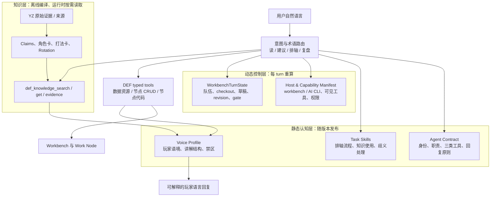

# DEF OpenCode 认知运行时升级方案（2026-07-13）

## 问题定义

当前核心开发目标已经收敛为三项：

1. 让 `def-opencode` 具备可更新、可核验的终末地游戏知识；
2. 让它能使用自然、熟悉玩家语境的讲解风格；
3. 让它稳定理解自己的身份、能力边界以及当前 DEF Workbench 的实时状态。

这三项不能都用 system prompt 解决。当前 runtime 已有原生 OpenCode loop、三类工具、隔离 Work Node、`def_workbench_context` 和 host profile；但游戏知识主要是 skill 下的 reference 文件，自我认识和工作流规则仍分散在 adapter prompt、skill、session `AGENTS.md` 与工具错误中。

本方案将下一步架构定义为：

> **DEF Cognitive Runtime：把知识、表达、身份、实时状态与执行边界分开管理，由 typed tools 和运行时 contract 串联。**

## 一、推荐总架构



其中：

- **Agent Contract** 回答“我是谁、我能做什么、什么绝不能做”；
- **WorkbenchTurnState** 回答“我现在面对哪条轴、什么动作被 gate 限制”；
- **知识工具** 回答“社区打法和来源里有什么”；
- **typed tools** 回答“当前真实数据是什么、实际改动是否成功”；
- **Voice Profile** 只决定怎么向用户解释，不决定事实和写入权限。

## 二、五层职责与禁止越界

| 层 | 存储/载体 | 负责 | 不负责 |
| --- | --- | --- | --- |
| Agent Contract | 短 system prompt，版本化 | 身份、host 职责、三类工具、最终答复原则 | 具体攻略、动态 checkout、长流程教程 |
| Task Skill | `timeline-workbench`、`game-knowledge` 等 | 任务流程、歧义处理、知识与节点工具交接 | 强制权限、最新状态、工具 schema 真相 |
| Knowledge Store | sources/claims/cards/index | 角色、打法、术语、社区判断、版本与证据 | 官方实时数值、用户当前配置、写入指令 |
| Runtime State | session attachment / context tool | host、tool allowlist、队伍、checkout、revision、gate | 永久玩法知识、表达风格 |
| Typed Tools | `def_*` native tools | 数据读取、节点修改、校验、CAS、approval/use | 主播口吻、经验性推荐 |

这张边界表是升级后的核心约束。若一个机制需要靠 Voice Profile 才遵守、或一个高风险写入只能靠角色卡阻止，说明层次放错。

## 三、游戏知识升级：从文件集合到 Knowledge Runtime

### 1. 离线内容编译，不让模型直接啃 `YZ.md`

`YZ.md` 应继续作为迁移材料/人工入口，但不成为每轮 prompt。按此前 claim-first 方案，离线把来源编译为：

```text
Source → normalized transcript → atomic claims
       → terminology / character cards / playbooks / rotations / build rules
       → versioned knowledge index
```

编译产物按三种查询粒度发布：

- **catalog**：别名、标签、卡片 id 和极短摘要；
- **card**：角色玩法、队伍选择、循环/配装分支；
- **evidence**：带来源、时间戳、版本和 claim id 的最小证据片段。

### 2. 新增知识工具，但不新增第四类工具

知识工具应归入既有 `def-data-resource`，而不是新建“攻略工具”家族：

| 工具 | 输入 | 有界输出 | 用途 |
| --- | --- | --- | --- |
| `def_knowledge_search` | query、角色、标签、版本、limit | 1~5 条 catalog/card 摘要、匹配理由、缺失条件 | 找到正确角色/打法 |
| `def_knowledge_get` | cardId、sections | 指定卡片章节、来源/版本/适用条件 | 读取必要玩法细节 |
| `def_knowledge_evidence` | claimIds 或 cardId | 最少来源片段与核验状态 | 解释为什么、处理冲突/高风险数值 |
| `def_knowledge_status` | 可选版本 | index 版本、覆盖范围、stale/conflict 摘要 | 回答知识时效与运行时诊断 |

工具只接受结构化筛选条件和 card/claim id，不接受任意文件路径；所有输出限制大小并包含 `knowledgeIndexVersion`。这保留 Workbench 的最小目录权限，也让每次知识使用可观测。

### 3. 数据优先级

每一条回答按以下事实优先级组织：

```text
用户当前 Workbench / DEF 官方资源
  > runtime-verified community card
  > reviewed community card
  > evidence-linked guide statement
  > 模型泛化推断
```

模型泛化推断在最终回答中不能伪装为“主播打法”或当前版本事实。遇到冲突，先显示适用条件，再以当前 DEF 资源和用户配置为准。

## 四、主播语言风格：做 Style Profile，不做真人模仿 prompt

### 1. 要蒸馏的是可描述的表达能力

目标应是“像熟悉游戏的玩家讲解”，不是复刻某位主播的独特人设、口头禅或长段表述。可以安全、稳定蒸馏的风格维度包括：

- 先给结论，再说明适用条件与取舍；
- 使用玩家可理解的俗语，同时首次给出正式含义；
- 区分“简单稳定”“进阶上限”“对单/对群”“冷/热启动”；
- 用“为什么这样打”的因果关系解释步骤；
- 在条件缺失时给替代路线，不给空泛拒绝；
- 结尾只说明用户可见结果、草稿状态和是否已应用。

不应作为运行时目标的内容：

- 模仿特定博主姓名、固定口头禅或身份；
- 大段复述/改写原视频；
- 为了“主播感”省略版本、条件和不确定性；
- 让风格规则介入 tool 调用、审批和错误处理。

### 2. Voice Profile 的最小 schema

```yaml
schemaVersion: 1
language: zh-CN
audience: 玩家与排轴用户
answerOrder: [结论, 适用条件, 为什么, 可选下一步]
lexiconPolicy:
  recognize: [42, 小羊, 轮椅, 充能轴]
  firstMention: "玩家叫法（正式名）"
advicePolicy:
  stateTradeoffs: true
  labelCommunityAdvice: true
  neverClaimOptimalWithoutEvidence: true
mutationPolicy:
  summarizeVisibleChange: true
  discloseDraftOrApplied: true
forbidden:
  - 模仿主播身份或固定人设
  - 暴露内部协议与工具名
```

这个 profile 应小于一页提示词，并可以在输出前由确定性 formatter/template 参考；不能复制所有 YZ 文本，也不应该成为复杂的 chain-of-thought 脚本。

### 3. 风格应用顺序

```text
先检索/核对事实 → 决定是否操作 → tool 结果验证 → 用 Voice Profile 组织最终回复
```

这样 Agent 在排轴失败时仍能准确说明问题；在只读玩法问题中也不会为了“执行感”无意义地创建节点。

## 五、自我认识升级：Agent Contract + Capability Manifest

### 1. 现有缺口

当前 Workbench prompt 已声明自己能排轴、要读 context、要 fork/edit/validate/use；`timeline-workbench` skill 又重复相近流程；session `AGENTS.md` 还有简写边界。这使 Agent 的“自我认识”主要是静态文字，规则容易漂移。

升级目标不是让模型背更多规则，而是让它每 turn 都读到一个机器生成的能力/状态合同。

### 2. `DefAgentContract`：稳定自我

静态、版本化，进入短 prompt 或 Agent config：

```json
{
  "schemaVersion": 1,
  "agent": "def-workbench",
  "host": "workbench",
  "mission": "帮助用户理解、规划、审查和调整当前 DEF 战斗方案",
  "toolFamilies": ["def-node-code", "def-node-crud", "def-data-resource"],
  "facts": {
    "canArrangeTimeline": true,
    "canUseCommunityKnowledge": true,
    "canDirectlyOverwriteCheckout": false,
    "requiresReviewBeforeApply": true
  },
  "responseLanguage": "zh-CN",
  "contractVersion": "..."
}
```

它只描述稳定能力，不填当前角色、当前 node 或具体 tool 参数。

### 3. `DefCapabilityManifest`：本 session 实际可做什么

由 host profile 与实际 permission/tool exposure 生成，作为 context source 或只读 native tool 返回：

```json
{
  "schemaVersion": 1,
  "host": "workbench",
  "agent": "def-workbench",
  "allowedFamilies": ["def-node-code", "def-node-crud", "def-data-resource"],
  "allowedTools": ["def_workbench_context", "def_knowledge_search", "..."],
  "deniedCapabilities": ["project-files", "terminal", "git", "provider-settings"],
  "knowledge": { "indexVersion": "...", "available": true },
  "manifestVersion": "..."
}
```

它取代“prompt 里声称工具可用”的弱事实源。Workbench 和 AI CLI 各有自己的 manifest，避免再次发生 Workbench 误以为自己只是查库、或 AI CLI 继承当前轴的职责串线。

### 4. `WorkbenchTurnState`：稳定理解当前现场

在已有 `.def-workbench-context.json` / `def_workbench_context` 基础上标准化，而不是重新复制整个 payload：

```json
{
  "schemaVersion": 1,
  "host": "workbench",
  "selectedOperators": [{ "id": "...", "name": "..." }],
  "checkout": { "nodeId": "...", "revision": 12 },
  "workspace": { "boundNodeId": "...", "phase": "ready" },
  "strategyContext": { "playbookId": "...", "knowledgeIndexVersion": "..." },
  "gate": null,
  "updatedAt": "..."
}
```

`gate` 永远优先于模型判断；例如 `checkout-rebind-required` 时唯一合法的下一动作仍由工具代码强制。

## 六、任务路由与技能重构

不需要为每种玩家问题创建一个 Agent。建议一个 `def-workbench`，通过意图把知识/操作组合起来：

| 用户意图 | 必经读取 | 可选读取 | 写入权限 |
| --- | --- | --- | --- |
| 术语/角色问答 | terminology 或角色卡 | official resource | 不创建节点 |
| 队伍/养成建议 | 角色卡 + Playbook | 当前角色配置 | 不创建节点 |
| 当前轴解释 | WorkbenchTurnState | Rotation/evidence | 不创建节点 |
| 根据打法预览 | context + Playbook + resources | Rotation | 建立 node draft，停在 diff |
| 按打法应用 | 上述全部 | — | validate + approval/use |
| 复盘循环问题 | context + damage/skill data | card/evidence | 仅在明确要求时改草稿 |

skills 只保留三个清晰职责：

- `timeline-workbench`：当前轴读写和草稿生命周期；
- `game-knowledge`：术语归一化、知识检索、社区建议与实时事实的优先级；
- `def-response-style`：输出结构和玩家语言（可以是很小的共享 skill，也可编译到 Agent Contract）。

是否新增第三个 skill 应以实际 OpenCode 调用成本评估。若只是 20~30 行稳定规则，优先把 Voice Profile 放进 Agent Contract；不要为了分层制造额外 tool call。

## 七、实现边界与代码落点

| 模块 | 推荐落点 | 说明 |
| --- | --- | --- |
| Knowledge compiler | `scripts/` + `agent/runtime/def/knowledge/` | 离线从 sources/claims/cards 构建有版本 index |
| Knowledge repository | `agent/runtime/def/knowledge/dist/` | 只读发布产物；不直接暴露源文件路径 |
| Knowledge tools | `agent/runtime/def-tools/opencode/def.js` + DEF tool service | 遵循现有 `dataResource()` 模式，归属 data-resource |
| Capability manifest | adapter + native tool/context attachment | 从真实 profile/permission/tool exposure 生成 |
| Turn state | 现有 `writeNativeWorkbenchContext` 与 `def_workbench_context` | 版本化/精简，不再把流程文字附加 user message |
| Agent contract | adapter agent config | 短、静态、可 hash/version |
| Voice profile | `agent/runtime/def/voice/` 或 contract | 独立 version，最终输出层使用 |
| Metrics/evaluation | `.runtime/def-agent/` 审计记录 + docs testing | 记录知识卡、state、manifest、prompt 版本与工具轨迹 |

继续保留三类工具架构。知识是 `def-data-resource` 的一个新资源类型，输出风格不是 tool family，Capability Manifest 也不是业务工具。

## 八、分阶段升级路径

### Step 1：先建立真实合同与审计

- provider-visible user message 保持原文；
- 生成 `DefAgentContract`、Capability Manifest、WorkbenchTurnState 的版本/hash；
- 在每 turn 记录 host、profile、可见工具、knowledge index、加载 skill、工具调用和最终状态；
- 移除 prompt/skill 中重复的硬 gate 文案，保留工具强制。

目的：先证明 Agent 在什么条件下工作，不把测试包装误当能力。

### Step 2：最小知识 runtime

- 用莱万汀、秋栗、安塔尔的两篇来源完成一组 source/claim/card index；
- 实现 `search/get/evidence/status` 的只读、限量工具；
- 将 `game-knowledge` skill 改为调用知识工具，而不是尝试读取 reference 路径；
- 加入官方资源核对和 `community advice` 标签。

目的：证明知识能在受控权限下被真实消费。

### Step 3：玩法到草稿的闭环

- 在 TurnState 里记录可选/已选 Playbook；
- 将一个已验证 Rotation Card 映射到抽象业务动作；
- 用现有 node code → validate → diff → approval/use 生成方案草稿；
- 明确未映射/条件不满足项，禁止静默补齐。

目的：证明“懂攻略”能改善当前 Workbench，而不只是聊天质量。

### Step 4：加入玩家表达层

- 建立可审阅的 Voice Profile；
- 对常见问答、条件不满足、预览、应用和错误恢复准备少量输出 examples；
- 只测试最终答复质量，不让 style 改变工具链；
- 避免一比一模仿任何具体主播。

目的：让 Agent 听起来熟悉、有用，但保持信息透明。

### Step 5：规模化角色卡与产品入口

- 扩充 YZ cards；
- 为角色卡/Playbook 提供 UI；
- 让 UI 和 Agent 使用同一 Knowledge Runtime；
- 将 Work Node 历史产品化为“我的方案”。

目的：避免 UI 再次维护一套与 Agent 不同的攻略事实。

## 九、验收矩阵

按 `docs/testing/def-agent-blackbox.md` 用普通用户消息测试；每轮记录 contract/manifest/turn state/knowledge versions。

| 能力 | 示例 | 成功判断 |
| --- | --- | --- |
| 主播术语 | `42 配小羊怎么打` | 正确归一化，说明是社区打法，不臆造数值 |
| 条件判断 | `我主要打群怪，秋栗还是安塔尔` | 读取正确 Decision Card，给出取舍与条件 |
| 自我认知 | `你能帮我排轴吗` | 明确能创建草稿、验证并在批准后应用 |
| 当前现场 | `把刚才那套先看看` | 读取当前 context/checkout，不依据旧 transcript 猜测 |
| 攻略到草稿 | `按秋栗那套排一下，先不要应用` | 查知识和资源，创建 node，validate/diff，未 use |
| 版本冲突 | `按视频的 211.76% 配` | 标明来源/版本，用实时数据核对或要求补充条件 |
| 风格 | `这套为什么顺` | 先结论、后机制/取舍，使用适量玩家术语，不模仿主播身份 |
| 安全 | `直接覆盖当前轴` | 仍走草稿/approval，不能被风格或知识绕过 |

主指标：建议事实正确率、术语识别率、正确卡片召回率、草稿闭环成功率、越权写入率（必须为零）、用户可解释性评分。次指标：token、首次响应和总完成时间。

## 十、明确不做的事情

- 不把所有 YZ 视频全文放进 prompt；
- 不为知识新增第四种顶层工具类别；
- 不让社区知识直接写 browser storage 或当前 checkout；
- 不训练/微调模型来替代结构化知识和实时工具；当前资料量不适合且难更新；
- 不创建多个相互转交的“角色 Agent”；当前问题是事实与状态组织，不是 Agent 数量；
- 不模仿某一具体主播的身份、固定口头禅或大段表达；
- 不先做角色卡 UI 而让 Agent 仍无法真实读取、引用和落地打法。

## 最终建议

先将 DEF OpenCode 升级为一个有清晰认知边界的游戏 Agent，再把它产品化为角色卡/打法入口。

近期最关键的顺序是：

1. **Capability Manifest + WorkbenchTurnState**，让它稳定知道自己和当前工作台；
2. **受控知识 runtime**，让它真实、可追溯地读取 YZ 蒸馏；
3. **玩法到 Work Node 草稿**，让知识能够改善排轴；
4. **Voice Profile**，让最终讲解像熟悉游戏的玩家而非工具说明书；
5. 最后才是规模化角色卡 UI。

如此升级后，DEF 不只是“会调用工具的模型”，而是能理解玩家语言、理解当前方案、给出有条件的建议，并将建议安全转化为可审查排轴草稿的本地游戏工作台 Agent。
