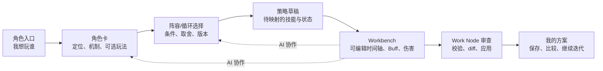

# DEF 产品形态研究：从角色卡到可验证的战斗工作台（2026-07-13）

## 结论

DEF 最有潜力的最终产品形态不是“带 AI 的终末地资料库”，也不是“自动给最优解的排轴机器人”。

它应成为一个本地、可解释、可迭代的：

> **角色—阵容—排轴战斗工作台**

角色卡是用户的起点；阵容与循环卡是策略层；主界面时间轴、伤害计算和 Work Node 是验证与编辑层；Agent 是把人的自然语言意图、社区经验和当前配置连接起来的协作者。

这个定位充分复用现有强项：本地数据、角色配置、时间轴、Buff、伤害追溯、保存/恢复和隔离的 AI 审查。它不把项目推向难以证明正确的“全自动最优战斗规划”，也不会把已有 Workbench 降级成只能看攻略的页面。

## 一、用户真正要完成的工作

当前产品从“选择干员”进入“开始排轴”。这个入口适合熟悉数据结构的用户，却没有回答普通玩家真正的开场问题：

- 我想玩这个角色，适合什么玩法？
- 我的角色池/潜能/装备条件下，有哪种队伍可行？
- 这套队伍为什么这样放技能？
- 能不能先给我一份能看的草稿，再由我调？
- 改完后伤害、Buff、循环和历史是否还能解释？

角色卡可以承担第一问与第二问；队伍/循环卡承担第三问；Workbench 承担第四、第五问。三者必须形成一次连续旅程，而不是互相孤立的页面。



## 二、三种可能产品形态

| 形态 | 用户体验 | 适配度 | 风险 |
| --- | --- | --- | --- |
| 攻略百科 | 搜角色、读卡片、看视频摘要 | 低 | 和现有 Wiki/视频平台差异小；无法体现排轴/计算价值 |
| AI 问答助手 | 输入问题，AI 推荐阵容与操作 | 中 | 容易把价值压缩到聊天；建议难以回看、比较和验证 |
| 角色—阵容—排轴工作台 | 从角色意图进入策略，再进入可编辑/可验证的时间轴 | 高，推荐 | 需要清晰区分知识、草稿、事实和应用状态 |

推荐第三种。它的核心承诺不是“保证最强”，而是：

> 给你一条有来源、有条件、能在你的配置里调整、并能看到影响的战斗方案。

## 三、产品支柱

### 1. 角色理解：角色卡不是百科页

角色卡以玩家决策为中心，而非复制官方数值。

用户应该在一屏内回答：

- 这个角色在队伍中干什么；
- 关键机制/操作窗口是什么；
- 哪些玩法是当前社区已整理、适用哪些场景；
- 我当前角色池能走哪几条路线；
- 选择某条路线要付出什么操作、潜能或装备条件。

官方角色面板、倍率和技能详情仍由现有角色数据页和 typed resources 承载。角色卡展示“怎么用、何时用、和谁用”，并显示来源、版本、社区建议标识。

### 2. 策略选择：把攻略变成可比较的 Playbook

产品中建议将 Team/Decision/Rotation 卡在用户侧统一称为“打法”或“战术方案（Playbook）”。它是一个有条件的策略包，不等于已应用排轴。

一个 Playbook 至少展示：

- 队伍构成：核心、可替换位置、缺失角色；
- 适用场景：对单/对群、冷/热启动、操作难度；
- 用户收益：稳定、爆发、资源友好或上限；
- 前置条件：潜能、武器、充能/装备目标；
- 循环概览：一眼能看懂的阶段，不直接暴露内部节点；
- 证据：来源和版本，而非把博主观点伪装为官方结论。

用户选择 Playbook 后的动作应叫“创建方案草稿”，而不是“应用攻略”。这个词能准确表达它会进入可编辑、可审查的工作流。

### 3. 验证与个性化：Workbench 是产品护城河

大多数攻略产品在“给方案”结束；DEF 应在这里开始产生独特价值。

策略草稿进入 Workbench 后，系统用用户当前角色配置、技能、装备、目标抗性和已有轴完成映射。结果必须分成三态：

| 状态 | 含义 | 用户下一步 |
| --- | --- | --- |
| 可落地 | 所需角色/技能可解析，约束满足 | 预览草稿并进入 diff |
| 可调整 | 部分角色、技能、潜能或装备不匹配 | 选择替代方案，或保留待补项 |
| 仅供参考 | 当前版本/证据不足，或无法映射 | 阅读逻辑，不能一键生成时间轴 |

这样产品不会把 YZ 视频中的抽象动作错误地当作当前画布的精确按钮坐标，也不会把“攻略推荐”误称为“计算验证后的最优解”。

### 4. 保存与演进：方案属于用户

用户最终资产不应只是聊天记录，也不应只是视频收藏，而应是可继续演进的“我的方案”：

- 基于哪张角色/打法卡创建；
- 使用了哪个知识版本；
- 哪些地方保留原方案、哪些是自己的改动；
- 在什么目标、角色配置和版本下验证过；
- 与上一个 Work Node 相比改变了什么；
- 是否已应用到当前主轴。

现有 Work Node、diff、checkout、保存/恢复是这个能力的天然底座。产品层只需把内部节点语言翻译成“方案版本”“草稿改动”“已应用”。

## 四、角色卡在产品信息架构中的位置

推荐形成四个用户可理解的一级区域，而不是将所有能力塞入主界面底部导航：

```text
开始 / 我的方案
  ├─ 继续上次方案
  ├─ 从角色开始
  ├─ 从已有阵容开始
  └─ 导入/恢复本地方案

角色与打法
  ├─ 角色卡
  ├─ 队伍/打法浏览
  └─ 术语与筛选

战斗工作台
  ├─ 排轴
  ├─ Buff / 目标 / 伤害
  ├─ 方案草稿与对比
  └─ AI 协作

资料维护（高级）
  ├─ 干员 / 武器 / 装备 / Buff 编辑
  ├─ 图片管理
  └─ AI CLI
```

“角色与打法”是新的面向玩家区域；“资料维护”保留给愿意维护本地数据库的高级用户。当前所有入口都同等放在 Workbench 底部，会让产品的玩家主线与维护主线混在一起。

## 五、关键用户旅程

### 旅程 A：从一个喜欢的角色开始

1. 用户在“开始”搜索或点击莱万汀；
2. 角色卡显示她的定位、核心机制、可选玩法和当前已知条件；
3. 用户选择“对群 / 简单上手”的秋栗火队 Playbook；
4. 产品询问或读取用户已有角色、潜能和配置；
5. 显示“可落地 / 需要补充”的策略检查；
6. 用户选择“创建方案草稿”；
7. Workbench 生成隔离草稿，展示阶段性循环与语义 diff；
8. 用户手工调整或让 AI 协助，再应用/保存。

### 旅程 B：从已有四人队开始

1. 用户选好四名角色；
2. 系统识别可匹配的 Playbook，并明确缺失条件；
3. 用户选择一个“作为参考”或“创建草稿”；
4. Workbench 把策略映射到现有轴，而不清空用户所有内容；
5. 结果以“新增、替换、未映射、冲突”分区展示。

### 旅程 C：从当前问题开始

1. 用户正在 Workbench，看见某个技能或 Buff；
2. 点击“为什么这样安排”或对 AI 说“42 的这个轴怎么更顺”；
3. Agent 读取当前 context 和匹配的角色/打法卡；
4. 回答先给依据和选项；
5. 只有用户说“按这个改/先看看”才创建 Work Node draft。

这条旅程使 AI 是“上下文中的策略解释和编辑协作”，不是替代整个产品的聊天框。

## 六、核心界面形态

### 1. 角色卡页：决策首页

建议采用“左信息、右动作”的布局：

```text
┌─────────────────────────────────────────────────────────────────┐
│ 莱万汀   灼热主C · 熔火爆发          社区知识 v1.2 · YZ      │
├──────────────────────────────┬──────────────────────────────────┤
│ 她的打法                      │ 适合你的方案                    │
│ - 核心机制                    │ [对群] 秋栗火队     创建草稿   │
│ - 操作重点                    │ [对单] 安塔尔火队   查看条件   │
│ - 养成原则                    │ [进阶] 卡缪火队     查看条件   │
│                                │                                  │
│ 常见搭档 / 可替代位            │ 你的当前配置：3/4 满足          │
│ 版本与来源                     │ 缺少：狼卫潜能条件待确认         │
└──────────────────────────────┴──────────────────────────────────┘
```

页面默认讲清“选择”，不默认展开动作细节和数值表。用户选择具体打法后才进入 Playbook 详情。

### 2. Playbook 详情：从理解到草稿

上部呈现队伍、适用条件、难度和取舍；中部呈现冷/热启动等循环阶段；底部固定两个动作：

- `作为参考加入工作台`：只保存/固定策略上下文，不改轴；
- `创建方案草稿`：进入隔离 Work Node，生成可审查变更。

没有“直接应用”按钮。高风险变化与当前 Spec 7 的 approval/use 模型保持一致。

### 3. Workbench 的“方案上下文条”

用户从 Playbook 进入后，时间轴上方只需一条轻量状态：

```text
秋栗火队 · 冷启动草稿  |  来源 YZ / 1.2  |  3 项映射成功 · 1 项待确认  |  查看依据
```

它比把整张攻略固定在右侧更好：用户能知道当前在实现什么，也能回到策略、查看差异或解除绑定。

## 七、Agent 的产品边界

Agent 不能成为唯一入口，也不应默认“替用户选一套最强阵容”。它在产品中有四种清晰角色：

| Agent 角色 | 例子 | 不做什么 |
| --- | --- | --- |
| 解释者 | “秋栗和安塔尔差在哪？” | 不把偏好说成唯一最优解 |
| 条件检查员 | “这套适合我的零潜狼卫吗？” | 不臆造用户角色或装备 |
| 草稿协作者 | “按秋栗思路先排一版” | 不越过 Work Node/approval 直接改当前轴 |
| 复盘者 | “为什么这次循环断了？” | 不把社区经验当作实时计算结果 |

Agent 的每次知识建议应可跳转到角色卡/Playbook；每次轴修改应可跳转到 diff/Work Node。反过来，角色卡和 Playbook 也应提供“问 AI”“在当前轴预览”的动作。这样知识、对话和编辑不会分裂成三套历史。

## 八、产品语言与信任表达

建议统一使用以下用户语言：

| 内部概念 | 用户可见语言 |
| --- | --- |
| community card | 角色打法 / 战术方案 |
| Work Node | 方案草稿 |
| checkout/use | 应用到当前轴 |
| validation | 排轴检查 |
| semantic diff | 改动对比 |
| evidence/claim | 来源与适用条件 |

每个建议需要一个显眼但克制的信任标签：

- `已按当前配置检查`：角色/技能/数据满足映射条件；
- `需要补充条件`：缺潜能、装备、技能等级或目标场景；
- `社区打法`：来自博主蒸馏，展示版本和来源；
- `旧版本参考`：默认不自动生成草稿。

这套表达能避免用户误解“AI 说了”或“视频里有”就是数据库已验证的游戏事实。

## 九、渐进演进，不推翻现有 Workbench

### 阶段 0：证明产品入口

不改排轴内核。做一个可浏览的莱万汀角色卡、秋栗/安塔尔 Decision Card 和两张 Playbook；从角色卡跳转到当前选人或现有 Workbench，只做“作为参考”上下文。

需要验证：用户是否愿意从角色/打法开始，而不是先手工配置四人。

### 阶段 1：策略适配检查

在选择 Playbook 前读取当前队伍、角色配置和可解析资源，输出可落地/可调整/仅供参考三态。仍不自动生成节点。

需要验证：条件解释是否能减少“照搬攻略后发现不适用”的挫败感。

### 阶段 2：策略到方案草稿

把已验证的 Rotation Card 映射为 Work Node 草稿，使用既有 codec、validate、diff 与 approval/use。保留“未映射”项，不静默填补。

需要验证：用户是否理解并信任草稿—对比—应用流程。

### 阶段 3：上下文 AI 协作

让 AI 在角色卡、Playbook 和 Workbench 之间双向跳转：解释策略、按当前条件提出变体、在用户授权下创建/修改草稿。

需要验证：AI 是否缩短了从问题到可审查方案的时间，而没有制造不可解释的自动化。

### 阶段 4：我的方案库

将 Work Node 历史产品化为“我的方案”：收藏、对比、复制、恢复、标注来源版本和个人改动。再考虑本地导入/导出或分享。

需要验证：用户是否会复用和迭代自己的方案，而不是每次从攻略重来。

## 十、衡量产品是否成立

产品不是以“模型回答更像博主”衡量，而以用户是否完成完整闭环衡量。

建议指标：

| 指标 | 说明 |
| --- | --- |
| 策略发现成功率 | 用户能否在角色/队伍入口找到适用玩法 |
| 条件透明度 | 用户是否能说清方案为何可用、为何不可用 |
| 草稿创建完成率 | 从 Playbook 到可验证 Work Node 的完成比例 |
| 未预期覆盖率 | 生成草稿时是否错误清空/替换了用户已有轴 |
| 应用信心 | 用户查看 diff 后是否愿意应用或继续改动 |
| 方案复用率 | 后续是否恢复/复制已有方案而非重复从零配置 |
| 可解释性 | 建议和改动是否能回溯到来源、条件和当前数据 |

只有当“从角色意图到可验证方案”的完成率提升，而不是单纯打开次数增加，角色卡和 Agent 才真正改善产品。

## 十一、当前最重要的产品决策

推荐立即固定以下方向，作为之后任何 spec 的前提：

1. DEF 的玩家主线是“理解角色 → 选择打法 → 生成并调整自己的方案 → 验证与保存”，不是“编辑数据库”；
2. 角色卡是玩家入口，Playbook 是策略选择，Workbench 是唯一可修改和验证的地方；
3. YZ 知识默认呈现为带来源与条件的社区打法，永不伪装为官方数据或最优证明；
4. Agent 是跨层协作者，不取代角色卡、Playbook、diff 或用户的最终应用决定；
5. 所有“把攻略变成排轴”的操作先成为方案草稿，后经检查和对比才应用；
6. 第一项产品试点应是“莱万汀 → 秋栗/安塔尔选择 → 冷启动草稿”，而非泛化所有角色和所有视频。

## 最终建议

角色卡方向值得继续，但请把目标从“做一套内容卡片”提高到“搭建玩家从角色兴趣走到个人方案的入口”。

DEF 的差异化不在于比视频更会讲攻略，而在于能把攻略的条件与逻辑落到用户自己的角色、装备、时间轴和伤害结果上，并把每次调整沉淀成可回看的本地方案。
