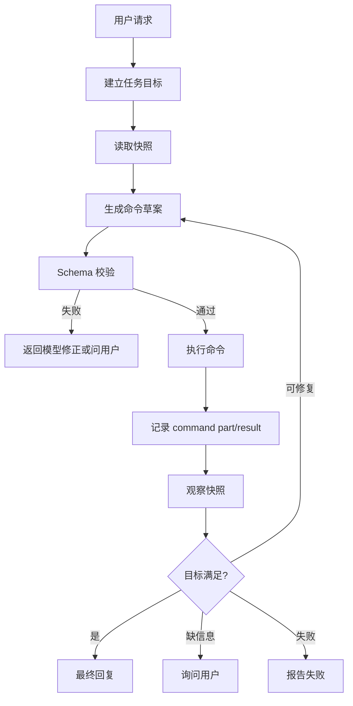

# def-opencode 主界面初版 Spec

## Status

草案中。

本 spec 用于明确 def-opencode 接管主界面口述排轴的业务思路、能力边界和第一版可用标准。它不是具体实现 plan，也不拆开发 tasks。

## 背景

主界面已经具备完整的人工排轴基础：用户可以选择干员、配置武器装备、在排轴上放置技能按钮、给技能按钮添加 Buff / 状态 / 异常、配置目标抗性，并计算伤害。

`def-1.8-code` 已经开始把 def-opencode 接到主界面右侧 AI 模式中。现有开发内容的基本方向是正确的：

- UI 层采用主界面右侧 AI 模式承载对话，不需要推翻。
- def-opencode 作为后台 agent runtime，不直接操作 DOM。
- agent 通过本地 REST 投递声明式命令。
- 浏览器页面仍是主界面事实源，由页面消费命令并调用现有 React/service/storage 逻辑写入状态。
- 主界面快照用于让 agent 查询当前已选干员、技能按钮、配置和伤害结果。

现阶段的问题不在于产品方向，而在于底层协议和执行闭环不完整：自然语言意图没有稳定映射到业务命令，命令参数没有足够强的解析与校验，批量命令没有事务语义，执行结果没有按用户意图验证。因此智能体容易只口头说完成，或者投递了不完整命令后无法判断是否真正完成。

UI 层除统一 markdown 渲染库等技术优化外，第一版不应大改。后续重点应放在业务规范、命令协议、执行器和验证闭环。

## Goal

让 def-opencode 能作为主界面的口述排轴助手，可靠完成第一版自然语言排轴操作。

第一版目标不是让 agent 自由发挥攻略，也不是让 agent 直接成为完整自动战斗规划器，而是让用户可以用自然语言驱动已有主界面能力，并看到确定的执行结果。

第一版应至少支持：

- 查询当前主界面状态。
- 选择或替换出战干员。
- 给指定干员配置武器和装备。
- 清空、保存、恢复排轴。
- 添加或移除技能按钮。
- 给技能按钮添加或移除 Buff。
- 设置目标抗性。
- 计算伤害并返回关键结果。
- 在执行失败或参数不足时给出明确原因，而不是口头假装完成。

## Non-Goals

第一版不处理：

- 不重做主界面 AI 模式 UI。
- 不废弃现有 CanvasBoard、AppContext、timeline、skill-button、buff storage。
- 不让 def-opencode 直接写 localStorage/sessionStorage 作为业务真相。
- 不让 def-opencode 点击 DOM 或模拟用户鼠标键盘。
- 不让 agent 绕过主界面服务直接改工程文件或业务数据文件。
- 不要求 agent 自动规划最优战斗循环、最优配装或完整攻略。
- 不要求自然语言覆盖所有模糊表达。
- 不把主界面 AI 做成通用聊天机器人。

## Product Positioning

def-opencode 主界面能力是“口述操作当前工作台”，不是“独立数据编辑器”。

用户面对的是主界面本身。AI 只是把用户自然语言转成主界面可执行命令，并在执行后告诉用户当前状态。所有真实状态变化都必须通过主界面已有服务完成。

推荐心智模型：

```text
用户口述
  -> def-opencode 解析意图
  -> REST 投递声明式命令
  -> 浏览器主界面执行命令
  -> 主界面生成快照和结果
  -> def-opencode 基于结果回复
```

## Existing UI Position

现有右侧 AI 面板方向保留。

系统 SHALL 继续使用主界面右侧 AI 模式承载 def-opencode 对话、状态、步骤和结果。

允许的 UI 优化：

- 使用统一 markdown 渲染库展示 agent 回复。
- 优化消息换行、代码块、列表和滚动体验。
- 优化运行状态、失败状态、重试和回退入口。
- 简化内部协议噪音展示。

不应在第一版大改：

- 不重新设计右侧 AI 模式整体布局。
- 不新增独立主界面 AI 页面。
- 不把已有主界面排轴区域改造成 agent 专用 UI。
- 不把技术细节暴露为普通用户必须理解的操作。

## Architecture

### Responsibility Split

系统 SHALL 保持以下责任边界：

```text
def-opencode
  负责：理解用户意图、读取快照、投递命令、读取结果、生成回复
  不负责：直接写业务 storage、点击 DOM、绕过主界面服务

Local REST
  负责：暴露主界面命令和快照协议、校验命令格式、记录命令状态
  不负责：直接修改 React 主界面真相

Browser Workbench
  负责：消费命令、调用主界面已有服务、写入 app truth、生成快照
  不负责：让 agent 绕过执行结果验证

Main Workbench Storage / Services
  负责：timeline、skill-button、buff、operator config、damage report 的业务真相
```

### Source of Truth

主界面浏览器状态和其持久化 storage 是第一版业务事实源。

REST 中的命令队列、结果日志和快照只是 agent 与主界面的桥接层。命令 `ok:true` 只表示命令被接受，不表示业务动作已经完成。业务完成必须由浏览器执行结果和快照共同证明。

### No DOM Automation

系统 SHALL 禁止 def-opencode 通过 DOM 点击、拖拽或模拟键盘完成排轴。

原因：

- DOM 自动化会绕过主界面现有服务边界。
- DOM 自动化难以获得可靠失败原因。
- DOM 自动化会和布局、滚动、缩放、动效强耦合。

第一版唯一允许的主界面操作方式是声明式命令。

## Agent Runtime Execution Model

def-opencode 主界面能力 SHALL 采用目标驱动的 agent 执行模型，而不是“用户说话 -> 模型自由回复”的聊天模型。

核心流程：



### Execution Ownership

每个节点必须有明确归属：

```text
用户请求
  归属：UI

建立任务目标
  归属：DEF Agent Kernel + model
  说明：把自然语言整理成可验证目标，例如“某干员某技能按钮包含某 Buff 并完成重算”。

读取快照
  归属：Workbench Snapshot Tool / Browser Workbench
  说明：读取当前主界面事实，不依赖模型记忆。

生成命令草案
  归属：model
  说明：模型只生成候选动作，不直接写业务真相。

Schema 校验
  归属：DEF Agent Kernel / REST / App
  说明：校验 op、字段、类型、引用关系和批量命令结构。

执行命令
  归属：Browser Workbench
  说明：由浏览器主界面调用既有 service/storage 逻辑执行。

记录 command part/result
  归属：DEF Agent Kernel / REST bridge
  说明：记录每条命令 pending/running/done/error、输入、输出和错误。

观察快照
  归属：Workbench Snapshot Tool
  说明：执行后重新读取事实状态。

目标满足判断
  归属：Verifier
  说明：按用户目标检查关键对象和字段，而不是只看是否投递过命令。

最终回复 / 询问用户 / 报告失败
  归属：model + verified result
  说明：回复必须基于执行结果和验证结果。
```

### Hard Boundary

系统 SHALL 把以下步骤做成硬边界，而不是只靠 prompt 约束：

- Schema 校验。
- 命令执行状态记录。
- 执行后快照观察。
- 目标满足验证。
- 失败原因归因。

模型 MAY 参与：

- 解析自然语言。
- 生成命令草案。
- 根据错误修正草案。
- 用自然语言总结 verified result。

模型 SHALL NOT 单独决定：

- 命令是否有效。
- 业务状态是否已经写入。
- 用户目标是否已经满足。
- 是否可以忽略执行错误。

### Repair Loop

系统 SHALL 支持有限修复循环。

当命令草案 schema 校验失败，或执行后 verifier 判断目标未满足时，系统 MAY 把结构化错误返回给模型，让模型重写命令草案。

修复循环必须受限：

- 同一用户请求最多允许有限次数自动修复。
- 同类错误重复出现时停止修复并报告失败。
- 缺少关键业务信息时询问用户，而不是继续猜测。
- 已经产生业务副作用时，后续修复必须基于最新快照。

## Command Protocol

主界面命令应表达业务意图，而不是表达 UI 操作细节。

第一版命令集合：

```text
selectCharacters
openView
openWorkbenchPage
clearTimeline
saveTimelineSnapshot
restoreTimelineSnapshot
listTimelineSnapshots
refreshOperatorConfig
setOperatorWeapon
setOperatorEquipment
addSkillButton
removeSkillButton
addBuff
removeBuff
setTargetResistance
calculateDamage
refreshSnapshot
```

### Command Validation

系统 SHALL 在 REST 接收命令时校验：

- `op` 必须属于支持列表。
- 必填字段必须存在。
- 字段类型必须符合 schema。
- 明显非法的命令不得进入 pending 队列。

系统 SHALL 在浏览器执行命令时再次校验：

- 目标干员是否存在且已选。
- 目标技能按钮是否存在。
- 目标 Buff 是否可解析。
- 目标装备/武器是否可解析。
- 目标节点是否可放置。
- 当前视图是否允许执行该命令。

### Command Result

每条命令执行后必须产生明确状态：

```text
pending -> running -> done | error
```

`done` 必须包含足够的结果字段用于验证，例如：

- 选中的干员列表。
- 新增技能按钮 id、干员、技能、staffIndex、lineIndex、nodeIndex。
- 新增 Buff id、名称、目标 buttonId。
- 配装后的武器装备摘要。
- 伤害计算总伤、按钮数和关键按钮结果。

`error` 必须包含用户可读的失败原因。

## Intent Model

第一版自然语言意图分为三类。

### Read-Only Intent

只读意图不会改变主界面。

示例：

- 当前选了谁？
- 现在有哪些技能按钮？
- 某个干员穿的是什么装备？
- 当前总伤是多少？

系统 SHALL 读取当前快照并回答具体状态。

系统 SHALL NOT 为只读意图投递变更命令。

系统 SHALL NOT 只回复“已完成”。

系统 SHALL NOT 用本地模板替代 def-agent 生成只读回答。主界面可以构建只读证据包，但最终口径应交给 def-agent 基于证据回答；本地模板只能作为 def-agent 不可用时的故障兜底。

只读证据包 SHALL 包含足够让模型自行推理的当前主界面内容：

- 已选干员。
- 技能按钮的干员、技能名、位置、按钮 id。
- 每个技能按钮已选 Buff 的 id、名称、来源。
- 装备配置摘要。
- 伤害报告摘要与按钮级伤害。

只读证据包 SHALL 明确说明它来自当前迁出态的快照；它不等于 appdata 工作节点，也不得写入 appdata 工作节点。

def-agent 会话 SHALL 在同一主界面上下文中连续保留，除非用户开启新对话或已选干员签名变化。用户追问“它/这个/刚才那个/有什么 Buff”时，模型应能结合上一轮定位结果和当前证据包回答。

### Mutating Intent

变更意图会改变主界面。

示例：

- 换成 A、B、C、D 四个干员。
- 给某干员穿某套装备。
- 在第 3 个节点释放某技能。
- 给这个技能加某个 Buff。
- 删除刚才那个技能按钮。
- 重算伤害。

系统 SHALL 投递实际命令。

系统 SHALL 在回复前检查命令执行结果。

系统 SHALL 在执行失败时明确说明失败原因。

### Ambiguous Intent

歧义意图缺少必要参数，或自然语言无法稳定映射到唯一业务动作。

示例：

- 帮我排个轴。
- 给她加合适的 Buff。
- 把伤害弄高一点。
- 放一个技能。

系统 SHALL 在缺少关键参数时询问最小补充信息，或者使用 spec 中定义的默认策略。

系统 SHALL NOT 在无法确定目标时随机操作。

## First-Version Business Defaults

为了让第一版可用，允许定义少量保守默认值。

### Operator Selection

当用户明确给出干员名称或已知别名时，系统 SHALL 直接按名称/别名解析。

当用户说“替换 A 为 B”时，系统 SHALL 保留未提及的当前已选干员，只替换目标。

当解析不到干员时，系统 SHALL 报错并说明未找到哪个名称。

### Equipment Defaults

当用户明确要求“合适配装”但未给出装备名时，第一版允许使用保守默认：

- 已有武器装备则保留。
- 未配置武器时可默认 `宏愿`。
- 未配置装备时可默认 `潮涌` 四件，满词条 `entryLevel: 3`。

该默认只用于第一版可操作性，不代表最终最优配装。

系统 SHOULD 在回复中说明使用了默认配置。

### Skill Placement Defaults

当用户指定干员和技能但未指定节点时，系统 MAY 使用该干员所在行的第一个可用节点。

当用户指定节点但该节点被占用时，系统 MAY 自动吸附到附近可用节点，并在结果中说明实际节点。

当无可用节点时，系统 SHALL 报错。

### Buff Defaults

Buff 操作不能只靠自然语言造一个临时 Buff。

系统 SHALL 通过已有 Buff 库、候选 Buff、当前按钮上下文或明确传入的 Buff 对象解析目标 Buff。

如果用户只给出 Buff 名称但系统无法解析到唯一 Buff，系统 SHALL 询问或返回候选项。

系统 SHALL NOT 为了完成操作而编造 Buff 类型、数值或来源。

## Batch And Transaction Semantics

自然语言排轴经常是一组连续动作。第一版必须把批量命令作为业务事务看待，而不是把一组命令松散塞进队列。

系统 SHALL 支持批量命令：

```json
{
  "commands": [
    { "op": "selectCharacters" },
    { "op": "addSkillButton" },
    { "op": "addBuff" },
    { "op": "calculateDamage" }
  ],
  "source": "def-opencode"
}
```

系统 SHALL 保证同一批命令按顺序执行。

系统 SHALL 允许后续命令引用前序命令产物，例如新增技能按钮后再给该按钮添加 Buff。

系统 SHALL 在批量命令中途失败时停止后续依赖命令，并返回失败点。

第一版可以不要求完整自动回滚，但必须保留足够结果让用户知道哪些已执行、哪些未执行。

## Verification

第一版不能只验证“agent 是否投递了某种命令”，必须验证“主界面状态是否符合用户意图”。

系统 SHALL 在每轮变更后形成验证摘要。

验证至少包含：

- 命令是否全部结束。
- 是否存在 error。
- 用户意图要求的关键对象是否出现在快照中。
- 关键字段是否符合预期，例如干员、技能、节点、Buff、装备、伤害按钮数。

示例：

```text
用户：给 A 的 B 技能加 X Buff 并重算伤害

验证要求：
- 存在 A-B 技能按钮
- 该按钮 selectedBuffIds 中包含 X
- calculateDamage 命令完成
- damageReport.buttonCount 与当前按钮数一致
```

如果验证失败，系统 SHALL 告诉用户“未按请求完成”，并给出失败原因或下一步建议。

## Rollback

系统 SHOULD 为高风险变更提供回退点。

高风险变更包括：

- 替换多个干员。
- 清空排轴。
- 批量添加或删除多个技能按钮。
- 批量修改 Buff。
- 恢复历史快照。

低风险变更不应默认强制保存回退点：

- 添加一个技能按钮。
- 删除一个明确目标技能按钮。
- 给一个按钮添加或移除一个 Buff。
- 只读查询。

用户明确要求“可回退”时，系统 SHALL 保存回退点。

## Requirements

### Requirement: 主界面 AI 入口

系统 SHALL 在主界面保留右侧 AI 模式作为 def-opencode 入口。

#### Scenario: 打开 AI 模式

- WHEN 用户进入主界面并打开 AI 模式
- THEN 系统显示 def-opencode 对话区域
- AND 显示当前 session / token / 状态等必要运行信息
- AND 不遮断主界面排轴事实源

#### Scenario: UI 技术优化

- WHEN agent 回复包含列表、代码块或结构化内容
- THEN UI 使用统一 markdown 渲染库展示
- AND 不要求业务层为展示格式做特殊字符串拼接

### Requirement: 快照查询

系统 SHALL 提供可供 agent 读取的主界面快照。

#### Scenario: 查询当前状态

- WHEN 用户询问当前干员、技能按钮、装备、Buff 或伤害
- THEN agent 读取主界面快照
- AND 回复具体名称、数量或数值
- AND 不投递变更命令

#### Scenario: 快照内容

- WHEN 主界面生成快照
- THEN 快照包含已选干员
- AND 包含技能按钮及其位置、技能类型和已选 Buff ids
- AND 包含干员武器装备摘要
- AND 包含最近伤害报告摘要

### Requirement: 声明式命令

系统 SHALL 使用声明式命令驱动主界面变更。

#### Scenario: 变更请求

- WHEN 用户要求选择干员、配装、放技能、加 Buff、改抗性或计算伤害
- THEN agent 投递对应声明式命令
- AND 浏览器主界面消费命令并执行
- AND agent 不直接写 storage
- AND agent 不点击 DOM

#### Scenario: 非法命令

- WHEN REST 收到未知 op 或缺少必填字段的命令
- THEN 系统拒绝该命令
- AND 命令不进入 pending 队列
- AND 返回可读错误信息

### Requirement: 批量执行

系统 SHALL 支持自然语言对应的多步命令按顺序执行。

#### Scenario: 添加按钮后添加 Buff

- WHEN 用户要求给某干员释放技能并加 Buff
- THEN 系统先添加技能按钮
- AND 后续 Buff 命令能定位到该新增按钮
- AND 最终快照中该按钮存在且包含目标 Buff

#### Scenario: 批量失败

- WHEN 批量命令中某一步失败
- THEN 系统停止执行依赖该结果的后续命令
- AND 返回失败命令、失败原因和已完成命令摘要

### Requirement: Buff 解析

系统 SHALL 提供可验证的 Buff 解析路径。

#### Scenario: 唯一命中

- WHEN 用户给出 Buff 名称且系统能唯一解析
- THEN 系统使用解析出的 Buff 数据添加到目标技能按钮
- AND 不编造 Buff 字段

#### Scenario: 多候选

- WHEN 用户给出的 Buff 名称命中多个候选
- THEN 系统返回候选项并要求用户选择
- AND 不随机选择一个候选执行

#### Scenario: 未命中

- WHEN 用户给出的 Buff 名称无法解析
- THEN 系统说明未找到该 Buff
- AND 不创建临时 Buff 冒充结果

### Requirement: 技能按钮定位

系统 SHALL 允许通过业务字段定位技能按钮。

#### Scenario: 通过 buttonId 定位

- WHEN 命令提供 buttonId
- THEN 系统优先使用 buttonId 定位目标按钮

#### Scenario: 通过干员和技能定位

- WHEN 命令提供 characterName / characterId 和 skillType / runtimeSkillId
- THEN 系统定位匹配按钮
- AND 如果存在多个候选，使用明确规则选择或要求用户补充

#### Scenario: 新增按钮坐标

- WHEN 系统新增技能按钮
- THEN runtime button、timelineData、skill-button repository 中的 staffIndex、lineIndex、nodeIndex 语义保持一致
- AND 伤害快照读取到的位置与画布展示一致

### Requirement: 执行结果验证

系统 SHALL 在回复前验证变更是否真实生效。

#### Scenario: 成功执行

- WHEN 用户请求已完成
- THEN agent 回复应包含关键执行摘要
- AND 摘要来自命令结果或快照
- AND 不只回复“已完成”

#### Scenario: 未执行

- WHEN agent 没有投递必要命令
- THEN 系统不得把本轮视为成功
- AND 应提示“未检测到实际主界面命令”

#### Scenario: 执行失败

- WHEN 命令状态为 error
- THEN agent 回复失败原因
- AND 不用成功话术覆盖错误

### Requirement: 回退

系统 SHALL 支持按业务场景保存和恢复回退点。

#### Scenario: 高风险操作

- WHEN 用户要求清空排轴或批量替换
- THEN 系统保存回退点
- AND 操作失败时用户可以恢复

#### Scenario: 小操作

- WHEN 用户只添加或删除单个技能按钮 / Buff
- THEN 系统不强制保存回退点
- AND 用户明确要求可回退时除外

## Acceptance Criteria

- 主界面右侧 AI 模式保留为 def-opencode 入口。
- agent 不通过 DOM 自动化操作主界面。
- agent 不直接写业务 storage。
- REST 拒绝未知 op 和缺少必填字段的命令。
- 浏览器执行器对命令做二次业务校验。
- 只读问题返回具体快照内容，不回复空泛完成。
- 只读问题由 def-agent 基于快照证据回答，本地模板只作故障兜底。
- 连续追问保持 def-agent 会话上下文。
- 变更问题必须投递实际命令。
- 命令结果包含可用于验证的业务字段。
- 批量命令按顺序执行。
- 批量命令失败时返回失败点和已完成摘要。
- 新增技能按钮在 runtime button、timelineData 和快照中的位置语义一致。
- Buff 名称必须解析到已有 Buff 或候选，不能编造。
- 执行成功回复必须基于命令结果或快照。
- 执行失败回复必须包含失败原因。
- 高风险变更支持回退点。
- UI 层除 markdown 等展示优化外，不作为第一版重构重点。

## Open Questions

- 第一版 Buff 解析应优先读取候选 Buff、全局 Buff 库，还是技能按钮上下文 Buff 列表？
- 批量命令是否需要显式 `batchId` 和批次级状态？
- 命令之间引用前序结果时，使用 `$previous.buttonId` 形式，还是由执行器自动匹配？
- “合适配装”的默认值是否固定为当前 spec 中的保守默认，还是需要按职业/元素扩展？
- 伤害验证是否只看总伤和按钮数，还是第一版就要验证每个按钮的伤害行？
