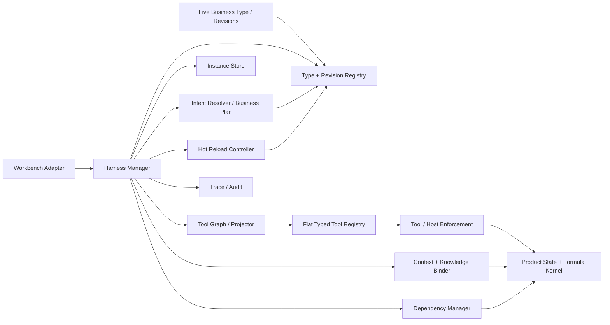

# Spec 9-2：五业务原子 Harness 解耦、管理与热重载重构

## 状态

规格已重写，等待实施。

本规格取代本目录旧版“只研究、不开发”的 Spec 9-2。旧版把问题抽象成 Tool 与八个 Harness slot 的横向职责划分，没有建立本项目真实的游戏业务链，也没有覆盖 Harness 管理与在线迭代。本规格以当前代码和产品状态为起点，要求在同一轮开发中一次完成：

1. 旧行为来源解耦；
2. Harness 注册、运行、迭代与热重载管理系统；
3. 选人、配装、排轴、BUFF、计算统计五个业务原子 Harness。

三项可以按依赖顺序实现和提交，但不能分批交付或长期保留两套主链路。

## 一、目标

### 1.1 唯一目标

> 把 DEF OpenCode 重构成由五个游戏业务 Harness 驱动的上下文运行时：Typed Tools 保持平级注册，Harness Manager 按业务事务绑定当前方案、游戏知识、执行阶段和可用 Tool，并允许单个业务 Harness 在不重启 OpenCode、不替换整个 Session 的前提下安全热重载。

### 1.2 为什么必须整体完成

只拆 Prompt 而没有 Manager，业务规则会重新散落。

只建 Manager 而没有五个业务 Harness，Manager 只能继续加载旧的全局混合包。

只创建五个 Harness 而没有解耦，固定 Agent Prompt、runtime Skill、宿主回合提示和旧 Harness 仍会同时决定行为。

因此本规格只有一个完成态：五业务主链路已经接管，旧的全局 Harness 路径已经退出运行时决策。

## 二、现状事实与问题定义

本规格依赖同目录 [`research.md`](./research.md) 中的代码证据，并以以下事实作为设计前提：

1. OpenCode Tool Registry 必须向模型提供平级 Tool 集，现有插件也按平级名称注册全部 `def_*` Tool。
2. Tool 的真实业务关系不是树：
   - 读取型 Tool 可被多个业务共享；
   - `fork / bind / patch / validate / diff / use` 等事务 Tool 同时服务排轴和 BUFF；
   - proposal、artifact、plan、approval capability 构成跨 Tool 的有向依赖；
   - 一个 Tool 在不同 Operation 和 Phase 中的可见性不同。
3. 当前 `DefHarnessPackageV1` 只校验八个 Markdown slot、hash、channel 和兼容性；组合行为是全文拼接。
4. 当前所谓热插拔只在新 Session 创建时选择并固定整包，活跃 Session 不会获得新 Harness。
5. 当前业务规则同时存在于：
   - 固定 Workbench Agent Prompt；
   - `timeline-workbench` runtime Skill；
   - 每 Turn 宿主 System Prompt；
   - 八槽 Harness；
   - Tool description；
   - plugin 回合门禁和服务端 handler。
6. 当前 Work Node 文件只是完整游戏方案的投影。排轴与 BUFF 会共同出现在按钮对象中，不能按文件划分业务写入权限。
7. 当前 OpenCode 已支持按 Prompt/Permission 过滤本轮 Tool，plugin 也有 `tool.execute.before` 可执行门禁，因此无需把 Tool Registry 改造成嵌套树。

问题不再定义为“八个 slot 是否独立”，而定义为：

> 如何使一个用户业务事务只有一个 Harness 决策主体，同时允许它使用共享 Tool 和贯穿全链路的游戏知识，并保证任何直接写入、系统级联、跨业务失效和热重载都具有唯一、可验证的归属。

## 三、规范术语

### 3.1 五个业务

固定业务集合：

```text
B = {selection, loadout, timeline, buff, calculation}
```

分别对应：

- `selection`：选人；
- `loadout`：配装；
- `timeline`：排轴；
- `buff`：上 BUFF；
- `calculation`：计算与统计。

游戏知识不是第六个业务；Work Node、Session、Approval、Diff 也不是业务。

### 3.2 Operation

Operation 是某个业务内部的用户动作，例如：

- 选人的新增、删除、换人；
- 配装的查询、推荐、比较、预览、应用；
- 排轴的新增技能、移动、删除、替换；
- BUFF 的添加、删除、替换、批量处理；
- 计算统计的计算、汇总、比较、归因。

Operation 不是独立 Harness。只有业务的上下文、可写状态和完成判据发生根本变化时，才允许增加新的 Harness Type。

### 3.3 Phase

Phase 是一次 Operation 的执行阶段，例如：

```text
resolve → evidence → plan → preview → await-confirmation → apply → verify
```

并非所有 Operation 都拥有全部阶段。Phase 决定本轮允许模型看到和调用哪些 Tool。

### 3.4 Harness Type

Harness Type 是五个业务的稳定硬合同，定义：

- 业务 id；
- Operation 集合；
- 最大 Tool 能力边界；
- 直接写入的语义状态范围；
- 合法 postcondition；
- 上下游依赖；
- 与 Tool Registry、状态 schema 和宿主协议的兼容要求。

Harness Type 属于运行时合同。扩大写入范围、改变 Tool schema、改变审批或安全边界不属于热重载。

### 3.5 Harness Revision

Harness Revision 是某一 Harness Type 的可热重载业务版本，定义：

- Operation 的识别和消歧规则；
- 各 Operation 的 Phase 图；
- 本业务所需游戏知识的查询策略；
- 每个 Phase 引用的 Tool；
- 业务判断、追问、纠错和中止策略；
- 玩家可读的结果表达。

Revision 只能在 Harness Type 的硬边界内变化。

### 3.6 Harness Instance

Harness Instance 是一次真实业务事务的上下文实例。它至少绑定：

```text
transactionId
sessionId
businessId
operationId
harnessRevision
timelineId
checkoutId
baseSchemeRevision
currentSchemeRevision
targets
conversationFocus
knowledgeEvidenceRefs
phase
candidateArtifact
status
```

Harness Instance 才是预览、确认、应用等跨 Turn 连续性的载体。

### 3.7 业务事务

业务事务从用户提出一个业务目标开始，到以下任一状态结束：

- `completed`：postcondition 已通过；
- `aborted`：用户或运行时明确终止；
- `superseded`：用户修改目标，旧候选被新事务替代；
- `stale`：方案、知识或依赖已经变化，必须重新规划；
- `revoked`：对应 Harness Revision 被显式撤销。

Session 不是业务事务。一个 Session 可以顺序或交错包含多个业务事务。

Instance 状态必须以机器可读记录保存，不能只存在于模型 transcript。若进程恢复后无法恢复原 proposal、capability、方案 lineage 或知识证据，该 Instance 必须进入 `stale` 或 `aborted`，不得从自然语言对话猜测并继续应用。

### 3.8 游戏知识切片

游戏知识切片是根据当前业务、Operation、目标实体和方案状态取得的有来源证据。它记录来源、范围、条件和 revision/hash，不把整套攻略永久注入全局 Prompt。

## 四、形式化关系与硬不变量

### 4.1 Harness 与 Tool 是多对多关系

设：

```text
T = 平级注册的 Typed Tools
P = Operation 的 Phase
Use ⊆ (Business × Operation × Phase) × Tool
```

本轮投影 Tool 集必须由下式得到：

```text
ProjectedTools(instance, phase)
  = { tool |
      ((instance.business, instance.operation, phase), tool) ∈ Use
    }
```

最终可用 Tool 再与以下硬边界求交：

```text
ActiveTools(instance, phase)
  = ProjectedTools(instance, phase)
  ∩ Type.toolCeiling
  ∩ ToolRegistry.exposure
  ∩ Host/Workspace admission
  ∩ Permission
```

不得因为 Tool 已被平级注册，就默认让所有业务在所有阶段看到它。

共享 Tool 由多个 Operation/Phase 显式引用，不设一个可以绕过业务归属的全局业务 Tool 集。

### 4.2 Tool 从属是工作流图，不是目录树

每个 Operation 必须声明有限状态工作流：

```text
Phase
  → allowedTools
  → requiredCapabilities
  → acceptedResultStates
  → nextPhase
```

Tool 可以被多个工作流引用。Tool 返回的 proposalToken、artifactId、planHash、approvalCapability 等是图上的 typed edge，不得由 Harness 文本伪造。

### 4.3 业务拥有语义状态，不拥有通用 Tool

游戏方案的主要状态记为：

```text
X = (Selection, Loadout, Timeline, Buff)
Calculation = F(X, CatalogFacts)
```

直接写入所有权：

| Harness | 直接拥有的语义状态 |
| --- | --- |
| `selection` | 当前队伍成员及顺序 |
| `loadout` | 干员武器、装备、技能等级和配置输入 |
| `timeline` | 技能按钮身份、动作顺序、位置与排轴结构 |
| `buff` | 按钮 BUFF 绑定、层数、异常和相关战斗状态 |
| `calculation` | 不直接修改方案，只生成派生计算和统计结果 |

`apply_patch`、Work Node CRUD 等公共 Tool 不拥有这些状态，只是受控执行媒介。

### 4.4 直接修改与系统级联必须分开

一个业务事务的实际差异必须满足：

```text
ActualDiff
  = DirectBusinessDiff
  ⊎ DeterministicReconciliation
  ⊎ DerivedRecalculation
```

`⊎` 表示互斥分类：每个 change 必须且只能属于一类。

- `DirectBusinessDiff` 必须落在当前 Harness Type 的直接写域；
- `DeterministicReconciliation` 只能由产品代码根据直接修改确定性产生；
- `DerivedRecalculation` 只更新计算缓存、统计报告等派生状态；
- 任何无法归入三类的变化必须阻止提交。

例如换人可以由产品代码清理已移除干员的按钮和失效 BUFF，但选人 Harness 不能任意编写排轴或 BUFF。

### 4.5 业务依赖图

目标依赖关系至少包括：

```text
selection → loadout
selection → timeline
selection → buff
selection → calculation
loadout   → timeline
loadout   → buff
loadout   → calculation
timeline  → buff
timeline  → calculation
buff      → calculation
```

每条依赖必须提供 effect classifier，根据具体 semantic diff 和下游状态输出：

- `none`：本次变化不影响该下游；
- `hard-invalid`：下游状态不再合法；
- `stale`：下游仍可读取，但旧业务结论不可继续复用；
- `recompute`：只需重新生成派生结果。

不得把一条边永久粗暴固定为同一 effect，也不得用自然语言提醒代替依赖失效状态。

### 4.6 原子化不等于依赖隔离

一个配装 Harness 可以读取干员、技能、队伍、装备、排轴和攻略知识。原子性要求的是：

- 只有配装业务负责配装判断；
- 只有配装写域允许直接改变配置；
- 业务结果有一个 postcondition；
- 其他业务作为上下文依赖或显式 handoff，而不是共同拥有同一决定。

### 4.7 并发与提交顺序

同一 Session 可以保留多个只读或待确认 Instance，但同一个 `timelineId + checkoutId` 的 mutation commit 必须串行化：

```text
commit(instance, X_r → X_(r+1)) is allowed only if
  instance.currentSchemeRevision = r
  ∧ checkout.currentRevision = r
  ∧ semanticDiff is valid
  ∧ approval/capability/CAS/postcondition gates pass
```

一个事务提交后：

1. 生成新的 scheme revision；
2. Dependency Manager 用实际 semantic diff 重新判定其他未完成 Instance；
3. `hard-invalid`、`stale`、`recompute` 按类型传播；
4. 即使 effect 为 `none`，旧 candidate/token 也必须通过 typed revalidation 才能绑定新 revision；
5. 禁止 last-write-wins、静默 rebase 或仅依据 transcript 继续旧事务。

## 五、五个 Harness Type 的最低合同

下表是本轮必须落地的初始 Operation 集，不限制未来扩展；若当前产品能力不足，必须返回明确的 unsupported typed state，不能用 Prompt 假装支持。

| Harness | 初始 Operation | 主要输入 | 完成输出 |
| --- | --- | --- | --- |
| 选人 | inspect、search、add、remove、replace、reorder、analyze、apply | 当前队伍、干员目录、队伍知识、用户目标 | 新队伍候选、级联影响、可见选人 postcondition |
| 配装 | inspect、resolve、recommend、compare、preview、apply、restore | 目标干员、当前队伍角色、武器装备目录、攻略条件 | 完整配置候选、proposal、配置 postcondition |
| 排轴 | inspect、add、remove、move、replace、copy、validate、preview、apply、restore | 当前按钮、技能事实、资源与触发知识 | 合法排轴候选、semantic diff、可见排轴 postcondition |
| BUFF | inspect、resolve、source、add、remove、replace、batch、stack、coverage、apply、restore | 当前按钮、BUFF 目录、来源和覆盖知识 | BUFF 绑定候选、覆盖变化、可见 BUFF postcondition |
| 计算统计 | calculate、aggregate、compare、attribute、diagnose、export、explain | 当前完整方案、公式引擎、统计口径 | 带方案 revision 的计算与统计报告 |

新增、删除、换人等是 Operation，不拆成新的 Harness package。

`3+1`、潮涌套、别礼、某个技能或某个 BUFF 都是业务上下文、领域术语或实体，不是 Harness Type。

## 六、Harness Manager

### 6.1 必备组件

Harness Manager 必须包含：

1. **Type Registry**
   - 注册五个稳定业务合同；
   - 校验 Operation、写域、依赖和兼容版本。
2. **Revision Registry**
   - 按业务保存 active、previous 和 candidate Revision；
   - 以 `businessId + version/generation + contentHash` 标识；
   - 不再构建一个覆盖全部业务的八槽大包。
3. **Business Intent Resolver**
   - 从用户文本、conversation focus、未完成事务和当前上下文生成结构化业务计划；
   - 输出单业务、跨业务序列、继续旧事务或需要澄清；
   - 不允许继续以少量正则作为完整业务路由。
4. **Instance Store**
   - 保存跨 Turn 业务事务；
   - 关联 proposal、Work Node、planHash、approval 和 postcondition；
   - 支持 active、awaiting-confirmation、completed、aborted、superseded、stale、revoked。
5. **Tool Graph / Projector**
   - 根据 Business、Operation、Phase 和 capability 计算本轮 Tool；
   - 在 Prompt 边界隐藏无关 Tool；
   - 在执行前再次校验。
6. **Context Binder**
   - 绑定正式 timeline、checkout、scheme revision、页面投影和 conversation focus；
   - 上下文变化时更新或使实例失效。
7. **Knowledge Binder**
   - 按业务问题取得最小证据切片；
   - 记录来源和适用条件；
   - 防止某篇攻略的局部结论泄漏到无关业务。
8. **Dependency Manager**
   - 处理五业务间的 none、hard-invalid、stale 和 recompute。
9. **Hot Reload Controller**
   - 编译、校验、发布、回退或撤销单个业务 Revision。
10. **Trace/Audit**
    - 记录每 Turn 和每事务实际使用的业务、Operation、Revision、方案 revision、知识证据、Tool、Phase 转换和最终状态。

### 6.2 Intent Resolver 输出合同

Resolver 至少输出：

```text
kind: new | continue | pipeline | clarify
steps:
  - businessId
  - operationId
  - targets
  - requestedEffect
transactionId?
confidence
ambiguities
```

高置信的待确认事务可以确定性续接；其余自然语言分流应使用受约束的结构化分类，不得让分类阶段调用业务 Tool 或修改状态。

Harness Revision 可以提供本 Type 内的识别提示，但不能扩张 Type 的 Operation 或声明另一个业务的写入目标。若同一 requested effect 同时得到多个业务 owner，Resolver 必须：

- 对用户明确要求的多个效果生成 pipeline；
- 对单一效果的归属冲突返回 clarify；
- 不按 Revision 激活顺序、文本顺序或正则先后覆盖。

只有 transaction id、待确认对象和当前上下文全部匹配时，才允许确定性 continue。

`clarify` 必须携带结构化 ambiguities/options，由 Workbench 的现有 question/interaction 边界呈现；它发生在业务 Instance 创建前，不得为了追问而临时加载一个万能 Harness 或开放业务 Tool。

### 6.3 跨业务请求

跨业务请求生成有序 Business Plan，而不是加载一个“万能 Harness”：

```text
选人事务完成
  → 读取新 scheme revision
  → 配装事务实例化
  → 读取新 scheme revision
  → 排轴事务实例化
  → BUFF 事务实例化
  → 计算统计
```

任一上游步骤失败、被拒绝或变 stale，后续步骤不得继续使用旧上下文。

Business Plan 是编排记录，不是第六个 Harness。它至少保存：

```text
planId
sessionId
userGoal
steps[]
currentStep
currentSchemeRevision
status
```

Plan 不拥有业务写域、Tool 或知识判断；每个 step 必须实例化对应的五业务 Harness Instance。

### 6.4 模块边界与依赖方向

Harness Manager 的十项组件是逻辑责任，不要求拆成十个进程、服务或 class。实现可以合并相邻模块，但必须维持以下单向依赖：



硬依赖规则：

1. Workbench Adapter 只通过 Harness Manager 进入五业务主链路；
2. Harness Revision 只能引用 Harness Type、canonical Tool id、knowledge query 和 typed state，不能导入 Tool handler；
3. Tool Runtime 和产品公式不得反向依赖某个 Harness Revision；
4. 五个 Harness Type/Revision 不互相导入或调用；
5. 跨业务协作只通过 Business Plan、scheme revision 和 Dependency effect；
6. Knowledge Binder 提供证据，不直接提交 mutation；
7. Harness Manager 编排业务，不复制 catalog、产品命令或伤害公式。

目标物理边界应保持：

```text
agent/harness/business/<businessId>/...
  业务 Type 与 Revision 源

agent/runtime/def-harness-manager/...
  Registry、Instance、Resolver、Projection、Binder、
  Dependency、Reload 与 Trace 的运行时代码

agent/runtime/def-tools/...
  canonical Tool registry、adapter 与执行前 gate
```

具体模块文件可以按实现需要合并，但不得把五业务 Revision 再写回固定 Agent Prompt 或 Tool 实现。

## 七、游戏知识架构

### 7.1 统一原则

游戏知识贯穿五个业务，但不能成为：

- 第六个 Harness；
- 全局固定 Prompt；
- 某一业务私有的事实副本；
- 替代当前 typed product fact 的权威来源。

### 7.2 按业务绑定

| 业务 | 典型知识问题 |
| --- | --- |
| 选人 | 角色定位、队伍机制、替代关系、适用场景 |
| 配装 | 角色职责、武器装备适配、套装术语、属性阈值 |
| 排轴 | 资源生产与消费、触发条件、冷热启动、动作衔接 |
| BUFF | 来源、触发、覆盖、层数、冲突与乘区 |
| 计算统计 | 公式解释、统计口径、伤害归因和比较条件 |

Knowledge Binder 的查询键至少包含：

```text
businessId
operationId
targets
schemeRevision
userConstraints
```

Mutation 事务使用过的知识证据必须写入 Instance。后续确认不得静默换用另一份攻略或另一套条件。

## 八、Tool 投影与执行防线

Tool Registry 继续平级注册，Harness Manager 不复制 Tool schema 或 handler。

每次业务执行至少有四道防线：

1. **模型可见性**
   - 每次模型请求都只启用当前 Phase 的 Tool；
   - 同一用户 Turn 内，Tool result 推进 Phase 后，下一次模型请求必须重新投影。
2. **执行前门禁**
   - `tool.execute.before` 校验 Session、Turn、Instance、Operation、Phase 和 Tool ref。
3. **服务端硬合同**
   - host、workspace、checkout、permission、approval、capability、CAS、schema 和 retry 规则继续由代码拥有。
4. **提交与后置条件**
   - semantic diff 写域、产品校验、可见页面 postcondition 必须通过。

Harness Revision 可以选择允许范围内的 Tool，但不能改变上述硬合同。

当前 OpenCode 的 Prompt/permission filter 只提供逐回合投影基础。本轮必须补齐 Phase Projection Bridge：在 Tool result 后由 Manager 接收 typed result、执行 phase transition，并在下一次 LLM request 准备阶段重新计算 system context 与 `ActiveTools`。不得以“整个 Operation 的 Tool 一次全部可见”代替逐 Phase 投影。

## 九、热重载与迭代

### 9.1 热重载单位

热重载单位是单个 Harness Revision，不是：

- 整个 Session；
- 全部五业务的大包；
- 正在执行的 Harness Instance；
- Tool 或产品代码。

### 9.2 发布过程

```text
Revision source changed
  → parse
  → Type boundary validation
  → Tool reference validation
  → workflow graph validation
  → knowledge selector validation
  → write-scope validation
  → compatibility validation
  → compile new generation
  → atomically swap activeRevision[businessId]
```

任何校验失败都保留该业务最后一个可用 Revision，并输出可观察错误。

### 9.3 活跃事务一致性

- 正在执行或等待确认的 Harness Instance 继续使用创建它的 Revision；
- 新业务事务使用最新 active Revision；
- Session 不因 Revision 发布而重建；
- 普通热重载不原地修改旧 proposal 或 Work Node；
- 若旧 Revision 存在不可接受错误，必须显式 revoke；
- 被 revoke 的未完成事务进入 `revoked`，重新规划后才能应用；
- 用户修正目标时，旧 proposal 被 supersede，新事务使用当前 active Revision。

这样既避免在“预览→确认”之间更换规则，也使同一 Session 能在下一项业务中立即使用新版 Harness。

### 9.4 迭代与回退

Revision Registry 至少支持：

- register；
- validate；
- activate；
- inspect；
- rollback；
- revoke；
- candidate transaction；
- trace lookup。

Candidate 只替换一个业务 Revision，并在独立业务事务中运行；不得重新创建全局候选包。

## 十、解耦与迁移要求

### 10.1 必须退出主链路的旧责任

1. `buildAgentPrompt("workbench")` 中的具体选人、配装、排轴、BUFF、计算工作流；
2. `timeline-workbench/SKILL.md` 中跨越五业务的总路由和重复业务规则；
3. 每 Turn 宿主 Prompt 中不属于当前事实或硬 gate 的业务命令；
4. 八槽 Harness 的全文拼接和 Session 整包 pin；
5. 仅覆盖少量主题的正则 Harness router；
6. Tool description 中不属于 Tool 本地合同的完整跨 Tool 工作流和最终回复要求；
7. stable Harness 中的 `3+1` 等局部业务规则污染。

### 10.2 必须保留的硬边界

- timeline/session/checkout 正式绑定；
- 当前页面投影收敛；
- Tool schema 与 canonical capability；
- host/workspace exposure；
- permission 和 native approval；
- capability/token、CAS、幂等和重试熔断；
- Work Node 校验、diff、use、restore；
- 产品命令和伤害公式；
- 可见页面 postcondition；
- Judge 与 Worker 隔离。

### 10.3 单一主链路

切换完成后，业务行为只能来自：

```text
Host Kernel Contract
+ 当前 Harness Instance
+ 本轮知识切片
+ 当前方案上下文
+ Typed Tool contract/result
```

不得继续同时注入旧八槽包、旧总 Skill 和包含同义业务规则的巨型 Agent Prompt。

## 十一、三项实施工作

### 11.1 工作一：解耦

建立完整行为来源清单，把每条现有规则分类为：

- Host kernel；
- Harness Type；
- Harness Revision；
- Knowledge；
- Tool contract；
- Tool/Host enforcement；
- Judge；
- 删除。

完成固定 Prompt、Skill、宿主 Prompt、旧 Harness 和 Tool description 的迁移或收窄。

### 11.2 工作二：管理与迭代系统

实现 Type Registry、Revision Registry、Intent Resolver、Instance Store、Tool Graph、Context/Knowledge Binder、Dependency Manager、Hot Reload Controller 和 Trace。

### 11.3 工作三：五个原子 Harness

为五个业务建立真实 Type 和初始 Revision，把当前仍然有效的业务规则迁入正确 Operation/Phase，不允许只创建空 manifest。

三项完成后统一切换主链路。任一项未完成，本规格均保持未完成。

## 十二、可观察性与失败语义

每个 Turn 至少可查询：

```text
sessionId
turnId
transactionId
businessId
operationId
harnessRevision
baseSchemeRevision
currentSchemeRevision
phaseBefore
activeTools
knowledgeEvidenceRefs
toolCalls
phaseAfter
resultStatus
downstreamEffects
```

必须区分：

- route ambiguous；
- Harness load failed；
- Tool unavailable；
- context stale；
- transaction stale；
- Revision revoked；
- business write-scope violation；
- typed Tool failure；
- approval rejected；
- postcondition failed；
- downstream invalidated；
- calculation recomputed。

失败不得被统一包装成“Agent 没做好”。

## 十三、验收标准

### 13.1 解耦

- 固定 Agent Prompt 不再包含五业务的具体工作流；
- runtime Skill 不再充当第二套全局 Harness；
- 宿主 Prompt 只提供事实和不可绕过的硬 gate；
- Tool description 只描述 Tool 本地合同；
- `DefHarnessPackageV1` 和 Session 整包 pin 不再控制正式 Workbench 主链路；
- 同一业务规则不存在两套活跃 owner。

### 13.2 Manager

- 五个 Harness Type 可注册并校验；
- Revision 可按单业务注册、激活、回退和撤销；
- 同一 Session 能在不同业务事务中使用不同 Revision；
- 未完成事务跨 Turn 保持原 Revision；
- 新事务无需重启即可使用热重载后的 Revision；
- Tool 可按 Business、Operation 和 Phase 动态投影；
- 同一 Turn 的 Tool result 推进 Phase 后，下一次模型请求使用新 Phase Tool 集；
- 未投影 Tool 在执行前仍会被门禁拒绝；
- semantic diff 越界会被阻止；
- 同一 timeline/checkout 的 mutation commit 经过 revision/CAS 串行化；
- 一个 commit 后，其他未完成 Instance 被重新判定而不是静默覆盖；
- 上游变化能产生 hard-invalid、stale 或 recompute；
- Trace 能还原实际 Harness、上下文、知识和 Tool 路径。

### 13.3 五业务

- “新增/换人/删人”均路由选人 Harness；
- “给别礼配置 3+1 潮涌套”只创建一个配装事务；
- “移动/删除技能”路由排轴 Harness；
- 单体和批量上/删 BUFF 路由 BUFF Harness；
- 计算、汇总、比较和归因路由计算统计 Harness；
- 游戏知识能按上下文服务五个业务，不成为全局规则污染源；
- 一个跨业务请求按依赖顺序执行，后续步骤读取前一步的新 scheme revision；
- 预览、确认、应用、拒绝、失败和已验证完成有不同 typed 状态。

### 13.4 热重载

- 修改配装 Revision 不改变选人、排轴、BUFF、计算 Revision；
- 活跃 Session 无需重建即可在新配装事务使用新版；
- 旧配装预览在确认前不会被静默换成新版判断；
- 显式 revoke 会阻止旧事务继续应用；
- 无效 Revision 不会替换最后一个可用版本；
- 回退只影响目标业务的新事务。

### 13.5 回归与真实 UI

- 保留 timeline/checkout/projection 一致性；
- 保留 native approval、CAS 和 postcondition；
- 按 `docs/testing/def-agent-blackbox.md` 验证真实 DEF turn、Tool、问题和失败；
- mutation 必须以真实页面结果为最终证据；
- 旧主链路完全退出后再判定切换完成。

## 十四、明确不做

本规格不：

- 修改游戏伤害公式；
- 重写干员、装备、武器、技能或 BUFF 数据；
- 把攻略内容硬编码进 Tool；
- 把 Tool Registry 改造成嵌套树；
- 创建多 Agent；
- 恢复 AI CLI 的 DEF OpenCode host；
- 改变现有 native approval 的用户权限语义；
- 以继续扩写巨型 Prompt 作为迁移方案；
- 为尚不存在的产品能力伪造 Harness 支持。

## 十五、完成定义

只有同时满足以下条件，Spec 9-2 才完成：

1. 旧全局行为来源完成解耦；
2. Harness Manager 和单业务热重载正式接管；
3. 五个业务 Harness 均为真实可执行 Revision；
4. Tool 关系以业务 Operation/Phase 图管理；
5. 业务事务绑定 Harness Revision、方案 revision 和知识证据；
6. semantic diff、下游失效和可见 postcondition 闭合；
7. 正式 Workbench 只剩一条主链路；
8. 自动合同验证与真实黑盒 UI 验证通过。

不能以“已建立目录”“已注册空 Harness”“已能加载新版”或“某个 3+1 场景通过”代替上述完成态。
