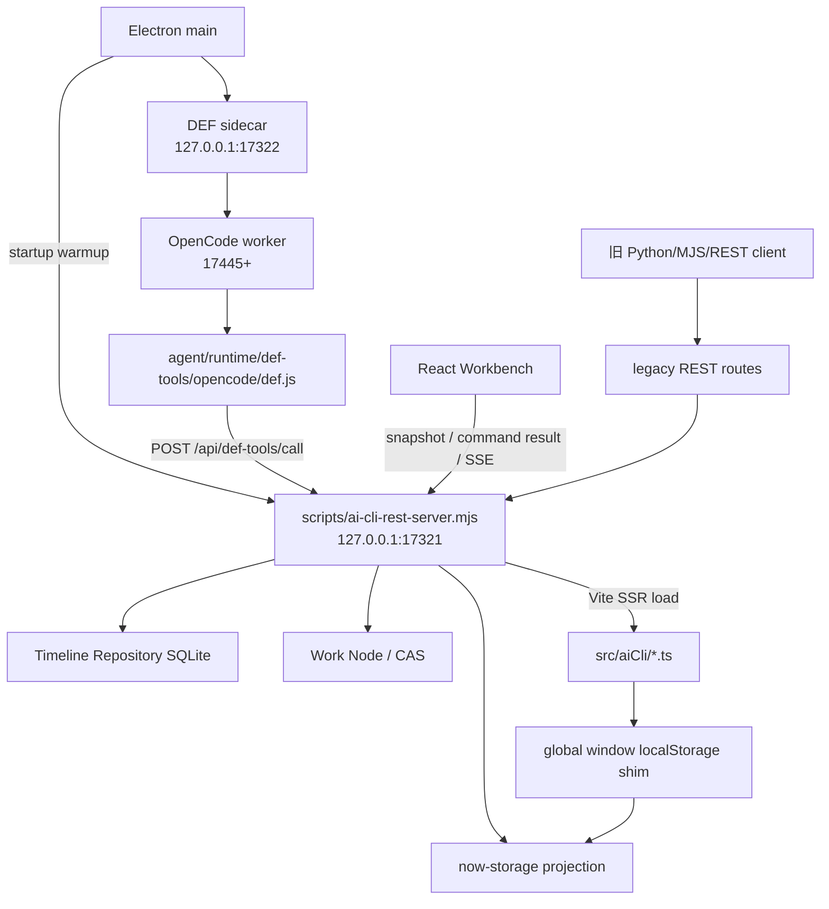
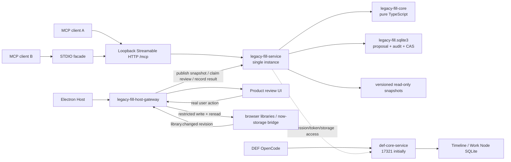

# Legacy AI CLI 独立化与 MCP 升级 Spec

> 状态：待审核；本轮仅完成调研与规格，不实施代码拆分。
> 日期：2026-07-19
> 硬约束：任何实现阶段都必须证明 DEF OpenCode 零行为变化；不得把旧 AI CLI 与 `17321` 上的 DEF 核心一起移除。

## 1. 结论摘要

本轮的核心结论是：`scripts/ai-cli-rest-server.mjs` 虽沿用 “AI CLI REST” 名称，但当前已经是 DEF OpenCode 的本地核心服务。它承载 Electron 启动预热、Workbench snapshot/current projection、Timeline Repository、Work Node/CAS、session/axis binding、typed-tool policy、approval capability、command/result/postcondition 等能力。`agent/runtime/def-tools/opencode/def.js` 的产品工具仍统一调用 `POST /api/def-tools/call`。因此不能删除整个脚本，也不能先迁走端口再补兼容。

目标方案是四层结构：

1. `legacy-fill-core`：纯 TypeScript、无浏览器和 transport 依赖，保存 schema、validator、normalizer、领域 adapter、proposal 与 review manifest 合同。
2. `legacy-fill-service`：单实例本地 daemon，持有独立 proposal SQLite、只读产品快照和 MCP server；MCP 只允许读取、校验、创建和审查 proposal。
3. `legacy-fill-host-gateway`：Electron/产品宿主唯一持有用户审批与最终写库能力，写后重读并发布版本变化。
4. `def-core-service`：继续承载全部 DEF typed-tool、Workbench、Timeline、Work Node、CAS、approval/governance 与内部 transport，初期继续监听 `127.0.0.1:17321`。

MCP transport 的推荐是：

- 桌面产品以**单实例 loopback Streamable HTTP** 为权威服务，便于多个外部 MCP client 共享 proposal 状态和 SQLite；
- 为只支持本地子进程配置的 client 提供**无状态 STDIO facade**，facade 只连接单实例 daemon，不拥有 proposal 状态；
- 不为每个 STDIO client 启动一套独立 proposal 服务；
- proposal 持久化不依赖实验性 MCP Tasks；
- 实现时锁定官方 TypeScript SDK 生产稳定的 `v1.x`，不在首轮迁移采用截至 2026-07-19 仍标为 pre-alpha 的 v2。

官方 MCP 规范说明 STDIO 由 client 启动子进程，而 Streamable HTTP 适合独立进程和多 client；本地 HTTP 还必须校验 Origin、只绑定 loopback 并认证连接。参考 [MCP transport 规范](https://modelcontextprotocol.io/specification/2025-11-25/basic/transports) 与 [官方 TypeScript SDK](https://github.com/modelcontextprotocol/typescript-sdk)。

## 2. 当前实现与依赖图

### 2.1 当前进程拓扑



### 2.2 `17321` 的实际启动与依赖

当前实现存在以下硬依赖：

- `electron/main.cjs` 的 `warmAiRuntimeAtStartup()` 先启动 `ai-cli-rest-server.mjs`，再启动 DEF sidecar，最后确保 OpenCode runtime；这属于产品启动与预热链路。
- `agent/server/def-agent-server.cjs` 在 `17321` 未就绪时也会启动同一脚本；native session binding、assert 与 context 调用依赖其 DEF routes。
- `agent/runtime/def-tools/opencode/def.js` 的 `callDefTool()` 默认请求 `http://127.0.0.1:17321/api/def-tools/call`，并传递 native session id；绝大多数 native typed tools 经此执行。
- Electron 和开发 bridge 将 `/api/main-workbench/*`、`/api/ai-timeline-worknodes*`、`/api/timeline-*` 作为受内部 token 保护的 renderer transport 转发到 `17321`。
- `scripts/ai-cli-rest-server.mjs` 当前约 8084 行，直接初始化 Timeline Repository、Work Node store、data-management service、approval capability、command SSE 与 Vite SSR loader。

因此，`17321` 的初次实现改动只能是**同端口、同路径、同错误语义的模块抽取**。重命名进程、脚本、环境变量或 health service 名称必须放到兼容期之后。

### 2.3 路由与职责现状

| 现有表面 | 当前职责 | 目标归属 | 首轮迁移要求 |
| --- | --- | --- | --- |
| `/api/def-tools/*` | typed-tool registry、policy、current gate、approval capability、tool execute | `def-core-service` | 路径和行为不变 |
| `/api/main-workbench/*` | snapshot/current projection、command queue/result/SSE、evidence | `def-core-service` | 继续内部 token 保护 |
| `/api/timeline-*` | documents、snapshots、work nodes、checkout ref、audit、bundle | `def-core-service` | Repository 与 SQLite 生命周期不变 |
| `/api/ai-timeline-worknodes*` | legacy Work Node transport/projection | `def-core-service` 兼容层 | 迁移期保持 |
| `/api/def-contract-test/*` | DEF 合同测试辅助 | `def-core-service` 测试表面 | 不进入 MCP |
| `/api/ai-cli/spec`、`/api/ai-cli/run` | 旧命令、协议说明、fill/proposal 兼容入口 | legacy 兼容代理 | 后续只转发，不双写 |
| `/api/{buff,weapon,operator,equipment}/*` | current/library/template/check/apply | `legacy-fill-service` | 保持旧响应直到调用方迁完 |
| `/api/agent/{guide,skills,sessions,logs,records,events}` | 旧 Agent session、记录、SSE、知识说明 | legacy 兼容/归档 | 不作为 MCP 核心合同 |
| `/api/agent/scripts/*` | 临时 JSON 脚本写入与执行 | 归档/移除 | MCP 永不提供脚本执行 |
| `/health` | 混合 DEF 与 legacy 诊断 | 初期仍是 DEF core health | 兼容期后再更名 |

### 2.4 浏览器 TypeScript 耦合

`scripts/ai-cli-rest-server.mjs` 当前通过 Vite SSR 动态加载：

- `src/aiCli/aiCliRestAdapter.ts`；
- `src/aiCli/buffFillAdapter.ts`；
- `src/aiCli/aiCliAgentInfrastructure.ts`。

为了让这些浏览器模块在 Node 中运行，服务先安装 `globalThis.window.localStorage/sessionStorage` shim。四个 fill adapter 和 proposal infrastructure 都直接读写 `window.localStorage`。主要 key 包括：

- `def.buff-editor.draft.v1`、`def.buff-editor.library.v1`、`def.buff-editor.undo.v1`；
- `def.weapon-sheet.draft.v1`、`def.weapon-sheet.library.v1`；
- `def.operator-editor.draft.v1`、`def.operator-editor.library.v1`；
- `def.equipment-sheet.draft.v1`、`def.equipment-sheet.library.v1`；
- `def.ai-agent.session.v1`、`def.ai-agent.operation-logs.v1`、`def.ai-agent.permission-profiles.v1`、`def.ai-agent.proposals.v1`。

现有 `AgentFillDomainAdapter` 同时包含 `validateAiDraft`、`applyToWorkingState` 和 `saveToLocalTruth`。这正是必须切开的边界：validator/normalizer 可进入 `legacy-fill-core`，浏览器草稿写入和 library 保存必须进入 Host adapter，不能由 MCP adapter 继承。

### 2.5 Proposal 与 `/ai-cli` 的当前可达性

旧代码仍实现两段状态：

```text
Wait/Wait --approve or Y--> Yes/Wait --save or Y--> Yes/Yes
          --reject or N--> No/No
                          --unsave or N--> Yes/No
```

REST 明确拒绝 `proposal.approve`、`proposal.reject`、`proposal.save`、`proposal.unsave`、`Y`、`N`；`fill.apply` 只创建 proposal。`proposal.list/show/clear` 仍可通过旧命令表面调用。

但当前源码还显示：

- `src/components/AiCliPage.tsx` 只渲染 `DefOpenCodeView host="ai-cli"`，即原生 OpenCode iframe，不再渲染旧终端组件；
- `importExternalProposals()` 保留在 `aiCliAgentInfrastructure.ts`，但仓库内没有生产调用点；
- `/api/agent/events` 仍广播旧 proposal/session 记录。

这意味着旧文档中的 “Web CLI 自动导入 proposal，再 Y → Y” 必须被当作**待冻结验证的兼容合同**，不能未经调用方清单和真实 UI 验证就假设仍完整可达。迁移 Task 0 必须记录：哪些外部脚本仍在用 REST、哪些产品 UI 仍能审核、哪些只是残留代码。这个发现不授权本轮修改或删除任何旧实现。

## 3. DEF core 与 legacy AI CLI 的精确边界

### 3.1 必须留在 DEF core 的能力

- Electron 启动、预热、health 与进程回收所需能力；
- native OpenCode session create/recover/bootstrap；
- Workbench timeline admission 与 formal/non-temporary workspace gate；
- session/axis binding、assert、unbind；
- current checkout context 和 snapshot/current projection；
- `DEF_TOOL_DEFINITION_BASE`、registry、route map、host exposure 与 governance policy；
- 所有 native typed tools 及其结构化错误；
- Work Node fork/materialize/status/rebuild/discard/sync/validate/diff/use/restore；
- native permission、approval request/decision/capability 与一次性消费；
- command queue、result、SSE、postcondition 与 rollback evidence；
- Timeline Repository、Work Node store、SQLite migration、audit 与数据生命周期；
- Interop/Harness 黑盒路径需要的内部 transport；
- `DEF_INTERNAL_GOVERNANCE_TOKEN` 及 raw transport policy。

### 3.2 可迁入 legacy fill 的能力

范围严格限制为：

- 读取 Host 发布的版本化 current/library 快照；
- 搜索 library；
- 读取 domain schema/template；
- 读取筛选后的填写策略与 golden examples；
- normalizer、validator 与 draft/proposal 构造；
- 创建持久化 proposal；
- 列出和读取 proposal 状态与完整 review manifest。

### 3.3 不可整体复用的旧模块

不能把 `src/aiCli` 整个文件夹原样搬进 MCP：

- `aiCliCommandService.ts` 同时包含旧编辑命令、浏览器事件、sessionStorage 选择态、proposal 审批与真正 library 写入；
- `aiCliRestAdapter.ts` 混合 legacy endpoints、DEF endpoint 文档和 now-storage emergency fallback；
- 各 fill adapter 把 schema/validation 与 localStorage writer 放在同一对象；
- `aiCliAgentInfrastructure.ts` 把 proposal、session、permission profile 和浏览器存储绑在一起。

正确做法是按函数职责抽取纯逻辑，并以冻结 fixture/contract 对比确认行为相同；旧 writer 只作为 Host adapter 的迁移来源，不进入 MCP 进程。

### 3.4 永不进入 MCP 的能力

- proposal approve/reject/save/unsave、Y/N；
- 直接 localStorage、sessionStorage 或 now-storage 写入；
- DEF session/axis binding、current checkout、Work Node、Timeline、CAS；
- DEF approval/capability/governance token；
- Workbench command queue 或任何 mutation；
- 任意脚本执行、shell、任意文件读写、项目源码读取；
- 原生 OpenCode permission 代理；
- MCP client 提供的任意 path 读取。

共享 Buff/Weapon/Operator/Equipment 产品数据是允许的，但只能通过 Host 发布的只读快照；共享 DEF session、上下文、审批状态或工作树不允许。

## 4. `/Users/sailstellar/Desktop/agent填表数据工具` 审计

### 4.1 结论

该目录是旧 REST API 的下游消费者、案例与个人经验工作区，不是 DEF OpenCode 核心依赖。审计时目录约 2.3 MB、78 个文件，其中顶层包含 34 个 Python、28 个 JSON、4 个 Markdown、3 个文本、1 个 MJS、1 个 shell、`__pycache__` 与 `.DS_Store`；至少 27 个文件硬编码 `127.0.0.1:17321`。

典型证据：

- `common_http.py` 将 `BASE` 固定为 `http://127.0.0.1:17321`，封装 GET、POST 和 `/api/ai-cli/run?client=web-cli`；
- 大量 `fill_*.py`、`*_submit.py` 和修复脚本直接调用 domain fill check/apply；
- JSON 文件包含历史请求、完整 library dump、proposal 响应和个人草稿；
- 存在 Windows 绝对路径残留和编码异常文件名；
- `CLAUDE.md` 同时包含协议事实、路径、操作流程和填写策略。

### 4.2 迁移分类

| 内容 | 处理方式 | 原因 |
| --- | --- | --- |
| `CLAUDE.md` 协议/endpoint/schema 部分 | 不迁移为独立事实源 | 必须由 core schema、tool contract 与生成文档产生 |
| `CLAUDE.md` 填写策略 | 人工筛选后进入版本化 guide resource | 策略可复用，但必须标注不是协议 |
| `golden-examples.md` | 迁入版本化 fixtures/resources，逐例绑定 schema version | 当前已有实际经验价值 |
| `common_http.py` | 由 MCP client 配置和 tools/resources 替代 | 不再维护硬编码 REST helper |
| 历史 Python/MJS | 归档或删除，不进入发布包 | 不能演变为任意脚本执行能力 |
| 请求 JSON、library dump、草稿、问题记录 | 仅按明确用例人工提炼，默认不发布 | 含个人数据、过期 schema 和重复事实 |
| `__pycache__`、`.DS_Store`、绝对路径/异常文件名 | 明确排除 | 发布卫生与隐私边界 |

### 4.3 仓库内重复 Skill

`agent/runtime/def/skills/akedatabase-fill-tool` 当前复制了该目录的知识：

- `references/golden-examples.md` 与桌面文件 SHA-256 完全一致；
- `references/CLAUDE.md` 是另一份稍旧副本，已经与桌面文件产生漂移；
- `SKILL.md` 仍把 `GET /api/ai-cli/spec` 和 Web CLI proposal 流程作为事实来源。

迁移完成后，该 Skill 只能保留为轻量 MCP 路由说明，例如“何时读取哪个 MCP resource、何时调用哪个 tool、不得审批或保存”；协议 schema、字段白名单和 validator 文案不得再复制。若 OpenCode 已能直接发现 MCP 能力且该 Skill 不再提供额外策略价值，则在单独确认后移除 Skill。不得把开发 Codex 的 `.agents/skills/**` 与这个产品运行时 Skill 混放或互相引用。

## 5. 目标架构与进程边界



### 5.1 `legacy-fill-core`

纯 TypeScript，允许依赖共享领域 type/normalizer，但不得依赖：

- `window`、DOM、localStorage/sessionStorage；
- Electron、IPC；
- Node HTTP、MCP transport；
- DEF Work Node、session binding、Timeline Repository；
- 具体文件路径或 SQLite driver。

建议边界：

```text
legacy-fill-core/
  domains/{buff,weapon,operator,equipment}/
  schema/
  validation/
  proposal/
  review-manifest/
  ports/storage.ts
  ports/snapshot.ts
```

### 5.2 `legacy-fill-service`

- Electron 启动并回收的单实例独立进程；
- 自己的 health、日志、SQLite 和 schema migration；
- MCP Streamable HTTP endpoint 与可选 STDIO facade；
- 兼容 REST adapter 可暂时与 daemon 同进程，但必须只是 tool/core 的薄适配层；
- 不加载 Vite，不安装 `window` shim，不读取应用源码；
- 不持有 DEF internal token；
- 不写 product storage。

### 5.3 `legacy-fill-host-gateway`

Host gateway 由 Electron/产品宿主持有，提供两类内部能力：

1. **只读发布**：从真实产品状态生成版本化快照，向 fill service 发布；
2. **受限提交**：只接受已经在产品 UI 中由真实用户确认、且 proposal revision/digest/base revision 均匹配的提交。

Host gateway 必须：

- 校验 proposal 和 review manifest 完整性；
- 显示规范化 payload、逐字段 diff、警告、证据和目标库；
- 以 CAS 检查 base library revision；
- 调用领域专用 writer，而不是通用 storage setter；
- 写后重新读取目标条目并计算 postcondition；
- 只有 postcondition 通过后才能标记 saved；
- 发布 `library.changed` 事件和新 revision/snapshot；
- 失败时保留可重试但不可假装成功的审计状态。

### 5.4 `def-core-service`

第一阶段只做同进程模块化，不改变：

- 可执行入口、端口 `17321`、health 路径；
- Electron 与 sidecar 的启动/预热顺序；
- `DEF_REST_BASE_URL`；
- `/api/def-tools/call`、raw transport 与 header；
- Repository 文件位置和 migration；
- tool registry、错误码、审批 capability；
- renderer command/result/SSE。

HTTP handler 应逐步变成薄 adapter，核心 state/handler 提取为显式 module；但此重构不是把 DEF core 搬到 legacy service。

## 6. 数据与存储边界

### 6.1 只读产品快照

Host 发布 `LegacyFillSnapshotV1`：

```ts
type LegacyFillSnapshotV1 = {
  manifestVersion: 1;
  snapshotId: string;
  generatedAt: string;
  source: 'electron-host';
  domains: Record<FillDomain, {
    schemaVersion: string;
    revision: number;
    contentHash: string;
    current: unknown;
    library: unknown;
  }>;
};
```

要求：

- revision 由 Host 单调递增，hash 由 canonical JSON 计算；
- snapshot 只包含 fill 所需数据，不含 Timeline、selected checkout、DEF session 或 governance 数据；
- proposal 必须记录 `snapshotId`、domain revision、content hash 和 schema version；
- 新 snapshot 发布后，基于旧 revision 的 proposal 可以继续查看，但 Host 保存时必须 fail-closed 或要求重新基线化；
- MCP 不得通过 path 参数读取 snapshot 之外的文件。

### 6.2 Proposal SQLite

Proposal 使用独立数据库，例如 `<userData>/data/localdata/legacy-fill.sqlite3`。不得复用 Timeline Repository SQLite，也不得把 proposal 行写入 DEF audit 表。

最低表：

- `fill_snapshots`：已发布 snapshot 元数据与受限 payload/cache；
- `fill_proposals`：owner、domain、payload、base identity、review/save 状态、revision、digest；
- `fill_proposal_events`：append-only audit；
- `fill_idempotency_keys`：owner + operation + key 唯一；
- `fill_schema_meta`：数据库 migration version。

每次 proposal 状态变更必须在单事务中执行 `expectedRevision` CAS，并追加 audit event。SQLite 使用 WAL、foreign keys、busy timeout 和明确的进程所有权；外部 client 不直接打开 DB。

### 6.3 owner 与 session namespace

- MCP transport session id 只用于 transport 生命周期，不作为 proposal owner；
- proposal owner 是 Host/配置签发的 `ownerNamespace`，至少包含 client installation id 和产品 profile/workspace id；
- 同一 owner 的重试通过 idempotency key 去重；不同 owner 不能 list/inspect 对方 proposal，除非 Host UI 以内部权限聚合；
- DEF OpenCode session id、axis binding id、timeline id 不得出现在 owner namespace；
- Host claim proposal 时记录独立 `reviewSessionId`，该 id 也不是 DEF session。

### 6.4 now-storage 与 localStorage 方向

当前 `localDataBridge` 的一般启动方向是 browser storage → now-storage；只有 Host 明确设置 `forceApply` 时才执行 now-storage → browser，并保护 SQLite workspace session。拆分期间不改变这一产品语义。

新边界规定：

- MCP 永不读写 now-storage 文件或浏览器 localStorage；
- Host 从已加载的产品状态生成 snapshot；
- 最终保存由 Host 的领域 writer 写 browser library，写后重读；
- 后续 browser → now-storage 镜像仍由现有 Host bridge 负责；
- 应用数据包触发的 now-storage → browser 完成后，Host 必须发布新 revision，使旧 proposal 失效；
- 兼容 REST 与 MCP 不能各写一份 proposal/product data，不允许双写；
- “将 localStorage 主库整体迁到 SQLite”是另一轮产品数据规格，不在本轮顺带决定。

## 7. MCP resources 与 tools 合同

### 7.1 Resources

建议 URI；实现可在不改变职责的前提下调整名称：

| Resource | 内容 | 可变性 |
| --- | --- | --- |
| `legacy-fill://snapshot/{snapshotId}/{domain}/current` | 指定快照的当前草稿 | immutable |
| `legacy-fill://snapshot/{snapshotId}/{domain}/library` | 指定快照的 library | immutable/paged |
| `legacy-fill://schema/{schemaVersion}/{domain}` | 从 core 生成的 JSON Schema | immutable |
| `legacy-fill://template/{schemaVersion}/{domain}` | 从 schema 生成的最小模板 | immutable |
| `legacy-fill://guides/strategy/{guideVersion}` | 筛选后的填写策略 | versioned |
| `legacy-fill://examples/{fixtureVersion}/{domain}` | 已验证 golden fixtures | versioned |
| `legacy-fill://proposals/{ownerNamespace}/{proposalId}/review` | 完整 structured review manifest | revisioned |
| `legacy-fill://proposals/{ownerNamespace}/{proposalId}/status` | proposal 状态与 audit 摘要 | revisioned |

Resources 不能包含绝对文件路径、DEF internal token、任意源码或未筛选历史目录内容。

### 7.2 Tools

所有 tool 必须同时定义 input schema、output schema、结构化错误和 size/page 限制。

#### `fill_get_current`

输入：`domain`、可选 `snapshotId`。
输出：`snapshotId`、`schemaVersion`、`revision`、`contentHash`、`current`。
语义：只读；省略 snapshot 时返回 Host 最新发布版本。

#### `fill_search_library`

输入：`domain`、`query`、`cursor?`、`limit`、`snapshotId?`。
输出：稳定排序的摘要、cursor、snapshot identity；inspect 单项时可返回完整条目。
语义：只搜索已发布 snapshot，不跨到 DEF current checkout。

#### `fill_get_template`

输入：`domain`、可选 `schemaVersion`。
输出：schema URI、template、字段约束、策略与协议的分离标记。
语义：模板必须由 core schema 生成，不能手抄 `CLAUDE.md`。

#### `fill_validate`

输入：`domain`、`draft`、`schemaVersion`、可选 `baseSnapshot`。
输出：`valid`、normalized draft、errors、warnings、validation digest。
语义：无写入；同一输入产生稳定规范化结果。

#### `proposal_create`

输入至少包含：

```ts
{
  ownerNamespace: string;
  idempotencyKey: string;
  domain: FillDomain;
  schemaVersion: string;
  baseSnapshot: { snapshotId: string; revision: number; contentHash: string };
  draft: unknown;
  intent?: string;
  evidence?: Array<{ label: string; text: string; source?: string }>;
}
```

输出：`proposalId`、`proposalRevision`、`reviewManifestUri`、`statusUri`、`created|duplicate`。
语义：服务端重新 validate/normalize；同 owner + idempotency key + request digest 只创建一次。相同 key 不同 digest 返回 conflict，不覆盖旧 proposal。

#### `proposal_list`

输入：owner、状态 filter、domain、cursor、limit。
输出：proposal 摘要、revision、base staleness、review/save 状态。
语义：只能读取 owner namespace 内的 proposal。

#### `proposal_inspect`

输入：owner、proposal id、可选 expected revision。
输出：完整 review manifest、validation、audit 摘要、状态。
语义：只读，不 claim、不批准、不保存。

### 7.3 明确不存在的 MCP tools

以下名称和等价语义都禁止注册：

- `proposal_approve`；
- `proposal_reject`；
- `proposal_save`；
- `proposal_unsave`；
- `direct_localstorage_write`；
- `now_storage_write`；
- `script_run`、`file_read`；
- 任何 DEF tool 代理。

普通模型连续调用任何允许的 tools，都只能得到一个可审核 proposal，不能改变 product library。

## 8. Proposal review manifest 与状态机

### 8.1 `ProposalReviewManifestV1`

```ts
type ProposalReviewManifestV1 = {
  manifestVersion: 1;
  proposalId: string;
  proposalRevision: number;
  ownerNamespace: string;
  domain: FillDomain;
  operation: 'upsert';
  createdAt: string;
  schemaVersion: string;
  baseSnapshot: {
    snapshotId: string;
    revision: number;
    contentHash: string;
  };
  target: { id: string; displayName?: string; existsInBase: boolean };
  intent?: string;
  summary: string;
  normalizedDraft: unknown;
  diff: Array<{
    path: string;
    kind: 'add' | 'replace' | 'remove';
    before?: unknown;
    after?: unknown;
  }>;
  validation: {
    valid: boolean;
    errors: Array<{ code: string; path?: string; message: string }>;
    warnings: Array<{ code: string; path?: string; message: string }>;
    digest: string;
  };
  evidence: Array<{ label: string; text: string; source?: string }>;
  requestedWrites: Array<{ storageDomain: FillDomain; targetId: string }>;
  review: { status: 'pending' | 'approved' | 'rejected'; decidedAt?: string };
  persistence: { status: 'not-requested' | 'pending' | 'saved' | 'failed'; verifiedRevision?: number };
  manifestDigest: string;
};
```

manifest digest 覆盖 base identity、normalized draft、diff、validation 与 requested writes。Host UI 必须展示 digest 对应的内容；用户确认后若 proposal revision/digest 或 product revision 变化，原确认失效。

### 8.2 状态所有权

```text
MCP proposal_create
  -> review=pending, persistence=not-requested

Host UI claim + user approve
  -> review=approved, persistence=not-requested

Host UI user save
  -> persistence=pending
  -> Host CAS write
  -> reread/postcondition pass
  -> persistence=saved

user reject
  -> review=rejected, persistence=not-requested
```

初次迁移保留旧 Y → Y 的“两步意图”，但交互只能发生在 Host UI，不能通过 REST/MCP 文本命令。未来是否合并为一个“审核并保存”动作属于产品决策；无论 UI 是一步还是两步，Host 仍是唯一状态转换者和 writer。

## 9. Transport 与本地桌面安全

### 9.1 选择

| 方案 | 优点 | 风险 | 决策 |
| --- | --- | --- | --- |
| 每 client 一套 STDIO server | client 配置简单、无监听端口 | 多实例状态分裂、进程回收分散、SQLite 并发/迁移复杂 | 不作为权威服务 |
| 单实例 Streamable HTTP | 多 client 共享状态、Host 生命周期清晰、易做审计/兼容代理 | 必须解决 loopback 认证、Origin/Host、端口发现 | 作为权威服务 |
| 单实例 HTTP + STDIO facade | 同时覆盖多 client 与只支持 STDIO 的 client | 多一个薄适配层 | 推荐目标 |

### 9.2 安全合同

- HTTP 只绑定 `127.0.0.1`，不绑定 `0.0.0.0` 或 LAN；
- 校验 `Origin` 和 `Host`，默认拒绝浏览器任意跨源；
- 每个 client 使用独立 bearer/capability，不使用 `DEF_INTERNAL_GOVERNANCE_TOKEN`；
- token 不出现在 resources、tool output、URL query、日志和 proposal audit；
- Host internal gateway 使用独立高权限 channel/capability，普通 MCP transport 不可访问；
- 设置 request body、library page、proposal payload、evidence 和并发上限；
- schema validation 在 transport 边界和 core 边界各执行一次；
- 进程退出由 Electron 回收，in-flight proposal create 依靠 DB transaction/idempotency 恢复；
- STDIO facade 的 stdout 只输出 MCP JSON-RPC，日志只写 stderr；
- 不启用 MCP sampling、elicitation 或 Tasks 来绕过 Host 审批。

## 10. 兼容迁移方案

不允许大爆炸重写。顺序如下：

### Phase 0：冻结现状

- 枚举所有 legacy endpoint、storage key、proposal 状态、下游脚本与生产调用点；
- 对 REST 读、check、apply、proposal list/show 建立 golden wire fixtures；
- 单独记录当前 `/ai-cli` 和 proposal import 的真实可达性；
- 建立 DEF baseline：tool registry、route map、health、SQLite schema/version、关键黑盒案例。

### Phase 1：先为 DEF core 建立模块边界

- 从 8000 行脚本中提取 DEF handler/state/repository composition；
- 保持原入口、端口、path、env、token、错误与启动顺序；
- 不迁移 legacy 行为，不改 tool definition。

### Phase 2：抽取 browser-neutral fill core

- 从四个 adapter 提取 schema、validator、normalizer、diff 与 proposal contract；
- localStorage writer 留在旧 Host adapter；
- 以冻结 fixture 做行为对比，不做大规模新测试。

### Phase 3：引入独立 storage port 与 proposal repository

- 建立 browser localStorage、now-storage projection、Host gateway、SQLite proposal adapter；
- proposal DB 独立于 DEF DB；
- 先 shadow-read/compare，不切 writer。

### Phase 4：启动独立 legacy fill daemon

- Electron 单实例启动、health、回收与端口发现；
- Host 发布只读 snapshot；
- daemon 不持有 product writer 和 DEF token。

### Phase 5：将旧 REST routes 改为兼容代理

- `17321` legacy route 或单独 compatibility listener 转发到新 service；
- 同一 request 只能有一个 proposal writer；
- 保持旧 response shape/idempotency 映射；
- 旧 `proposal.clear` 只可在 compatibility REST 中将调用者 legacy owner 下的 pending proposal 记为取消/拒绝，不进入 MCP，也不能批准或保存；
- 禁止旧/新双写。

### Phase 6：建立 MCP resources/tools

- 先上 read/template/validate；
- 再上 proposal create/list/inspect；
- 负向证明 MCP 无 approve/save/localStorage/DEF 能力。

### Phase 7：Host review/save 闭环

- 产品 UI 展示完整 manifest；
- 真实用户确认；
- Host CAS 写、重读、postcondition、事件；
- stale proposal 必须重新生成或显式 rebase。

### Phase 8：迁移调用方与知识

- 外部目录改用 MCP，历史脚本归档；
- AKEDatabase Skill 简化为 MCP 路由说明；
- schema/template/guide/example 各有唯一版本源。

### Phase 9：移除 legacy 表面

仅在用户确认产品迁移策略、调用方清零和可回滚版本发布后：

- 移除 legacy REST fallback；
- 移除旧 Y/Y 命令和遗留 Web CLI proposal 路径；
- 再考虑将 “AI CLI REST” 重命名为 DEF local core service。

## 11. 降级与回滚

- 每个 phase 单独提交，禁止一个提交同时迁 DEF core、legacy writer 和 UI；
- DEF core 模块抽取可通过恢复旧 composition 入口回滚，不回滚 Repository 数据；
- daemon 切换使用明确 feature flag，失败时 legacy REST 可回到冻结实现，但不得与新 service 同时写；
- proposal SQLite migration 前备份，migration 单事务；失败时保留旧 DB 和 proposal export；
- Host writer 切换前保留旧领域 writer adapter，按 proposal `originVersion` 选择唯一处理器；
- 新 MCP 不可用时，DEF OpenCode 仍必须完整启动和工作；legacy fill 进入 unavailable/read-only，不得拖垮 `17321`；
- stale snapshot、CAS conflict、postcondition failure 都 fail-closed，不自动覆盖；
- 兼容代理可延长但不允许 silent fallback 后双写；
- service rename 是最后一步，出现 sidecar/packaged regression 时恢复旧脚本名、env 与 health service label。

## 12. 非目标

本 Spec 不做：

- 本轮实施任何代码拆分；
- 改变 DEF typed tool 名称、schema、policy、approval 或行为；
- 把 legacy fill 变成 DEF Work Node 工具；
- 允许 MCP 修改当前排轴或配置；
- 允许外部 agent 最终审批/保存；
- 把外部工具目录整体打包；
- 引入任意脚本执行或任意文件读取；
- 以 MCP Tasks 替代 proposal DB；
- 顺带迁移所有产品 localStorage 到 SQLite；
- 立即删除 `/ai-cli`、legacy REST 或重命名 `17321`；
- 修改现有 Spec 的完成状态；
- 以端口存活或 API 单测替代 DEF Agent 黑盒验收。

## 13. 可验证验收标准

### 13.1 架构与安全

- `legacy-fill-core` 可在无 `window`、无 Electron、无 HTTP/MCP 的 Node 测试环境导入；
- MCP tool/resource 清单只有本 Spec 允许的能力；
- 普通 MCP client 无法发现或调用 approve/save/direct-write/script/file/DEF tool；
- proposal 在重启后保留 owner、revision、CAS、audit 与 idempotency；
- 两个 MCP client 看到同一 owner namespace 的一致 proposal 状态；
- 不同 owner 不能互读；
- stale base revision 保存失败且 library 不变；
- Host 保存后重读通过，library revision 单调增加并发布变化事件；
- compatibility proxy 与 MCP 同时存在时，每次请求只有一个 writer；
- 安装包不包含外部目录的缓存、草稿、绝对路径残留或历史脚本。

### 13.2 Legacy 行为

- current/library/template/check/apply 的冻结兼容 fixture 在代理期保持；
- `fill.apply` 仍只创建 proposal；
- REST/MCP 均不能执行 approval/save；
- proposal list/inspect 展示完整 review manifest；
- AKEDatabase 策略、golden example、schema 分别有明确版本与事实源。

### 13.3 DEF OpenCode 零行为变化矩阵

涉及 DEF agent/typed tools 的验证必须执行 `docs/testing/def-agent-blackbox.md`。Mac 桌面使用 `DefCodexInteropProtocol v1` 的 status → authorize → turns/events/transcript/questions/state，并用 Computer Use 只确认真实 iframe 可见；不得以旧 `/def-agent/workbench-test/prompt`、端口存活或单元测试代替。

| DEF 行为 | 不变量 | 每个关键阶段的证据 |
| --- | --- | --- |
| runtime 启动与预热 | Electron 仍按原顺序启动 `17321`、sidecar、OpenCode；已运行实例不被普通验证重启 | startup log + v1 status ready + UI 可见 |
| native session create/recover | host/profile/harness/session directory 与恢复行为不变 | 创建与恢复各一例，记录 session id/transcript |
| Timeline admission | temporary/缺失 workspace 继续 fail-closed；formal SQLite workspace 可进入 | v1 state + admission structured result |
| session/axis binding | bind/assert/unbind、timeline/checkout identity 不变 | binding contract + v1 state，禁止只看 HTTP 200 |
| current checkout context | model 读取到的 snapshot/checkout 与 UI 一致 | typed read result + v1 transcript/state + UI spot check |
| 所有 native typed tools | registry、schema、host exposure、错误码和执行路径不变 | registry/route-map diff 为零；按风险族抽样自然话术黑盒 |
| Work Node 全链路 | fork/materialize/sync/validate/diff/use/restore、revision/CAS 不变 | 相关 contract/smoke + 自然话术黑盒；mutation 记录当前状态变化 |
| OpenCode native permission | 原生 permission card、拒绝/批准与 question state 不变 | v1 questions + transcript + UI card |
| approval capability | session/axis/timeline/plan/revision/hash 绑定、一次性和过期语义不变 | capability contract + approved/rejected/stale cases |
| command/result/postcondition | canonical admission、queue、renderer result、verify/postcondition 不变 | events/tool result/state，不能只证明 enqueue |
| Timeline Repository/SQLite | 文件位置、schema migration、transaction、checkout ref、audit 生命周期不变 | repository smoke + restart/recovery + 数据计数 |
| Interop/Harness | v1 turn correlation、events、questions、state、Harness pinning/rollback 不变 | `docs/testing/def-agent-blackbox.md` Required Record 完整记录 |
| packaged runtime | sidecar bundle/SSR/runtime paths 与进程回收不回退 | packaged-sidecar smoke + 打包版最小原生 turn/tool call |

退出规则：任何一行出现不清楚、重复 tool activity、session mismatch、permission 异常或数据差异时，先按黑盒文档收集 events/transcript/questions/state，不重复发送同一 prompt；本阶段不得继续切流。

## 14. 未决设计选择

以下内容需要在对应 coding task 开始前由产品/实现评审确认，但不改变本 Spec 的安全边界：

1. Host review UI 初版保留“两次确认”还是合并为一次“审核并保存”；默认兼容策略是保留两段状态。
2. Streamable HTTP 的端口发现使用 Electron bridge registry、固定端口还是受控动态端口；无论选择哪种，都不得复用 `17321` 或 DEF token。
3. 首批外部 client 是否都支持 Streamable HTTP；不支持者启用 STDIO facade，facade 仍不得成为第二个状态实例。
4. proposal 与 audit 的保留期、导出与用户清理 UI。
5. golden examples 首批纳入哪些案例，以及每个 fixture 绑定哪个 schema version。
6. 兼容代理移除和旧 `/ai-cli` proposal 路径退役的产品版本窗口。
7. “AI CLI REST” 最终名称与脚本路径；只能在所有旧调用方迁移后决定。
