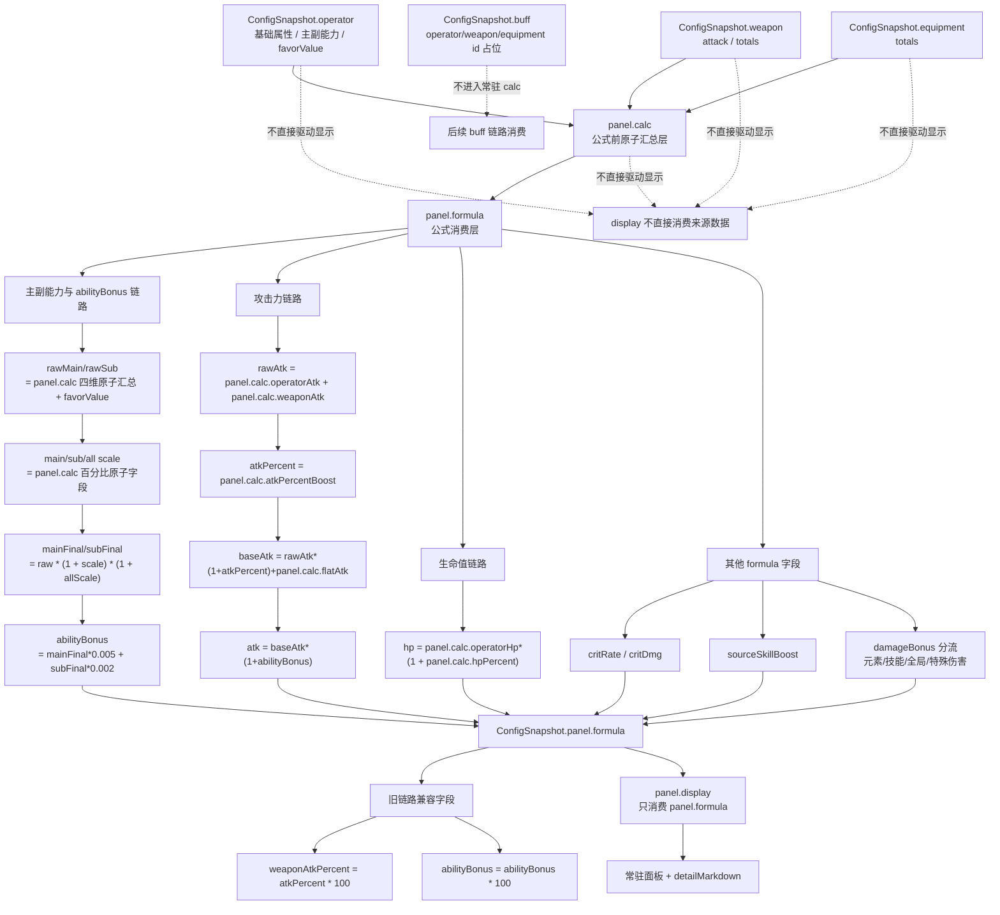

# OperatorConfigPage 面板数据显示与计算逻辑 Phase 3 Spec

## Why

Phase 2 已让 `OperatorConfigPage` 接入主界面角色上下文、`operator-studio` 本地角色数据、武器数据、装备数据和技能详情数据。

Phase 3 的目标是继续完善这个界面的显示内容和计算逻辑：页面需要能返回主界面，需要保持现有 UI 布局不变，并将当前“基础数据”标题改为“面板数据”可点击入口，点击后用 markdown 弹窗展示旧 `operator-panel` 信息区那类详细面板说明。同时，面板数据不能继续散落在页面组件里计算，必须从旧 `operator-panel` 的规则中提炼出独立计算服务。

## Current Findings

- 旧 `operator-panel` 主要实现位于 `src/components/CanvasBoard/components/OperatorConfigPanel.tsx`。
- 旧面板计算规则基本可参考，但代码质量不适合直接搬入新页面。
- 当前没有独立维护的 `operator panel utils`。
- 已有底层计算相关模块位于 `src/core/calculators` 和 `src/core/services`，例如 `buffCalculator.ts`、`skillButtonDamageCalculatorV2.ts`、`damageReportService.ts`。
- 旧 `OperatorConfigPanel.tsx` 中的面板计算逻辑应作为规则参考，而不是作为新实现的长期依赖。
- 旧 `panelSnapshot / infoSnap / infoSnapshot` 只作为字段和展示参考，不作为 Phase 3 目标结构。
- Phase 3 SHALL 重新定义 `ConfigSnapshot`。
- 后续命名统一使用 `operator`，不再新增 `character` 命名。

## What Changes

- `OperatorConfigPage` SHALL 增加返回按钮，点击后回到主界面。
- 当前“面板数据”栏 UI SHALL 保持现有布局不变。
- 当前“基础数据”四个字 SHALL 改为“面板数据”，并变为可点击入口。
- 点击“面板数据”标题 SHALL 打开 markdown 详情弹窗。
- markdown 详情弹窗 SHALL 展示旧 `operator-panel` 信息区同类详细面板说明。
- 角色等级按钮 SHALL 保留现有 8 个按钮布局。
- `30 / 50 / 70` 等级按钮 SHALL 显示但禁用，不允许点击。
- 面板数据 SHALL 基于当前 operator、等级、武器、装备、技能配置计算。
- 面板计算 SHALL 抽离到独立 service 或 calculator，不继续写在 `OperatorConfigPage.tsx` 中。
- 面板计算 SHALL 输出新的 `ConfigSnapshot`。

## Scope

本阶段处理：

- 返回主界面入口。
- “面板数据”标题点击入口。
- 面板详情 markdown 弹窗内容。
- 当前可用等级档位规则。
- 面板计算规则。
- 面板计算代码结构边界。
- 面板快照输出结构。

本阶段不处理：

- 新增独立角色选择器。
- 改主界面选人流程。
- 改角色区等级按钮数量。
- 改技能区高度、槽位、尾标布局。
- 对 `30 / 50 / 70` 做插值、向上取值或向下取值计算。
- 重写旧 `OperatorConfigPanel` 全部 UI。
- 完整接入所有条件触发 buff。
- 装备三件套/套装效果。

## Requirements

### Requirement: 返回主界面

系统 SHALL 在 `OperatorConfigPage` 提供返回主界面的按钮。

#### Scenario: 点击返回

- WHEN 用户点击返回按钮
- THEN 页面导航到主界面路由 `APP_ROUTE_PATHS.home`
- AND 不清空 `OperatorConfigPage` 当前缓存
- AND 不清空主界面已选角色集合
- AND 不改变当前角色配置

#### Scenario: 路由实现

- WHEN 实现返回按钮
- THEN 使用现有 `navigateToAppPath(APP_ROUTE_PATHS.home)`
- AND 不手写 hash 字符串

### Requirement: 面板数据栏与详情入口

系统 SHALL 保持当前数据栏 UI 布局不变，将标题从“基础数据”改为“面板数据”，并将该标题作为详情入口。

#### Scenario: 常驻 UI 不变

- WHEN 页面渲染当前角色上方数据区
- THEN 现有数据栏布局保持不变
- AND 标题文案显示为“面板数据”
- AND 不新增常驻字段
- AND 不改变该栏高度
- AND 不改变角色区、技能区、装备区、武器区既有布局

#### Scenario: 打开入口

- WHEN 用户点击 `面板数据` 标题文字
- THEN 页面打开面板详情弹窗

#### Scenario: 标题可点击表现

- WHEN 页面渲染 `面板数据` 标题
- THEN 标题应有可点击状态
- AND 点击区域仅限标题或标题同级的明确入口
- AND 不把整块面板数据栏变成按钮

### Requirement: 显示字段与存储字段分离

系统 SHALL 区分 `ConfigSnapshot` 存储字段和页面显示字段。

#### Scenario: 字段职责

- WHEN 定义 `ConfigSnapshot`
- THEN `ConfigSnapshot` 保存计算和后续链路消费需要的规范字段
- AND 显示字段由展示层从 `ConfigSnapshot` 派生
- AND 显示字段不等于存储字段
- AND 存储字段不得因为当前 UI 不直接显示而丢失

#### Scenario: 显示映射

- WHEN 页面渲染常驻面板区域或 markdown 详情
- THEN 通过显示映射读取 `ConfigSnapshot.panel.formula`
- AND 显示映射可以分组、换名、合并或隐藏字段
- AND 例如 `allSkillDmgBonus` 这类字段可以作为独立存储字段存在，即使当前显示面板不直接展示
- AND 显示映射输出到 `ConfigSnapshot.panel.display`
- AND 常驻面板与 markdown 详情只读取 `panel.display`

#### Scenario: calc / formula / display 职责

- WHEN 生成 `ConfigSnapshot.panel`
- THEN `panel.calc` SHALL 作为公式前原子汇总层
- AND `panel.calc` 只负责汇总 `operator / weapon / equipment` 的常驻贡献
- AND `panel.calc` 中的原子字段保持不拆分、不分流、不吃入后续公式
- AND `panel.formula` SHALL 作为公式消费层，消费 `panel.calc` 得到后续计算结果
- AND `panel.display` SHALL 作为展示映射层，消费 `panel.formula` 生成常驻面板和 markdown 展示字段
- AND `panel.display` 不承担公式计算职责
- AND `allSkillDmgBonus / magicDmgBonus / allDmgBonus` 等字段在 `panel.calc` 中独立保存
- AND 全局伤害、全技能伤害、元素通用伤害的展开 SHALL 发生在 `panel.formula.damageBonus`，不发生在 `panel.calc`
- AND `panel.formula.damageBonus` 的展开结果可被 `panel.display` 格式化展示，也可被后续伤害链路消费
- AND Phase 3 不使用 `allElementDmgBonus`
- AND 旧代码中的 `allElementDmgBonus` 语义 SHALL 收敛到 `magicDmgBonus`
- AND `magicDmgBonus` 在 Phase 3 表示非物理元素通用伤害加成
- AND `magicDmgBonus` 在 `panel.formula` 展开到 `灼热 / 电磁 / 寒冷 / 自然` 伤害结果，不展开到 `物理伤害加成`
- AND `allDmgBonus` 保持为全伤害加成，不与 `magicDmgBonus` 合并

### Requirement: 面板详情 markdown 弹窗

系统 SHALL 用 markdown 弹窗展示当前角色面板详情。

#### Scenario: 弹窗内容来源

- WHEN 面板详情弹窗打开
- THEN 弹窗内容来自 `ConfigSnapshot.detailMarkdown`
- AND `detailMarkdown` 根据当前角色、等级、武器、装备和配置生成
- AND 不直接复用旧 `OperatorConfigPanel.tsx` 的组件状态

#### Scenario: 弹窗内容分组

- WHEN 生成 `detailMarkdown`
- THEN 内容按显示字段分组展示
- AND 显示字段分组 SHALL 由本文档的 `显示面板字段分组` 定义

#### Scenario: 旧 panel 详细字段参考

- WHEN 定义 `detailMarkdown`
- THEN 参考旧 `OperatorConfigPanel` 信息区的 `infoSnapshot`
- AND 旧信息区包含 `干员面板: name Lv.level / 武器: name Lv.90 / 干员能力值 / 面板能力值（计算后） / 装备 / 主副能力换算 / 能力值加成 / 基础属性 / 攻击力计算 / 暴击率 / 暴击伤害 / 源石技艺强度 / 抗性 / 治疗效率加成 / 受治疗效率加成 / 连携技冷却缩减 / 终结技充能效率 / 失衡效率加成 / 伤害加成 / 武器无条件触发 / 武器有条件触发`
- AND 新 markdown 可以调整排版，但不得丢失已能计算的同类信息

#### Scenario: 未实现字段

- WHEN 某个详情字段当前没有计算规则
- THEN markdown 明确显示 `未实现` 或 `暂无`
- AND 不使用旧代码中的 `代码没写` 文案
- AND 不伪造数值

### Requirement: 显示面板字段分组

系统 SHALL 按已确认的显示字段分组渲染面板信息。

#### Scenario: 基础分组

- WHEN 渲染显示面板
- THEN `基础` 分组包含 `生命值 / 攻击力 / 防御力`

#### Scenario: 主副能力分组

- WHEN 渲染显示面板
- THEN `主副能力` 分组包含 `主能力 / 副能力`
- AND `主能力 / 副能力` 是四维能力中的二选项展示，不是额外能力字段
- AND 展示格式应表达能力名称和计算后数值，例如 `主能力：力量 1234`

#### Scenario: 四维能力分组

- WHEN 渲染显示面板
- THEN `四维能力` 分组包含 `力量 / 敏捷 / 智识 / 意志`

#### Scenario: 暴击与技艺分组

- WHEN 渲染显示面板
- THEN `暴击与技艺` 分组包含 `暴击率 / 暴击伤害 / 源石技艺强度`

#### Scenario: 效率分组

- WHEN 渲染显示面板
- THEN `效率` 分组包含 `治疗效率加成 / 受治疗效率加成 / 连携技冷却缩减 / 终结技充能效率 / 失衡效率加成`

#### Scenario: 元素伤害分组

- WHEN 渲染显示面板
- THEN `元素伤害` 分组包含 `物理伤害加成 / 灼热伤害加成 / 电磁伤害加成 / 寒冷伤害加成 / 自然伤害加成`

#### Scenario: 技能伤害分组

- WHEN 渲染显示面板
- THEN `技能伤害` 分组包含 `普通攻击伤害加成 / 战技伤害加成 / 连携技伤害加成 / 终结技伤害加成`

#### Scenario: 特殊伤害分组

- WHEN 渲染显示面板
- THEN `特殊伤害` 分组包含 `对失衡目标伤害加成`

#### Scenario: 弹窗关闭

- WHEN 用户点击关闭按钮或弹窗遮罩
- THEN 关闭面板详情弹窗
- AND 不改变当前角色配置

### Requirement: 角色等级档位

系统 SHALL 保留现有角色等级按钮布局，但禁用当前没有数据规则的中间等级。

#### Scenario: 保留 8 个按钮

- WHEN 页面渲染角色等级区
- THEN 保留现有 8 个按钮交互布局
- AND 不改为 6 个按钮

#### Scenario: 禁用中间等级

- WHEN 页面渲染 `30 / 50 / 70` 等级按钮
- THEN 按钮显示为禁用态
- AND 用户不能点击
- AND 不写入当前角色等级配置
- AND 不触发面板重算

#### Scenario: 可用等级

- WHEN 页面渲染角色等级按钮
- THEN `1 / 20 / 40 / 60 / 80 / 90` 可点击
- AND 点击后写入当前角色等级配置
- AND 触发面板数据栏展示值与面板详情 markdown 刷新

### Requirement: 好感值输入

系统 SHALL 在角色等级区附近提供可调好感值输入，用于主能力换算。

#### Scenario: 好感值 UI 位置

- WHEN 页面渲染角色等级区
- THEN 在 `90级` 按钮旁边提供好感值入口
- AND 好感值入口使用独立图层或浮层方式呈现
- AND 不挤占、不压缩、不改变既有角色等级按钮布局
- AND 不改变既有 8 个等级按钮的尺寸和排列

#### Scenario: 好感值输入

- WHEN 用户打开或聚焦好感值入口
- THEN 显示可编辑数值文本框
- AND 默认值为 `60`
- AND 用户可以修改好感值数值
- AND 数值变化后触发 `ConfigSnapshot.panel` 重新生成
- AND 常驻面板与 markdown 详情通过 `panel.display` 读取重算后的结果

#### Scenario: 好感值存储

- WHEN 保存当前角色配置
- THEN 好感值作为当前 operator 配置的一部分保存
- AND `ConfigSnapshot.operator` SHALL 包含当前好感值
- AND `ConfigSnapshot.panel.calc` SHALL 保留该好感值进入公式前的原子来源
- AND `ConfigSnapshot.panel.formula` SHALL 消费该好感值参与主能力换算

### Requirement: 面板计算输入

系统 SHALL 使用当前页面已有配置和本地数据作为面板计算输入。

#### Scenario: 角色输入

- WHEN 计算面板数据
- THEN 角色基础属性来自当前角色 `operator-studio` 模板
- AND 属性结构为 `attributes.<attributeKey>.<levelKey>`
- AND `attributeKey` 包括 `atk / hp / strength / agility / intelligence / will`

#### Scenario: 等级输入

- WHEN 当前角色等级为 `1 / 20 / 40 / 60 / 80 / 90`
- THEN 映射到 `level1 / level20 / level40 / level60 / level80 / level90`

#### Scenario: 武器输入

- WHEN 当前角色已选择武器
- THEN 武器攻击来自当前武器 `attackGrowth.<当前武器等级>`
- AND 若当前武器等级没有对应攻击值，可回退读取 `attackGrowth.90`
- AND 当前武器等级来自 `/operator-config` 的 `weapon.config.level`
- AND 武器技能档位来自 `/operator-config` 的 `weapon.config.skillLevels.skill1 / skill2 / skill3`
- AND Phase 3 不再使用旧 `OperatorConfigPanel` 的固定技能等级规则
- AND Phase 3 不再使用旧 `skill3.levels.<潜能档>.passive` 作为主要无条件贡献来源

#### Scenario: 武器技能明细结构

- WHEN 生成 `ConfigSnapshot.weapon`
- THEN 保存当前武器的配置、原始数据和当前档位技能明细
- AND `ConfigSnapshot.weapon.config` 至少包含 `level / potential / skillLevels`
- AND `ConfigSnapshot.weapon.attack` 保存当前武器等级对应攻击值
- AND `ConfigSnapshot.weapon.skills.skill1` 读取 `weapon.skills.skill1.levels.<当前 skill1 等级>.value`
- AND `ConfigSnapshot.weapon.skills.skill1.typeKey` 来自 `weapon.skills.skill1.statType`
- AND `ConfigSnapshot.weapon.skills.skill2` 读取 `weapon.skills.skill2.levels.<当前 skill2 等级>.value`
- AND `ConfigSnapshot.weapon.skills.skill2.typeKey` 来自 `weapon.skills.skill2.statType`
- AND `ConfigSnapshot.weapon.skills.skill3.effects` 读取 `weapon.skills.skill3.effects`
- AND `skill3.effects` 每条 effect 读取 `effect.levels.<当前 skill3 等级>`
- AND 每条武器技能明细至少保存 `skillKey / effectKey / label / typeKey / level / value / raw`
- AND 百分比类武器 value 在内部统一按小数存储

#### Scenario: skill1 字段映射

- WHEN 归一化武器 `skill1`
- THEN `skill1.statType` 只按 weapon sheet 的 `skill1` 可选字段映射
- AND 映射关系为：

```ts
{
  敏捷提升: 'agilityBoost',
  力量提升: 'strengthBoost',
  意志提升: 'willBoost',
  智识提升: 'intelligenceBoost',
  主能力提升: 'mainStatBoost',
  副能力提升: 'subStatBoost',
}
```

- AND `strengthBoost / agilityBoost / intelligenceBoost / willBoost` 在武器区表示四维固定值提升
- AND `mainStatBoost / subStatBoost` 在武器 `skill1` 中表示主能力/副能力固定值提升
- AND 武器 `skill1.mainStatBoost / skill1.subStatBoost` 不得与装备同名百分比字段混用

#### Scenario: skill2 字段映射

- WHEN 归一化武器 `skill2`
- THEN `skill2.statType` 只按 weapon sheet 的 `skill2` 可选字段映射
- AND 映射关系为：

```ts
{
  攻击提升: 'atkPercentBoost',
  生命提升: 'hp',
  物理伤害提升: 'physicalDmgBonus',
  灼热伤害提升: 'fireDmgBonus',
  电磁伤害提升: 'electricDmgBonus',
  寒冷伤害提升: 'iceDmgBonus',
  自然伤害提升: 'natureDmgBonus',
  暴击率提升: 'critRateBoost',
  暴击伤害提升: 'critDmgBonusBoost',
  源石技艺提升: 'sourceSkillBoost',
  终结技充能效率提升: 'ultimateChargeEfficiency',
  法术伤害提升: 'magicDmgBonus',
  治疗效率提升: 'healingBonus',
}
```

- AND `hp` 在武器 `skill2` 中表示生命百分比提升
- AND `hp` MUST 归一化为 `weapon.totals.hpPercent`
- AND 不得把武器 `skill2.hp` 当作固定生命值处理

#### Scenario: 武器汇总结构

- WHEN 生成 `ConfigSnapshot.weapon`
- THEN 输出 `totals`
- AND `totals` 按武器技能明细的 `typeKey` 汇总
- AND `ConfigSnapshot.panel.calc` 只消费 `weapon.attack` 与 `weapon.totals`
- AND `ConfigSnapshot.panel.calc` 不直接遍历 `weapon.skills` 明细
- AND `weapon.skills` 与 `weapon.totals` 不直接驱动 `panel.display`
- AND 武器贡献必须先进入 `panel.calc`
- AND `panel.formula` 只消费 `panel.calc` 派生公式结果
- AND `panel.display` 只消费 `panel.formula`
- AND 多条武器明细命中同一个 `typeKey` 时当前档位数值直接相加
- AND 未识别 `typeKey` 的武器明细保留在 `weapon.skills` 与详情 markdown 中，但不进入 `weapon.totals`

#### Scenario: 武器条件效果边界

- WHEN 武器技能 effect 标记为条件效果
- THEN Phase 3 默认只保存到 `ConfigSnapshot.weapon.skills` 和 `detailMarkdown`
- AND 不进入 `weapon.totals`
- AND 不参与 `panel.calc`
- AND 条件效果 SHALL 视为 buff 候选
- AND 条件效果不属于常驻面板值，不能混入 `panel.calc`
- AND 条件效果接入 buff 链路需后续单独定义

#### Scenario: skill3 calc 消费边界

- WHEN 归一化武器 `skill3.effects`
- THEN 只有 `effect.category = passive` 的 effect 可以进入 `weapon.totals`
- AND 只有进入 `weapon.totals` 的 passive effect 可以被 `panel.calc` 消费
- AND `effect.category = condition` 的 effect 不进入 `weapon.totals`
- AND `effect.category = condition` 的 effect 不参与 `panel.calc`
- AND `condition` effect 进入 `ConfigSnapshot.weapon.skills` 与 `detailMarkdown`
- AND `condition` effect SHALL 保留 `typeKey / level / value / raw`，供后续 buff 链路消费

#### Scenario: 装备输入

- WHEN 当前角色已选择装备
- THEN 装备词条按当前 `L0 / L1 / L2 / L3` 档位取值
- AND 将有效词条汇总为面板计算需要的装备贡献
- AND 固定词条不进入 3 个可配置词条框
- AND 装备贡献唯一正式来源为 `/operator-config` 当前 4 件装备的有效词条和当前档位
- AND Phase 3 只汇总装备单件有效词条
- AND Phase 3 不汇总装备三件套/套装效果
- AND 不继续兼容旧 `OperatorConfigPanel` 的手填 `equipment` 数值对象
- AND 历史缓存中若存在旧手填 `equipment` 对象，本阶段不要求迁移、不要求参与计算
- AND 面板计算模块只接收新结构归一化后的装备贡献

#### Scenario: fixedStat 边界

- WHEN 装备数据包含 `fixedStat`
- THEN `ConfigSnapshot.equipment` 可以保留 `fixedStat` 原始信息用于后续扩展
- AND Phase 3 面板计算不读取 `fixedStat.defense / fixedStat.hp / fixedStat.flatAtk`
- AND 显示面板中的 `防御力` 若没有其他来源则显示空态或 `暂无`
- AND 不使用 `fixedStat` 补防御力、生命值或攻击力

#### Scenario: 装备明细结构

- WHEN 生成 `ConfigSnapshot.equipment`
- THEN 保存当前 4 件装备的明细
- AND 每件装备保存 `slotKey / equipmentId / name / part / effects`
- AND 每条 effect 保存 `effectId / label / typeKey / level / value / unit / raw`
- AND `level` 为当前页面配置的 `L0 / L1 / L2 / L3`
- AND `value` 为 `effect.levels.<当前档位>` 读取到的数值
- AND 百分比类 effect 在 `value` 和 `totals` 内部统一按小数存储，例如 `10%` 存为 `0.1`
- AND 显示层负责把小数格式化为百分比文案

#### Scenario: 装备汇总结构

- WHEN 生成 `ConfigSnapshot.equipment`
- THEN 输出 `totals`
- AND `totals` 按 effect 的 `typeKey` 汇总
- AND `ConfigSnapshot.panel.calc` 只消费 `equipment.totals`
- AND `ConfigSnapshot.panel.calc` 不直接遍历 4 件装备明细
- AND `ConfigSnapshot.panel.formula` 只消费 `panel.calc`，不直接遍历 4 件装备明细

#### Scenario: 同字段汇总规则

- WHEN 多条装备 effect 命中同一个 `typeKey`
- THEN 对这些 effect 的当前档位数值直接相加
- AND 例如两条 `atkPercentBoost` 分别为 `10%` 与 `8%` 时，`equipment.totals.atkPercentBoost = 0.18`
- AND 显示层可将 `0.18` 展示为 `18%`
- AND 复合字段在 Phase 3 也只按自身 `typeKey` 相加，不拆分

#### Scenario: 装备 effect 命中字段

- WHEN 从装备 effect 汇总面板贡献
- THEN 只识别已确认的装备 effect 命中字段
- AND 命中字段白名单为：

```ts
{
  攻击力: 'atkPercentBoost',
  源石技艺强度: 'sourceSkillBoost',
  终结技充能效率: 'ultimateChargeEfficiency',
  连携技伤害加成: 'chainSkillDmgBonus',
  主能力: 'mainStatBoost',
  全伤害减免: 'damageReduction',
  生命值: 'hpPercent',
  治疗效率加成: 'healingBonus',
  普通攻击伤害加成: 'normalAttackDmgBonus',
  终结技伤害加成: 'ultimateDmgBonus',
  法术伤害加成: 'magicDmgBonus',
  副能力: 'subStatBoost',
  暴击率: 'critRateBoost',
  暴击伤害: 'critDmgBonusBoost',
  物理伤害加成: 'physicalDmgBonus',
  战技伤害加成: 'skillDmgBonus',
  对失衡目标伤害加成: 'imbalanceDmgBonus',
  寒冷和电磁伤害加成: 'iceElectricDmgBonus',
  所有技能伤害加成: 'allSkillDmgBonus',
  灼热和自然伤害加成: 'fireNatureDmgBonus',
}
```

#### Scenario: 装备攻击力字段

- WHEN 装备 effect 命中 `攻击力`
- THEN 该字段按 `atkPercentBoost` 处理
- AND 不按固定攻击 `flatAtk` 处理

#### Scenario: 装备生命值字段

- WHEN 装备 effect 命中 `生命值`
- THEN 该字段按 `hpPercent` 处理
- AND 不按固定生命 `hp` 处理

#### Scenario: 装备未接入显示字段

- WHEN 装备 effect 命中 `全伤害减免`
- THEN 该字段保留为 `damageReduction`
- AND `damageReduction` 可以进入 `equipment.totals` 与 `panel.calc`
- AND 当前显示面板不展开该字段
- AND markdown 详情中该字段显示为 `未接入`

#### Scenario: 装备法术伤害字段

- WHEN 装备 effect 命中 `法术伤害加成`
- THEN 该字段保留为 `magicDmgBonus`
- AND `panel.calc.damageBonus.magicDmgBonus` 独立保存该原子字段
- AND `panel.formula.damageBonus` 将 `magicDmgBonus` 展开到对应元素伤害结果
- AND `panel.display` 只格式化 `panel.formula.damageBonus` 的结果
- AND 常驻显示面板不直接显示单独的 `法术伤害加成` 行

#### Scenario: 装备复合伤害字段

- WHEN 装备 effect 命中 `寒冷和电磁伤害加成`
- THEN 本阶段保留为 `iceElectricDmgBonus`
- AND 不在 Phase 3 直接拆为 `iceDmgBonus` 与 `electricDmgBonus`

- WHEN 装备 effect 命中 `灼热和自然伤害加成`
- THEN 本阶段保留为 `fireNatureDmgBonus`
- AND 不在 Phase 3 直接拆为 `fireDmgBonus` 与 `natureDmgBonus`

- AND 复合字段拆分属于后续 utils / 映射层任务

### Requirement: 面板计算规则

系统 SHALL 参考旧 `OperatorConfigPanel` 的面板计算规则，并在新服务中实现。

> Note: 本节中的攻击力、主副能力换算与 `abilityBonus` 公式当前先按旧 `OperatorConfigPanel` 记录，作为 Phase 3 实现前的规则草案。由于旧字段命名、单位和新 `ConfigSnapshot` 结构存在不一致，本节公式标记为“待复核纠正”，实现前必须再次逐项确认。
>
> 已复核旧代码关键差异：旧 `OperatorConfigPanel` 使用 `level90Data`、`weaponAttackAt90`、主属性固定 `+60` 好感、旧 `equipment.hp` 和旧 `equipment.flatAtk`。Phase 3 已改为当前角色等级、当前武器等级、可编辑 `favorValue`、`equipment.totals.hpPercent`，且不消费 `equipment.flatAtk`。因此实现不得机械复制旧公式，只能按本文档的新数据来源改写。

#### Scenario: 能力值汇总

- WHEN 计算力量、敏捷、智识、意志
- THEN `panel.calc.strength / agility / intelligence / will` 保存公式前四维原子汇总值
- AND 四维原子汇总值先取当前等级角色基础能力值
- AND 加上武器无条件能力值贡献
- AND 加上装备命中的四维固定值贡献
- AND `panel.calc` 中的四维字段只是汇总值，不代表已经进入 `abilityBonus` 或攻击力公式
- AND 主副能力换算 SHALL 发生在 `panel.formula`，不发生在 `panel.calc`
- AND 装备的 `mainStatBoost / subStatBoost` 只在 `panel.formula` 的主副属性百分比阶段参与计算
- AND Phase 3 不读取装备 `fixedStat` 或旧 `equipment` 手填对象来补固定能力值

#### Scenario: 主副属性

- WHEN 计算主副属性
- THEN 在 `panel.formula` 中计算主副属性换算
- AND 主属性字段来自角色模板 `mainStat`
- AND 副属性字段来自角色模板 `subStat`
- AND 主属性额外加当前好感值 `favorValue`
- AND `favorValue` 默认值为 `60`
- AND 主属性再叠加武器主属性固定加成
- AND 副属性再叠加武器副属性固定加成

#### Scenario: 主副属性百分比

- WHEN 计算最终主副属性
- THEN 在 `panel.formula` 中按旧 `OperatorConfigPanel` 公式记录，待复核纠正
- AND `rawMainStat` 从 `panel.calc` 中当前主能力对应的四维原子汇总值读取
- AND `rawSubStat` 从 `panel.calc` 中当前副能力对应的四维原子汇总值读取
- AND 主属性按 `mainStatFinal = rawMainStat * (1 + mainStatScale) * (1 + allStatScale)` 计算
- AND 副属性按 `subStatFinal = rawSubStat * (1 + subStatScale) * (1 + allStatScale)` 计算
- AND `mainStatScale` SHALL 来自 `panel.calc.mainStatBoost`
- AND `subStatScale` SHALL 来自 `panel.calc.subStatBoost`
- AND `allStatScale` SHALL 保留旧公式位置
- AND Phase 3 装备白名单未包含 `allStatBoost`，因此装备侧暂不汇总 `equipment.totals.allStatBoost`
- AND 武器侧 `weaponAllStatBoostBonus` 是否进入 `allStatScale` SHALL 在实现前复核

#### Scenario: 能力攻击加成

- WHEN 计算能力攻击加成
- THEN 在 `panel.formula` 中计算，待复核纠正
- AND 主属性攻击加成为 `mainStatFinal * 0.005`
- AND 副属性攻击加成为 `subStatFinal * 0.002`
- AND 总能力攻击加成为 `abilityBonus = mainAtkBonus + subAtkBonus`
- AND `panel.formula.abilityBonus` 内部单位暂按小数记录
- AND 旧链路兼容字段 `abilityBonus` 若继续暴露给伤害计算 SHALL 保持旧单位：百分数点，即 `panel.formula.abilityBonus * 100`

#### Scenario: 攻击力

- WHEN 计算面板攻击力
- THEN 在 `panel.formula` 中按旧 `OperatorConfigPanel` 的分步攻击力公式记录，待复核纠正
- AND `rawAtk = panel.calc.operatorAtk + panel.calc.weaponAtk`
- AND `atkPercent = panel.calc.atkPercentBoost`
- AND `baseAtk = rawAtk * (1 + atkPercent) + panel.calc.flatAtk`
- AND `panelAtk = baseAtk * (1 + panel.formula.abilityBonus)`
- AND 攻击力详情 SHALL 展示 `基础攻击 / 百分比加成 / 最终基础 / 面板攻击` 四段
- AND `panel.calc.atkPercentBoost` 内部单位暂按小数记录
- AND 旧链路兼容字段 `weaponAtkPercent` 若继续暴露给伤害计算 SHALL 保持旧语义：武器攻击百分比与装备攻击百分比之和
- AND 旧链路兼容字段 `weaponAtkPercent` 若继续暴露给伤害计算 SHALL 保持旧单位：百分数点，即 `panel.calc.atkPercentBoost * 100`
- AND Phase 3 不读取 `equipment.flatAtk`

#### Scenario: 生命值

- WHEN 计算面板生命值
- THEN `panel.calc.operatorHp` 保存角色基础生命值
- AND `panel.calc.hpPercent` 汇总武器与装备生命百分比
- AND `panel.formula.hp = panel.calc.operatorHp * (1 + panel.calc.hpPercent)`
- AND Phase 3 不读取 `equipment.hp`

#### Scenario: 暴击

- WHEN 计算暴击率
- THEN 默认暴击率为 `0.05`
- AND 叠加武器暴击率
- AND 叠加装备 `equipment.totals.critRateBoost`

- WHEN 计算暴击伤害
- THEN 默认暴击伤害为 `0.5`
- AND 叠加装备 `equipment.totals.critDmgBonusBoost`
- AND 叠加武器 `skill2` 汇总到 `weapon.totals.critDmgBonusBoost` 的贡献
- AND 叠加武器 `skill3 category = passive` 汇总到 `weapon.totals.critDmgBonusBoost` 的贡献
- AND 武器或历史字段若出现 `critDmgBonus`，Phase 3 SHALL 归一化为 `critDmgBonusBoost`
- AND `panel.calc.critDmgBonusBoost` 汇总装备与武器的暴击伤害提升原子值
- AND `panel.formula.critDmg = 0.5 + panel.calc.critDmgBonusBoost`

#### Scenario: 伤害加成

- WHEN 计算伤害加成快照
- THEN 元素伤害加成、技能类型伤害加成、全技能伤害加成、全伤害加成应输出到统一快照
- AND 快照字段命名应与现有伤害计算链路兼容
- AND `panel.calc.damageBonus` SHALL 保留原子字段，不在 calc 层展开
- AND `panel.calc.damageBonus` SHALL NOT 包含 `allElementDmgBonus`
- AND 旧代码或旧数据中的 `allElementDmgBonus` 若进入 Phase 3 迁移边界，SHALL 归入 `magicDmgBonus`
- AND `magicDmgBonus` SHALL 作为非物理元素通用伤害加成
- AND `allDmgBonus` SHALL 作为全伤害加成
- AND `panel.formula.damageBonus.physicalDmgBonus = physicalDmgBonus + allDmgBonus`
- AND `panel.formula.damageBonus.fireDmgBonus = fireDmgBonus + magicDmgBonus + allDmgBonus`
- AND `panel.formula.damageBonus.electricDmgBonus = electricDmgBonus + magicDmgBonus + allDmgBonus`
- AND `panel.formula.damageBonus.iceDmgBonus = iceDmgBonus + magicDmgBonus + allDmgBonus`
- AND `panel.formula.damageBonus.natureDmgBonus = natureDmgBonus + magicDmgBonus + allDmgBonus`
- AND `panel.formula.damageBonus.normalAttackDmgBonus = normalAttackDmgBonus`
- AND `panel.formula.damageBonus.skillDmgBonus = skillDmgBonus + allSkillDmgBonus`
- AND `panel.formula.damageBonus.chainSkillDmgBonus = chainSkillDmgBonus + allSkillDmgBonus`
- AND `panel.formula.damageBonus.ultimateDmgBonus = ultimateDmgBonus + allSkillDmgBonus`
- AND `panel.formula.damageBonus.imbalanceDmgBonus = imbalanceDmgBonus`
- AND `panel.display.damageBonus` 只格式化 `panel.formula.damageBonus`，不重复执行分流公式

### Requirement: ConfigSnapshot 输出

系统 SHALL 输出统一的 `ConfigSnapshot`，供页面展示、markdown 详情和后续伤害链路消费。

#### Calculation Flow



#### Scenario: 顶层结构

- WHEN 面板计算完成
- THEN 输出 `ConfigSnapshot`
- AND 顶层结构为 `panel / operator / weapon / equipment / buff / detailMarkdown`
- AND 不输出旧 `panelSnapshot` 作为目标结构

#### Scenario: operator 分组

- WHEN 输出 `ConfigSnapshot.operator`
- THEN 该分组保存当前 operator 自身配置和原始数据快照
- AND 至少包含 `id / name / level / potential / element / mainStat / subStat / baseAttributes`

#### Scenario: weapon 分组

- WHEN 面板计算完成
- THEN `ConfigSnapshot.weapon` 保存当前武器配置、武器攻击、武器无条件贡献和武器详情行

#### Scenario: equipment 分组

- WHEN 面板计算完成
- THEN `ConfigSnapshot.equipment` 保存当前 4 件装备的有效词条、档位和汇总后的装备贡献

#### Scenario: buff 分组

- WHEN 面板计算完成
- THEN `ConfigSnapshot.buff` 暂只保存来自不同来源的 buff 引用占位
- AND `ConfigSnapshot.buff` 顶层结构为 `operator / weapon / equipment`
- AND `buff.operator` 暂只统计 operator 侧可替代 buff 的 `id`
- AND `buff.weapon` 暂只统计 weapon 侧可替代 buff 的 `id`
- AND `buff.equipment` 暂只统计 equipment 侧可替代 buff 的 `id`
- AND Phase 3 不要求保存完整 buff 明细
- AND Phase 3 不要求定义 buff 参数、触发条件、数值或开关状态
- AND `buff` 不属于常驻面板计算结果
- AND `panel.calc` 不自动消费 `buff`
- AND buff 正式结构和消费链路后续单独修正

#### Scenario: panel 分组

- WHEN 面板计算完成
- THEN `ConfigSnapshot.panel` 分为 `calc / formula / display`
- AND `ConfigSnapshot.panel.calc` 保存公式前原子汇总字段，不保存吃入后续公式后的最终结果
- AND `ConfigSnapshot.panel.formula` 保存消费 `panel.calc` 后得到的公式结果、分流结果和必要中间值
- AND `ConfigSnapshot.panel.display` 保存面向常驻面板和 markdown 的显示映射结果
- AND `panel.calc` 消费 `ConfigSnapshot.operator / ConfigSnapshot.weapon / ConfigSnapshot.equipment`
- AND `panel.calc` 不消费 `ConfigSnapshot.buff`
- AND `panel.formula` 只消费 `panel.calc`
- AND `panel.display` 只消费 `panel.formula`
- AND 页面常驻面板和 `detailMarkdown` 不直接从 `operator / weapon / equipment` 拼显示值
- AND `panel.calc` 至少包含 `operatorAtk / weaponAtk / operatorHp / strength / agility / intelligence / will / atkPercentBoost / hpPercent / critRateBoost / critDmgBonusBoost / sourceSkillBoost`
- AND `panel.formula` 至少包含 `atk / hp / baseAtk / abilityBonus / mainStatFinal / subStatFinal / weaponAtkPercent / critRate / critDmg / sourceSkill`
- AND 伤害加成进入 `ConfigSnapshot.panel.calc.damageBonus`
- AND `damageBonus` 至少包含 `physicalDmgBonus / fireDmgBonus / electricDmgBonus / iceDmgBonus / natureDmgBonus / magicDmgBonus / normalAttackDmgBonus / skillDmgBonus / chainSkillDmgBonus / ultimateDmgBonus / allSkillDmgBonus / imbalanceDmgBonus / allDmgBonus`
- AND 分流后的伤害加成进入 `ConfigSnapshot.panel.formula.damageBonus`

#### Scenario: detailMarkdown

- WHEN 面板计算完成
- THEN `ConfigSnapshot.detailMarkdown` 保存 markdown 详情内容
- AND markdown 内容根据 `panel.display` 生成
- AND 不再输出旧 `infoSnapshot` 作为目标结构

### Requirement: 计算代码结构

系统 SHALL 将面板计算逻辑从 UI 组件中拆出。

#### Scenario: 新计算模块

- WHEN 实现 Phase 3
- THEN 新增独立 `core` 计算模块
- AND 推荐路径为 `src/core/calculators/operatorPanelCalculator.ts` 或 `src/core/services/operatorPanelService.ts`
- AND `OperatorConfigPage.tsx` 只负责组织输入、调用计算、展示结果

#### Scenario: 旧代码参考边界

- WHEN 参考旧 `OperatorConfigPanel.tsx`
- THEN 只提炼计算规则
- AND 不直接复制旧组件状态管理和 UI 逻辑
- AND 不继续扩大 `OperatorConfigPage.tsx` 的计算职责

#### Scenario: 复用边界

- WHEN 需要 buff 汇总或伤害链路兼容
- THEN 优先复用 `src/core/calculators/buffCalculator.ts`
- AND 避免重复实现已存在的 buff 汇总逻辑

## Acceptance Criteria

### AC1: 返回入口可用

- 页面存在返回主界面的按钮。
- 点击后回到主界面。
- 当前配置缓存不被清空。

### AC2: 面板数据详情入口完成

- 常驻“面板数据”栏 UI 布局保持不变。
- `基础数据` 标题已改为 `面板数据`。
- `面板数据` 标题可点击。
- 点击标题打开 markdown 面板详情弹窗。
- 弹窗展示当前角色面板计算详情。

### AC3: 等级按钮边界正确

- 等级区保留现有 8 个按钮。
- `30 / 50 / 70` 显示但禁用。
- 禁用按钮不写配置、不触发计算。

### AC4: 面板计算服务化

- 面板计算不直接写在 `OperatorConfigPage.tsx` 中。
- 新增独立计算模块。
- 页面展示读取计算模块输出。

### AC5: 面板规则对齐旧逻辑

- 攻击、生命、主副属性、暴击、伤害加成的规则以旧 `OperatorConfigPanel` 为参考。
- 实现 SHALL 以本文档定义的新 `ConfigSnapshot`、新数据来源和已标注待复核公式为准。
- 旧组件代码只作为规则参考，不作为新页面的直接依赖。

## Open Follow-Ups

- `30 / 50 / 70` 的真实属性数据或插值规则后续单独定义。
- 武器条件触发效果后续单独定义。
- 装备三件套/套装效果留到 Phase 4 定义。
- 潜能对面板的影响后续单独定义。
- 面板快照如何反向同步到主界面伤害按钮，可在后续阶段继续定义。
